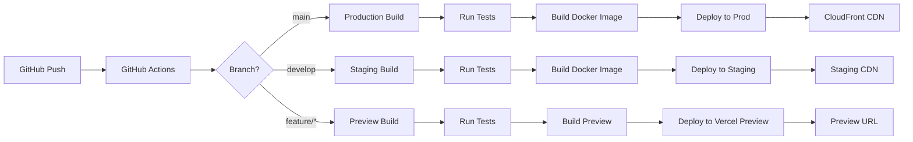

# 🚀 AuraConnect Frontend Deployment & CI/CD Plan

## Overview
This document outlines the deployment strategy, CI/CD pipeline, and testing approach for the AuraConnect AI frontend applications.

## Deployment Architecture Decision

### SSR/SSG vs SPA Decision

We've chosen **Next.js with App Router (SSR/SSG)** for the following reasons:

| Feature | Next.js (SSR/SSG) | SPA (Vite) | Decision |
|---------|-------------------|------------|----------|
| SEO | ✅ Excellent | ❌ Requires workarounds | Next.js |
| Initial Load | ✅ Fast (HTML ready) | ❌ Slower (JS bundle) | Next.js |
| Dynamic Content | ✅ Server Components | ⚠️ Client-only | Next.js |
| Authentication | ✅ Middleware support | ⚠️ Client guards only | Next.js |
| API Routes | ✅ Built-in | ❌ Separate backend | Next.js |
| Static Export | ✅ Supported | ✅ Default | Tie |
| Real-time | ✅ RSC + Client | ✅ WebSocket | Tie |

### Deployment Strategy



## CI/CD Pipeline Configuration

### 1. GitHub Actions Workflow

```yaml
# .github/workflows/frontend-deploy.yml
name: Frontend CI/CD

on:
  push:
    branches: [main, develop]
    paths:
      - 'frontend/**'
      - '.github/workflows/frontend-deploy.yml'
  pull_request:
    branches: [main, develop]
    paths:
      - 'frontend/**'

env:
  NODE_VERSION: '20.x'
  PNPM_VERSION: '8'

jobs:
  test:
    runs-on: ubuntu-latest
    strategy:
      matrix:
        app: [admin-dashboard, pos-terminal, kitchen-display]
    
    steps:
      - uses: actions/checkout@v4
      
      - uses: pnpm/action-setup@v2
        with:
          version: ${{ env.PNPM_VERSION }}
      
      - uses: actions/setup-node@v4
        with:
          node-version: ${{ env.NODE_VERSION }}
          cache: 'pnpm'
      
      - name: Install dependencies
        run: pnpm install --frozen-lockfile
      
      - name: Type Check
        run: pnpm --filter ${{ matrix.app }} typecheck
      
      - name: Lint
        run: pnpm --filter ${{ matrix.app }} lint
      
      - name: Unit Tests
        run: pnpm --filter ${{ matrix.app }} test:unit
      
      - name: Component Tests
        run: pnpm --filter ${{ matrix.app }} test:components
      
      - name: Build
        run: pnpm --filter ${{ matrix.app }} build
        env:
          NEXT_PUBLIC_API_URL: ${{ secrets.API_URL }}
      
      - name: Upload coverage
        uses: codecov/codecov-action@v3
        with:
          directory: ./apps/${{ matrix.app }}/coverage

  e2e-tests:
    needs: test
    runs-on: ubuntu-latest
    if: github.event_name == 'push'
    
    steps:
      - uses: actions/checkout@v4
      
      - uses: pnpm/action-setup@v2
        with:
          version: ${{ env.PNPM_VERSION }}
      
      - uses: actions/setup-node@v4
        with:
          node-version: ${{ env.NODE_VERSION }}
          cache: 'pnpm'
      
      - name: Install dependencies
        run: pnpm install --frozen-lockfile
      
      - name: Install Playwright
        run: pnpm exec playwright install --with-deps
      
      - name: Run E2E tests
        run: pnpm test:e2e
        env:
          PLAYWRIGHT_BASE_URL: http://localhost:3000
          API_URL: ${{ secrets.API_URL }}
      
      - uses: actions/upload-artifact@v3
        if: always()
        with:
          name: playwright-report
          path: playwright-report/
          retention-days: 7

  lighthouse:
    needs: test
    runs-on: ubuntu-latest
    if: github.event_name == 'push'
    
    steps:
      - uses: actions/checkout@v4
      
      - name: Lighthouse CI
        uses: treosh/lighthouse-ci-action@v10
        with:
          urls: |
            http://localhost:3000
            http://localhost:3000/orders
            http://localhost:3000/dashboard
          budgetPath: ./lighthouse-budget.json
          uploadArtifacts: true
          temporaryPublicStorage: true

  deploy:
    needs: [test, e2e-tests]
    runs-on: ubuntu-latest
    if: github.event_name == 'push' && (github.ref == 'refs/heads/main' || github.ref == 'refs/heads/develop')
    
    steps:
      - uses: actions/checkout@v4
      
      - name: Configure AWS credentials
        uses: aws-actions/configure-aws-credentials@v4
        with:
          aws-access-key-id: ${{ secrets.AWS_ACCESS_KEY_ID }}
          aws-secret-access-key: ${{ secrets.AWS_SECRET_ACCESS_KEY }}
          aws-region: us-east-1
      
      - name: Build and push Docker image
        env:
          ECR_REGISTRY: ${{ secrets.ECR_REGISTRY }}
          IMAGE_TAG: ${{ github.sha }}
        run: |
          docker build -t $ECR_REGISTRY/auraconnect-frontend:$IMAGE_TAG .
          docker push $ECR_REGISTRY/auraconnect-frontend:$IMAGE_TAG
      
      - name: Deploy to ECS
        run: |
          aws ecs update-service \
            --cluster auraconnect-cluster \
            --service auraconnect-frontend \
            --force-new-deployment
      
      - name: Invalidate CloudFront
        run: |
          aws cloudfront create-invalidation \
            --distribution-id ${{ secrets.CLOUDFRONT_DISTRIBUTION_ID }} \
            --paths "/*"
```

### 2. Testing Strategy

#### Unit Tests (Jest + React Testing Library)

```typescript
// src/components/OrderCard.test.tsx
import { render, screen, fireEvent } from '@testing-library/react';
import { OrderCard } from './OrderCard';

describe('OrderCard', () => {
  const mockOrder = {
    id: '123',
    customerName: 'John Doe',
    total: 45.99,
    status: 'pending',
    items: [{ name: 'Burger', quantity: 2 }],
  };

  it('renders order information correctly', () => {
    render(<OrderCard order={mockOrder} />);
    
    expect(screen.getByText('John Doe')).toBeInTheDocument();
    expect(screen.getByText('$45.99')).toBeInTheDocument();
    expect(screen.getByText('Pending')).toBeInTheDocument();
  });

  it('calls onStatusChange when status is updated', () => {
    const onStatusChange = jest.fn();
    render(
      <OrderCard 
        order={mockOrder} 
        onStatusChange={onStatusChange} 
      />
    );
    
    fireEvent.click(screen.getByText('Mark as Preparing'));
    expect(onStatusChange).toHaveBeenCalledWith('123', 'preparing');
  });
});
```

#### Component Tests (Storybook + Chromatic)

```typescript
// src/components/OrderCard.stories.tsx
import type { Meta, StoryObj } from '@storybook/react';
import { OrderCard } from './OrderCard';

const meta: Meta<typeof OrderCard> = {
  title: 'Orders/OrderCard',
  component: OrderCard,
  parameters: {
    layout: 'centered',
  },
};

export default meta;
type Story = StoryObj<typeof meta>;

export const Default: Story = {
  args: {
    order: {
      id: '123',
      customerName: 'John Doe',
      total: 45.99,
      status: 'pending',
      items: [
        { name: 'Burger', quantity: 2, price: 12.99 },
        { name: 'Fries', quantity: 1, price: 4.99 },
      ],
    },
  },
};

export const Preparing: Story = {
  args: {
    ...Default.args,
    order: {
      ...Default.args.order,
      status: 'preparing',
    },
  },
};

export const Ready: Story = {
  args: {
    ...Default.args,
    order: {
      ...Default.args.order,
      status: 'ready',
    },
  },
};
```

#### E2E Tests (Playwright)

```typescript
// e2e/orders.spec.ts
import { test, expect } from '@playwright/test';

test.describe('Order Management', () => {
  test.beforeEach(async ({ page }) => {
    // Login as manager
    await page.goto('/login');
    await page.fill('[name="email"]', 'manager@test.com');
    await page.fill('[name="password"]', 'password');
    await page.click('button[type="submit"]');
    await page.waitForURL('/dashboard');
  });

  test('should create a new order', async ({ page }) => {
    await page.goto('/orders');
    await page.click('text=New Order');
    
    // Select customer
    await page.click('[data-testid="customer-select"]');
    await page.click('text=John Doe');
    
    // Add items
    await page.click('[data-testid="add-item-burger"]');
    await page.click('[data-testid="add-item-fries"]');
    
    // Submit order
    await page.click('button[type="submit"]');
    
    // Verify order created
    await expect(page.locator('text=Order created successfully')).toBeVisible();
    await expect(page).toHaveURL(/\/orders\/\d+/);
  });

  test('should update order status', async ({ page }) => {
    await page.goto('/orders');
    
    // Find pending order
    const orderCard = page.locator('[data-testid="order-card"]').first();
    await orderCard.click();
    
    // Update status
    await page.click('text=Mark as Preparing');
    await expect(page.locator('text=Status updated')).toBeVisible();
    
    // Verify status changed
    await expect(orderCard.locator('text=Preparing')).toBeVisible();
  });
});
```

### 3. Performance Testing

```javascript
// lighthouse-budget.json
{
  "path": "/*",
  "resourceSizes": [
    {
      "resourceType": "script",
      "budget": 300
    },
    {
      "resourceType": "total",
      "budget": 800
    }
  ],
  "resourceCounts": [
    {
      "resourceType": "third-party",
      "budget": 10
    }
  ],
  "timings": [
    {
      "metric": "interactive",
      "budget": 3000
    },
    {
      "metric": "first-contentful-paint",
      "budget": 1000
    }
  ]
}
```

## Infrastructure Configuration

### 1. Docker Configuration

```dockerfile
# Dockerfile
FROM node:20-alpine AS base

# Install pnpm
RUN corepack enable
RUN corepack prepare pnpm@8.15.0 --activate

# Dependencies
FROM base AS deps
WORKDIR /app
COPY package.json pnpm-lock.yaml ./
COPY apps/admin-dashboard/package.json ./apps/admin-dashboard/
COPY packages/*/package.json ./packages/*/
RUN pnpm install --frozen-lockfile

# Builder
FROM base AS builder
WORKDIR /app
COPY --from=deps /app/node_modules ./node_modules
COPY . .
RUN pnpm build:admin-dashboard

# Runner
FROM base AS runner
WORKDIR /app

ENV NODE_ENV production
ENV NEXT_TELEMETRY_DISABLED 1

RUN addgroup --system --gid 1001 nodejs
RUN adduser --system --uid 1001 nextjs

COPY --from=builder /app/apps/admin-dashboard/public ./public
COPY --from=builder --chown=nextjs:nodejs /app/apps/admin-dashboard/.next/standalone ./
COPY --from=builder --chown=nextjs:nodejs /app/apps/admin-dashboard/.next/static ./.next/static

USER nextjs

EXPOSE 3000

ENV PORT 3000
ENV HOSTNAME "0.0.0.0"

CMD ["node", "server.js"]
```

### 2. Infrastructure as Code (Terraform)

```hcl
# terraform/frontend.tf
resource "aws_ecs_service" "frontend" {
  name            = "auraconnect-frontend"
  cluster         = aws_ecs_cluster.main.id
  task_definition = aws_ecs_task_definition.frontend.arn
  desired_count   = var.app_count
  launch_type     = "FARGATE"

  network_configuration {
    security_groups  = [aws_security_group.ecs_tasks.id]
    subnets          = aws_subnet.private.*.id
    assign_public_ip = false
  }

  load_balancer {
    target_group_arn = aws_alb_target_group.frontend.id
    container_name   = "frontend"
    container_port   = 3000
  }

  depends_on = [aws_alb_listener.front_end]
}

resource "aws_cloudfront_distribution" "frontend_cdn" {
  origin {
    domain_name = aws_alb.main.dns_name
    origin_id   = "ALB-${aws_alb.main.name}"

    custom_origin_config {
      http_port              = 80
      https_port             = 443
      origin_protocol_policy = "https-only"
      origin_ssl_protocols   = ["TLSv1.2"]
    }
  }

  enabled             = true
  is_ipv6_enabled     = true
  default_root_object = "index.html"

  default_cache_behavior {
    allowed_methods  = ["GET", "HEAD", "OPTIONS", "PUT", "POST", "PATCH", "DELETE"]
    cached_methods   = ["GET", "HEAD"]
    target_origin_id = "ALB-${aws_alb.main.name}"

    forwarded_values {
      query_string = true
      headers      = ["Authorization", "CloudFront-Forwarded-Proto"]

      cookies {
        forward = "all"
      }
    }

    viewer_protocol_policy = "redirect-to-https"
    min_ttl                = 0
    default_ttl            = 3600
    max_ttl                = 86400
  }

  price_class = "PriceClass_100"

  restrictions {
    geo_restriction {
      restriction_type = "whitelist"
      locations        = ["US", "CA", "GB"]
    }
  }

  viewer_certificate {
    cloudfront_default_certificate = true
  }
}
```

## Monitoring & Observability

### 1. Application Monitoring

```typescript
// src/lib/monitoring.ts
import * as Sentry from "@sentry/nextjs";
import { metrics } from '@opentelemetry/api';

// Initialize Sentry
Sentry.init({
  dsn: process.env.NEXT_PUBLIC_SENTRY_DSN,
  environment: process.env.NODE_ENV,
  integrations: [
    new Sentry.BrowserTracing(),
    new Sentry.Replay(),
  ],
  tracesSampleRate: process.env.NODE_ENV === 'production' ? 0.1 : 1.0,
  replaysSessionSampleRate: 0.1,
  replaysOnErrorSampleRate: 1.0,
});

// Custom metrics
const meter = metrics.getMeter('auraconnect-frontend');
const pageLoadTime = meter.createHistogram('page_load_time');
const apiCallDuration = meter.createHistogram('api_call_duration');

export const trackPageLoad = (duration: number, page: string) => {
  pageLoadTime.record(duration, { page });
};

export const trackApiCall = (duration: number, endpoint: string, status: number) => {
  apiCallDuration.record(duration, { endpoint, status: status.toString() });
};
```

### 2. Real User Monitoring (RUM)

```typescript
// src/components/RumProvider.tsx
import { useEffect } from 'react';
import { useRouter } from 'next/router';

export const RumProvider: React.FC<{ children: ReactNode }> = ({ children }) => {
  const router = useRouter();

  useEffect(() => {
    const handleRouteChange = (url: string) => {
      // Track page views
      if (window.gtag) {
        window.gtag('config', process.env.NEXT_PUBLIC_GA_ID, {
          page_path: url,
        });
      }

      // Track Core Web Vitals
      if ('web-vital' in window) {
        window['web-vital']({
          page: url,
          metrics: ['CLS', 'FID', 'LCP', 'FCP', 'TTFB'],
        });
      }
    };

    router.events.on('routeChangeComplete', handleRouteChange);
    return () => {
      router.events.off('routeChangeComplete', handleRouteChange);
    };
  }, [router.events]);

  return <>{children}</>;
};
```

## Security Best Practices

### 1. Security Headers

```typescript
// next.config.js
const securityHeaders = [
  {
    key: 'X-DNS-Prefetch-Control',
    value: 'on'
  },
  {
    key: 'Strict-Transport-Security',
    value: 'max-age=63072000; includeSubDomains; preload'
  },
  {
    key: 'X-Frame-Options',
    value: 'SAMEORIGIN'
  },
  {
    key: 'X-Content-Type-Options',
    value: 'nosniff'
  },
  {
    key: 'Referrer-Policy',
    value: 'origin-when-cross-origin'
  },
  {
    key: 'Content-Security-Policy',
    value: ContentSecurityPolicy.replace(/\s{2,}/g, ' ').trim()
  }
];

module.exports = {
  async headers() {
    return [
      {
        source: '/:path*',
        headers: securityHeaders,
      },
    ];
  },
};
```

### 2. Environment Variables Validation

```typescript
// src/env.mjs
import { createEnv } from "@t3-oss/env-nextjs";
import { z } from "zod";

export const env = createEnv({
  server: {
    DATABASE_URL: z.string().url(),
    NODE_ENV: z.enum(["development", "test", "production"]),
  },
  client: {
    NEXT_PUBLIC_API_URL: z.string().url(),
    NEXT_PUBLIC_WS_URL: z.string().url(),
    NEXT_PUBLIC_SENTRY_DSN: z.string().url().optional(),
  },
  runtimeEnv: {
    DATABASE_URL: process.env.DATABASE_URL,
    NODE_ENV: process.env.NODE_ENV,
    NEXT_PUBLIC_API_URL: process.env.NEXT_PUBLIC_API_URL,
    NEXT_PUBLIC_WS_URL: process.env.NEXT_PUBLIC_WS_URL,
    NEXT_PUBLIC_SENTRY_DSN: process.env.NEXT_PUBLIC_SENTRY_DSN,
  },
});
```

## Deployment Checklist

### Pre-Deployment
- [ ] All tests passing (unit, integration, E2E)
- [ ] Code review approved
- [ ] Security scan completed
- [ ] Performance budgets met
- [ ] Documentation updated
- [ ] Database migrations ready

### Deployment
- [ ] Blue-green deployment initiated
- [ ] Health checks passing
- [ ] Smoke tests executed
- [ ] Monitoring alerts configured
- [ ] Rollback plan ready

### Post-Deployment
- [ ] Production smoke tests
- [ ] Performance metrics validated
- [ ] Error rates monitored
- [ ] User feedback collected
- [ ] Deployment documented