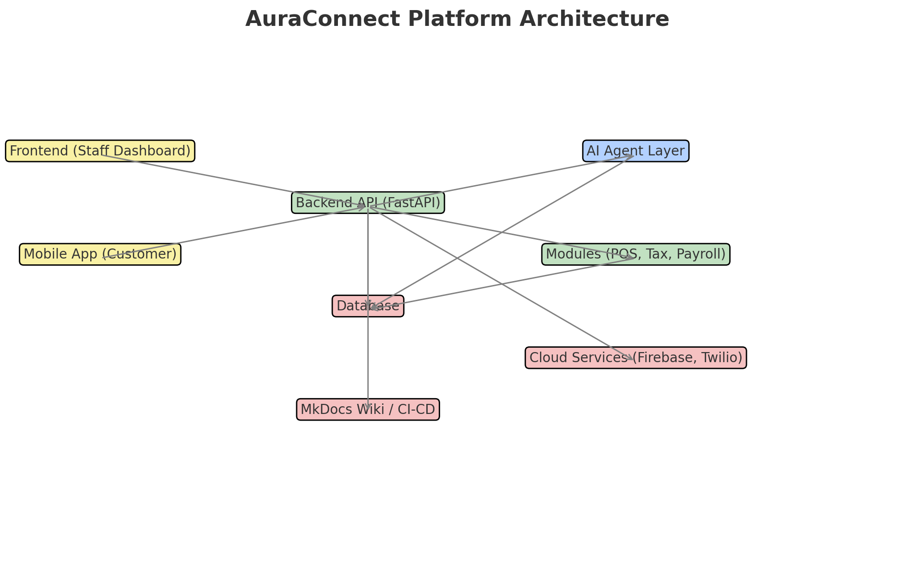

# AuraConnect

<div align="center">
  
  
  **Enterprise Restaurant Management Platform**
  
  [](https://fastapi.tiangolo.com)
  [](https://www.postgresql.org)
  [](https://reactjs.org)
  [](https://www.docker.com)
</div>

## Overview

AuraConnect is a comprehensive restaurant management platform that integrates order processing, staff management, payroll, inventory, and customer engagement into a single, modern solution.

## 🚀 Quick Start

```bash
# Clone the repository
git clone https://github.com/AuraTechWave/auraconnectai.git
cd auraconnectai

# Start with Docker
docker-compose up -d

# Access the application
# API: http://localhost:8000/docs
# Frontend: http://localhost:3000
```

## 📚 Documentation

- **[Getting Started Guide](docs/guides/getting-started.md)** - Set up your development environment
- **[Full Documentation](https://docs.auraconnect.com)** - Complete documentation portal
- **[API Reference](docs/api/README.md)** - REST API documentation
- **[Architecture Overview](docs/architecture/README.md)** - System design and patterns

## 🏗️ Key Features

- **Order Management** - Real-time order processing with kitchen integration
- **Staff & Payroll** - Employee scheduling and automated payroll processing
- **Inventory Tracking** - Real-time stock management with supplier integration
- **Customer Engagement** - Loyalty programs, feedback, and promotions
- **Analytics & AI** - Business intelligence and predictive insights
- **POS Integration** - Seamless integration with Square, Clover, and Toast

## 🛠️ Tech Stack

- **Backend**: FastAPI (Python 3.11+)
- **Frontend**: React 18+ with TypeScript
- **Database**: PostgreSQL 14+ with Redis caching
- **Infrastructure**: Docker, Kubernetes-ready
- **Authentication**: JWT with RBAC

## 🤝 Contributing

See our [Contributing Guide](CONTRIBUTING.md) for details on our development process.

## 📄 License

Proprietary software owned by AuraTechWave. All rights reserved.

## 🌟 Support

- **Documentation**: [docs.auraconnect.com](https://docs.auraconnect.com)
- **Issues**: [GitHub Issues](https://github.com/AuraTechWave/auraconnectai/issues)
- **Email**: support@auratechwave.com

---

<div align="center">
  <strong>Built with ❤️ by AuraTechWave</strong>
</div>