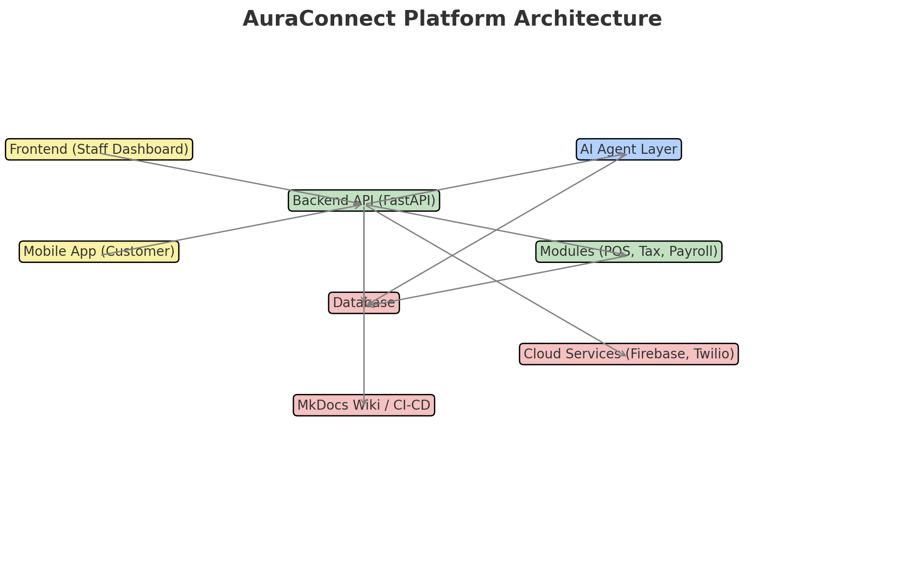

# AuraConnect - Enterprise Restaurant Management Platform

<div align="center">
  
  
  **A comprehensive, AI-powered restaurant management system built with modern microservices architecture**
  
  [](https://fastapi.tiangolo.com)
  [](https://www.postgresql.org)
  [](https://reactjs.org)
  [](https://www.docker.com)
  [](https://www.python.org)
</div>

## 🎯 Overview

AuraConnect is an enterprise-grade restaurant management platform that revolutionizes how restaurants operate. Built with a modern microservices architecture, it provides comprehensive solutions for every aspect of restaurant management - from order processing to payroll, from inventory to customer engagement.

### 🌟 Why AuraConnect?

- **🚀 Complete Solution**: All-in-one platform covering every aspect of restaurant operations
- **🏗️ Modern Architecture**: Microservices-based design for scalability and reliability
- **🤖 AI-Powered**: Intelligent recommendations and predictive analytics
- **🔄 Real-time Sync**: Live data synchronization across all modules
- **🌍 Multi-location Ready**: Manage multiple restaurant locations from a single platform
- **📱 Omnichannel**: Seamless integration across web, mobile, and POS systems

## 📚 Documentation Hub

| Documentation | Description |
|--------------|-------------|
| [🏗️ Architecture Overview](docs/architecture/README.md) | System design, patterns, and technical decisions |
| [🚀 Getting Started](docs/guides/getting-started.md) | Quick start guide for developers |
| [📦 Module Documentation](docs/modules/README.md) | Detailed documentation for each module |
| [🔌 API Reference](docs/api/README.md) | Complete API documentation |
| [💻 Development Guide](docs/development/README.md) | Development setup and best practices |
| [🚢 Deployment Guide](docs/deployment/README.md) | Production deployment instructions |

## 🏛️ System Architecture

AuraConnect follows a modern microservices architecture designed for scalability, maintainability, and performance:

```mermaid
graph TB
    subgraph "Frontend Applications"
        A1[Restaurant Portal]
        A2[Kitchen Display]
        A3[Customer App]
        A4[Admin Panel]
    end
    
    subgraph "API Gateway"
        B[Nginx<br/>Load Balancing & Rate Limiting]
    end
    
    subgraph "Backend Services - FastAPI"
        C1[Auth Service]
        C2[POS Integration]
        C3[Orders Service]
        C4[Payroll Service]
        C5[Analytics Service]
        C6[... Other Services]
    end
    
    subgraph "Shared Infrastructure Layer"
        D1[Message Queue]
        D2[Redis Cache]
        D3[Celery Task Queue]
        D4[S3 Storage]
    end
    
    subgraph "Data Layer"
        E[(PostgreSQL<br/>Multi-tenant | Partitioned | Replicated)]
    end
    
    A1 --> B
    A2 --> B
    A3 --> B
    A4 --> B
    
    B --> C1
    B --> C2
    B --> C3
    B --> C4
    B --> C5
    B --> C6
    
    C1 --> D1
    C1 --> D2
    C2 --> D1
    C2 --> D2
    C3 --> D1
    C3 --> D2
    C3 --> D3
    C4 --> D1
    C4 --> D2
    C4 --> D3
    C5 --> D1
    C5 --> D2
    C5 --> D4
    C6 --> D1
    C6 --> D2
    
    D1 --> E
    D2 --> E
    D3 --> E
    
    classDef frontend fill:#e3f2fd,stroke:#1976d2,stroke-width:2px
    classDef gateway fill:#fff3e0,stroke:#f57c00,stroke-width:2px
    classDef service fill:#f3e5f5,stroke:#7b1fa2,stroke-width:2px
    classDef infra fill:#e8f5e9,stroke:#388e3c,stroke-width:2px
    classDef database fill:#fce4ec,stroke:#c2185b,stroke-width:2px
    
    class A1,A2,A3,A4 frontend
    class B gateway
    class C1,C2,C3,C4,C5,C6 service
    class D1,D2,D3,D4 infra
    class E database
```

## 📦 Core Modules

### Restaurant Operations

| Module | Description | Key Features | Status |
|--------|-------------|--------------|--------|
| **[Orders](docs/modules/orders/README.md)** | Order management system | Real-time processing, Kitchen integration, Multi-channel support | ✅ Production |
| **[Menu](docs/modules/menu/README.md)** | Menu management | Dynamic pricing, Modifiers, Categories, Dietary info | ✅ Production |
| **[Inventory](docs/modules/inventory/README.md)** | Stock management | Real-time tracking, Low stock alerts, Supplier integration | ✅ Production |
| **[POS](docs/modules/pos/README.md)** | POS system integration | Square, Clover, Toast adapters, Offline sync | ✅ Production |

### Staff & Financial Management

| Module | Description | Key Features | Status |
|--------|-------------|--------------|--------|
| **[Staff](docs/modules/staff/README.md)** | Employee management | [Advanced Scheduling](backend/modules/staff/docs/SCHEDULING_USAGE.md), Roles, Permissions, Time tracking, [Biometric Auth](backend/modules/staff/docs/BIOMETRIC_API.md) | ✅ Production |
| **[Payroll](docs/modules/payroll/README.md)** | Payroll processing | Multi-state tax, Direct deposit, Compliance | ✅ Production |
| **[Tax](docs/modules/tax/README.md)** | Tax calculations | Federal/State/Local, Real-time updates, Reporting | ✅ Production |

### Customer Experience

| Module | Description | Key Features | Status |
|--------|-------------|--------------|--------|
| **[Customers](docs/modules/customers/README.md)** | CRM system | Profiles, Preferences, Order history | ✅ Production |
| **[Feedback](docs/modules/feedback/README.md)** | Review management | Multi-channel collection, AI analysis, Response automation | ✅ Production |
| **[Loyalty](docs/modules/loyalty/README.md)** | Rewards program | Points, Tiers, Campaigns, Redemption | ✅ Production |
| **[Promotions](docs/modules/promotions/README.md)** | Marketing campaigns | Discounts, BOGO, Time-based, Targeted offers | ✅ Production |

### Intelligence & Configuration

| Module | Description | Key Features | Status |
|--------|-------------|--------------|--------|
| **[Analytics](docs/modules/analytics/README.md)** | Business intelligence | Real-time dashboards, Reports, Predictive analytics | ✅ Production |
| **[AI Recommendations](docs/modules/ai_recommendations/README.md)** | AI insights | Menu optimization, Demand forecasting, Customer preferences | 🚧 Beta |
| **[Settings](docs/modules/settings/README.md)** | System configuration | Multi-tenant, Feature flags, Preferences | ✅ Production |

## 🚀 Quick Start

Get AuraConnect running in minutes with Docker:

```bash
# Clone and start
git clone https://github.com/AuraTechWave/auraconnectai.git
cd auraconnectai
docker-compose up -d

# Access applications
# API Docs: http://localhost:8000/docs
# Frontend: http://localhost:3000
# Admin: admin@restaurant.com / admin123
```

For detailed setup instructions, see our [Quick Start Guide](docs/guides/quick-start.md).

## 🛠️ Technology Stack

**Backend**: FastAPI, PostgreSQL, Redis, Celery  
**Frontend**: React, TypeScript, Redux Toolkit, Material-UI  
**Infrastructure**: Docker, Kubernetes, GitHub Actions, Prometheus  

See our complete [Technology Stack Documentation](docs/architecture/technology-stack.md) for detailed information.

## 🔐 Security Features

- **Authentication**: JWT-based with access/refresh token pattern
- **Authorization**: Role-based access control (RBAC) with fine-grained permissions
- **Data Protection**: Encryption at rest and in transit
- **Multi-tenancy**: Complete data isolation between restaurants
- **Audit Trails**: Comprehensive logging of all actions
- **OWASP Compliance**: Protection against common vulnerabilities
- **Rate Limiting**: API protection against abuse
- **CORS**: Configurable cross-origin resource sharing

## 📊 API Documentation

Interactive API documentation is available at:
- **Swagger UI**: http://localhost:8000/docs
- **ReDoc**: http://localhost:8000/redoc

### Example API Calls

#### Authentication
```http
POST /api/v1/auth/login
{
  "email": "admin@restaurant.com",
  "password": "secure_password"
}
```

#### Create Order
```http
POST /api/v1/orders
Authorization: Bearer <token>
{
  "items": [
    {"menu_item_id": 1, "quantity": 2, "modifiers": ["extra_cheese"]}
  ],
  "customer_id": 123,
  "order_type": "dine_in",
  "table_number": "5"
}
```

#### Process Payroll
```http
POST /api/v1/payroll/process
Authorization: Bearer <token>
{
  "pay_period_start": "2024-01-01",
  "pay_period_end": "2024-01-15",
  "employee_ids": [1, 2, 3]
}
```

## 🧪 Testing

AuraConnect has comprehensive test coverage including unit tests, integration tests, and performance tests.

### Test Categories

Tests are organized with pytest markers for efficient test execution:

- **`@pytest.mark.unit`** - Fast unit tests
- **`@pytest.mark.integration`** - Integration tests requiring full stack
- **`@pytest.mark.slow`** - Long-running tests
- **`@pytest.mark.concurrent`** - Concurrency and threading tests
- **`@pytest.mark.api`** - API endpoint tests
- **`@pytest.mark.db`** - Database-dependent tests
- **`@pytest.mark.stress`** - Load and stress tests

### Running Tests

```bash
# Run all tests
pytest

# Run with coverage
pytest --cov=modules --cov-report=html

# Run specific module tests
pytest backend/modules/orders/tests/ -v

# Run only fast tests (exclude slow tests)
pytest -m "not slow"

# Run integration tests
pytest -m integration

# Run concurrent tests with output
pytest -m concurrent -v -s

# Run specific test file
pytest backend/modules/orders/tests/test_inventory_deduction_integration.py -v
```

### Integration Test Suite

The platform includes comprehensive integration tests for critical workflows:

- **Inventory Deduction Tests** ([Documentation](backend/modules/orders/tests/README_INTEGRATION_TESTS.md))
  - Order placement with automatic ingredient deduction
  - Order cancellation with inventory rollback
  - Shared ingredients across multiple menu items
  - Partial fulfillment scenarios
  - Concurrent order handling
  - Race condition prevention

### Test Data Factories

Tests use factory patterns to avoid hardcoded data:

```python
# Example using test factories
from modules.orders.tests.factories import (
    create_restaurant_setup,
    create_order_scenario
)

# Generate complete test environment
setup = create_restaurant_setup(num_menu_items=5)
order = create_order_scenario(num_items=3)
```

### Performance Testing

```bash
# Run performance benchmarks
pytest backend/tests/performance/ -v --benchmark

# Stress test with concurrent operations
pytest -m stress -v
```

## 🚢 Deployment

### Production Deployment Options

1. **Docker Swarm** - For small to medium deployments
2. **Kubernetes** - For large-scale, high-availability deployments
3. **Cloud Platforms** - AWS ECS, Google Cloud Run, Azure Container Instances
4. **PaaS** - Heroku, Railway, Render

See [Deployment Guide](docs/deployment/README.md) for detailed instructions.

## 🤝 Contributing

We welcome contributions! Please see our [Contributing Guide](CONTRIBUTING.md) for details.

### Development Process
1. Fork the repository
2. Create a feature branch (`git checkout -b feature/amazing-feature`)
3. Commit your changes (`git commit -m 'Add amazing feature'`)
4. Push to the branch (`git push origin feature/amazing-feature`)
5. Open a Pull Request

### Code Standards
- **Python**: Black formatter, Flake8 linter, Type hints required
- **JavaScript/TypeScript**: ESLint, Prettier
- **Tests**: Required for all new features (minimum 80% coverage)
- **Documentation**: All APIs must be documented

## 📄 License

This project is proprietary software owned by AuraTechWave. All rights reserved.

## 🌟 Support

- **Documentation**: [docs.auraconnect.com](https://docs.auraconnect.com)
- **Email**: support@auratechwave.com
- **Issues**: [GitHub Issues](https://github.com/AuraTechWave/auraconnectai/issues)
- **Discord**: [Join our community](https://discord.gg/auraconnect)

---

<div align="center">
  <strong>Built with ❤️ by AuraTechWave</strong>
  <br>
  <sub>Empowering restaurants with intelligent technology</sub>
</div>