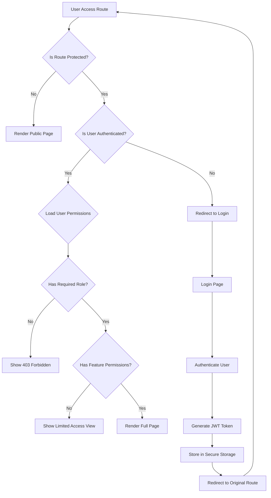

# 🔐 AuraConnect Routing & Access Control

## Overview
This document defines the routing architecture, access control patterns, and authentication flow for the AuraConnect AI platform.

## Authentication & Authorization Flow



## Route Protection Architecture

### 1. Route Configuration Structure

```typescript
// src/config/routeConfig.ts

export interface RouteConfig {
  path: string;
  component: React.ComponentType;
  title: string;
  icon?: React.ComponentType;
  layout?: 'default' | 'auth' | 'minimal' | 'kitchen';
  isPublic?: boolean;
  roles?: UserRole[];
  permissions?: Permission[];
  breadcrumb?: boolean;
  children?: RouteConfig[];
  meta?: {
    description?: string;
    keywords?: string[];
    preload?: string[];
  };
}

export const routeConfig: RouteConfig[] = [
  {
    path: '/',
    component: HomePage,
    title: 'Home',
    isPublic: true,
    layout: 'auth',
  },
  {
    path: '/dashboard',
    component: DashboardPage,
    title: 'Dashboard',
    icon: DashboardIcon,
    roles: ['admin', 'manager', 'owner'],
    breadcrumb: true,
  },
  {
    path: '/orders',
    component: OrdersLayout,
    title: 'Orders',
    icon: OrdersIcon,
    roles: ['admin', 'manager', 'staff'],
    children: [
      {
        path: '',
        component: OrdersList,
        title: 'All Orders',
        permissions: ['orders.view'],
      },
      {
        path: ':orderId',
        component: OrderDetail,
        title: 'Order Detail',
        permissions: ['orders.view'],
        breadcrumb: true,
      },
      {
        path: 'new',
        component: CreateOrder,
        title: 'New Order',
        permissions: ['orders.create'],
      },
    ],
  },
  {
    path: '/kitchen',
    component: KitchenDisplay,
    title: 'Kitchen Display',
    icon: KitchenIcon,
    layout: 'kitchen',
    roles: ['kitchen', 'manager'],
    permissions: ['kitchen.view'],
  },
  {
    path: '/staff',
    component: StaffLayout,
    title: 'Staff Management',
    icon: StaffIcon,
    roles: ['admin', 'manager', 'owner'],
    children: [
      {
        path: '',
        component: StaffDirectory,
        title: 'Directory',
        permissions: ['staff.view'],
      },
      {
        path: 'schedule',
        component: ScheduleManager,
        title: 'Scheduling',
        permissions: ['staff.schedule'],
      },
      {
        path: 'payroll',
        component: PayrollDashboard,
        title: 'Payroll',
        roles: ['admin', 'owner'],
        permissions: ['payroll.view'],
      },
    ],
  },
];
```

### 2. Protected Route Component

```typescript
// src/components/auth/ProtectedRoute.tsx

interface ProtectedRouteProps {
  config: RouteConfig;
  children: React.ReactNode;
}

export const ProtectedRoute: React.FC<ProtectedRouteProps> = ({ 
  config, 
  children 
}) => {
  const { user, permissions } = useAuth();
  const navigate = useNavigate();
  
  useEffect(() => {
    if (!config.isPublic && !user) {
      navigate('/login', { 
        state: { from: location.pathname } 
      });
    }
  }, [user, config.isPublic]);

  // Check role-based access
  if (config.roles && !config.roles.includes(user?.role)) {
    return <AccessDenied reason="insufficient_role" />;
  }

  // Check permission-based access
  if (config.permissions) {
    const hasPermissions = config.permissions.every(
      permission => permissions.includes(permission)
    );
    
    if (!hasPermissions) {
      return <AccessDenied reason="missing_permissions" />;
    }
  }

  return <>{children}</>;
};
```

### 3. Route Provider with Context

```typescript
// src/providers/RouteProvider.tsx

interface RouteContextValue {
  currentRoute: RouteConfig | null;
  breadcrumbs: BreadcrumbItem[];
  canAccess: (path: string) => boolean;
  navigateWithPermission: (path: string) => void;
}

export const RouteProvider: React.FC<{ children: ReactNode }> = ({ 
  children 
}) => {
  const location = useLocation();
  const { user, permissions } = useAuth();
  const navigate = useNavigate();
  
  const currentRoute = useMemo(() => {
    return findRouteByPath(routeConfig, location.pathname);
  }, [location.pathname]);

  const breadcrumbs = useMemo(() => {
    return generateBreadcrumbs(routeConfig, location.pathname);
  }, [location.pathname]);

  const canAccess = useCallback((path: string) => {
    const route = findRouteByPath(routeConfig, path);
    if (!route) return false;
    if (route.isPublic) return true;
    
    if (route.roles && !route.roles.includes(user?.role)) {
      return false;
    }
    
    if (route.permissions) {
      return route.permissions.every(p => permissions.includes(p));
    }
    
    return true;
  }, [user, permissions]);

  const navigateWithPermission = useCallback((path: string) => {
    if (canAccess(path)) {
      navigate(path);
    } else {
      toast.error('You do not have permission to access this page');
    }
  }, [canAccess, navigate]);

  return (
    <RouteContext.Provider 
      value={{ 
        currentRoute, 
        breadcrumbs, 
        canAccess, 
        navigateWithPermission 
      }}
    >
      {children}
    </RouteContext.Provider>
  );
};
```

## Permission System

### 1. Permission Structure

```typescript
// src/types/permissions.ts

export type PermissionResource = 
  | 'orders' | 'menu' | 'staff' | 'inventory' 
  | 'customers' | 'analytics' | 'payments' 
  | 'settings' | 'kitchen' | 'payroll';

export type PermissionAction = 
  | 'view' | 'create' | 'update' | 'delete' 
  | 'export' | 'import' | 'schedule' | 'approve';

export type Permission = `${PermissionResource}.${PermissionAction}`;

export interface RolePermissions {
  owner: Permission[];
  admin: Permission[];
  manager: Permission[];
  staff: Permission[];
  kitchen: Permission[];
  customer: Permission[];
}

export const defaultRolePermissions: RolePermissions = {
  owner: ['*.*'], // All permissions
  admin: [
    'orders.*', 'menu.*', 'staff.*', 'inventory.*',
    'customers.*', 'analytics.*', 'payments.*', 'settings.*'
  ],
  manager: [
    'orders.*', 'menu.view', 'menu.update', 
    'staff.view', 'staff.schedule', 'inventory.*',
    'customers.view', 'analytics.view', 'kitchen.*'
  ],
  staff: [
    'orders.view', 'orders.create', 'orders.update',
    'menu.view', 'customers.view', 'customers.create'
  ],
  kitchen: [
    'kitchen.*', 'orders.view', 'orders.update',
    'inventory.view', 'inventory.update'
  ],
  customer: [
    'orders.view', 'menu.view'
  ]
};
```

### 2. Permission Hooks

```typescript
// src/hooks/usePermissions.ts

export const usePermissions = () => {
  const { user, permissions } = useAuth();
  
  const hasPermission = useCallback((permission: Permission) => {
    if (!user) return false;
    
    // Check for wildcard permissions
    if (permissions.includes('*.*')) return true;
    
    const [resource] = permission.split('.');
    if (permissions.includes(`${resource}.*`)) return true;
    
    return permissions.includes(permission);
  }, [user, permissions]);

  const hasAnyPermission = useCallback((perms: Permission[]) => {
    return perms.some(permission => hasPermission(permission));
  }, [hasPermission]);

  const hasAllPermissions = useCallback((perms: Permission[]) => {
    return perms.every(permission => hasPermission(permission));
  }, [hasPermission]);

  return {
    hasPermission,
    hasAnyPermission,
    hasAllPermissions,
    permissions,
    isOwner: user?.role === 'owner',
    isAdmin: user?.role === 'admin' || user?.role === 'owner',
    isManager: ['manager', 'admin', 'owner'].includes(user?.role || ''),
  };
};
```

## Dynamic Navigation Generation

```typescript
// src/components/navigation/DynamicNavigation.tsx

export const DynamicNavigation: React.FC = () => {
  const { canAccess } = useRoute();
  const location = useLocation();
  
  const navigationItems = useMemo(() => {
    return routeConfig
      .filter(route => {
        // Filter out routes without icons (detail pages)
        if (!route.icon) return false;
        
        // Check if user can access this route
        return canAccess(route.path);
      })
      .map(route => ({
        path: route.path,
        title: route.title,
        icon: route.icon,
        active: location.pathname.startsWith(route.path),
        children: route.children
          ?.filter(child => canAccess(`${route.path}/${child.path}`))
          .map(child => ({
            path: `${route.path}/${child.path}`,
            title: child.title,
            active: location.pathname === `${route.path}/${child.path}`,
          })),
      }));
  }, [canAccess, location.pathname]);

  return (
    <nav className="sidebar-nav">
      {navigationItems.map(item => (
        <NavItem key={item.path} {...item} />
      ))}
    </nav>
  );
};
```

## Route Guards & Middleware

### 1. Authentication Guard

```typescript
// src/guards/AuthGuard.tsx

export const AuthGuard: React.FC<{ children: ReactNode }> = ({ 
  children 
}) => {
  const { isAuthenticated, isLoading } = useAuth();
  const location = useLocation();
  
  if (isLoading) {
    return <LoadingScreen />;
  }
  
  if (!isAuthenticated) {
    return <Navigate to="/login" state={{ from: location }} replace />;
  }
  
  return <>{children}</>;
};
```

### 2. Role Guard

```typescript
// src/guards/RoleGuard.tsx

interface RoleGuardProps {
  roles: UserRole[];
  children: ReactNode;
  fallback?: ReactNode;
}

export const RoleGuard: React.FC<RoleGuardProps> = ({ 
  roles, 
  children, 
  fallback 
}) => {
  const { user } = useAuth();
  
  if (!user || !roles.includes(user.role)) {
    return fallback || <AccessDenied />;
  }
  
  return <>{children}</>;
};
```

### 3. Feature Flag Guard

```typescript
// src/guards/FeatureGuard.tsx

export const FeatureGuard: React.FC<{
  feature: string;
  children: ReactNode;
}> = ({ feature, children }) => {
  const { isFeatureEnabled } = useFeatureFlags();
  
  if (!isFeatureEnabled(feature)) {
    return null;
  }
  
  return <>{children}</>;
};
```

## Route Preloading & Code Splitting

```typescript
// src/utils/routePreloader.ts

export const preloadRoute = async (path: string) => {
  const route = findRouteByPath(routeConfig, path);
  
  if (route?.meta?.preload) {
    // Preload data dependencies
    const preloadPromises = route.meta.preload.map(endpoint => 
      fetch(endpoint).then(res => res.json())
    );
    
    await Promise.all(preloadPromises);
  }
  
  // Preload component chunk
  if (route?.component) {
    const Component = route.component as any;
    if (Component.preload) {
      await Component.preload();
    }
  }
};

// Usage with React Router
export const RoutePreloader: React.FC = () => {
  const location = useLocation();
  
  useEffect(() => {
    // Preload adjacent routes for faster navigation
    const currentRoute = findRouteByPath(routeConfig, location.pathname);
    if (currentRoute?.children) {
      currentRoute.children.forEach(child => {
        preloadRoute(`${currentRoute.path}/${child.path}`);
      });
    }
  }, [location.pathname]);
  
  return null;
};
```

## Best Practices

### 1. Route Organization
- Group related routes under parent routes
- Use consistent naming conventions
- Keep route configuration centralized

### 2. Permission Design
- Use resource.action pattern for permissions
- Implement wildcard permissions for admin roles
- Cache permission checks for performance

### 3. Navigation Performance
- Lazy load route components
- Preload adjacent routes
- Implement route-based code splitting

### 4. Security Considerations
- Always validate permissions on the backend
- Use secure token storage (httpOnly cookies)
- Implement CSRF protection
- Add rate limiting to authentication endpoints

### 5. User Experience
- Show loading states during auth checks
- Provide clear access denied messages
- Implement smooth redirects after login
- Preserve user's intended destination