# Payroll & Tax Module Architecture

## Overview

The Payroll & Tax Module is designed with a modular, layered architecture that ensures scalability, maintainability, and seamless integration with other AuraConnect modules. This document provides a comprehensive overview of the system architecture, design patterns, and technical decisions.

## Table of Contents

1. [System Architecture](#system-architecture)
2. [Component Architecture](#component-architecture)
3. [Data Architecture](#data-architecture)
4. [Integration Architecture](#integration-architecture)
5. [Security Architecture](#security-architecture)
6. [Deployment Architecture](#deployment-architecture)
7. [Performance Architecture](#performance-architecture)
8. [Design Patterns](#design-patterns)

## System Architecture

### High-Level Architecture

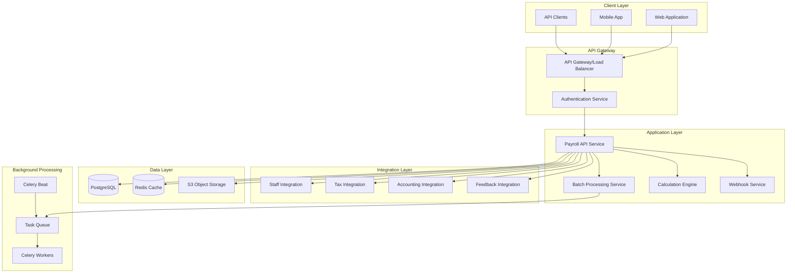
```mermaid
graph TB
    subgraph "Client Layer"
        WEB[Web Application]
        MOB[Mobile App]
        API_CLIENT[API Clients]
    end
    
    subgraph "API Gateway"
        GATEWAY[API Gateway/Load Balancer]
        AUTH[Authentication Service]
    end
    
    subgraph "Application Layer"
        PAYROLL_API[Payroll API Service]
        BATCH[Batch Processing Service]
        CALC[Calculation Engine]
        WEBHOOK[Webhook Service]
    end
    
    subgraph "Integration Layer"
        STAFF_INT[Staff Integration]
        TAX_INT[Tax Integration]
        ACC_INT[Accounting Integration]
        FEED_INT[Feedback Integration]
    end
    
    subgraph "Data Layer"
        PG[(PostgreSQL)]
        REDIS[(Redis Cache)]
        S3[S3 Object Storage]
    end
    
    subgraph "Background Processing"
        CELERY[Celery Workers]
        BEAT[Celery Beat]
        QUEUE[Task Queue]
    end
    
    WEB --> GATEWAY
    MOB --> GATEWAY
    API_CLIENT --> GATEWAY
    
    GATEWAY --> AUTH
    AUTH --> PAYROLL_API
    
    PAYROLL_API --> CALC
    PAYROLL_API --> BATCH
    PAYROLL_API --> WEBHOOK
    
    PAYROLL_API --> STAFF_INT
    PAYROLL_API --> TAX_INT
    PAYROLL_API --> ACC_INT
    PAYROLL_API --> FEED_INT
    
    PAYROLL_API --> PG
    PAYROLL_API --> REDIS
    PAYROLL_API --> S3
    
    BATCH --> QUEUE
    QUEUE --> CELERY
    BEAT --> QUEUE
```

### Layered Architecture

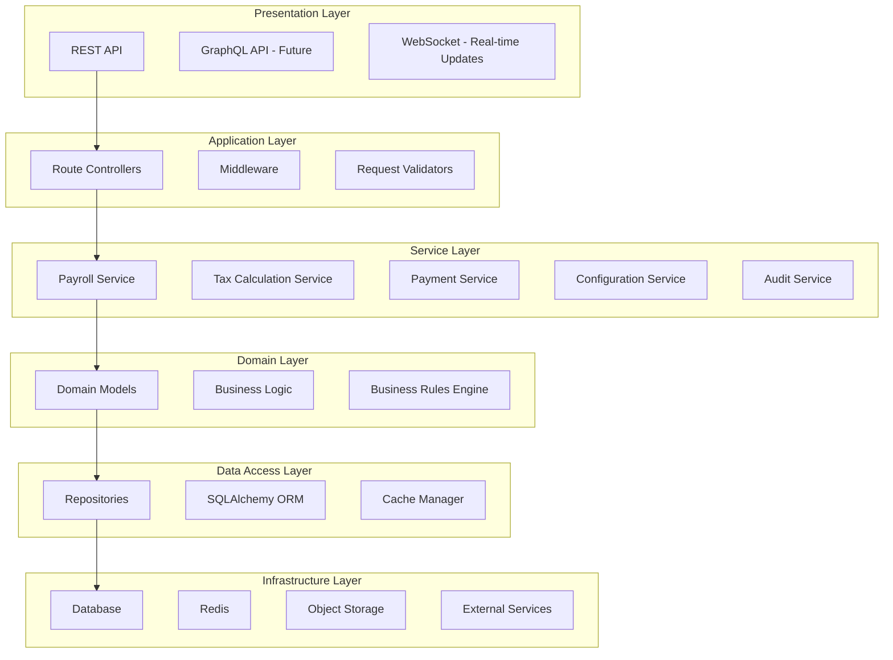
```mermaid
graph TD
    subgraph "Presentation Layer"
        REST[REST API]
        GRAPHQL[GraphQL API - Future]
        WEBSOCKET[WebSocket - Real-time Updates]
    end
    
    subgraph "Application Layer"
        CONTROLLERS[Route Controllers]
        MIDDLEWARE[Middleware]
        VALIDATORS[Request Validators]
    end
    
    subgraph "Service Layer"
        PAYROLL_SVC[Payroll Service]
        TAX_SVC[Tax Calculation Service]
        PAYMENT_SVC[Payment Service]
        CONFIG_SVC[Configuration Service]
        AUDIT_SVC[Audit Service]
    end
    
    subgraph "Domain Layer"
        MODELS[Domain Models]
        BUSINESS[Business Logic]
        RULES[Business Rules Engine]
    end
    
    subgraph "Data Access Layer"
        REPO[Repositories]
        ORM[SQLAlchemy ORM]
        CACHE[Cache Manager]
    end
    
    subgraph "Infrastructure Layer"
        DB[Database]
        CACHE_STORE[Redis]
        STORAGE[Object Storage]
        EXTERNAL[External Services]
    end
    
    REST --> CONTROLLERS
    CONTROLLERS --> PAYROLL_SVC
    PAYROLL_SVC --> MODELS
    MODELS --> REPO
    REPO --> DB
```

## Component Architecture

### Core Components

#### 1. Payroll API Service

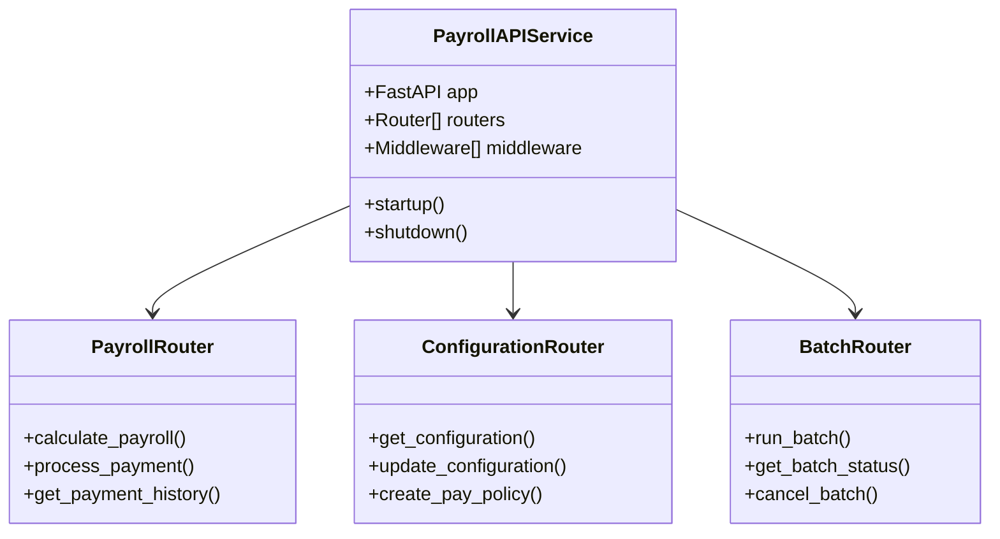
```mermaid
classDiagram
    class PayrollAPIService {
        +FastAPI app
        +Router[] routers
        +Middleware[] middleware
        +startup()
        +shutdown()
    }
    
    class PayrollRouter {
        +calculate_payroll()
        +process_payment()
        +get_payment_history()
    }
    
    class ConfigurationRouter {
        +get_configuration()
        +update_configuration()
        +create_pay_policy()
    }
    
    class BatchRouter {
        +run_batch()
        +get_batch_status()
        +cancel_batch()
    }
    
    PayrollAPIService --> PayrollRouter
    PayrollAPIService --> ConfigurationRouter
    PayrollAPIService --> BatchRouter
```

#### 2. Calculation Engine

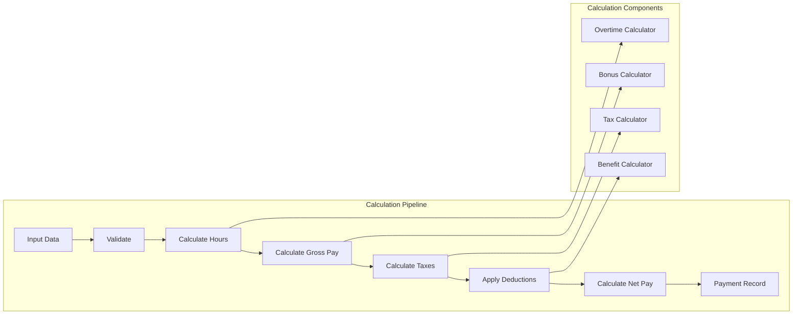
```mermaid
graph LR
    subgraph "Calculation Pipeline"
        INPUT[Input Data] --> VALIDATE[Validate]
        VALIDATE --> HOURS[Calculate Hours]
        HOURS --> GROSS[Calculate Gross Pay]
        GROSS --> TAX[Calculate Taxes]
        TAX --> DEDUCT[Apply Deductions]
        DEDUCT --> NET[Calculate Net Pay]
        NET --> OUTPUT[Payment Record]
    end
    
    subgraph "Calculation Components"
        OVERTIME[Overtime Calculator]
        BONUS[Bonus Calculator]
        TAX_CALC[Tax Calculator]
        BENEFIT[Benefit Calculator]
    end
    
    HOURS --> OVERTIME
    GROSS --> BONUS
    TAX --> TAX_CALC
    DEDUCT --> BENEFIT
```

#### 3. Batch Processing Service

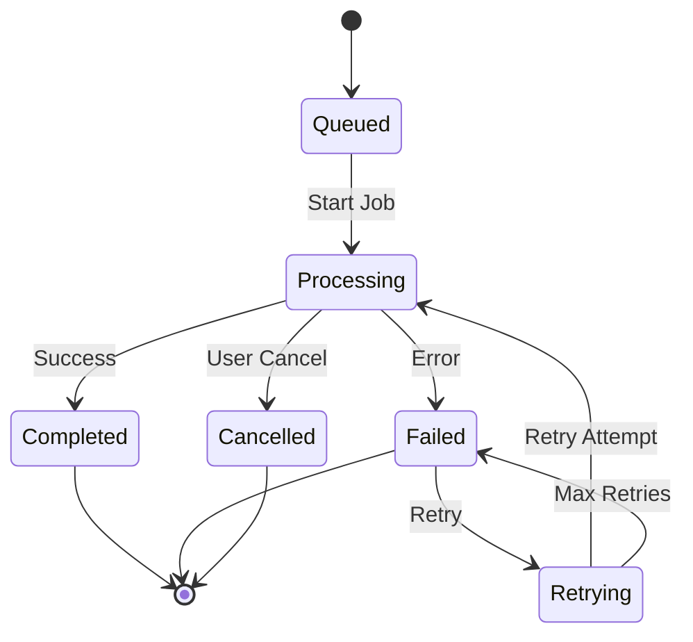
```mermaid
stateDiagram-v2
    [*] --> Queued
    Queued --> Processing : Start Job
    Processing --> Completed : Success
    Processing --> Failed : Error
    Processing --> Cancelled : User Cancel
    Failed --> Retrying : Retry
    Retrying --> Processing : Retry Attempt
    Retrying --> Failed : Max Retries
    Completed --> [*]
    Failed --> [*]
    Cancelled --> [*]
```

### Service Dependencies

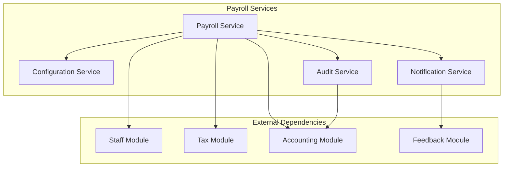
```mermaid
graph TD
    subgraph "Payroll Services"
        PS[Payroll Service]
        CS[Configuration Service]
        AS[Audit Service]
        NS[Notification Service]
    end
    
    subgraph "External Dependencies"
        STAFF[Staff Module]
        TAX[Tax Module]
        ACC[Accounting Module]
        FEED[Feedback Module]
    end
    
    PS --> CS
    PS --> AS
    PS --> NS
    PS --> STAFF
    PS --> TAX
    PS --> ACC
    NS --> FEED
    AS --> ACC
```

## Data Architecture

### Entity Relationship Diagram

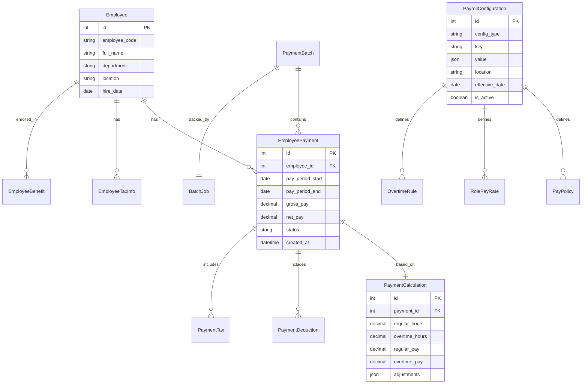
```mermaid
erDiagram
    Employee ||--o{ EmployeePayment : has
    Employee ||--o{ EmployeeTaxInfo : has
    Employee ||--o{ EmployeeBenefit : enrolled_in
    
    EmployeePayment ||--|| PaymentCalculation : based_on
    EmployeePayment ||--o{ PaymentDeduction : includes
    EmployeePayment ||--o{ PaymentTax : includes
    
    PayrollConfiguration ||--o{ PayPolicy : defines
    PayrollConfiguration ||--o{ RolePayRate : defines
    PayrollConfiguration ||--o{ OvertimeRule : defines
    
    PaymentBatch ||--o{ EmployeePayment : contains
    PaymentBatch ||--|| BatchJob : tracked_by
    
    Employee {
        int id PK
        string employee_code
        string full_name
        string department
        string location
        date hire_date
    }
    
    EmployeePayment {
        int id PK
        int employee_id FK
        date pay_period_start
        date pay_period_end
        decimal gross_pay
        decimal net_pay
        string status
        datetime created_at
    }
    
    PaymentCalculation {
        int id PK
        int payment_id FK
        decimal regular_hours
        decimal overtime_hours
        decimal regular_pay
        decimal overtime_pay
        json adjustments
    }
    
    PayrollConfiguration {
        int id PK
        string config_type
        string key
        json value
        string location
        date effective_date
        boolean is_active
    }
```

### Data Flow Architecture

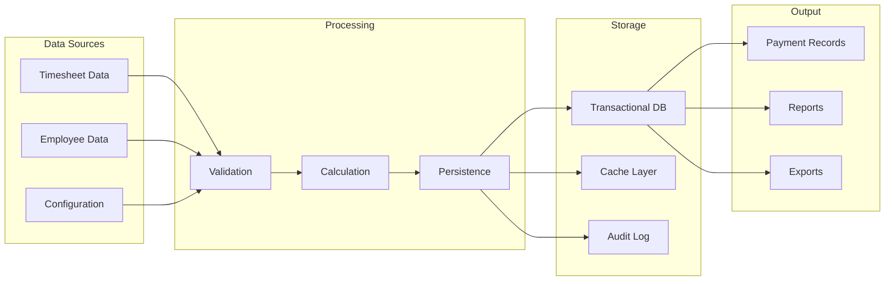
```mermaid
flowchart LR
    subgraph "Data Sources"
        TIME[Timesheet Data]
        EMP[Employee Data]
        CONFIG[Configuration]
    end
    
    subgraph "Processing"
        VALIDATE[Validation]
        CALC[Calculation]
        PERSIST[Persistence]
    end
    
    subgraph "Storage"
        TRANS[Transactional DB]
        CACHE[Cache Layer]
        AUDIT[Audit Log]
    end
    
    subgraph "Output"
        PAY[Payment Records]
        REPORT[Reports]
        EXPORT[Exports]
    end
    
    TIME --> VALIDATE
    EMP --> VALIDATE
    CONFIG --> VALIDATE
    
    VALIDATE --> CALC
    CALC --> PERSIST
    
    PERSIST --> TRANS
    PERSIST --> CACHE
    PERSIST --> AUDIT
    
    TRANS --> PAY
    TRANS --> REPORT
    TRANS --> EXPORT
```

### Caching Strategy

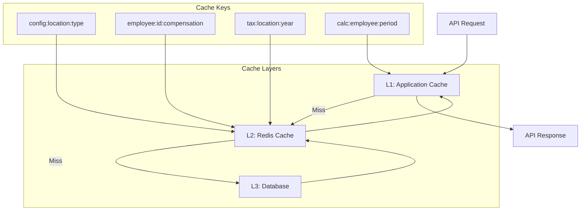
```mermaid
graph TD
    subgraph "Cache Layers"
        L1[L1: Application Cache]
        L2[L2: Redis Cache]
        L3[L3: Database]
    end
    
    subgraph "Cache Keys"
        CONFIG_KEY[config:location:type]
        EMP_KEY[employee:id:compensation]
        TAX_KEY[tax:location:year]
        CALC_KEY[calc:employee:period]
    end
    
    REQUEST[API Request] --> L1
    L1 -->|Miss| L2
    L2 -->|Miss| L3
    L3 --> L2
    L2 --> L1
    L1 --> RESPONSE[API Response]
    
    CONFIG_KEY --> L2
    EMP_KEY --> L2
    TAX_KEY --> L2
    CALC_KEY --> L1
```

## Integration Architecture

### Service Integration Pattern

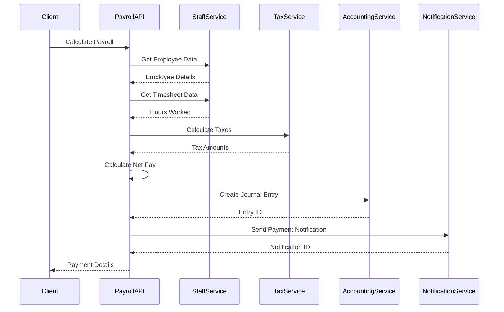
```mermaid
sequenceDiagram
    participant Client
    participant PayrollAPI
    participant StaffService
    participant TaxService
    participant AccountingService
    participant NotificationService
    
    Client->>PayrollAPI: Calculate Payroll
    PayrollAPI->>StaffService: Get Employee Data
    StaffService-->>PayrollAPI: Employee Details
    
    PayrollAPI->>StaffService: Get Timesheet Data
    StaffService-->>PayrollAPI: Hours Worked
    
    PayrollAPI->>TaxService: Calculate Taxes
    TaxService-->>PayrollAPI: Tax Amounts
    
    PayrollAPI->>PayrollAPI: Calculate Net Pay
    
    PayrollAPI->>AccountingService: Create Journal Entry
    AccountingService-->>PayrollAPI: Entry ID
    
    PayrollAPI->>NotificationService: Send Payment Notification
    NotificationService-->>PayrollAPI: Notification ID
    
    PayrollAPI-->>Client: Payment Details
```

### Event-Driven Architecture

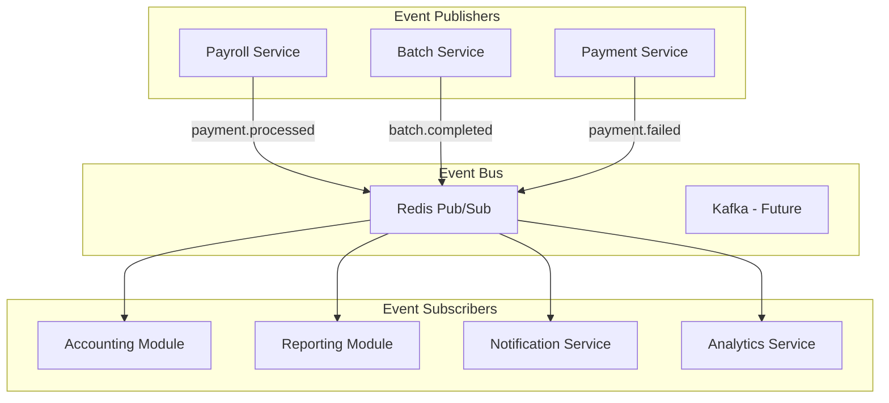
```mermaid
graph TD
    subgraph "Event Publishers"
        PAYROLL[Payroll Service]
        BATCH[Batch Service]
        PAYMENT[Payment Service]
    end
    
    subgraph "Event Bus"
        REDIS_PS[Redis Pub/Sub]
        KAFKA[Kafka - Future]
    end
    
    subgraph "Event Subscribers"
        ACCOUNTING[Accounting Module]
        REPORTING[Reporting Module]
        NOTIFICATION[Notification Service]
        ANALYTICS[Analytics Service]
    end
    
    PAYROLL -->|payment.processed| REDIS_PS
    BATCH -->|batch.completed| REDIS_PS
    PAYMENT -->|payment.failed| REDIS_PS
    
    REDIS_PS --> ACCOUNTING
    REDIS_PS --> REPORTING
    REDIS_PS --> NOTIFICATION
    REDIS_PS --> ANALYTICS
```

### API Gateway Pattern

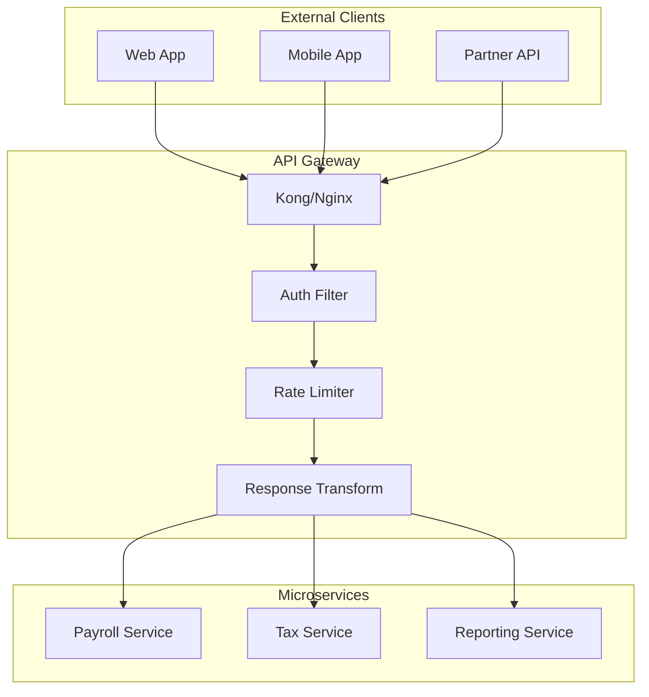
```mermaid
graph TD
    subgraph "External Clients"
        WEB[Web App]
        MOBILE[Mobile App]
        PARTNER[Partner API]
    end
    
    subgraph "API Gateway"
        KONG[Kong/Nginx]
        AUTH_FILTER[Auth Filter]
        RATE_LIMIT[Rate Limiter]
        TRANSFORM[Response Transform]
    end
    
    subgraph "Microservices"
        PAYROLL_MS[Payroll Service]
        TAX_MS[Tax Service]
        REPORT_MS[Reporting Service]
    end
    
    WEB --> KONG
    MOBILE --> KONG
    PARTNER --> KONG
    
    KONG --> AUTH_FILTER
    AUTH_FILTER --> RATE_LIMIT
    RATE_LIMIT --> TRANSFORM
    
    TRANSFORM --> PAYROLL_MS
    TRANSFORM --> TAX_MS
    TRANSFORM --> REPORT_MS
```

## Security Architecture

### Security Layers

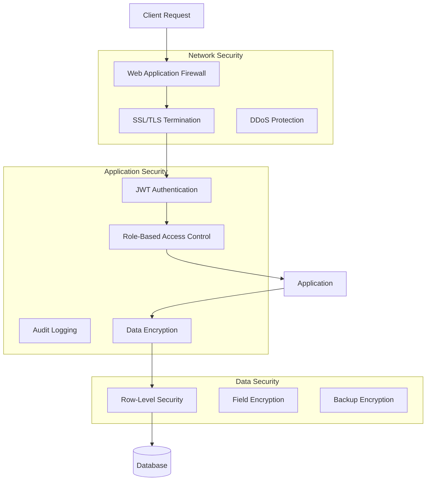
```mermaid
graph TD
    subgraph "Network Security"
        WAF[Web Application Firewall]
        SSL[SSL/TLS Termination]
        DDOS[DDoS Protection]
    end
    
    subgraph "Application Security"
        JWT[JWT Authentication]
        RBAC[Role-Based Access Control]
        AUDIT[Audit Logging]
        ENCRYPT[Data Encryption]
    end
    
    subgraph "Data Security"
        ROW_SEC[Row-Level Security]
        FIELD_ENC[Field Encryption]
        BACKUP_ENC[Backup Encryption]
    end
    
    REQUEST[Client Request] --> WAF
    WAF --> SSL
    SSL --> JWT
    JWT --> RBAC
    RBAC --> APP[Application]
    APP --> ENCRYPT
    ENCRYPT --> ROW_SEC
    ROW_SEC --> DB[(Database)]
```

### Authentication & Authorization Flow

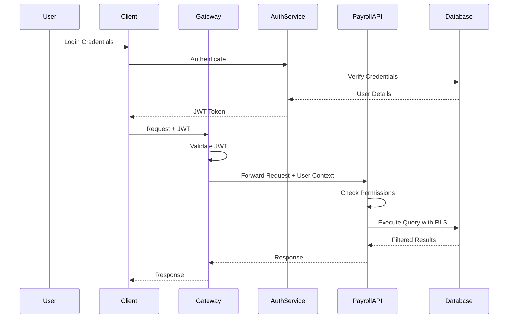
```mermaid
sequenceDiagram
    participant User
    participant Client
    participant Gateway
    participant AuthService
    participant PayrollAPI
    participant Database
    
    User->>Client: Login Credentials
    Client->>AuthService: Authenticate
    AuthService->>Database: Verify Credentials
    Database-->>AuthService: User Details
    AuthService-->>Client: JWT Token
    
    Client->>Gateway: Request + JWT
    Gateway->>Gateway: Validate JWT
    Gateway->>PayrollAPI: Forward Request + User Context
    
    PayrollAPI->>PayrollAPI: Check Permissions
    PayrollAPI->>Database: Execute Query with RLS
    Database-->>PayrollAPI: Filtered Results
    PayrollAPI-->>Gateway: Response
    Gateway-->>Client: Response
```

## Deployment Architecture

### Container Architecture

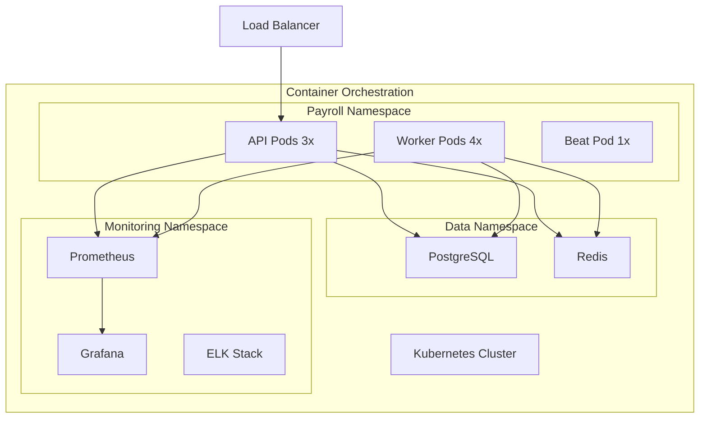
```mermaid
graph TD
    subgraph "Container Orchestration"
        K8S[Kubernetes Cluster]
        
        subgraph "Payroll Namespace"
            API_POD[API Pods 3x]
            WORKER_POD[Worker Pods 4x]
            BEAT_POD[Beat Pod 1x]
        end
        
        subgraph "Data Namespace"
            PG_POD[PostgreSQL]
            REDIS_POD[Redis]
        end
        
        subgraph "Monitoring Namespace"
            PROM_POD[Prometheus]
            GRAF_POD[Grafana]
            ELK_POD[ELK Stack]
        end
    end
    
    LB[Load Balancer] --> API_POD
    API_POD --> PG_POD
    API_POD --> REDIS_POD
    WORKER_POD --> PG_POD
    WORKER_POD --> REDIS_POD
    
    API_POD --> PROM_POD
    WORKER_POD --> PROM_POD
    PROM_POD --> GRAF_POD
```

### High Availability Architecture

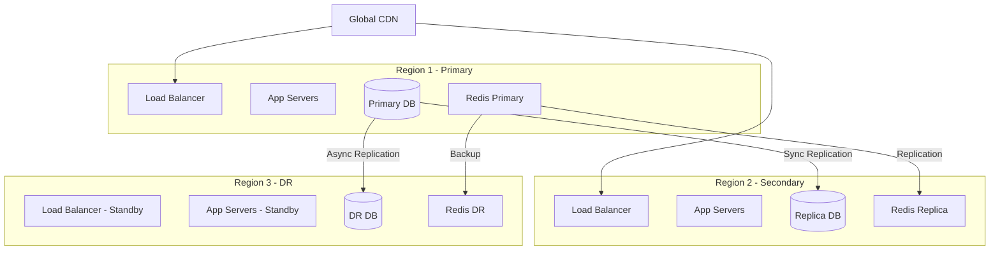
```mermaid
graph TB
    subgraph "Region 1 - Primary"
        LB1[Load Balancer]
        APP1[App Servers]
        DB1[(Primary DB)]
        CACHE1[Redis Primary]
    end
    
    subgraph "Region 2 - Secondary"
        LB2[Load Balancer]
        APP2[App Servers]
        DB2[(Replica DB)]
        CACHE2[Redis Replica]
    end
    
    subgraph "Region 3 - DR"
        LB3[Load Balancer - Standby]
        APP3[App Servers - Standby]
        DB3[(DR DB)]
        CACHE3[Redis DR]
    end
    
    CDN[Global CDN] --> LB1
    CDN --> LB2
    
    DB1 -->|Sync Replication| DB2
    DB1 -->|Async Replication| DB3
    
    CACHE1 -->|Replication| CACHE2
    CACHE1 -->|Backup| CACHE3
```

### CI/CD Pipeline


```mermaid
graph LR
    subgraph "Development"
        DEV[Developer] --> GIT[Git Push]
    end
    
    subgraph "CI Pipeline"
        GIT --> WEBHOOK[Webhook Trigger]
        WEBHOOK --> BUILD[Build Docker Image]
        BUILD --> TEST[Run Tests]
        TEST --> SCAN[Security Scan]
        SCAN --> PUSH[Push to Registry]
    end
    
    subgraph "CD Pipeline"
        PUSH --> STAGE[Deploy to Staging]
        STAGE --> E2E[E2E Tests]
        E2E --> APPROVE[Manual Approval]
        APPROVE --> PROD[Deploy to Production]
        PROD --> VERIFY[Health Checks]
    end
    
    subgraph "Rollback"
        VERIFY -->|Failed| ROLLBACK[Auto Rollback]
        ROLLBACK --> PREV[Previous Version]
    end
```

## Performance Architecture

### Performance Optimization Layers

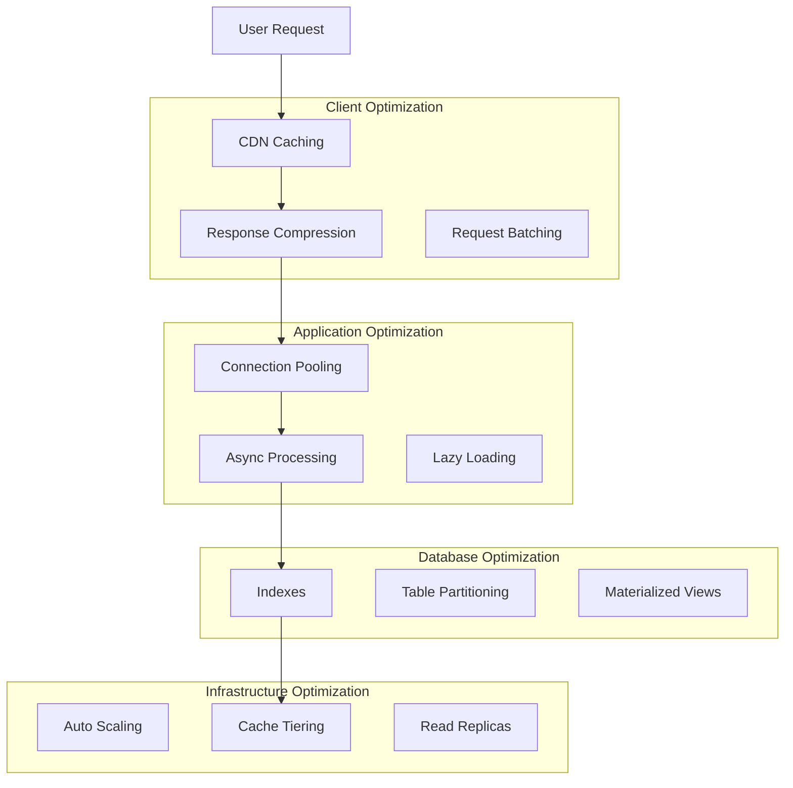
```mermaid
graph TD
    subgraph "Client Optimization"
        CDN[CDN Caching]
        COMPRESS[Response Compression]
        BATCH_REQ[Request Batching]
    end
    
    subgraph "Application Optimization"
        POOL[Connection Pooling]
        ASYNC[Async Processing]
        LAZY[Lazy Loading]
    end
    
    subgraph "Database Optimization"
        INDEX[Indexes]
        PARTITION[Table Partitioning]
        MATERIALIZE[Materialized Views]
    end
    
    subgraph "Infrastructure Optimization"
        AUTO_SCALE[Auto Scaling]
        CACHE_TIER[Cache Tiering]
        READ_REPLICA[Read Replicas]
    end
    
    REQUEST[User Request] --> CDN
    CDN --> COMPRESS
    COMPRESS --> POOL
    POOL --> ASYNC
    ASYNC --> INDEX
    INDEX --> CACHE_TIER
```

### Scalability Strategy

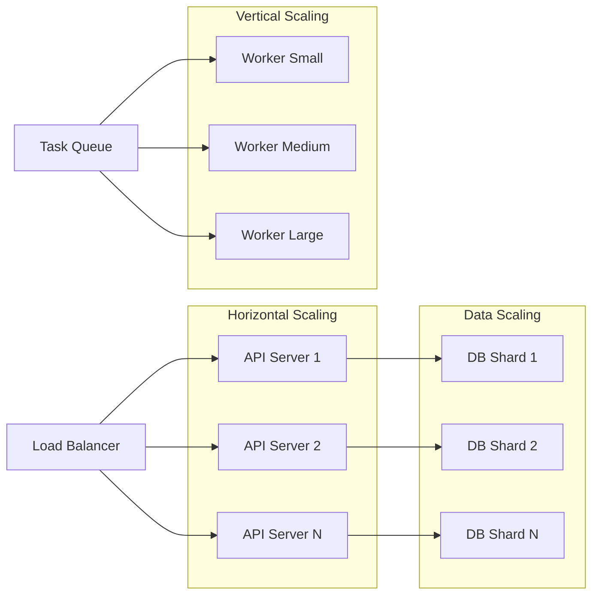
```mermaid
graph LR
    subgraph "Horizontal Scaling"
        API1[API Server 1]
        API2[API Server 2]
        API3[API Server N]
    end
    
    subgraph "Vertical Scaling"
        WORKER_S[Worker Small]
        WORKER_M[Worker Medium]
        WORKER_L[Worker Large]
    end
    
    subgraph "Data Scaling"
        SHARD1[DB Shard 1]
        SHARD2[DB Shard 2]
        SHARD3[DB Shard N]
    end
    
    LB[Load Balancer] --> API1
    LB --> API2
    LB --> API3
    
    QUEUE[Task Queue] --> WORKER_S
    QUEUE --> WORKER_M
    QUEUE --> WORKER_L
    
    API1 --> SHARD1
    API2 --> SHARD2
    API3 --> SHARD3
```

## Design Patterns

### 1. Repository Pattern

```python
# Abstract Repository
class BaseRepository(ABC):
    @abstractmethod
    async def get(self, id: int):
        pass
    
    @abstractmethod
    async def create(self, entity: BaseModel):
        pass
    
    @abstractmethod
    async def update(self, id: int, entity: BaseModel):
        pass

# Concrete Implementation
class PaymentRepository(BaseRepository):
    def __init__(self, db: Session):
        self.db = db
    
    async def get(self, id: int) -> EmployeePayment:
        return self.db.query(EmployeePayment).filter_by(id=id).first()
```

### 2. Factory Pattern

```python
# Tax Calculator Factory
class TaxCalculatorFactory:
    @staticmethod
    def get_calculator(location: str) -> TaxCalculator:
        calculators = {
            'california': CaliforniaTaxCalculator,
            'new_york': NewYorkTaxCalculator,
            'texas': TexasTaxCalculator
        }
        return calculators.get(location, DefaultTaxCalculator)()
```

### 3. Strategy Pattern

```python
# Payment Processing Strategy
class PaymentProcessor(ABC):
    @abstractmethod
    async def process(self, payment: Payment):
        pass

class DirectDepositProcessor(PaymentProcessor):
    async def process(self, payment: Payment):
        # Direct deposit logic
        pass

class CheckProcessor(PaymentProcessor):
    async def process(self, payment: Payment):
        # Check processing logic
        pass
```

### 4. Observer Pattern

```python
# Event System
class PayrollEventSystem:
    def __init__(self):
        self._observers = defaultdict(list)
    
    def subscribe(self, event_type: str, handler: Callable):
        self._observers[event_type].append(handler)
    
    async def publish(self, event_type: str, data: Dict):
        for handler in self._observers[event_type]:
            await handler(data)
```

### 5. Chain of Responsibility

```python
# Validation Chain
class ValidationHandler(ABC):
    def __init__(self):
        self._next_handler = None
    
    def set_next(self, handler):
        self._next_handler = handler
        return handler
    
    @abstractmethod
    async def handle(self, request: PayrollRequest):
        if self._next_handler:
            return await self._next_handler.handle(request)
        return True

class HoursValidation(ValidationHandler):
    async def handle(self, request: PayrollRequest):
        if request.hours > 168:  # Max hours in a week
            raise ValidationError("Invalid hours")
        return await super().handle(request)
```

## Technology Stack

### Core Technologies

| Layer | Technology | Purpose |
|-------|------------|---------|
| API Framework | FastAPI | High-performance async API |
| ORM | SQLAlchemy | Database abstraction |
| Database | PostgreSQL 15 | Primary data store |
| Cache | Redis 7 | Caching and pub/sub |
| Task Queue | Celery | Background processing |
| Container | Docker | Containerization |
| Orchestration | Kubernetes | Container orchestration |
| Monitoring | Prometheus + Grafana | Metrics and visualization |
| Logging | ELK Stack | Centralized logging |
| API Gateway | Kong/Nginx | API routing and management |

### Development Tools

| Tool | Purpose |
|------|---------|
| Poetry | Dependency management |
| Black | Code formatting |
| Flake8 | Linting |
| Pytest | Testing framework |
| Alembic | Database migrations |
| Pre-commit | Git hooks |
| Swagger/OpenAPI | API documentation |

## Architecture Decisions

### ADR-001: Microservices vs Modular Monolith

**Decision**: Modular Monolith with future microservices migration path

**Rationale**:
- Simpler deployment and operations initially
- Clear module boundaries for future extraction
- Reduced operational complexity
- Easier data consistency

### ADR-002: Synchronous vs Asynchronous Processing

**Decision**: Hybrid approach with sync for real-time operations and async for batch

**Rationale**:
- Better user experience for individual calculations
- Scalability for batch operations
- Resource optimization
- Clear separation of concerns

### ADR-003: Database Per Service vs Shared Database

**Decision**: Shared database with logical separation

**Rationale**:
- Simplified transactions
- Easier reporting and analytics
- Reduced operational overhead
- Future migration path to separate databases

### ADR-004: Event Sourcing vs CRUD

**Decision**: CRUD with audit logging

**Rationale**:
- Simpler implementation
- Meets compliance requirements
- Easier to understand and maintain
- Sufficient for current requirements

## Future Roadmap

### Phase 1: Current Architecture (Months 1-6)
- Modular monolith
- Shared database
- Basic event system
- Manual scaling

### Phase 2: Service Extraction (Months 7-12)
- Extract calculation engine
- Separate tax service
- Implement API gateway
- Enhanced monitoring

### Phase 3: Full Microservices (Year 2)
- Complete service separation
- Event-driven architecture
- Service mesh implementation
- Multi-region deployment

### Phase 4: Advanced Features (Year 2+)
- Machine learning integration
- Real-time analytics
- GraphQL API
- Global distribution

## Architecture Principles

1. **Modularity**: Clear boundaries between components
2. **Scalability**: Horizontal and vertical scaling capabilities
3. **Resilience**: Fault tolerance and graceful degradation
4. **Security**: Defense in depth approach
5. **Observability**: Comprehensive monitoring and logging
6. **Maintainability**: Clean code and clear documentation
7. **Performance**: Optimized for high throughput
8. **Compliance**: Audit trails and data protection

## Conclusion

The Payroll & Tax Module architecture is designed to be robust, scalable, and maintainable while providing a clear path for future enhancements. The modular approach allows for gradual evolution from a monolithic architecture to microservices as the system grows and requirements change.

For implementation details and code examples, refer to the [Developer Guide](DEVELOPER_GUIDE.md). For deployment instructions, see the [Deployment Guide](DEPLOYMENT.md).