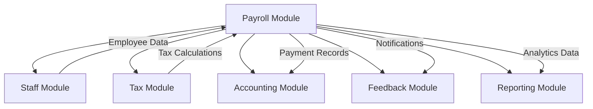

# Payroll Module Integration Guide

This guide provides detailed instructions for integrating the Payroll & Tax Module with other AuraConnect modules.

## Table of Contents

1. [Overview](#overview)
2. [Staff Module Integration](#staff-module-integration)
3. [Tax Module Integration](#tax-module-integration)
4. [Accounting Module Integration](#accounting-module-integration)
5. [Feedback Module Integration](#feedback-module-integration)
6. [Reporting Module Integration](#reporting-module-integration)
7. [Integration Patterns](#integration-patterns)
8. [Event-Driven Integration](#event-driven-integration)
9. [Best Practices](#best-practices)

## Overview

The Payroll Module is designed to seamlessly integrate with other AuraConnect modules through:

- **Direct API calls** for synchronous operations
- **Event publishing** for asynchronous notifications
- **Shared data models** for consistency
- **Service interfaces** for loose coupling

### Module Dependencies



## Staff Module Integration

The Payroll Module depends heavily on the Staff Module for employee data.

### Required Staff Module Endpoints

```python
# backend/modules/payroll/integrations/staff_integration.py

from typing import List, Optional, Dict
from datetime import date
import httpx

class StaffIntegration:
    """Integration with Staff Module for employee data."""
    
    def __init__(self, base_url: str, auth_token: str):
        self.base_url = base_url
        self.headers = {"Authorization": f"Bearer {auth_token}"}
    
    async def get_employee(self, employee_id: int) -> Dict:
        """Fetch employee details from Staff Module."""
        async with httpx.AsyncClient() as client:
            response = await client.get(
                f"{self.base_url}/api/staff/{employee_id}",
                headers=self.headers
            )
            response.raise_for_status()
            return response.json()
    
    async def get_employee_timesheet(
        self, 
        employee_id: int,
        start_date: date,
        end_date: date
    ) -> Dict:
        """Fetch timesheet data for payroll calculation."""
        async with httpx.AsyncClient() as client:
            response = await client.get(
                f"{self.base_url}/api/staff/{employee_id}/timesheets",
                params={
                    "start_date": start_date.isoformat(),
                    "end_date": end_date.isoformat()
                },
                headers=self.headers
            )
            response.raise_for_status()
            return response.json()
    
    async def get_active_employees(
        self,
        department: Optional[str] = None,
        location: Optional[str] = None
    ) -> List[Dict]:
        """Get list of active employees for batch processing."""
        params = {"status": "active"}
        if department:
            params["department"] = department
        if location:
            params["location"] = location
            
        async with httpx.AsyncClient() as client:
            response = await client.get(
                f"{self.base_url}/api/staff",
                params=params,
                headers=self.headers
            )
            response.raise_for_status()
            return response.json()["employees"]
```

### Staff Module Data Requirements

The Payroll Module requires the following employee data:

```json
{
  "employee": {
    "id": 123,
    "employee_code": "EMP001",
    "full_name": "John Doe",
    "email": "john.doe@company.com",
    "department": "Engineering",
    "location": "california",
    "employment_type": "full_time",
    "employment_status": "active",
    "hire_date": "2020-01-15",
    
    "compensation": {
      "pay_type": "salary",
      "annual_salary": 120000.00,
      "hourly_rate": null,
      "overtime_eligible": false
    },
    
    "tax_info": {
      "filing_status": "single",
      "federal_allowances": 2,
      "state_allowances": 1,
      "additional_federal_withholding": 0.00,
      "additional_state_withholding": 0.00,
      "is_exempt_federal": false,
      "is_exempt_state": false,
      "is_exempt_fica": false
    },
    
    "benefits": {
      "health_insurance": {
        "plan": "premium",
        "monthly_cost": 500.00,
        "employee_contribution": 200.00
      },
      "retirement": {
        "plan": "401k",
        "employee_percentage": 0.06,
        "employer_match_percentage": 0.04,
        "employer_match_limit": 5000.00
      }
    },
    
    "bank_info": {
      "payment_method": "direct_deposit",
      "account_type": "checking",
      "account_number_masked": "****1234",
      "routing_number_masked": "****5678"
    }
  }
}
```

### Timesheet Integration

```python
# Example: Fetching and processing timesheet data

async def calculate_payroll_from_timesheet(
    employee_id: int,
    pay_period_start: date,
    pay_period_end: date
):
    """Calculate payroll based on timesheet data."""
    
    # Get employee details
    staff_integration = StaffIntegration(
        base_url="https://api.auraconnect.com",
        auth_token=get_service_token()
    )
    
    employee = await staff_integration.get_employee(employee_id)
    timesheet = await staff_integration.get_employee_timesheet(
        employee_id, 
        pay_period_start, 
        pay_period_end
    )
    
    # Process timesheet entries
    total_regular_hours = Decimal("0")
    total_overtime_hours = Decimal("0")
    
    for entry in timesheet["entries"]:
        if entry["is_approved"]:
            total_regular_hours += Decimal(str(entry["regular_hours"]))
            total_overtime_hours += Decimal(str(entry["overtime_hours"]))
    
    # Calculate pay based on employee type
    if employee["compensation"]["pay_type"] == "hourly":
        regular_pay = (
            total_regular_hours * 
            Decimal(str(employee["compensation"]["hourly_rate"]))
        )
        overtime_pay = (
            total_overtime_hours * 
            Decimal(str(employee["compensation"]["hourly_rate"])) * 
            Decimal("1.5")
        )
    else:
        # Salary - calculate based on pay period
        annual_salary = Decimal(str(employee["compensation"]["annual_salary"]))
        regular_pay = annual_salary / Decimal("26")  # Bi-weekly
        overtime_pay = Decimal("0")
    
    return {
        "employee_id": employee_id,
        "regular_hours": total_regular_hours,
        "overtime_hours": total_overtime_hours,
        "regular_pay": regular_pay,
        "overtime_pay": overtime_pay,
        "gross_pay": regular_pay + overtime_pay
    }
```

## Tax Module Integration

The Payroll Module integrates with the Tax Module for accurate tax calculations.

### Tax Calculation Service

```python
# backend/modules/payroll/integrations/tax_integration.py

from decimal import Decimal
from typing import Dict
import httpx

class TaxIntegration:
    """Integration with Tax Module for tax calculations."""
    
    def __init__(self, base_url: str, auth_token: str):
        self.base_url = base_url
        self.headers = {"Authorization": f"Bearer {auth_token}"}
    
    async def calculate_taxes(
        self,
        gross_pay: Decimal,
        employee_id: int,
        pay_period_start: date,
        pay_period_end: date,
        ytd_income: Decimal,
        filing_status: str,
        allowances: int,
        location: str
    ) -> Dict[str, Decimal]:
        """Calculate all applicable taxes."""
        
        payload = {
            "gross_pay": str(gross_pay),
            "employee_id": employee_id,
            "pay_period": {
                "start": pay_period_start.isoformat(),
                "end": pay_period_end.isoformat()
            },
            "ytd_income": str(ytd_income),
            "filing_info": {
                "status": filing_status,
                "allowances": allowances
            },
            "location": location
        }
        
        async with httpx.AsyncClient() as client:
            response = await client.post(
                f"{self.base_url}/api/tax/calculate",
                json=payload,
                headers=self.headers
            )
            response.raise_for_status()
            
            taxes = response.json()
            return {
                "federal_income_tax": Decimal(taxes["federal_income_tax"]),
                "state_income_tax": Decimal(taxes["state_income_tax"]),
                "local_tax": Decimal(taxes["local_tax"]),
                "social_security": Decimal(taxes["social_security"]),
                "medicare": Decimal(taxes["medicare"]),
                "additional_medicare": Decimal(taxes.get("additional_medicare", "0")),
                "state_disability": Decimal(taxes.get("state_disability", "0")),
                "state_unemployment": Decimal(taxes.get("state_unemployment", "0"))
            }
    
    async def get_tax_rates(self, location: str, year: int) -> Dict:
        """Get current tax rates for a location."""
        async with httpx.AsyncClient() as client:
            response = await client.get(
                f"{self.base_url}/api/tax/rates",
                params={"location": location, "year": year},
                headers=self.headers
            )
            response.raise_for_status()
            return response.json()
```

### Tax Module Response Format

```json
{
  "taxes": {
    "federal_income_tax": "425.63",
    "state_income_tax": "141.88",
    "local_tax": "0.00",
    "social_security": "175.93",
    "medicare": "41.14",
    "additional_medicare": "0.00",
    "state_disability": "28.38",
    "state_unemployment": "0.00",
    "total_taxes": "812.96"
  },
  "tax_details": {
    "federal": {
      "taxable_income": "2837.50",
      "tax_rate": "0.15",
      "allowance_amount": "0.00"
    },
    "state": {
      "state_code": "CA",
      "taxable_income": "2837.50",
      "tax_rate": "0.05"
    },
    "fica": {
      "social_security_wage_base": "168600.00",
      "ytd_social_security_wages": "5675.00",
      "medicare_additional_threshold": "200000.00"
    }
  }
}
```

## Accounting Module Integration

The Payroll Module sends payment data to the Accounting Module for general ledger entries.

### Journal Entry Creation

```python
# backend/modules/payroll/integrations/accounting_integration.py

from decimal import Decimal
from datetime import date
from typing import List, Dict
import httpx

class AccountingIntegration:
    """Integration with Accounting Module for GL entries."""
    
    def __init__(self, base_url: str, auth_token: str):
        self.base_url = base_url
        self.headers = {"Authorization": f"Bearer {auth_token}"}
    
    async def create_payroll_journal_entry(
        self,
        pay_date: date,
        payroll_summary: Dict[str, Decimal]
    ) -> str:
        """Create journal entry for payroll."""
        
        # Build journal entry lines
        lines = []
        
        # Debit: Salary Expense
        lines.append({
            "account_code": "5000",  # Salary Expense
            "description": "Gross Wages",
            "debit": str(payroll_summary["total_gross_pay"]),
            "credit": "0.00"
        })
        
        # Credit: Various liabilities
        lines.append({
            "account_code": "2100",  # Federal Tax Payable
            "description": "Federal Income Tax Withheld",
            "debit": "0.00",
            "credit": str(payroll_summary["total_federal_tax"])
        })
        
        lines.append({
            "account_code": "2110",  # State Tax Payable
            "description": "State Income Tax Withheld",
            "debit": "0.00",
            "credit": str(payroll_summary["total_state_tax"])
        })
        
        lines.append({
            "account_code": "2120",  # FICA Payable
            "description": "FICA Taxes Withheld",
            "debit": "0.00",
            "credit": str(
                payroll_summary["total_social_security"] + 
                payroll_summary["total_medicare"]
            )
        })
        
        lines.append({
            "account_code": "2200",  # Wages Payable
            "description": "Net Wages Payable",
            "debit": "0.00",
            "credit": str(payroll_summary["total_net_pay"])
        })
        
        # Create journal entry
        journal_entry = {
            "date": pay_date.isoformat(),
            "reference": f"PAYROLL-{pay_date.isoformat()}",
            "description": f"Payroll for period ending {pay_date}",
            "lines": lines,
            "status": "pending"
        }
        
        async with httpx.AsyncClient() as client:
            response = await client.post(
                f"{self.base_url}/api/accounting/journal-entries",
                json=journal_entry,
                headers=self.headers
            )
            response.raise_for_status()
            return response.json()["entry_id"]
    
    async def record_payment_disbursement(
        self,
        payment_id: str,
        amount: Decimal,
        payment_method: str,
        payment_date: date
    ) -> str:
        """Record actual payment disbursement."""
        
        disbursement = {
            "payment_id": payment_id,
            "amount": str(amount),
            "payment_method": payment_method,
            "payment_date": payment_date.isoformat(),
            "account_code": "1000" if payment_method == "check" else "1010",
            "reference": f"PAYROLL-PMT-{payment_id}"
        }
        
        async with httpx.AsyncClient() as client:
            response = await client.post(
                f"{self.base_url}/api/accounting/disbursements",
                json=disbursement,
                headers=self.headers
            )
            response.raise_for_status()
            return response.json()["disbursement_id"]
```

### Chart of Accounts Mapping

| Account Type | Account Code | Description |
|--------------|--------------|-------------|
| Expense | 5000 | Salary Expense |
| Expense | 5010 | Hourly Wage Expense |
| Expense | 5020 | Overtime Expense |
| Expense | 5100 | Employer FICA Expense |
| Expense | 5110 | Employer FUTA Expense |
| Expense | 5120 | Employer SUTA Expense |
| Liability | 2100 | Federal Tax Payable |
| Liability | 2110 | State Tax Payable |
| Liability | 2120 | FICA Payable |
| Liability | 2130 | 401(k) Payable |
| Liability | 2200 | Wages Payable |
| Asset | 1000 | Cash - Operating |
| Asset | 1010 | Cash - Payroll |

## Feedback Module Integration

The Payroll Module uses the Feedback Module for employee notifications.

### Notification Service

```python
# backend/modules/payroll/integrations/feedback_integration.py

from typing import Dict, List, Optional
import httpx

class FeedbackIntegration:
    """Integration with Feedback Module for notifications."""
    
    def __init__(self, base_url: str, auth_token: str):
        self.base_url = base_url
        self.headers = {"Authorization": f"Bearer {auth_token}"}
    
    async def send_payment_notification(
        self,
        employee_id: int,
        payment_details: Dict
    ) -> str:
        """Send payment notification to employee."""
        
        notification = {
            "recipient_id": employee_id,
            "type": "payment_processed",
            "channel": ["email", "in_app"],
            "template": "payroll_payment_processed",
            "data": {
                "employee_name": payment_details["employee_name"],
                "pay_period": payment_details["pay_period"],
                "pay_date": payment_details["pay_date"],
                "net_pay": payment_details["net_pay"],
                "payment_method": payment_details["payment_method"],
                "view_stub_url": payment_details["view_stub_url"]
            },
            "priority": "normal"
        }
        
        async with httpx.AsyncClient() as client:
            response = await client.post(
                f"{self.base_url}/api/feedback/notifications",
                json=notification,
                headers=self.headers
            )
            response.raise_for_status()
            return response.json()["notification_id"]
    
    async def send_batch_notifications(
        self,
        notifications: List[Dict]
    ) -> List[str]:
        """Send multiple notifications in batch."""
        
        batch_request = {
            "notifications": notifications,
            "batch_options": {
                "continue_on_error": True,
                "priority": "normal"
            }
        }
        
        async with httpx.AsyncClient() as client:
            response = await client.post(
                f"{self.base_url}/api/feedback/notifications/batch",
                json=batch_request,
                headers=self.headers
            )
            response.raise_for_status()
            return response.json()["notification_ids"]
```

### Notification Templates

**Payment Processed Template:**
```html
Subject: Your payment for {{ pay_period }} has been processed

Dear {{ employee_name }},

Your payment for the pay period {{ pay_period }} has been successfully processed.

Payment Details:
- Pay Date: {{ pay_date }}
- Net Pay: ${{ net_pay }}
- Payment Method: {{ payment_method }}

You can view your detailed pay stub here: {{ view_stub_url }}

If you have any questions, please contact HR.

Best regards,
Payroll Team
```

## Reporting Module Integration

The Payroll Module provides data to the Reporting Module for analytics.

### Analytics Data Export

```python
# backend/modules/payroll/integrations/reporting_integration.py

from datetime import date
from typing import Dict, List
import httpx

class ReportingIntegration:
    """Integration with Reporting Module for analytics."""
    
    def __init__(self, base_url: str, auth_token: str):
        self.base_url = base_url
        self.headers = {"Authorization": f"Bearer {auth_token}"}
    
    async def export_payroll_metrics(
        self,
        start_date: date,
        end_date: date
    ) -> str:
        """Export payroll metrics for reporting."""
        
        metrics = await self._calculate_metrics(start_date, end_date)
        
        export_request = {
            "data_type": "payroll_metrics",
            "period": {
                "start": start_date.isoformat(),
                "end": end_date.isoformat()
            },
            "metrics": metrics,
            "dimensions": ["department", "location", "employment_type"],
            "granularity": "daily"
        }
        
        async with httpx.AsyncClient() as client:
            response = await client.post(
                f"{self.base_url}/api/reporting/data-export",
                json=export_request,
                headers=self.headers
            )
            response.raise_for_status()
            return response.json()["export_id"]
    
    async def _calculate_metrics(
        self,
        start_date: date,
        end_date: date
    ) -> Dict:
        """Calculate payroll metrics for the period."""
        
        # This would query the database for actual metrics
        return {
            "total_gross_pay": 1250000.00,
            "total_net_pay": 937500.00,
            "total_taxes": 312500.00,
            "employee_count": 250,
            "average_gross_pay": 5000.00,
            "overtime_hours": 1250.5,
            "overtime_cost": 93787.50,
            "benefits_cost": 125000.00,
            "department_breakdown": {
                "Engineering": {
                    "gross_pay": 600000.00,
                    "employee_count": 100
                },
                "Sales": {
                    "gross_pay": 400000.00,
                    "employee_count": 80
                },
                "Support": {
                    "gross_pay": 250000.00,
                    "employee_count": 70
                }
            }
        }
```

### Reporting Dashboards

The Payroll Module provides data for the following dashboards:

1. **Payroll Summary Dashboard**
   - Total payroll costs by period
   - Department-wise breakdown
   - YoY comparison
   - Tax liability tracking

2. **Labor Cost Analytics**
   - Regular vs overtime costs
   - Cost per employee
   - Benefits utilization
   - Productivity metrics

3. **Compliance Dashboard**
   - Tax filing status
   - Audit trail summary
   - Error rates
   - Processing time metrics

## Integration Patterns

### Synchronous Integration

For real-time operations that require immediate response:

```python
async def process_single_payment(employee_id: int):
    """Synchronous integration example."""
    try:
        # 1. Get employee data (sync)
        employee = await staff_integration.get_employee(employee_id)
        
        # 2. Calculate taxes (sync)
        taxes = await tax_integration.calculate_taxes(...)
        
        # 3. Create payment record
        payment = await create_payment(employee, taxes)
        
        # 4. Send to accounting (sync)
        journal_entry = await accounting_integration.create_journal_entry(...)
        
        # 5. Notify employee (async - fire and forget)
        asyncio.create_task(
            feedback_integration.send_payment_notification(...)
        )
        
        return payment
        
    except Exception as e:
        await handle_integration_error(e)
        raise
```

### Asynchronous Integration

For batch operations and non-critical updates:

```python
async def process_batch_payroll(job_id: str):
    """Asynchronous integration example."""
    
    # 1. Queue job
    await queue_batch_job(job_id)
    
    # 2. Process in background
    @background_task
    async def process():
        employees = await staff_integration.get_active_employees()
        
        for employee in employees:
            try:
                # Process each employee
                await process_employee_payroll(employee)
                
                # Update progress
                await update_job_progress(job_id, employee["id"])
                
            except Exception as e:
                await log_employee_error(job_id, employee["id"], e)
                continue
        
        # 3. Send completion notification
        await notify_batch_completion(job_id)
    
    # Return immediately with job status
    return {"job_id": job_id, "status": "processing"}
```

## Event-Driven Integration

The Payroll Module publishes events that other modules can subscribe to:

### Published Events

```python
# Event definitions
PAYROLL_EVENTS = {
    "payment.calculated": {
        "description": "Payroll calculation completed",
        "payload": {
            "employee_id": int,
            "calculation_id": str,
            "gross_pay": float,
            "net_pay": float
        }
    },
    "payment.processed": {
        "description": "Payment successfully processed",
        "payload": {
            "payment_id": str,
            "employee_id": int,
            "amount": float,
            "payment_date": str
        }
    },
    "batch.started": {
        "description": "Batch payroll processing started",
        "payload": {
            "job_id": str,
            "total_employees": int,
            "pay_period": dict
        }
    },
    "batch.completed": {
        "description": "Batch payroll processing completed",
        "payload": {
            "job_id": str,
            "successful": int,
            "failed": int,
            "duration_seconds": int
        }
    },
    "tax_form.generated": {
        "description": "Tax form (W-2, 1099) generated",
        "payload": {
            "form_type": str,
            "year": int,
            "employee_id": int,
            "form_id": str
        }
    }
}
```

### Event Publisher

```python
# backend/modules/payroll/events/publisher.py

import json
from typing import Dict, Any
import aioredis

class PayrollEventPublisher:
    """Publish payroll events for other modules."""
    
    def __init__(self, redis_url: str):
        self.redis_url = redis_url
        self.redis = None
    
    async def connect(self):
        """Connect to Redis for pub/sub."""
        self.redis = await aioredis.create_redis_pool(self.redis_url)
    
    async def publish(self, event_type: str, payload: Dict[str, Any]):
        """Publish an event."""
        event = {
            "type": event_type,
            "timestamp": datetime.utcnow().isoformat(),
            "payload": payload
        }
        
        channel = f"payroll.{event_type}"
        await self.redis.publish(channel, json.dumps(event))
    
    async def close(self):
        """Close Redis connection."""
        if self.redis:
            self.redis.close()
            await self.redis.wait_closed()
```

### Event Subscriber Example

```python
# Example: Accounting module subscribing to payroll events

import asyncio
import json
import aioredis

class PayrollEventSubscriber:
    """Subscribe to payroll events in accounting module."""
    
    async def start(self):
        redis = await aioredis.create_redis_pool('redis://localhost')
        channel = (await redis.subscribe('payroll.payment.processed'))[0]
        
        while await channel.wait_message():
            message = await channel.get_json()
            await self.handle_payment_processed(message)
    
    async def handle_payment_processed(self, event: Dict):
        """Handle payment processed event."""
        payment_data = event["payload"]
        
        # Create accounting entries
        await create_payment_journal_entry(
            payment_id=payment_data["payment_id"],
            amount=payment_data["amount"],
            date=payment_data["payment_date"]
        )
```

## Best Practices

### 1. Error Handling

Always implement proper error handling for integrations:

```python
from tenacity import retry, stop_after_attempt, wait_exponential

class ResilientIntegration:
    """Example of resilient integration patterns."""
    
    @retry(
        stop=stop_after_attempt(3),
        wait=wait_exponential(multiplier=1, min=4, max=10)
    )
    async def call_external_service(self, *args, **kwargs):
        """Retry failed calls with exponential backoff."""
        try:
            return await self._make_call(*args, **kwargs)
        except httpx.HTTPStatusError as e:
            if e.response.status_code >= 500:
                raise  # Retry on server errors
            else:
                # Don't retry client errors
                await self.handle_client_error(e)
                raise
```

### 2. Circuit Breaker Pattern

Prevent cascading failures:

```python
from pybreaker import CircuitBreaker

class TaxServiceIntegration:
    def __init__(self):
        self.tax_breaker = CircuitBreaker(
            fail_max=5,
            reset_timeout=60,
            exclude=[httpx.HTTPStatusError]
        )
    
    @tax_breaker
    async def calculate_taxes(self, *args, **kwargs):
        """Protected tax calculation call."""
        return await self._calculate_taxes(*args, **kwargs)
```

### 3. Data Validation

Validate all data exchanged between modules:

```python
from pydantic import BaseModel, validator
from decimal import Decimal

class EmployeePayrollData(BaseModel):
    """Validated employee data from Staff module."""
    
    employee_id: int
    hourly_rate: Optional[Decimal]
    annual_salary: Optional[Decimal]
    
    @validator('hourly_rate', 'annual_salary')
    def validate_positive(cls, v):
        if v is not None and v <= 0:
            raise ValueError('Must be positive')
        return v
    
    @validator('annual_salary')
    def validate_salary_or_hourly(cls, v, values):
        if v is None and values.get('hourly_rate') is None:
            raise ValueError('Either hourly_rate or annual_salary required')
        return v
```

### 4. Monitoring and Logging

Track all integration points:

```python
import logging
from functools import wraps

logger = logging.getLogger(__name__)

def log_integration(service_name: str):
    """Decorator to log integration calls."""
    def decorator(func):
        @wraps(func)
        async def wrapper(*args, **kwargs):
            start_time = time.time()
            try:
                result = await func(*args, **kwargs)
                duration = time.time() - start_time
                logger.info(
                    f"{service_name} integration successful",
                    extra={
                        "service": service_name,
                        "method": func.__name__,
                        "duration": duration,
                        "status": "success"
                    }
                )
                return result
            except Exception as e:
                duration = time.time() - start_time
                logger.error(
                    f"{service_name} integration failed",
                    extra={
                        "service": service_name,
                        "method": func.__name__,
                        "duration": duration,
                        "status": "error",
                        "error": str(e)
                    }
                )
                raise
        return wrapper
    return decorator
```

### 5. Integration Testing

Create integration tests that mock external services:

```python
import pytest
from unittest.mock import AsyncMock

@pytest.fixture
def mock_staff_service():
    """Mock Staff service for testing."""
    mock = AsyncMock()
    mock.get_employee.return_value = {
        "id": 123,
        "hourly_rate": "25.00",
        "location": "california"
    }
    return mock

async def test_payroll_calculation_with_integrations(
    mock_staff_service,
    mock_tax_service
):
    """Test payroll calculation with mocked integrations."""
    # Inject mocks
    payroll_service = PayrollService(
        staff_service=mock_staff_service,
        tax_service=mock_tax_service
    )
    
    # Test calculation
    result = await payroll_service.calculate_payroll(
        employee_id=123,
        hours_worked=80
    )
    
    # Verify integrations were called
    mock_staff_service.get_employee.assert_called_once_with(123)
    mock_tax_service.calculate_taxes.assert_called_once()
    
    assert result["net_pay"] > 0
```

## Integration Checklist

Before deploying integrations:

- [ ] All integration points have error handling
- [ ] Circuit breakers configured for external calls
- [ ] Retry logic implemented for transient failures
- [ ] Data validation on all module boundaries
- [ ] Integration tests cover all scenarios
- [ ] Monitoring and alerting configured
- [ ] Documentation updated with integration details
- [ ] Performance impact assessed
- [ ] Security review completed
- [ ] Rollback plan documented