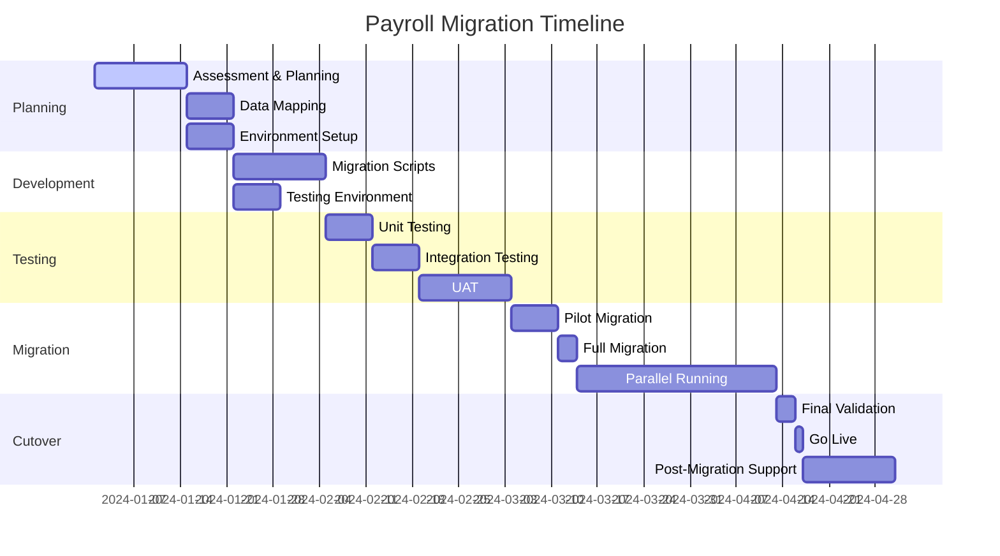
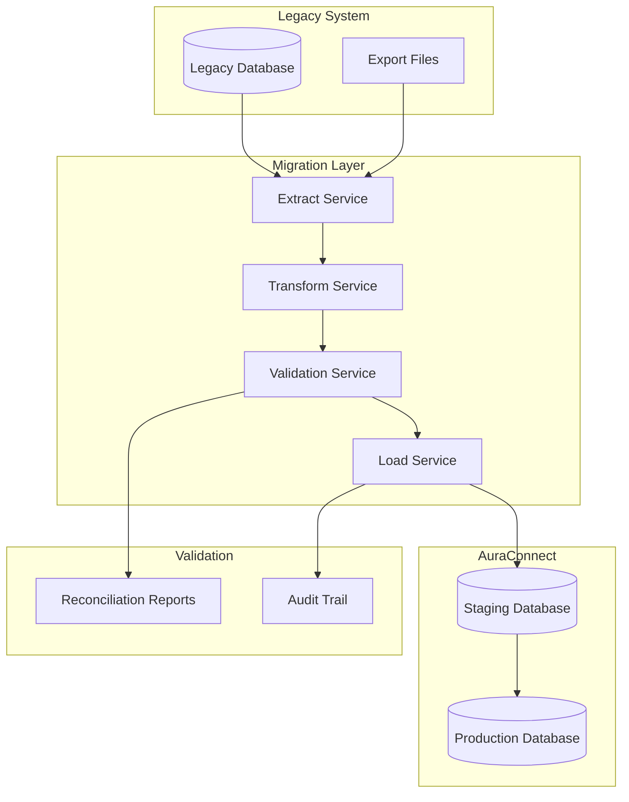

# Payroll Module Migration Guide

This guide provides comprehensive instructions for migrating from legacy payroll systems to the AuraConnect Payroll & Tax Module.

## Table of Contents

1. [Overview](#overview)
2. [Pre-Migration Planning](#pre-migration-planning)
3. [Data Migration Strategy](#data-migration-strategy)
4. [Migration Process](#migration-process)
5. [System-Specific Guides](#system-specific-guides)
6. [Validation and Testing](#validation-and-testing)
7. [Cutover Planning](#cutover-planning)
8. [Post-Migration](#post-migration)
9. [Rollback Procedures](#rollback-procedures)

## Overview

### Migration Objectives

- **Data Integrity**: Ensure all payroll data is accurately transferred
- **Compliance**: Maintain regulatory compliance throughout migration
- **Zero Downtime**: Minimize disruption to payroll operations
- **Audit Trail**: Preserve historical data and audit trails
- **Parallel Running**: Support parallel running during transition

### Migration Timeline



## Pre-Migration Planning

### 1. System Assessment

#### Current System Inventory
```yaml
Current_System_Assessment:
  system_info:
    name: "Legacy Payroll System"
    vendor: "Current Vendor"
    version: "x.x.x"
    database: "Oracle/SQL Server/MySQL"
    users: 500
    
  data_volume:
    employees: 5000
    historical_years: 7
    payment_records: 350000
    tax_forms: 35000
    
  integrations:
    - name: "Time & Attendance"
      type: "API"
      frequency: "Daily"
    - name: "HRIS"
      type: "File Transfer"
      frequency: "Real-time"
    - name: "GL System"
      type: "Batch"
      frequency: "Per Pay Run"
```

#### Gap Analysis

| Feature | Legacy System | AuraConnect | Gap | Migration Action |
|---------|--------------|-------------|-----|------------------|
| Multi-state Payroll | Limited | Full Support | ✓ | Map state configurations |
| Direct Deposit | File-based | API-based | ✓ | Update bank interfaces |
| Tax Filing | Manual | Automated | ✓ | Configure tax services |
| Garnishments | Basic | Advanced | ✓ | Enhanced data mapping |
| Reporting | Limited | Comprehensive | ✓ | Train users on new reports |

### 2. Data Mapping

#### Employee Master Data
```python
# Legacy to AuraConnect field mapping
EMPLOYEE_FIELD_MAPPING = {
    # Legacy Field -> AuraConnect Field
    'EMP_ID': 'employee_code',
    'FIRST_NAME': 'first_name',
    'LAST_NAME': 'last_name',
    'SSN': 'ssn_encrypted',
    'HIRE_DATE': 'hire_date',
    'DEPT_CODE': 'department',
    'LOCATION_CODE': 'location',
    'PAY_RATE': 'base_salary',
    'PAY_FREQUENCY': 'pay_schedule',
    'STATUS': 'employment_status',
    
    # Transformations required
    'FULL_NAME': lambda r: f"{r['FIRST_NAME']} {r['LAST_NAME']}",
    'ANNUAL_SALARY': lambda r: r['PAY_RATE'] * PAY_FREQUENCY_MULTIPLIER[r['PAY_FREQUENCY']],
    'PAY_TYPE': lambda r: 'salary' if r['SALARY_FLAG'] == 'Y' else 'hourly'
}

# Tax configuration mapping
TAX_FIELD_MAPPING = {
    'FED_FILING_STATUS': 'federal_filing_status',
    'FED_ALLOWANCES': 'federal_allowances',
    'STATE_CODE': 'state',
    'STATE_FILING_STATUS': 'state_filing_status',
    'STATE_ALLOWANCES': 'state_allowances',
    'EXTRA_FED_WH': 'additional_federal_withholding',
    'EXTRA_STATE_WH': 'additional_state_withholding'
}
```

### 3. Risk Assessment

| Risk | Impact | Probability | Mitigation |
|------|--------|-------------|------------|
| Data Loss | High | Low | Comprehensive backups, validation |
| Calculation Differences | High | Medium | Parallel running, reconciliation |
| User Adoption | Medium | Medium | Training, documentation |
| Integration Failures | High | Low | Phased approach, fallback plans |
| Compliance Issues | High | Low | Audit trail preservation |

## Data Migration Strategy

### Migration Architecture



### Data Categories

#### 1. Master Data
- Employee demographics
- Compensation details
- Tax configurations
- Benefit enrollments
- Bank account information

#### 2. Transactional Data
- Payment history (current year)
- YTD totals
- Tax withholdings
- Deduction history
- Leave balances

#### 3. Historical Data
- Prior year payment records
- Tax forms (W-2, 1099)
- Audit logs
- Compliance reports

#### 4. Configuration Data
- Pay schedules
- Overtime rules
- Tax tables
- Deduction codes
- GL mappings

## Migration Process

### Phase 1: Environment Setup

```bash
# 1. Create migration environment
./scripts/setup_migration_env.sh

# 2. Install migration tools
pip install payroll-migration-toolkit

# 3. Configure connections
cat > config/migration.yaml << EOF
source:
  type: oracle
  host: legacy-db.company.com
  port: 1521
  database: PAYROLL
  username: migration_user
  
target:
  type: postgresql
  host: auraconnect-db.company.com
  port: 5432
  database: payroll_staging
  username: migration_user
  
migration:
  batch_size: 1000
  parallel_workers: 4
  validation_mode: strict
  rollback_enabled: true
EOF
```

### Phase 2: Data Extraction

```python
# extract_legacy_data.py
import cx_Oracle
import pandas as pd
from datetime import datetime

class LegacyDataExtractor:
    def __init__(self, config):
        self.config = config
        self.connection = self._connect()
    
    def extract_employees(self, as_of_date=None):
        """Extract employee master data."""
        query = """
        SELECT 
            e.EMP_ID,
            e.FIRST_NAME,
            e.LAST_NAME,
            e.SSN,
            e.HIRE_DATE,
            e.DEPT_CODE,
            e.LOCATION_CODE,
            c.PAY_RATE,
            c.PAY_FREQUENCY,
            c.SALARY_FLAG,
            e.STATUS
        FROM EMPLOYEES e
        JOIN COMPENSATION c ON e.EMP_ID = c.EMP_ID
        WHERE e.STATUS IN ('A', 'L')  -- Active and Leave
        AND c.EFFECTIVE_DATE = (
            SELECT MAX(EFFECTIVE_DATE)
            FROM COMPENSATION c2
            WHERE c2.EMP_ID = e.EMP_ID
            AND c2.EFFECTIVE_DATE <= :as_of_date
        )
        """
        
        as_of_date = as_of_date or datetime.now()
        df = pd.read_sql(query, self.connection, params={'as_of_date': as_of_date})
        
        # Add data quality checks
        self._validate_extracted_data(df)
        
        return df
    
    def extract_ytd_totals(self, year):
        """Extract year-to-date totals."""
        query = """
        SELECT 
            EMP_ID,
            SUM(GROSS_PAY) as YTD_GROSS,
            SUM(NET_PAY) as YTD_NET,
            SUM(FED_TAX) as YTD_FED_TAX,
            SUM(STATE_TAX) as YTD_STATE_TAX,
            SUM(SOC_SEC) as YTD_SOC_SEC,
            SUM(MEDICARE) as YTD_MEDICARE,
            MAX(PAY_DATE) as LAST_PAY_DATE
        FROM PAYROLL_HISTORY
        WHERE YEAR(PAY_DATE) = :year
        GROUP BY EMP_ID
        """
        
        return pd.read_sql(query, self.connection, params={'year': year})
```

### Phase 3: Data Transformation

```python
# transform_payroll_data.py
from decimal import Decimal
import hashlib

class PayrollDataTransformer:
    def __init__(self, mapping_config):
        self.mapping_config = mapping_config
    
    def transform_employees(self, legacy_df):
        """Transform employee data to AuraConnect format."""
        transformed = pd.DataFrame()
        
        for legacy_field, target_field in EMPLOYEE_FIELD_MAPPING.items():
            if callable(target_field):
                # Apply transformation function
                transformed[legacy_field] = legacy_df.apply(target_field, axis=1)
            else:
                # Direct mapping
                transformed[target_field] = legacy_df[legacy_field]
        
        # Add additional fields
        transformed['tenant_id'] = self.mapping_config['tenant_id']
        transformed['created_at'] = datetime.now()
        transformed['created_by'] = 'migration'
        
        # Encrypt sensitive data
        transformed['ssn_encrypted'] = transformed['ssn_encrypted'].apply(
            self._encrypt_ssn
        )
        
        return transformed
    
    def _encrypt_ssn(self, ssn):
        """Encrypt SSN for storage."""
        # Remove any formatting
        clean_ssn = ''.join(filter(str.isdigit, str(ssn)))
        
        # Use proper encryption in production
        return hashlib.sha256(clean_ssn.encode()).hexdigest()
    
    def transform_pay_rates(self, legacy_df):
        """Transform compensation data."""
        transformed = pd.DataFrame()
        
        # Convert pay rates based on frequency
        for idx, row in legacy_df.iterrows():
            if row['SALARY_FLAG'] == 'Y':
                # Annual salary
                transformed.loc[idx, 'annual_salary'] = Decimal(str(row['PAY_RATE']))
                transformed.loc[idx, 'hourly_rate'] = None
            else:
                # Hourly rate
                transformed.loc[idx, 'annual_salary'] = None
                transformed.loc[idx, 'hourly_rate'] = Decimal(str(row['PAY_RATE']))
            
            transformed.loc[idx, 'pay_type'] = 'salary' if row['SALARY_FLAG'] == 'Y' else 'hourly'
            transformed.loc[idx, 'employee_id'] = row['EMP_ID']
            transformed.loc[idx, 'effective_date'] = datetime.now()
        
        return transformed
```

### Phase 4: Data Validation

```python
# validate_migration.py
class MigrationValidator:
    def __init__(self, source_conn, target_conn):
        self.source_conn = source_conn
        self.target_conn = target_conn
        self.validation_results = []
    
    def validate_record_counts(self):
        """Validate record counts match."""
        validations = [
            ('employees', 'EMPLOYEES', 'staff_employee'),
            ('payments', 'PAYROLL_HISTORY', 'employee_payments'),
            ('tax_info', 'EMPLOYEE_TAX', 'employee_tax_info')
        ]
        
        for name, source_table, target_table in validations:
            source_count = self._get_count(self.source_conn, source_table)
            target_count = self._get_count(self.target_conn, target_table)
            
            self.validation_results.append({
                'validation': f'{name}_count',
                'source_count': source_count,
                'target_count': target_count,
                'status': 'PASS' if source_count == target_count else 'FAIL',
                'variance': abs(source_count - target_count)
            })
    
    def validate_financial_totals(self, year):
        """Validate financial totals match."""
        # Source system totals
        source_query = """
        SELECT 
            SUM(GROSS_PAY) as total_gross,
            SUM(NET_PAY) as total_net,
            SUM(FED_TAX) as total_fed_tax
        FROM PAYROLL_HISTORY
        WHERE YEAR(PAY_DATE) = :year
        """
        
        source_totals = pd.read_sql(
            source_query, 
            self.source_conn, 
            params={'year': year}
        ).iloc[0]
        
        # Target system totals
        target_query = """
        SELECT 
            SUM(gross_pay) as total_gross,
            SUM(net_pay) as total_net,
            SUM(federal_tax_withheld) as total_fed_tax
        FROM employee_payments
        WHERE EXTRACT(YEAR FROM pay_date) = %s
        """
        
        target_totals = pd.read_sql(
            target_query,
            self.target_conn,
            params=[year]
        ).iloc[0]
        
        # Compare with tolerance
        tolerance = Decimal('0.01')  # 1 cent tolerance
        
        for field in ['total_gross', 'total_net', 'total_fed_tax']:
            source_val = Decimal(str(source_totals[field]))
            target_val = Decimal(str(target_totals[field]))
            variance = abs(source_val - target_val)
            
            self.validation_results.append({
                'validation': f'{field}_reconciliation',
                'source_value': source_val,
                'target_value': target_val,
                'status': 'PASS' if variance <= tolerance else 'FAIL',
                'variance': variance
            })
    
    def generate_validation_report(self):
        """Generate validation report."""
        report = pd.DataFrame(self.validation_results)
        
        # Summary
        total_validations = len(report)
        passed = len(report[report['status'] == 'PASS'])
        failed = len(report[report['status'] == 'FAIL'])
        
        print(f"\nValidation Summary:")
        print(f"Total Validations: {total_validations}")
        print(f"Passed: {passed}")
        print(f"Failed: {failed}")
        print(f"Success Rate: {(passed/total_validations)*100:.2f}%")
        
        # Failed validations detail
        if failed > 0:
            print("\nFailed Validations:")
            print(report[report['status'] == 'FAIL'])
        
        # Save detailed report
        report.to_csv(f'validation_report_{datetime.now():%Y%m%d_%H%M%S}.csv', index=False)
        
        return report
```

## System-Specific Guides

### ADP to AuraConnect

```python
# adp_migration.py
class ADPMigration(BaseMigration):
    def extract_employees(self):
        """Extract from ADP specific format."""
        # ADP uses different field names
        query = """
        SELECT 
            AssociateID as EMP_ID,
            FirstName as FIRST_NAME,
            LastName as LAST_NAME,
            TaxID as SSN,
            HireDate as HIRE_DATE,
            HomeDepartment as DEPT_CODE,
            WorkLocation as LOCATION_CODE
        FROM ADP.Associates
        WHERE Status = 'Active'
        """
        return self.extract_data(query)
    
    def map_pay_frequencies(self, adp_code):
        """Map ADP pay frequency codes."""
        mapping = {
            'B': 'biweekly',
            'S': 'semimonthly',
            'M': 'monthly',
            'W': 'weekly'
        }
        return mapping.get(adp_code, 'biweekly')
```

### Paychex to AuraConnect

```python
# paychex_migration.py
class PaychexMigration(BaseMigration):
    def extract_from_export_file(self, file_path):
        """Extract from Paychex export files."""
        # Paychex typically provides CSV exports
        df = pd.read_csv(
            file_path,
            dtype={
                'Employee ID': str,
                'SSN': str,
                'Zip Code': str
            }
        )
        
        # Rename columns to standard format
        column_mapping = {
            'Employee ID': 'EMP_ID',
            'First Name': 'FIRST_NAME',
            'Last Name': 'LAST_NAME',
            'Social Security': 'SSN',
            'Hire Date': 'HIRE_DATE',
            'Department': 'DEPT_CODE',
            'Location': 'LOCATION_CODE',
            'Annual Salary': 'PAY_RATE',
            'Pay Frequency': 'PAY_FREQUENCY'
        }
        
        df.rename(columns=column_mapping, inplace=True)
        return df
```

### QuickBooks Payroll to AuraConnect

```python
# quickbooks_migration.py
class QuickBooksMigration(BaseMigration):
    def connect_to_quickbooks(self):
        """Connect to QuickBooks API."""
        from quickbooks import QuickBooks
        
        client = QuickBooks(
            client_id=self.config['qb_client_id'],
            client_secret=self.config['qb_client_secret'],
            refresh_token=self.config['qb_refresh_token'],
            company_id=self.config['qb_company_id']
        )
        return client
    
    def extract_employees(self):
        """Extract employees from QuickBooks."""
        client = self.connect_to_quickbooks()
        
        employees = []
        query = "SELECT * FROM Employee WHERE Active = true"
        
        results = client.query(query)
        
        for emp in results:
            employees.append({
                'EMP_ID': emp.Id,
                'FIRST_NAME': emp.GivenName,
                'LAST_NAME': emp.FamilyName,
                'SSN': emp.SSN,
                'HIRE_DATE': emp.HireDate,
                'EMAIL': emp.PrimaryEmailAddr.Address if emp.PrimaryEmailAddr else None
            })
        
        return pd.DataFrame(employees)
```

## Validation and Testing

### Test Migration Process

```python
# test_migration.py
class MigrationTester:
    def __init__(self, config):
        self.config = config
        self.test_results = []
    
    def run_test_migration(self, sample_size=100):
        """Run test migration with sample data."""
        print(f"Running test migration with {sample_size} records...")
        
        # 1. Extract sample data
        sample_employees = self.extract_sample_employees(sample_size)
        
        # 2. Transform data
        transformed = self.transform_data(sample_employees)
        
        # 3. Load to staging
        self.load_to_staging(transformed)
        
        # 4. Run calculations
        self.test_calculations()
        
        # 5. Validate results
        self.validate_results()
        
        return self.test_results
    
    def test_calculations(self):
        """Test payroll calculations match."""
        test_cases = [
            {
                'employee_id': 'TEST001',
                'hours': 80,
                'rate': 25.00,
                'expected_gross': 2000.00
            },
            {
                'employee_id': 'TEST002',
                'hours': 90,  # With overtime
                'rate': 20.00,
                'expected_gross': 1900.00  # 80*20 + 10*30
            }
        ]
        
        for test in test_cases:
            result = self.calculate_payroll(
                test['employee_id'],
                test['hours'],
                test['rate']
            )
            
            variance = abs(result['gross_pay'] - test['expected_gross'])
            
            self.test_results.append({
                'test': f"calculation_{test['employee_id']}",
                'expected': test['expected_gross'],
                'actual': result['gross_pay'],
                'variance': variance,
                'status': 'PASS' if variance < 0.01 else 'FAIL'
            })
```

### Reconciliation Reports

```sql
-- reconciliation_queries.sql

-- Employee count reconciliation
WITH source_counts AS (
    SELECT 
        COUNT(*) as total_employees,
        COUNT(CASE WHEN STATUS = 'A' THEN 1 END) as active_employees,
        COUNT(CASE WHEN SALARY_FLAG = 'Y' THEN 1 END) as salaried_employees
    FROM legacy.EMPLOYEES
),
target_counts AS (
    SELECT 
        COUNT(*) as total_employees,
        COUNT(CASE WHEN employment_status = 'active' THEN 1 END) as active_employees,
        COUNT(CASE WHEN pay_type = 'salary' THEN 1 END) as salaried_employees
    FROM staff_employee
)
SELECT 
    'Employee Counts' as metric,
    s.total_employees as source_value,
    t.total_employees as target_value,
    ABS(s.total_employees - t.total_employees) as variance
FROM source_counts s, target_counts t;

-- YTD totals reconciliation
WITH source_ytd AS (
    SELECT 
        EMP_ID,
        SUM(GROSS_PAY) as ytd_gross,
        SUM(FED_TAX + STATE_TAX) as ytd_taxes
    FROM legacy.PAYROLL_HISTORY
    WHERE YEAR = 2024
    GROUP BY EMP_ID
),
target_ytd AS (
    SELECT 
        e.employee_code as emp_id,
        SUM(p.gross_pay) as ytd_gross,
        SUM(p.federal_tax_withheld + p.state_tax_withheld) as ytd_taxes
    FROM employee_payments p
    JOIN staff_employee e ON p.employee_id = e.id
    WHERE EXTRACT(YEAR FROM p.pay_date) = 2024
    GROUP BY e.employee_code
)
SELECT 
    s.EMP_ID,
    s.ytd_gross as source_gross,
    t.ytd_gross as target_gross,
    ABS(s.ytd_gross - t.ytd_gross) as gross_variance,
    s.ytd_taxes as source_taxes,
    t.ytd_taxes as target_taxes,
    ABS(s.ytd_taxes - t.ytd_taxes) as tax_variance
FROM source_ytd s
JOIN target_ytd t ON s.EMP_ID = t.emp_id
WHERE ABS(s.ytd_gross - t.ytd_gross) > 0.01
ORDER BY gross_variance DESC;
```

## Cutover Planning

### Cutover Checklist

#### Pre-Cutover (T-7 days)
- [ ] Final data validation completed
- [ ] All integrations tested
- [ ] User training completed
- [ ] Rollback procedures tested
- [ ] Communication sent to stakeholders
- [ ] Backup of legacy system taken

#### Cutover Day (T-0)
- [ ] Legacy system access restricted
- [ ] Final data sync executed
- [ ] Validation scripts run
- [ ] System smoke tests passed
- [ ] User access granted
- [ ] Monitoring enabled

#### Post-Cutover (T+1 to T+7)
- [ ] Daily reconciliation reports
- [ ] User issue tracking
- [ ] Performance monitoring
- [ ] Integration verification
- [ ] Parallel run comparison

### Parallel Running Plan

```python
# parallel_run_comparison.py
class ParallelRunValidator:
    def __init__(self, legacy_conn, auraconnect_conn):
        self.legacy_conn = legacy_conn
        self.auraconnect_conn = auraconnect_conn
    
    def compare_payroll_run(self, pay_date):
        """Compare payroll calculations between systems."""
        results = []
        
        # Get employees
        employees = self.get_employee_list()
        
        for emp in employees:
            # Legacy calculation
            legacy_calc = self.get_legacy_calculation(emp['id'], pay_date)
            
            # AuraConnect calculation
            aura_calc = self.get_auraconnect_calculation(emp['id'], pay_date)
            
            # Compare
            variance = {
                'employee_id': emp['id'],
                'gross_pay_variance': abs(legacy_calc['gross'] - aura_calc['gross']),
                'net_pay_variance': abs(legacy_calc['net'] - aura_calc['net']),
                'fed_tax_variance': abs(legacy_calc['fed_tax'] - aura_calc['fed_tax']),
                'status': 'MATCH' if self._within_tolerance(legacy_calc, aura_calc) else 'VARIANCE'
            }
            
            results.append(variance)
        
        return pd.DataFrame(results)
    
    def _within_tolerance(self, legacy, aura, tolerance=0.01):
        """Check if calculations are within acceptable tolerance."""
        fields = ['gross', 'net', 'fed_tax', 'state_tax']
        
        for field in fields:
            if abs(legacy[field] - aura[field]) > tolerance:
                return False
        
        return True
```

## Post-Migration

### Monitoring and Support

```python
# post_migration_monitor.py
class PostMigrationMonitor:
    def __init__(self, config):
        self.config = config
        self.alerts = []
    
    def daily_health_check(self):
        """Run daily health checks."""
        checks = [
            self.check_calculation_accuracy(),
            self.check_integration_status(),
            self.check_user_activity(),
            self.check_error_rates()
        ]
        
        for check in checks:
            if not check['status']:
                self.send_alert(check)
    
    def check_calculation_accuracy(self):
        """Monitor calculation accuracy."""
        # Compare a sample of calculations
        sample_size = 100
        variance_threshold = 0.01
        
        variances = self.calculate_sample_variances(sample_size)
        accuracy_rate = len(variances[variances < variance_threshold]) / sample_size
        
        return {
            'check': 'calculation_accuracy',
            'status': accuracy_rate >= 0.99,
            'accuracy_rate': accuracy_rate,
            'message': f'Calculation accuracy: {accuracy_rate:.2%}'
        }
```

### Knowledge Transfer

#### Training Materials
1. **System Overview**
   - Architecture differences
   - New features and capabilities
   - Integration points

2. **User Guides**
   - Step-by-step procedures
   - Screenshot comparisons
   - Common tasks mapping

3. **Administrator Training**
   - Configuration management
   - Troubleshooting guide
   - Monitoring and maintenance

#### Documentation Updates
```markdown
# Migration Completion Checklist

## Technical Documentation
- [ ] Updated system architecture diagrams
- [ ] API documentation for integrations
- [ ] Database schema documentation
- [ ] Runbook for common operations

## User Documentation
- [ ] Updated user manuals
- [ ] Quick reference guides
- [ ] Video tutorials
- [ ] FAQ document

## Operational Documentation
- [ ] Support procedures
- [ ] Escalation matrix
- [ ] SLA definitions
- [ ] Disaster recovery plan
```

## Rollback Procedures

### Rollback Decision Matrix

| Scenario | Severity | Rollback Decision | Action |
|----------|----------|-------------------|--------|
| Critical calculation errors | High | Immediate | Execute full rollback |
| Integration failures | Medium | Evaluate | Partial rollback possible |
| Performance issues | Low | Monitor | Optimize, no rollback |
| User adoption issues | Low | Support | Training, no rollback |

### Rollback Execution

```bash
#!/bin/bash
# rollback_migration.sh

echo "Starting rollback procedure..."

# 1. Stop AuraConnect services
systemctl stop auraconnect-payroll

# 2. Restore database backup
pg_restore -h localhost -U postgres -d payroll_backup payroll_pre_migration.dump

# 3. Revert configuration
cp /backup/config/payroll.conf /etc/auraconnect/payroll.conf

# 4. Update DNS/Load balancer
./scripts/update_routing.sh legacy

# 5. Start legacy system
./scripts/start_legacy_payroll.sh

# 6. Verify legacy system
./scripts/verify_legacy_health.sh

echo "Rollback completed. Legacy system restored."
```

### Post-Rollback Actions

1. **Root Cause Analysis**
   - Identify failure points
   - Document lessons learned
   - Update migration plan

2. **Communication**
   - Notify all stakeholders
   - Update project timeline
   - Schedule retrospective

3. **Remediation Planning**
   - Address identified issues
   - Update test cases
   - Plan re-migration

## Migration Tools and Scripts

### Master Migration Script

```python
# master_migration.py
import argparse
import logging
from datetime import datetime

class PayrollMigrationOrchestrator:
    def __init__(self, config_file):
        self.config = self.load_config(config_file)
        self.setup_logging()
        
    def execute_migration(self, phase='all', dry_run=False):
        """Execute migration based on phase."""
        phases = {
            'extract': self.extract_phase,
            'transform': self.transform_phase,
            'load': self.load_phase,
            'validate': self.validate_phase,
            'cutover': self.cutover_phase
        }
        
        if phase == 'all':
            for phase_name, phase_func in phases.items():
                self.logger.info(f"Starting {phase_name} phase...")
                phase_func(dry_run)
        else:
            phases[phase](dry_run)
    
    def extract_phase(self, dry_run=False):
        """Extract data from legacy system."""
        extractor = LegacyDataExtractor(self.config)
        
        datasets = [
            'employees',
            'compensation',
            'tax_configuration',
            'payment_history',
            'ytd_totals'
        ]
        
        for dataset in datasets:
            self.logger.info(f"Extracting {dataset}...")
            data = extractor.extract(dataset)
            
            if not dry_run:
                self.save_extracted_data(dataset, data)
            
            self.logger.info(f"Extracted {len(data)} {dataset} records")

if __name__ == "__main__":
    parser = argparse.ArgumentParser(description='Payroll Migration Tool')
    parser.add_argument('--config', required=True, help='Configuration file')
    parser.add_argument('--phase', default='all', help='Migration phase')
    parser.add_argument('--dry-run', action='store_true', help='Dry run mode')
    
    args = parser.parse_args()
    
    orchestrator = PayrollMigrationOrchestrator(args.config)
    orchestrator.execute_migration(args.phase, args.dry_run)
```

## Conclusion

This migration guide provides a comprehensive framework for migrating from legacy payroll systems to AuraConnect. Key success factors include:

1. **Thorough Planning**: Detailed assessment and mapping
2. **Phased Approach**: Incremental migration with validation
3. **Parallel Running**: Ensure accuracy before cutover
4. **Comprehensive Testing**: Validate all aspects of the system
5. **User Training**: Ensure smooth adoption
6. **Rollback Preparedness**: Have contingency plans ready

For specific technical questions during migration, contact the migration support team at migration-support@auraconnect.com.