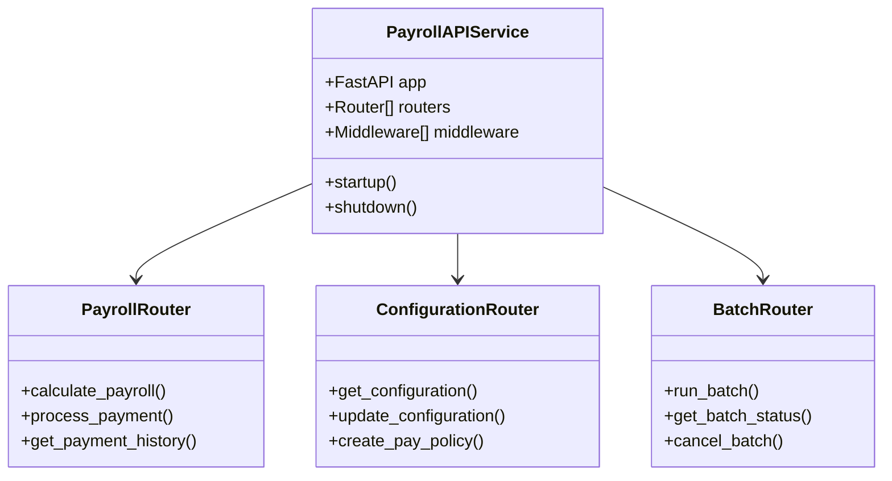
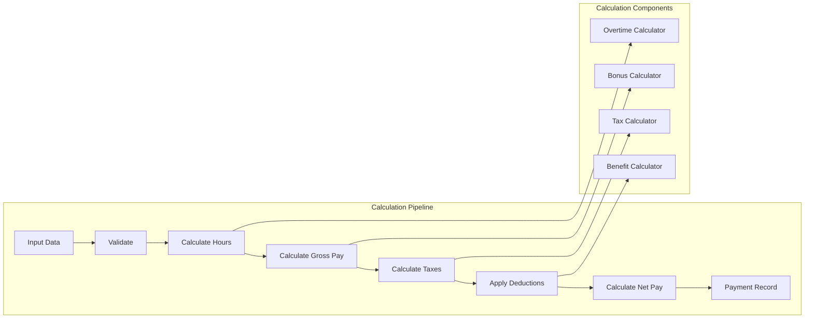
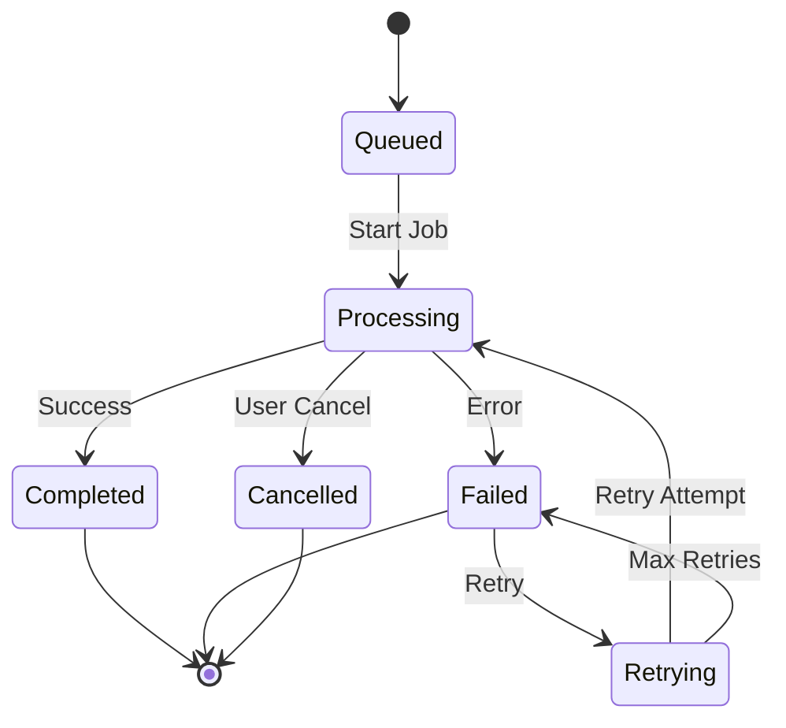
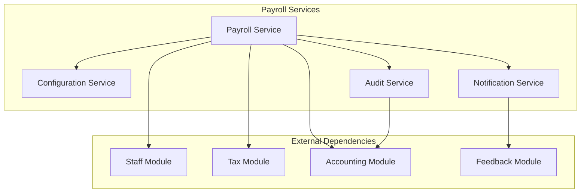

# Component Architecture

This document details the component architecture of the Payroll & Tax Module, describing the core components and their interactions.

## Core Components Overview



## Component Descriptions

### 1. Payroll API Service

The main FastAPI application that serves as the entry point for all payroll operations.

**Responsibilities:**
- Request routing
- Middleware management
- Dependency injection
- Health checks
- Service lifecycle

**Key Features:**
- Async request handling
- Automatic API documentation
- Request validation
- Error handling

### 2. Calculation Engine



**Components:**
- **Validation Engine**: Ensures data integrity
- **Hours Calculator**: Regular and overtime hours
- **Gross Pay Calculator**: Base pay, overtime, bonuses
- **Tax Calculator**: Federal, state, local taxes
- **Deduction Engine**: Benefits, garnishments, etc.
- **Net Pay Calculator**: Final take-home calculation

### 3. Batch Processing Service



**Key Features:**
- Job queue management
- Progress tracking
- Error handling and retry logic
- Parallel processing
- Result aggregation

### 4. Configuration Service

Manages all payroll-related configurations including:
- Pay policies
- Overtime rules
- Tax tables
- Deduction types
- Role-based pay rates

### 5. Audit Service

Provides comprehensive audit logging for:
- All configuration changes
- Payment calculations
- User actions
- System events
- Compliance tracking

## Service Dependencies



## Design Patterns

### Repository Pattern

```python
# Abstract Repository
class BaseRepository(ABC):
    @abstractmethod
    async def get(self, id: int):
        pass
    
    @abstractmethod
    async def create(self, entity: BaseModel):
        pass
    
    @abstractmethod
    async def update(self, id: int, entity: BaseModel):
        pass

# Concrete Implementation
class PaymentRepository(BaseRepository):
    def __init__(self, db: Session):
        self.db = db
    
    async def get(self, id: int) -> EmployeePayment:
        return self.db.query(EmployeePayment).filter_by(id=id).first()
```

### Factory Pattern

```python
# Tax Calculator Factory
class TaxCalculatorFactory:
    @staticmethod
    def get_calculator(location: str) -> TaxCalculator:
        calculators = {
            'california': CaliforniaTaxCalculator,
            'new_york': NewYorkTaxCalculator,
            'texas': TexasTaxCalculator
        }
        return calculators.get(location, DefaultTaxCalculator)()
```

### Strategy Pattern

```python
# Payment Processing Strategy
class PaymentProcessor(ABC):
    @abstractmethod
    async def process(self, payment: Payment):
        pass

class DirectDepositProcessor(PaymentProcessor):
    async def process(self, payment: Payment):
        # Direct deposit logic
        pass

class CheckProcessor(PaymentProcessor):
    async def process(self, payment: Payment):
        # Check processing logic
        pass
```

### Chain of Responsibility

```python
# Validation Chain
class ValidationHandler(ABC):
    def __init__(self):
        self._next_handler = None
    
    def set_next(self, handler):
        self._next_handler = handler
        return handler
    
    @abstractmethod
    async def handle(self, request: PayrollRequest):
        if self._next_handler:
            return await self._next_handler.handle(request)
        return True
```

## Component Communication

### Synchronous Communication
- Direct service calls
- HTTP REST APIs
- Database queries

### Asynchronous Communication
- Message queues (Celery)
- Event publishing (Redis Pub/Sub)
- Webhooks

## Scalability Considerations

1. **Stateless Components**: All services are stateless for horizontal scaling
2. **Connection Pooling**: Database and Redis connection pools
3. **Caching Strategy**: Multi-level caching for performance
4. **Load Balancing**: Round-robin distribution across instances
5. **Circuit Breakers**: Prevent cascading failures

## Monitoring and Observability

Each component provides:
- Health check endpoints
- Prometheus metrics
- Structured logging
- Distributed tracing
- Performance counters

## Related Documentation

- [Architecture Overview](overview.md)
- [Data Architecture](data.md)
- [Integration Patterns](integration.md)
- [API Documentation](../API.md)