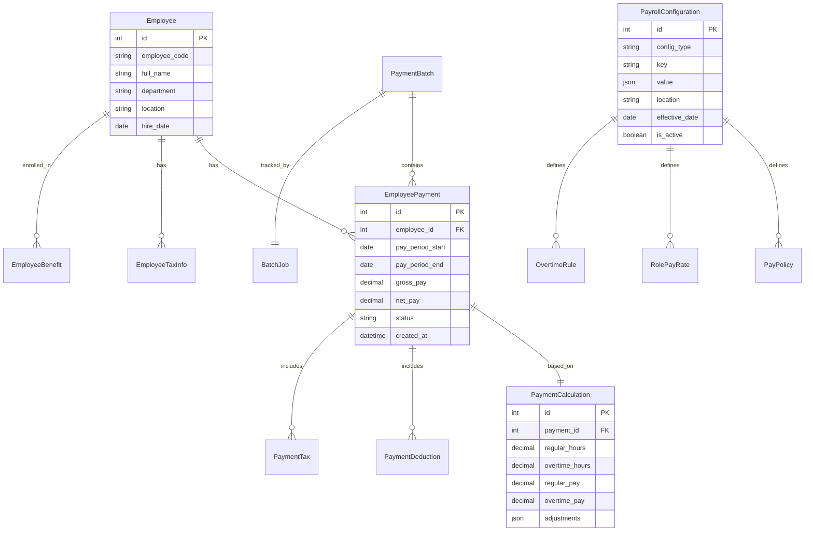
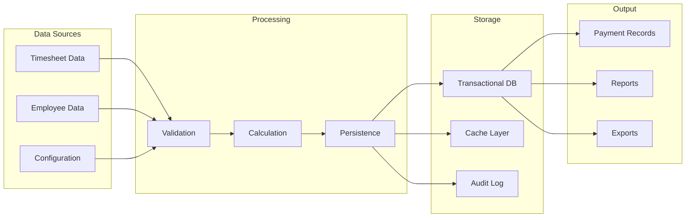
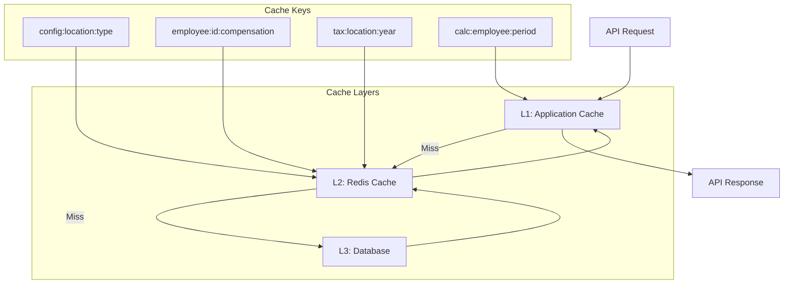

# Data Architecture

This document describes the data architecture of the Payroll & Tax Module, including the database schema, data flow patterns, and caching strategies.

## Entity Relationship Diagram



## Core Data Models

### Employee Payment
Primary entity for storing payment records.

```sql
CREATE TABLE employee_payments (
    id SERIAL PRIMARY KEY,
    employee_id INTEGER NOT NULL REFERENCES employees(id),
    pay_period_start DATE NOT NULL,
    pay_period_end DATE NOT NULL,
    pay_date DATE NOT NULL,
    gross_pay DECIMAL(12,2) NOT NULL,
    net_pay DECIMAL(12,2) NOT NULL,
    status VARCHAR(20) NOT NULL,
    payment_method VARCHAR(20),
    confirmation_number VARCHAR(50),
    created_at TIMESTAMP DEFAULT CURRENT_TIMESTAMP,
    created_by INTEGER,
    updated_at TIMESTAMP,
    tenant_id INTEGER NOT NULL,
    CONSTRAINT uk_employee_payment UNIQUE (employee_id, pay_period_start, pay_period_end)
);

-- Performance indexes
CREATE INDEX idx_employee_payments_employee_date 
    ON employee_payments(employee_id, pay_period_start, pay_period_end);
CREATE INDEX idx_employee_payments_status 
    ON employee_payments(status) 
    WHERE status IN ('pending', 'processing');
CREATE INDEX idx_employee_payments_pay_date 
    ON employee_payments(pay_date);
```

### Payment Calculations
Detailed breakdown of payment calculations.

```sql
CREATE TABLE payment_calculations (
    id SERIAL PRIMARY KEY,
    payment_id INTEGER NOT NULL REFERENCES employee_payments(id),
    regular_hours DECIMAL(6,2),
    overtime_hours DECIMAL(6,2),
    double_time_hours DECIMAL(6,2),
    regular_pay DECIMAL(12,2),
    overtime_pay DECIMAL(12,2),
    double_time_pay DECIMAL(12,2),
    bonus_amount DECIMAL(12,2),
    commission_amount DECIMAL(12,2),
    other_earnings JSONB,
    calculation_details JSONB,
    created_at TIMESTAMP DEFAULT CURRENT_TIMESTAMP
);
```

### Tax Withholdings
Tax calculation details for each payment.

```sql
CREATE TABLE payment_taxes (
    id SERIAL PRIMARY KEY,
    payment_id INTEGER NOT NULL REFERENCES employee_payments(id),
    tax_type VARCHAR(50) NOT NULL,
    taxable_wages DECIMAL(12,2) NOT NULL,
    tax_amount DECIMAL(12,2) NOT NULL,
    tax_rate DECIMAL(5,4),
    ytd_taxable_wages DECIMAL(12,2),
    ytd_tax_amount DECIMAL(12,2),
    jurisdiction VARCHAR(50),
    tax_details JSONB
);

CREATE INDEX idx_payment_taxes_payment_type 
    ON payment_taxes(payment_id, tax_type);
```

## Data Flow Architecture



## Caching Strategy

### Cache Layers



### Cache Policies

| Data Type | Cache Location | TTL | Invalidation Strategy |
|-----------|---------------|-----|----------------------|
| Configuration | Redis | 1 hour | On update |
| Employee Data | Redis | 15 min | On update |
| Tax Tables | Redis | 24 hours | Daily refresh |
| Calculations | Memory | 5 min | Time-based |
| Reports | Redis | 1 hour | On data change |

## Data Partitioning Strategy

### Table Partitioning

```sql
-- Partition employee_payments by year
CREATE TABLE employee_payments_2024 PARTITION OF employee_payments
    FOR VALUES FROM ('2024-01-01') TO ('2025-01-01');

CREATE TABLE employee_payments_2025 PARTITION OF employee_payments
    FOR VALUES FROM ('2025-01-01') TO ('2026-01-01');

-- Partition audit logs by month
CREATE TABLE payroll_audit_logs_2024_01 PARTITION OF payroll_audit_logs
    FOR VALUES FROM ('2024-01-01') TO ('2024-02-01');
```

### Archival Strategy

1. **Active Data**: Current year + previous year
2. **Archive Data**: 2-7 years (compressed)
3. **Cold Storage**: 7+ years (S3 Glacier)

## Data Security

### Encryption at Rest

```sql
-- Sensitive fields are encrypted
CREATE TABLE employee_sensitive_data (
    id SERIAL PRIMARY KEY,
    employee_id INTEGER NOT NULL REFERENCES employees(id),
    ssn_encrypted BYTEA NOT NULL,
    bank_account_encrypted BYTEA,
    routing_number_encrypted BYTEA,
    encryption_key_id VARCHAR(50) NOT NULL,
    created_at TIMESTAMP DEFAULT CURRENT_TIMESTAMP
);
```

### Row-Level Security

```sql
-- Enable RLS
ALTER TABLE employee_payments ENABLE ROW LEVEL SECURITY;

-- Create policy for tenant isolation
CREATE POLICY tenant_isolation ON employee_payments
    FOR ALL
    USING (tenant_id = current_setting('app.current_tenant')::int);
```

## Data Consistency

### Transaction Management

```python
# Example transaction handling
async def process_payment_batch(payments: List[PaymentData]):
    async with db.transaction():
        # Create batch record
        batch = await create_batch_record()
        
        # Process each payment
        for payment_data in payments:
            payment = await create_payment(payment_data)
            await create_calculation(payment)
            await create_taxes(payment)
            await create_deductions(payment)
        
        # Update batch status
        await update_batch_status(batch, "completed")
```

### Audit Trail

All data modifications are tracked in audit logs:

```sql
CREATE TABLE payroll_audit_logs (
    id SERIAL PRIMARY KEY,
    table_name VARCHAR(50) NOT NULL,
    record_id INTEGER NOT NULL,
    action VARCHAR(20) NOT NULL,
    user_id INTEGER,
    old_values JSONB,
    new_values JSONB,
    changed_fields TEXT[],
    ip_address INET,
    user_agent TEXT,
    created_at TIMESTAMP DEFAULT CURRENT_TIMESTAMP
);

-- Audit trigger
CREATE TRIGGER audit_employee_payments
    AFTER INSERT OR UPDATE OR DELETE ON employee_payments
    FOR EACH ROW EXECUTE FUNCTION audit_trigger_function();
```

## Performance Optimization

### Materialized Views

```sql
-- YTD summary view
CREATE MATERIALIZED VIEW employee_ytd_summary AS
SELECT 
    employee_id,
    EXTRACT(YEAR FROM pay_date) as year,
    SUM(gross_pay) as ytd_gross,
    SUM(net_pay) as ytd_net,
    SUM(federal_tax) as ytd_federal_tax,
    COUNT(*) as payment_count
FROM employee_payments
WHERE status = 'completed'
GROUP BY employee_id, EXTRACT(YEAR FROM pay_date);

-- Refresh strategy
CREATE INDEX idx_ytd_summary_employee_year 
    ON employee_ytd_summary(employee_id, year);
```

### Query Optimization

1. **Covering Indexes**: Include all needed columns
2. **Partial Indexes**: For frequently filtered queries
3. **Statistics**: Regular ANALYZE operations
4. **Connection Pooling**: Optimal pool sizes

## Related Documentation

- [Architecture Overview](overview.md)
- [Component Architecture](components.md)
- [Database Schema](../../models/README.md)
- [Migration Guide](../migration/data-mapping.md)