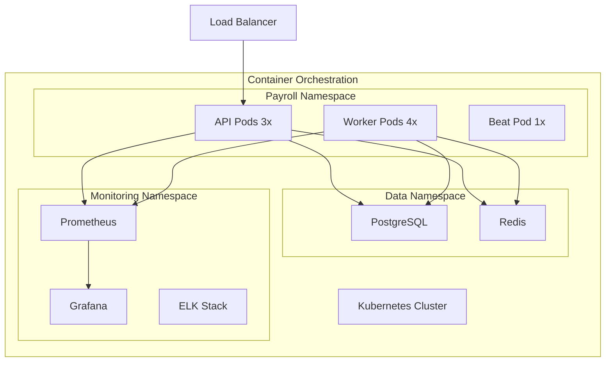
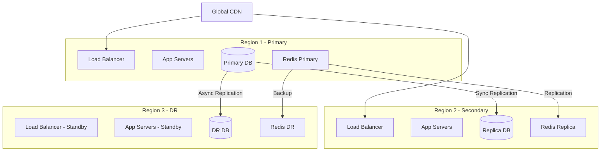

# Deployment Architecture

This document describes the deployment architecture and infrastructure requirements for the Payroll & Tax Module.

## Container Architecture



## High Availability Architecture



## Kubernetes Deployment

### Deployment Configuration

```yaml
# payroll-deployment.yaml
apiVersion: apps/v1
kind: Deployment
metadata:
  name: payroll-api
  namespace: auraconnect
spec:
  replicas: 3
  selector:
    matchLabels:
      app: payroll-api
  template:
    metadata:
      labels:
        app: payroll-api
    spec:
      containers:
      - name: payroll-api
        image: auraconnect/payroll:latest
        ports:
        - containerPort: 8000
        envFrom:
        - configMapRef:
            name: payroll-config
        - secretRef:
            name: payroll-secret
        resources:
          requests:
            memory: "256Mi"
            cpu: "250m"
          limits:
            memory: "512Mi"
            cpu: "500m"
        livenessProbe:
          httpGet:
            path: /health
            port: 8000
          initialDelaySeconds: 30
          periodSeconds: 10
        readinessProbe:
          httpGet:
            path: /ready
            port: 8000
          initialDelaySeconds: 5
          periodSeconds: 5
```

### Service Configuration

```yaml
# payroll-service.yaml
apiVersion: v1
kind: Service
metadata:
  name: payroll-service
  namespace: auraconnect
spec:
  selector:
    app: payroll-api
  ports:
  - protocol: TCP
    port: 80
    targetPort: 8000
  type: ClusterIP
```

### Horizontal Pod Autoscaling

```yaml
# payroll-hpa.yaml
apiVersion: autoscaling/v2
kind: HorizontalPodAutoscaler
metadata:
  name: payroll-api-hpa
  namespace: auraconnect
spec:
  scaleTargetRef:
    apiVersion: apps/v1
    kind: Deployment
    name: payroll-api
  minReplicas: 3
  maxReplicas: 10
  metrics:
  - type: Resource
    resource:
      name: cpu
      target:
        type: Utilization
        averageUtilization: 70
  - type: Resource
    resource:
      name: memory
      target:
        type: Utilization
        averageUtilization: 80
```

## CI/CD Pipeline

```mermaid
graph LR
    subgraph "Development"
        DEV[Developer] --> GIT[Git Push]
    end
    
    subgraph "CI Pipeline"
        GIT --> WEBHOOK[Webhook Trigger]
        WEBHOOK --> BUILD[Build Docker Image]
        BUILD --> TEST[Run Tests]
        TEST --> SCAN[Security Scan]
        SCAN --> PUSH[Push to Registry]
    end
    
    subgraph "CD Pipeline"
        PUSH --> STAGE[Deploy to Staging]
        STAGE --> E2E[E2E Tests]
        E2E --> APPROVE[Manual Approval]
        APPROVE --> PROD[Deploy to Production]
        PROD --> VERIFY[Health Checks]
    end
    
    subgraph "Rollback"
        VERIFY -->|Failed| ROLLBACK[Auto Rollback]
        ROLLBACK --> PREV[Previous Version]
    end
```



### GitHub Actions Workflow

```yaml
# .github/workflows/deploy-payroll.yml
name: Deploy Payroll Module

on:
  push:
    branches: [main]
    paths:
      - 'backend/modules/payroll/**'

jobs:
  build-and-test:
    runs-on: ubuntu-latest
    steps:
      - uses: actions/checkout@v3
      
      - name: Set up Python
        uses: actions/setup-python@v4
        with:
          python-version: '3.10'
      
      - name: Install dependencies
        run: |
          cd backend/modules/payroll
          pip install -r requirements.txt
          pip install -r requirements-test.txt
      
      - name: Run tests
        run: |
          cd backend/modules/payroll
          pytest tests/ --cov=./ --cov-report=xml
      
      - name: Build Docker image
        run: |
          docker build -t payroll:${{ github.sha }} .
          docker tag payroll:${{ github.sha }} payroll:latest
  
  deploy-staging:
    needs: build-and-test
    runs-on: ubuntu-latest
    steps:
      - name: Deploy to staging
        run: |
          kubectl set image deployment/payroll-api \
            payroll-api=auraconnect/payroll:${{ github.sha }} \
            -n staging
      
      - name: Wait for rollout
        run: |
          kubectl rollout status deployment/payroll-api -n staging
  
  deploy-production:
    needs: deploy-staging
    runs-on: ubuntu-latest
    environment: production
    steps:
      - name: Deploy to production
        run: |
          kubectl set image deployment/payroll-api \
            payroll-api=auraconnect/payroll:${{ github.sha }} \
            -n production
```

## Infrastructure Requirements

### Compute Resources

| Environment | API Servers | Workers | CPU | Memory | Storage |
|-------------|-------------|---------|-----|---------|------------|
| Development | 1 | 1 | 2 cores | 4GB | 20GB |
| Staging | 2 | 2 | 4 cores | 8GB | 50GB |
| Production | 3+ | 4+ | 8 cores | 16GB | 100GB |

### Database Requirements

```yaml
# PostgreSQL Configuration
postgresql:
  version: "15"
  resources:
    cpu: 4
    memory: 16Gi
    storage: 500Gi
  configuration:
    max_connections: 200
    shared_buffers: 4GB
    effective_cache_size: 12GB
    work_mem: 16MB
    maintenance_work_mem: 256MB
  replication:
    mode: synchronous
    replicas: 2
  backup:
    schedule: "0 2 * * *"
    retention: 30
```

### Redis Requirements

```yaml
# Redis Configuration
redis:
  version: "7"
  mode: cluster
  nodes: 3
  resources:
    cpu: 2
    memory: 8Gi
  persistence:
    enabled: true
    type: AOF
  maxmemory-policy: allkeys-lru
```

## Monitoring Stack

### Prometheus Configuration

```yaml
# prometheus-config.yaml
global:
  scrape_interval: 15s
  evaluation_interval: 15s

scrape_configs:
  - job_name: 'payroll-api'
    kubernetes_sd_configs:
      - role: pod
        namespaces:
          names:
            - auraconnect
    relabel_configs:
      - source_labels: [__meta_kubernetes_pod_label_app]
        action: keep
        regex: payroll-api
    metrics_path: '/metrics'
```

### Grafana Dashboards

Key metrics to monitor:
- API response times (p50, p95, p99)
- Request rate and error rate
- Database connection pool usage
- Background job queue length
- Payment processing success rate
- Resource utilization (CPU, memory, disk)

## Security Configuration

### Network Policies

```yaml
# network-policy.yaml
apiVersion: networking.k8s.io/v1
kind: NetworkPolicy
metadata:
  name: payroll-network-policy
  namespace: auraconnect
spec:
  podSelector:
    matchLabels:
      app: payroll-api
  policyTypes:
  - Ingress
  - Egress
  ingress:
  - from:
    - namespaceSelector:
        matchLabels:
          name: auraconnect
    - podSelector:
        matchLabels:
          app: nginx-ingress
    ports:
    - protocol: TCP
      port: 8000
  egress:
  - to:
    - namespaceSelector:
        matchLabels:
          name: auraconnect
    ports:
    - protocol: TCP
      port: 5432  # PostgreSQL
    - protocol: TCP
      port: 6379  # Redis
```

### SSL/TLS Configuration

```yaml
# ingress-tls.yaml
apiVersion: networking.k8s.io/v1
kind: Ingress
metadata:
  name: payroll-ingress
  namespace: auraconnect
  annotations:
    kubernetes.io/ingress.class: nginx
    cert-manager.io/cluster-issuer: letsencrypt-prod
    nginx.ingress.kubernetes.io/ssl-protocols: "TLSv1.2 TLSv1.3"
    nginx.ingress.kubernetes.io/ssl-ciphers: "HIGH:!aNULL:!MD5"
spec:
  tls:
  - hosts:
    - api.auraconnect.com
    secretName: payroll-tls
  rules:
  - host: api.auraconnect.com
    http:
      paths:
      - path: /api/payroll
        pathType: Prefix
        backend:
          service:
            name: payroll-service
            port:
              number: 80
```

## Backup and Recovery

### Backup Strategy

```bash
#!/bin/bash
# backup-payroll.sh

# Database backup
kubectl exec -n auraconnect postgres-0 -- \
  pg_dump -U payroll_user payroll_db | \
  gzip > payroll_backup_$(date +%Y%m%d_%H%M%S).sql.gz

# Upload to S3
aws s3 cp payroll_backup_*.sql.gz \
  s3://auraconnect-backups/payroll/

# Redis backup
kubectl exec -n auraconnect redis-0 -- \
  redis-cli BGSAVE

# Application state backup
kubectl get all -n auraconnect -o yaml > \
  k8s_state_backup_$(date +%Y%m%d).yaml
```

### Disaster Recovery

1. **RTO (Recovery Time Objective)**: 4 hours
2. **RPO (Recovery Point Objective)**: 1 hour

Recovery procedure:
1. Provision new infrastructure
2. Restore database from backup
3. Restore Redis data
4. Deploy application
5. Update DNS
6. Verify functionality

## Performance Optimization

### Caching Strategy

```yaml
# Redis cache configuration
cache:
  levels:
    - name: L1
      type: in-memory
      ttl: 300
      max_size: 100MB
    - name: L2
      type: redis
      ttl: 3600
      max_size: 1GB
  
  keys:
    - pattern: "config:*"
      ttl: 3600
    - pattern: "employee:*"
      ttl: 900
    - pattern: "calculation:*"
      ttl: 300
```

### Auto-scaling Configuration

```yaml
# Vertical Pod Autoscaler
apiVersion: autoscaling.k8s.io/v1
kind: VerticalPodAutoscaler
metadata:
  name: payroll-vpa
spec:
  targetRef:
    apiVersion: apps/v1
    kind: Deployment
    name: payroll-api
  updatePolicy:
    updateMode: "Auto"
  resourcePolicy:
    containerPolicies:
    - containerName: payroll-api
      maxAllowed:
        cpu: 2
        memory: 2Gi
```

## Related Documentation

- [Architecture Overview](overview.md)
- [Security Architecture](security.md)
- [Deployment Guide](../DEPLOYMENT.md)
- [Monitoring Guide](../reference/monitoring.md)