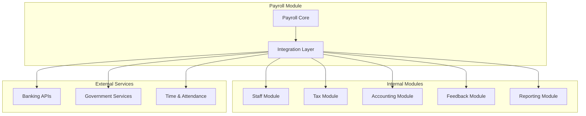
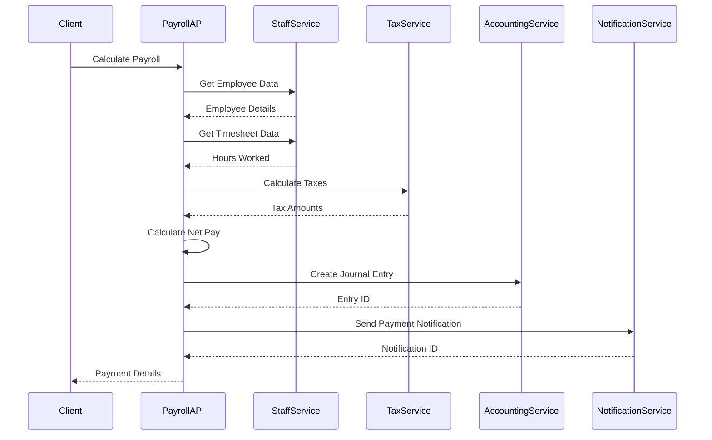
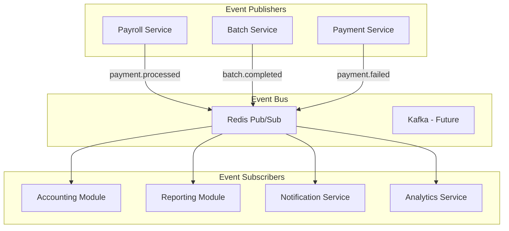
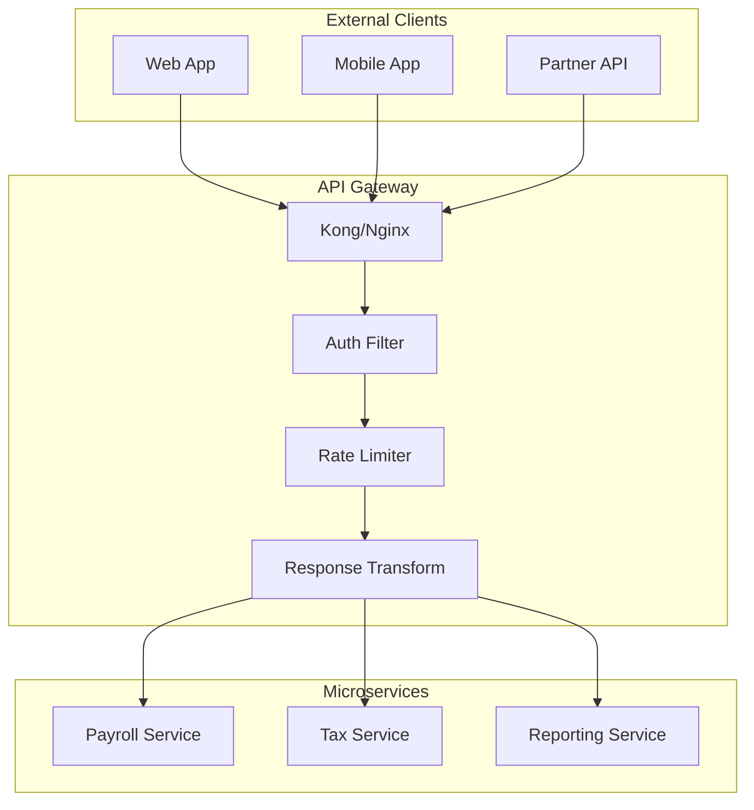

# Integration Architecture

This document describes how the Payroll & Tax Module integrates with other AuraConnect modules and external services.

## Integration Overview



## Service Integration Pattern



## Integration Patterns

### 1. Synchronous Integration

Used for real-time operations requiring immediate response.

```python
class SynchronousIntegration:
    async def process_single_payment(self, employee_id: int):
        """Synchronous integration example."""
        # Get employee data (sync)
        employee = await staff_integration.get_employee(employee_id)
        
        # Calculate taxes (sync)
        taxes = await tax_integration.calculate_taxes(...)
        
        # Create payment record
        payment = await create_payment(employee, taxes)
        
        # Send to accounting (sync)
        journal_entry = await accounting_integration.create_journal_entry(...)
        
        # Notify employee (async - fire and forget)
        asyncio.create_task(
            feedback_integration.send_payment_notification(...)
        )
        
        return payment
```

### 2. Asynchronous Integration

Used for batch operations and non-critical updates.

```python
class AsynchronousIntegration:
    async def process_batch_payroll(self, job_id: str):
        """Asynchronous integration example."""
        # Queue job
        await queue_batch_job(job_id)
        
        # Process in background
        @background_task
        async def process():
            employees = await staff_integration.get_active_employees()
            
            for employee in employees:
                try:
                    await process_employee_payroll(employee)
                    await update_job_progress(job_id, employee["id"])
                except Exception as e:
                    await log_employee_error(job_id, employee["id"], e)
                    continue
            
            await notify_batch_completion(job_id)
        
        return {"job_id": job_id, "status": "processing"}
```

### 3. Event-Driven Integration



## Module-Specific Integrations

### Staff Module Integration

```python
class StaffIntegration:
    """Integration with Staff Module for employee data."""
    
    async def get_employee(self, employee_id: int) -> Dict:
        """Fetch employee details from Staff Module."""
        async with httpx.AsyncClient() as client:
            response = await client.get(
                f"{self.base_url}/api/staff/{employee_id}",
                headers=self.headers
            )
            response.raise_for_status()
            return response.json()
    
    async def get_employee_timesheet(
        self, 
        employee_id: int,
        start_date: date,
        end_date: date
    ) -> Dict:
        """Fetch timesheet data for payroll calculation."""
        async with httpx.AsyncClient() as client:
            response = await client.get(
                f"{self.base_url}/api/staff/{employee_id}/timesheets",
                params={
                    "start_date": start_date.isoformat(),
                    "end_date": end_date.isoformat()
                },
                headers=self.headers
            )
            response.raise_for_status()
            return response.json()
```

### Tax Module Integration

```python
class TaxIntegration:
    """Integration with Tax Module for tax calculations."""
    
    async def calculate_taxes(
        self,
        gross_pay: Decimal,
        employee_id: int,
        location: str,
        filing_status: str,
        allowances: int
    ) -> Dict[str, Decimal]:
        """Calculate all applicable taxes."""
        payload = {
            "gross_pay": str(gross_pay),
            "employee_id": employee_id,
            "location": location,
            "filing_info": {
                "status": filing_status,
                "allowances": allowances
            }
        }
        
        async with httpx.AsyncClient() as client:
            response = await client.post(
                f"{self.base_url}/api/tax/calculate",
                json=payload,
                headers=self.headers
            )
            response.raise_for_status()
            return response.json()
```

### Accounting Module Integration

```python
class AccountingIntegration:
    """Integration with Accounting Module for GL entries."""
    
    async def create_payroll_journal_entry(
        self,
        pay_date: date,
        payroll_summary: Dict[str, Decimal]
    ) -> str:
        """Create journal entry for payroll."""
        lines = self._build_journal_lines(payroll_summary)
        
        journal_entry = {
            "date": pay_date.isoformat(),
            "reference": f"PAYROLL-{pay_date.isoformat()}",
            "description": f"Payroll for period ending {pay_date}",
            "lines": lines,
            "status": "pending"
        }
        
        async with httpx.AsyncClient() as client:
            response = await client.post(
                f"{self.base_url}/api/accounting/journal-entries",
                json=journal_entry,
                headers=self.headers
            )
            response.raise_for_status()
            return response.json()["entry_id"]
```

## API Gateway Pattern



## Error Handling and Resilience

### Circuit Breaker Pattern

```python
from pybreaker import CircuitBreaker

class ResilientIntegration:
    def __init__(self):
        self.tax_breaker = CircuitBreaker(
            fail_max=5,
            reset_timeout=60,
            exclude=[httpx.HTTPStatusError]
        )
    
    @tax_breaker
    async def calculate_taxes(self, *args, **kwargs):
        """Protected tax calculation call."""
        return await self._calculate_taxes(*args, **kwargs)
```

### Retry Logic

```python
from tenacity import retry, stop_after_attempt, wait_exponential

class RetryableIntegration:
    @retry(
        stop=stop_after_attempt(3),
        wait=wait_exponential(multiplier=1, min=4, max=10)
    )
    async def call_external_service(self, *args, **kwargs):
        """Retry failed calls with exponential backoff."""
        try:
            return await self._make_call(*args, **kwargs)
        except httpx.HTTPStatusError as e:
            if e.response.status_code >= 500:
                raise  # Retry on server errors
            else:
                # Don't retry client errors
                await self.handle_client_error(e)
                raise
```

## Event Publishing

### Published Events

```python
PAYROLL_EVENTS = {
    "payment.calculated": {
        "description": "Payroll calculation completed",
        "payload": {
            "employee_id": int,
            "calculation_id": str,
            "gross_pay": float,
            "net_pay": float
        }
    },
    "payment.processed": {
        "description": "Payment successfully processed",
        "payload": {
            "payment_id": str,
            "employee_id": int,
            "amount": float,
            "payment_date": str
        }
    },
    "batch.completed": {
        "description": "Batch payroll processing completed",
        "payload": {
            "job_id": str,
            "successful": int,
            "failed": int,
            "duration_seconds": int
        }
    }
}
```

### Event Publisher Implementation

```python
class PayrollEventPublisher:
    """Publish payroll events for other modules."""
    
    async def publish(self, event_type: str, payload: Dict[str, Any]):
        """Publish an event."""
        event = {
            "type": event_type,
            "timestamp": datetime.utcnow().isoformat(),
            "payload": payload
        }
        
        channel = f"payroll.{event_type}"
        await self.redis.publish(channel, json.dumps(event))
```

## Integration Testing

```python
@pytest.fixture
def mock_staff_service():
    """Mock Staff service for testing."""
    mock = AsyncMock()
    mock.get_employee.return_value = {
        "id": 123,
        "hourly_rate": "25.00",
        "location": "california"
    }
    return mock

async def test_payroll_calculation_with_integrations(
    mock_staff_service,
    mock_tax_service
):
    """Test payroll calculation with mocked integrations."""
    payroll_service = PayrollService(
        staff_service=mock_staff_service,
        tax_service=mock_tax_service
    )
    
    result = await payroll_service.calculate_payroll(
        employee_id=123,
        hours_worked=80
    )
    
    mock_staff_service.get_employee.assert_called_once_with(123)
    mock_tax_service.calculate_taxes.assert_called_once()
    assert result["net_pay"] > 0
```

## Monitoring Integration Health

```python
class IntegrationMonitor:
    async def check_integration_health(self):
        """Monitor health of all integrations."""
        integrations = {
            "staff": self.check_staff_integration,
            "tax": self.check_tax_integration,
            "accounting": self.check_accounting_integration,
            "feedback": self.check_feedback_integration
        }
        
        health_status = {}
        for name, check_func in integrations.items():
            try:
                health_status[name] = await check_func()
            except Exception as e:
                health_status[name] = {
                    "status": "unhealthy",
                    "error": str(e)
                }
        
        return health_status
```

## Related Documentation

- [Architecture Overview](overview.md)
- [API Gateway Configuration](deployment.md#api-gateway)
- [Event System](../reference/event-system.md)
- [Integration Guide](../INTEGRATION.md)