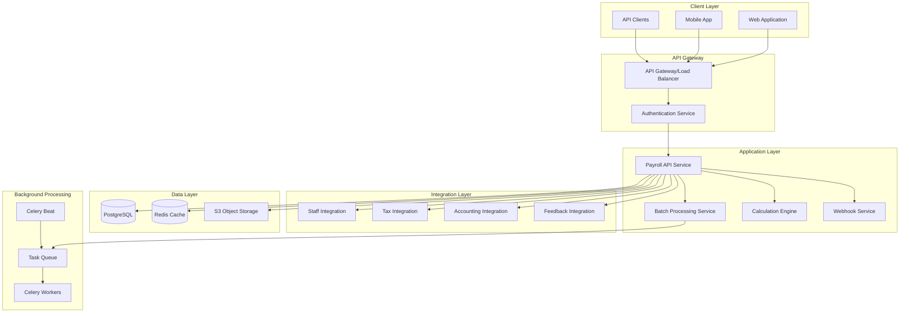
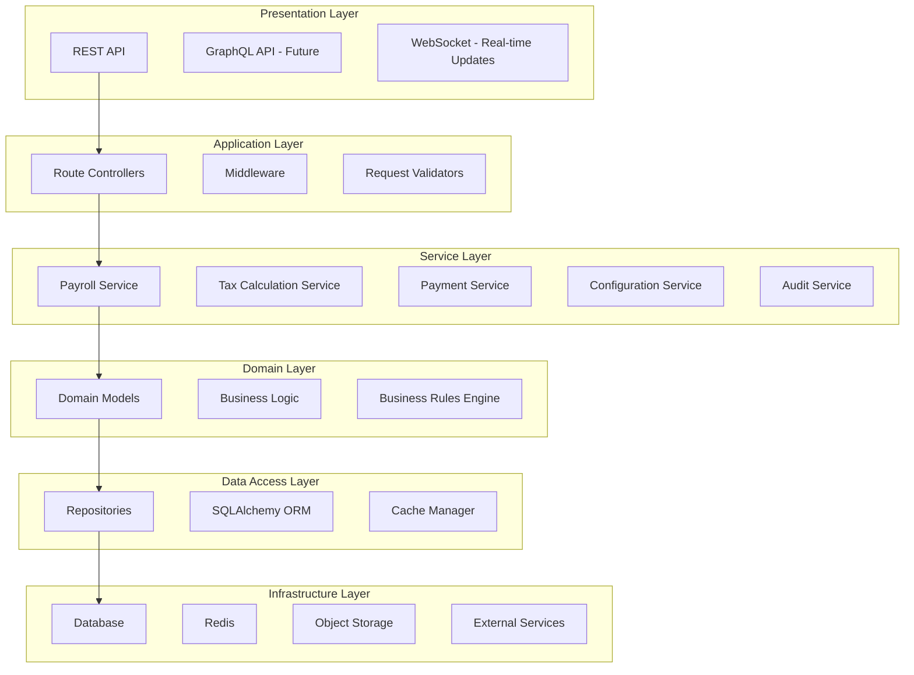

# Payroll & Tax Module - Architecture Overview

## Introduction

The Payroll & Tax Module is designed with a modular, layered architecture that ensures scalability, maintainability, and seamless integration with other AuraConnect modules.

## Architecture Principles

1. **Modularity**: Clear boundaries between components
2. **Scalability**: Horizontal and vertical scaling capabilities
3. **Resilience**: Fault tolerance and graceful degradation
4. **Security**: Defense in depth approach
5. **Observability**: Comprehensive monitoring and logging
6. **Maintainability**: Clean code and clear documentation
7. **Performance**: Optimized for high throughput
8. **Compliance**: Audit trails and data protection

## High-Level Architecture

## Layered Architecture

## Technology Stack

### Core Technologies

| Layer | Technology | Purpose |
|-------|------------|---------|
| API Framework | FastAPI | High-performance async API |
| ORM | SQLAlchemy | Database abstraction |
| Database | PostgreSQL 15 | Primary data store |
| Cache | Redis 7 | Caching and pub/sub |
| Task Queue | Celery | Background processing |
| Container | Docker | Containerization |
| Orchestration | Kubernetes | Container orchestration |
| Monitoring | Prometheus + Grafana | Metrics and visualization |
| Logging | ELK Stack | Centralized logging |
| API Gateway | Kong/Nginx | API routing and management |

### Development Tools

| Tool | Purpose |
|------|---------|
| Poetry | Dependency management |
| Black | Code formatting |
| Flake8 | Linting |
| Pytest | Testing framework |
| Alembic | Database migrations |
| Pre-commit | Git hooks |
| Swagger/OpenAPI | API documentation |

## Architecture Decisions

### ADR-001: Microservices vs Modular Monolith

**Decision**: Modular Monolith with future microservices migration path

**Rationale**:
- Simpler deployment and operations initially
- Clear module boundaries for future extraction
- Reduced operational complexity
- Easier data consistency

[View full ADR](../reference/adr/001-modular-monolith.md)

### ADR-002: Synchronous vs Asynchronous Processing

**Decision**: Hybrid approach with sync for real-time operations and async for batch

**Rationale**:
- Better user experience for individual calculations
- Scalability for batch operations
- Resource optimization
- Clear separation of concerns

[View full ADR](../reference/adr/002-sync-async-processing.md)

### ADR-003: Database Per Service vs Shared Database

**Decision**: Shared database with logical separation

**Rationale**:
- Simplified transactions
- Easier reporting and analytics
- Reduced operational overhead
- Future migration path to separate databases

[View full ADR](../reference/adr/003-shared-database.md)

### ADR-004: Event Sourcing vs CRUD

**Decision**: CRUD with audit logging

**Rationale**:
- Simpler implementation
- Meets compliance requirements
- Easier to understand and maintain
- Sufficient for current requirements

[View full ADR](../reference/adr/004-crud-with-audit.md)

## Future Roadmap

### Phase 1: Current Architecture (Months 1-6)
- Modular monolith
- Shared database
- Basic event system
- Manual scaling

### Phase 2: Service Extraction (Months 7-12)
- Extract calculation engine
- Separate tax service
- Implement API gateway
- Enhanced monitoring

### Phase 3: Full Microservices (Year 2)
- Complete service separation
- Event-driven architecture
- Service mesh implementation
- Multi-region deployment

### Phase 4: Advanced Features (Year 2+)
- Machine learning integration
- Real-time analytics
- GraphQL API
- Global distribution

## Related Documentation

- [Component Architecture](components.md) - Detailed component design
- [Data Architecture](data.md) - Database design and data flow
- [Integration Architecture](integration.md) - Module integration patterns
- [Security Architecture](security.md) - Security implementation
- [Deployment Architecture](deployment.md) - Infrastructure details

## Next Steps

1. Review the [Component Architecture](components.md) for detailed component design
2. Understand the [Data Architecture](data.md) for database schema
3. Learn about [Integration Patterns](integration.md) for module communication
4. Configure [Security](security.md) for production deployment