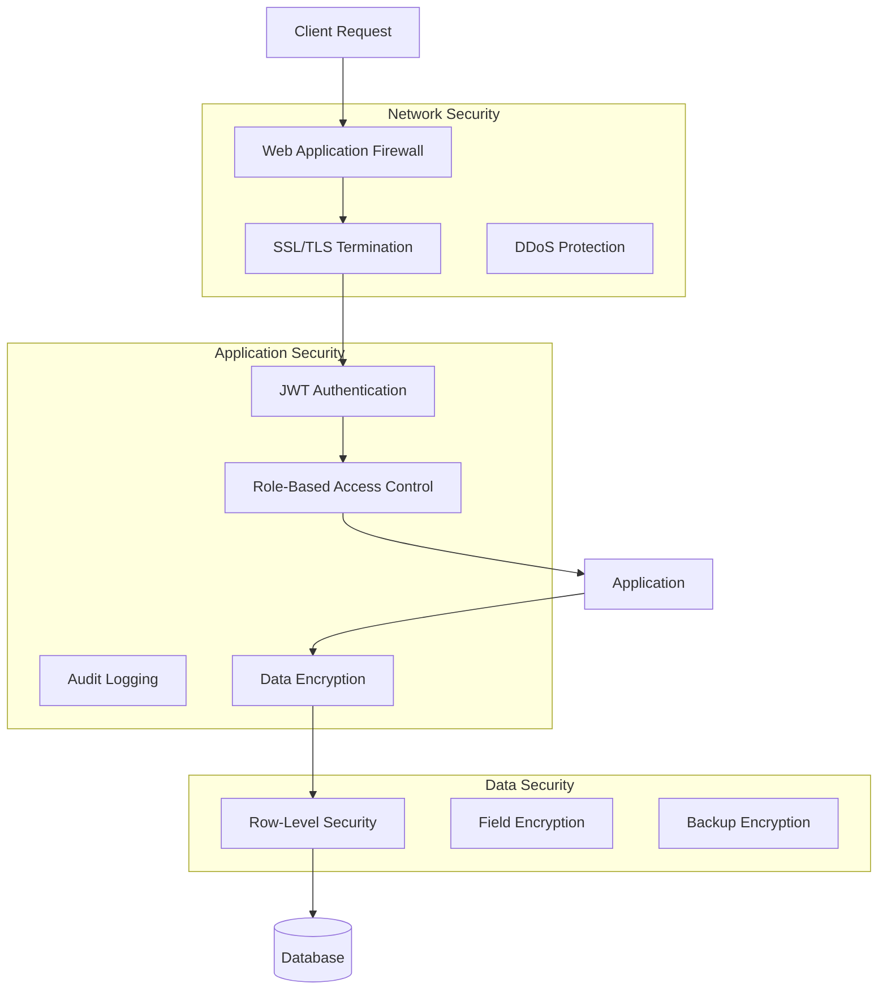
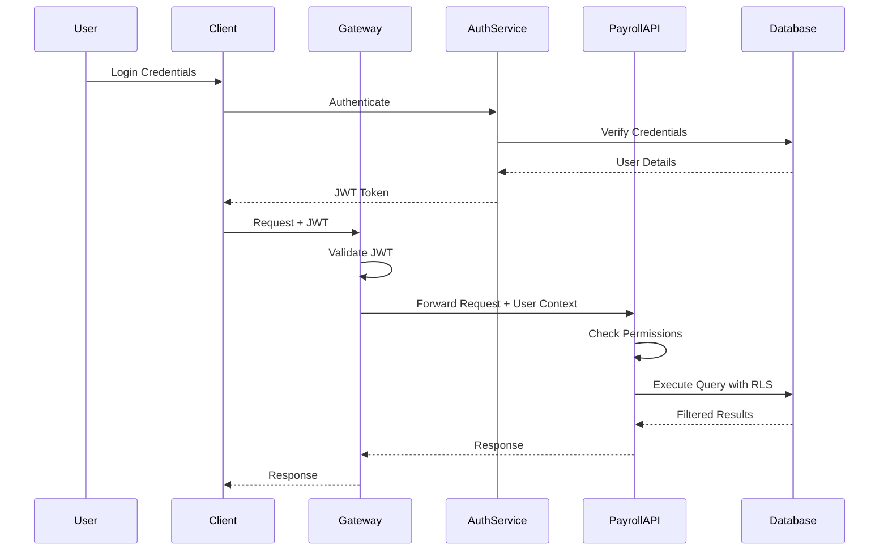

# Security Architecture

This document outlines the security architecture and implementations for the Payroll & Tax Module.

## Security Overview



## Authentication & Authorization

### Authentication Flow



### JWT Implementation

```python
from fastapi import Security, HTTPException, status
from fastapi.security import HTTPBearer, HTTPAuthorizationCredentials
import jwt

security = HTTPBearer()

async def verify_token(credentials: HTTPAuthorizationCredentials = Security(security)):
    """Verify JWT token."""
    token = credentials.credentials
    
    try:
        payload = jwt.decode(
            token,
            settings.JWT_SECRET_KEY,
            algorithms=[settings.JWT_ALGORITHM]
        )
        return payload
    except jwt.ExpiredSignatureError:
        raise HTTPException(
            status_code=status.HTTP_401_UNAUTHORIZED,
            detail="Token has expired"
        )
    except jwt.InvalidTokenError:
        raise HTTPException(
            status_code=status.HTTP_401_UNAUTHORIZED,
            detail="Invalid token"
        )
```

### Role-Based Access Control (RBAC)

```python
from enum import Enum
from functools import wraps

class PayrollPermission(Enum):
    PAYROLL_READ = "payroll:read"
    PAYROLL_WRITE = "payroll:write"
    PAYROLL_ADMIN = "payroll:admin"
    PAYROLL_APPROVE = "payroll:approve"

def require_permission(permission: PayrollPermission):
    """Decorator to check permissions."""
    def decorator(func):
        @wraps(func)
        async def wrapper(*args, **kwargs):
            user = kwargs.get('current_user')
            if not user or permission.value not in user.permissions:
                raise HTTPException(
                    status_code=status.HTTP_403_FORBIDDEN,
                    detail="Insufficient permissions"
                )
            return await func(*args, **kwargs)
        return wrapper
    return decorator

# Usage
@router.post("/payments")
@require_permission(PayrollPermission.PAYROLL_WRITE)
async def create_payment(
    payment_data: PaymentCreate,
    current_user: User = Depends(get_current_user)
):
    # Process payment
    pass
```

## Data Encryption

### Encryption at Rest

```python
from cryptography.fernet import Fernet
import base64

class FieldEncryption:
    """Handle field-level encryption for sensitive data."""
    
    def __init__(self, key: str):
        self.cipher = Fernet(base64.urlsafe_b64encode(key.encode()[:32]))
    
    def encrypt(self, plaintext: str) -> str:
        """Encrypt sensitive data."""
        return self.cipher.encrypt(plaintext.encode()).decode()
    
    def decrypt(self, ciphertext: str) -> str:
        """Decrypt sensitive data."""
        return self.cipher.decrypt(ciphertext.encode()).decode()

# Database model with encrypted fields
class EmployeeSensitiveData(Base):
    __tablename__ = 'employee_sensitive_data'
    
    id = Column(Integer, primary_key=True)
    employee_id = Column(Integer, ForeignKey('employees.id'))
    ssn_encrypted = Column(String(500), nullable=False)
    bank_account_encrypted = Column(String(500))
    routing_number_encrypted = Column(String(500))
    
    @property
    def ssn(self):
        return encryption.decrypt(self.ssn_encrypted) if self.ssn_encrypted else None
    
    @ssn.setter
    def ssn(self, value):
        self.ssn_encrypted = encryption.encrypt(value) if value else None
```

### Encryption in Transit

All API communications use TLS 1.2+ with strong cipher suites:

```nginx
# nginx.conf
server {
    listen 443 ssl http2;
    server_name api.auraconnect.com;

    ssl_certificate /etc/nginx/ssl/cert.pem;
    ssl_certificate_key /etc/nginx/ssl/key.pem;
    ssl_protocols TLSv1.2 TLSv1.3;
    ssl_ciphers HIGH:!aNULL:!MD5;
    ssl_prefer_server_ciphers on;
    
    # HSTS
    add_header Strict-Transport-Security "max-age=31536000; includeSubDomains" always;
    
    # Additional security headers
    add_header X-Frame-Options "DENY" always;
    add_header X-Content-Type-Options "nosniff" always;
    add_header X-XSS-Protection "1; mode=block" always;
}
```

## Database Security

### Row-Level Security (RLS)

```sql
-- Enable RLS for multi-tenant isolation
ALTER TABLE employee_payments ENABLE ROW LEVEL SECURITY;

-- Create policy for tenant isolation
CREATE POLICY tenant_isolation ON employee_payments
    FOR ALL
    USING (tenant_id = current_setting('app.current_tenant')::int);

-- Create policy for user access
CREATE POLICY user_access ON employee_payments
    FOR SELECT
    USING (
        employee_id IN (
            SELECT id FROM employees 
            WHERE manager_id = current_setting('app.current_user')::int
        )
        OR 
        employee_id = current_setting('app.current_user')::int
    );
```

### Audit Logging

```sql
-- Comprehensive audit table
CREATE TABLE payroll_audit_logs (
    id SERIAL PRIMARY KEY,
    table_name VARCHAR(50) NOT NULL,
    record_id INTEGER NOT NULL,
    action VARCHAR(20) NOT NULL,
    user_id INTEGER,
    user_role VARCHAR(50),
    old_values JSONB,
    new_values JSONB,
    changed_fields TEXT[],
    ip_address INET,
    user_agent TEXT,
    session_id VARCHAR(100),
    created_at TIMESTAMP DEFAULT CURRENT_TIMESTAMP
);

-- Audit trigger function
CREATE OR REPLACE FUNCTION audit_trigger_function()
RETURNS TRIGGER AS $$
BEGIN
    INSERT INTO payroll_audit_logs (
        table_name,
        record_id,
        action,
        user_id,
        user_role,
        old_values,
        new_values,
        changed_fields,
        ip_address,
        session_id
    ) VALUES (
        TG_TABLE_NAME,
        COALESCE(NEW.id, OLD.id),
        TG_OP,
        current_setting('app.current_user')::int,
        current_setting('app.user_role'),
        to_jsonb(OLD),
        to_jsonb(NEW),
        ARRAY(
            SELECT jsonb_object_keys(to_jsonb(NEW)) 
            EXCEPT 
            SELECT jsonb_object_keys(to_jsonb(OLD))
        ),
        inet(current_setting('app.client_ip')),
        current_setting('app.session_id')
    );
    RETURN NEW;
END;
$$ LANGUAGE plpgsql;
```

## API Security

### Input Validation

```python
from pydantic import BaseModel, validator, constr
from decimal import Decimal

class PaymentCreate(BaseModel):
    employee_id: int
    gross_pay: Decimal
    pay_period_start: date
    pay_period_end: date
    
    @validator('gross_pay')
    def validate_gross_pay(cls, v):
        if v <= 0:
            raise ValueError('Gross pay must be positive')
        if v > Decimal('999999.99'):
            raise ValueError('Gross pay exceeds maximum allowed')
        return v
    
    @validator('pay_period_end')
    def validate_pay_period(cls, v, values):
        if 'pay_period_start' in values and v <= values['pay_period_start']:
            raise ValueError('End date must be after start date')
        return v

class SSNUpdate(BaseModel):
    ssn: constr(pattern=r'^\d{3}-\d{2}-\d{4}$')
    
    @validator('ssn')
    def validate_ssn(cls, v):
        # Additional SSN validation
        if v.startswith('000') or v[4:6] == '00' or v[7:] == '0000':
            raise ValueError('Invalid SSN')
        return v
```

### Rate Limiting

```python
from slowapi import Limiter, _rate_limit_exceeded_handler
from slowapi.util import get_remote_address

limiter = Limiter(key_func=get_remote_address)
app.state.limiter = limiter
app.add_exception_handler(RateLimitExceeded, _rate_limit_exceeded_handler)

@app.get("/api/payroll/payments")
@limiter.limit("100/minute")
async def list_payments(request: Request):
    # Handle request
    pass

@app.post("/api/payroll/export")
@limiter.limit("5/minute")
async def export_data(request: Request):
    # Handle export
    pass
```

## Security Headers

```python
from fastapi.middleware.cors import CORSMiddleware
from starlette.middleware.sessions import SessionMiddleware

# CORS configuration
app.add_middleware(
    CORSMiddleware,
    allow_origins=["https://app.auraconnect.com"],
    allow_credentials=True,
    allow_methods=["GET", "POST", "PUT", "DELETE"],
    allow_headers=["*"],
    expose_headers=["X-Total-Count"],
)

# Security headers middleware
@app.middleware("http")
async def add_security_headers(request: Request, call_next):
    response = await call_next(request)
    response.headers["X-Content-Type-Options"] = "nosniff"
    response.headers["X-Frame-Options"] = "DENY"
    response.headers["X-XSS-Protection"] = "1; mode=block"
    response.headers["Referrer-Policy"] = "strict-origin-when-cross-origin"
    response.headers["Content-Security-Policy"] = "default-src 'self'"
    return response
```

## Vulnerability Management

### SQL Injection Prevention

```python
# Always use parameterized queries
@router.get("/employees/{employee_id}/payments")
async def get_employee_payments(
    employee_id: int,
    db: Session = Depends(get_db)
):
    # Safe: Using ORM with parameterized queries
    payments = db.query(EmployeePayment).filter(
        EmployeePayment.employee_id == employee_id
    ).all()
    
    # Never do this:
    # query = f"SELECT * FROM payments WHERE employee_id = {employee_id}"
    
    return payments
```

### XSS Prevention

```python
from markupsafe import escape

@router.post("/payments/notes")
async def add_payment_note(
    payment_id: int,
    note: str,
    db: Session = Depends(get_db)
):
    # Escape user input
    safe_note = escape(note)
    
    # Store escaped content
    payment_note = PaymentNote(
        payment_id=payment_id,
        note=safe_note,
        created_by=current_user.id
    )
    db.add(payment_note)
    db.commit()
    
    return {"message": "Note added successfully"}
```

## Compliance & Privacy

### PCI DSS Compliance

- No storage of full credit card numbers
- Tokenization for payment methods
- Regular security scans
- Access logging and monitoring

### GDPR Compliance

```python
@router.delete("/employees/{employee_id}/personal-data")
@require_permission(PayrollPermission.PAYROLL_ADMIN)
async def delete_personal_data(
    employee_id: int,
    db: Session = Depends(get_db)
):
    """GDPR right to erasure implementation."""
    # Anonymize personal data instead of hard delete
    employee = db.query(Employee).filter_by(id=employee_id).first()
    
    if employee:
        employee.ssn_encrypted = None
        employee.bank_account_encrypted = None
        employee.email = f"deleted_{employee_id}@anonymous.com"
        employee.phone = None
        employee.address = None
        
        # Log the deletion request
        audit_log = AuditLog(
            action="GDPR_DATA_DELETION",
            employee_id=employee_id,
            performed_by=current_user.id,
            timestamp=datetime.utcnow()
        )
        db.add(audit_log)
        db.commit()
    
    return {"message": "Personal data deleted"}
```

## Security Monitoring

### Real-time Threat Detection

```python
class SecurityMonitor:
    def __init__(self):
        self.failed_attempts = {}
    
    async def check_suspicious_activity(self, user_id: int, action: str):
        """Monitor for suspicious patterns."""
        key = f"{user_id}:{action}"
        
        # Track failed attempts
        if action == "login_failed":
            self.failed_attempts[key] = self.failed_attempts.get(key, 0) + 1
            
            if self.failed_attempts[key] > 5:
                await self.trigger_security_alert(
                    f"Multiple failed login attempts for user {user_id}"
                )
                await self.lock_account(user_id)
        
        # Check for data exfiltration
        if action == "export_data":
            recent_exports = await self.get_recent_exports(user_id)
            if len(recent_exports) > 10:
                await self.trigger_security_alert(
                    f"Unusual export activity for user {user_id}"
                )
```

## Related Documentation

- [Architecture Overview](overview.md)
- [Deployment Security](deployment.md#security)
- [API Security](../API.md#authentication)
- [Compliance Guide](../reference/compliance.md)