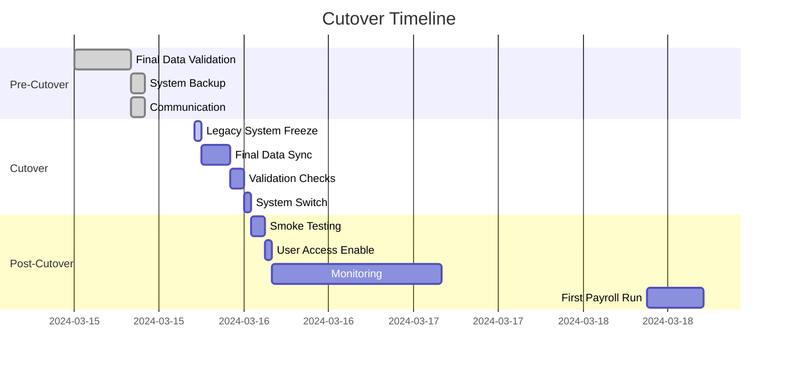

# Cutover Planning Guide

This document provides detailed procedures for the go-live cutover from legacy payroll systems to AuraConnect.

## Cutover Overview



## Pre-Cutover Checklist

### T-7 Days

#### System Preparation
- [ ] Production environment fully configured
- [ ] All integrations tested and verified
- [ ] Performance testing completed
- [ ] Security scan completed
- [ ] Backup procedures tested

#### Data Preparation
- [ ] Final data mapping verified
- [ ] All data quality issues resolved
- [ ] Test migration successful
- [ ] Reconciliation reports reviewed
- [ ] Sign-off from data owners

#### Team Preparation
- [ ] Migration team roles assigned
- [ ] Runbooks prepared and reviewed
- [ ] Communication plan finalized
- [ ] Support team briefed
- [ ] Escalation matrix defined

### T-3 Days

#### Final Validations
```python
def pre_cutover_validation():
    """Run final validation checks before cutover."""
    
    checks = []
    
    # Check 1: Verify all active employees migrated
    active_employee_check = """
    SELECT 
        (SELECT COUNT(*) FROM legacy.employees WHERE status = 'A') as legacy_count,
        (SELECT COUNT(*) FROM employees WHERE employment_status = 'active') as new_count
    """
    
    # Check 2: Verify YTD totals match
    ytd_check = """
    SELECT 
        'YTD Gross' as metric,
        SUM(ytd_gross) as legacy_total
    FROM legacy.employee_ytd
    WHERE year = YEAR(GETDATE())
    
    UNION ALL
    
    SELECT 
        'YTD Gross' as metric,
        SUM(gross_pay) as new_total
    FROM employee_payments
    WHERE EXTRACT(YEAR FROM pay_date) = EXTRACT(YEAR FROM CURRENT_DATE)
    """
    
    # Check 3: Verify next payroll ready
    next_payroll_check = """
    SELECT 
        COUNT(DISTINCT e.id) as employees_ready,
        pp.start_date,
        pp.end_date,
        pp.pay_date
    FROM employees e
    JOIN pay_periods pp ON pp.pay_schedule = e.pay_schedule
    WHERE e.employment_status = 'active'
    AND pp.pay_date = (
        SELECT MIN(pay_date) 
        FROM pay_periods 
        WHERE pay_date > CURRENT_DATE
    )
    """
    
    return checks
```

#### Communication
- [ ] All users notified of cutover schedule
- [ ] Legacy system freeze time communicated
- [ ] Support contact information distributed
- [ ] Contingency plans communicated

### T-1 Day

#### Final Preparations
```bash
#!/bin/bash
# pre_cutover_checklist.sh

echo "=== Pre-Cutover Final Checklist ==="
echo "Date: $(date)"
echo "Cutover scheduled for: $CUTOVER_DATE"

# 1. Backup legacy system
echo -n "1. Legacy system backup... "
./backup_legacy_system.sh
echo "✓"

# 2. Take snapshot of new system
echo -n "2. New system snapshot... "
kubectl exec -n auraconnect postgres-0 -- pg_dump payroll_db > pre_cutover_backup.sql
echo "✓"

# 3. Verify rollback procedure
echo -n "3. Rollback procedure test... "
./test_rollback_procedure.sh
echo "✓"

# 4. Check system health
echo -n "4. System health check... "
curl -s https://api.auraconnect.com/health | jq '.status'
echo "✓"

# 5. Verify team readiness
echo "5. Team readiness:"
echo "   - Migration lead: ✓"
echo "   - Database admin: ✓"
echo "   - Application support: ✓"
echo "   - Business owner: ✓"

echo "=== Pre-cutover checklist complete ==="
```

## Cutover Day Procedures

### Phase 1: Legacy System Freeze (5:00 PM)

```python
class CutoverOrchestrator:
    """Orchestrate cutover process."""
    
    def __init__(self, config):
        self.config = config
        self.start_time = None
        self.checkpoints = []
    
    def phase1_freeze_legacy(self):
        """Phase 1: Freeze legacy system."""
        self.log_checkpoint("PHASE_1_START", "Freezing legacy system")
        
        try:
            # 1. Disable user access
            self.execute_sql(
                "UPDATE system_config SET value = 'READONLY' WHERE key = 'system_mode'",
                connection=self.legacy_conn
            )
            
            # 2. Stop scheduled jobs
            self.execute_sql(
                "UPDATE scheduled_jobs SET enabled = 0 WHERE job_type = 'PAYROLL'",
                connection=self.legacy_conn
            )
            
            # 3. Capture final state
            self.capture_legacy_state()
            
            # 4. Create marker record
            self.execute_sql(
                f"INSERT INTO migration_log (event, timestamp) VALUES ('SYSTEM_FROZEN', '{datetime.now()}')",
                connection=self.legacy_conn
            )
            
            self.log_checkpoint("PHASE_1_COMPLETE", "Legacy system frozen")
            return True
            
        except Exception as e:
            self.log_error("PHASE_1_FAILED", str(e))
            return False
```

### Phase 2: Final Data Sync (5:30 PM - 9:30 PM)

```python
def phase2_final_sync(self):
    """Phase 2: Perform final data synchronization."""
    self.log_checkpoint("PHASE_2_START", "Starting final data sync")
    
    sync_tasks = [
        {
            'name': 'Employee Updates',
            'query': """
                SELECT * FROM employees 
                WHERE modified_date >= :last_sync_date
                OR created_date >= :last_sync_date
            """,
            'target_table': 'employees',
            'key_field': 'employee_id'
        },
        {
            'name': 'Compensation Changes',
            'query': """
                SELECT * FROM compensation 
                WHERE effective_date >= :last_sync_date
                OR modified_date >= :last_sync_date
            """,
            'target_table': 'employee_compensation',
            'key_field': 'comp_id'
        },
        {
            'name': 'Recent Payments',
            'query': """
                SELECT * FROM payroll_history 
                WHERE pay_date >= :last_sync_date
                OR created_date >= :last_sync_date
            """,
            'target_table': 'employee_payments',
            'key_field': 'payment_id'
        }
    ]
    
    for task in sync_tasks:
        self.sync_data(task)
        self.validate_sync(task)
    
    self.log_checkpoint("PHASE_2_COMPLETE", "Final data sync completed")
```

### Phase 3: Validation (9:30 PM - 11:30 PM)

```python
def phase3_validation(self):
    """Phase 3: Run validation checks."""
    self.log_checkpoint("PHASE_3_START", "Starting validation")
    
    validation_suite = ValidationSuite()
    
    # Critical validations (must pass)
    critical_checks = [
        validation_suite.check_employee_count,
        validation_suite.check_active_employees,
        validation_suite.check_ytd_totals,
        validation_suite.check_tax_configurations,
        validation_suite.check_payment_history
    ]
    
    critical_passed = True
    for check in critical_checks:
        result = check()
        self.log_validation_result(check.__name__, result)
        if not result['passed']:
            critical_passed = False
    
    if not critical_passed:
        self.log_error("PHASE_3_FAILED", "Critical validation failed")
        return False
    
    # Non-critical validations (warnings only)
    warning_checks = [
        validation_suite.check_benefit_enrollments,
        validation_suite.check_deduction_setup,
        validation_suite.check_direct_deposit_info
    ]
    
    for check in warning_checks:
        result = check()
        self.log_validation_result(check.__name__, result)
    
    self.log_checkpoint("PHASE_3_COMPLETE", "Validation completed")
    return True
```

### Phase 4: System Switch (11:30 PM - 12:30 AM)

```python
def phase4_system_switch(self):
    """Phase 4: Switch to new system."""
    self.log_checkpoint("PHASE_4_START", "Starting system switch")
    
    try:
        # 1. Update DNS
        self.update_dns_records()
        
        # 2. Enable new system
        self.execute_sql(
            "UPDATE system_config SET value = 'ACTIVE' WHERE key = 'payroll_module'",
            connection=self.new_conn
        )
        
        # 3. Start background jobs
        self.start_background_jobs()
        
        # 4. Enable integrations
        self.enable_integrations()
        
        # 5. Clear caches
        self.clear_all_caches()
        
        self.log_checkpoint("PHASE_4_COMPLETE", "System switch completed")
        return True
        
    except Exception as e:
        self.log_error("PHASE_4_FAILED", str(e))
        self.initiate_rollback()
        return False
```

## Post-Cutover Activities

### Immediate Verification (12:30 AM - 2:30 AM)

```python
class PostCutoverVerification:
    """Verify system after cutover."""
    
    def run_smoke_tests(self):
        """Run basic smoke tests."""
        tests = [
            self.test_user_login,
            self.test_employee_search,
            self.test_payroll_calculation,
            self.test_report_generation,
            self.test_integration_health
        ]
        
        results = []
        for test in tests:
            try:
                result = test()
                results.append({
                    'test': test.__name__,
                    'status': 'PASS' if result else 'FAIL',
                    'timestamp': datetime.now()
                })
            except Exception as e:
                results.append({
                    'test': test.__name__,
                    'status': 'ERROR',
                    'error': str(e),
                    'timestamp': datetime.now()
                })
        
        return results
    
    def test_payroll_calculation(self):
        """Test payroll calculation for sample employee."""
        test_employee_id = self.config['test_employee_id']
        
        # Run calculation
        response = requests.post(
            f"{self.api_url}/calculate",
            json={
                'employee_id': test_employee_id,
                'pay_period_start': '2024-03-01',
                'pay_period_end': '2024-03-15',
                'hours_worked': {'regular': 80, 'overtime': 0}
            },
            headers=self.get_auth_headers()
        )
        
        assert response.status_code == 200
        result = response.json()
        
        # Verify calculation
        assert result['gross_pay'] > 0
        assert result['net_pay'] > 0
        assert result['net_pay'] < result['gross_pay']
        
        return True
```

### Day 1 Monitoring

```python
def create_monitoring_dashboard():
    """Create real-time monitoring dashboard."""
    
    dashboard_config = {
        'refresh_interval': 30,  # seconds
        'metrics': [
            {
                'name': 'System Health',
                'query': 'SELECT status FROM health_check ORDER BY timestamp DESC LIMIT 1',
                'type': 'status'
            },
            {
                'name': 'Active Users',
                'query': 'SELECT COUNT(DISTINCT user_id) FROM user_sessions WHERE last_activity > NOW() - INTERVAL \'5 minutes\'',
                'type': 'gauge'
            },
            {
                'name': 'API Response Time',
                'query': 'SELECT AVG(response_time) FROM api_logs WHERE timestamp > NOW() - INTERVAL \'5 minutes\'',
                'type': 'metric',
                'unit': 'ms'
            },
            {
                'name': 'Error Rate',
                'query': 'SELECT COUNT(*) FROM error_logs WHERE timestamp > NOW() - INTERVAL \'1 hour\'',
                'type': 'counter'
            },
            {
                'name': 'Calculations Processed',
                'query': 'SELECT COUNT(*) FROM payroll_calculations WHERE created_at > :cutover_time',
                'type': 'counter'
            }
        ]
    }
    
    return dashboard_config
```

### First Payroll Run Checklist

```markdown
## First Payroll Run - Day 3

### Pre-Processing
- [ ] Verify all employees are accessible
- [ ] Confirm pay period dates are correct
- [ ] Check time entries are imported
- [ ] Validate tax tables are current
- [ ] Review any pending adjustments

### Processing
- [ ] Run calculation preview
- [ ] Compare 10 sample employees to legacy
- [ ] Review exception report
- [ ] Get business approval
- [ ] Process final payroll

### Post-Processing
- [ ] Verify all payments created
- [ ] Check direct deposit file
- [ ] Confirm tax calculations
- [ ] Generate pay stubs
- [ ] Send notifications

### Validation
- [ ] Compare totals to legacy estimate
- [ ] Verify GL entries created
- [ ] Check tax liability report
- [ ] Review audit trail
```

## Parallel Running Procedures

### Parallel Run Configuration

```python
class ParallelRunManager:
    """Manage parallel running period."""
    
    def __init__(self, start_date: date, end_date: date):
        self.start_date = start_date
        self.end_date = end_date
        self.comparison_results = []
    
    def process_parallel_payroll(self, pay_date: date):
        """Process payroll in both systems."""
        
        # Process in legacy system
        legacy_results = self.process_legacy_payroll(pay_date)
        
        # Process in new system
        new_results = self.process_new_payroll(pay_date)
        
        # Compare results
        comparison = self.compare_payroll_runs(
            legacy_results,
            new_results,
            pay_date
        )
        
        self.comparison_results.append(comparison)
        
        # Generate comparison report
        self.generate_comparison_report(comparison)
        
        return comparison
    
    def compare_payroll_runs(self, legacy, new, pay_date):
        """Compare payroll results between systems."""
        
        comparison = {
            'pay_date': pay_date,
            'summary': {
                'total_employees': {
                    'legacy': len(legacy),
                    'new': len(new),
                    'match': len(legacy) == len(new)
                },
                'total_gross': {
                    'legacy': sum(e['gross_pay'] for e in legacy),
                    'new': sum(e['gross_pay'] for e in new),
                    'variance': 0  # Calculate variance
                },
                'total_net': {
                    'legacy': sum(e['net_pay'] for e in legacy),
                    'new': sum(e['net_pay'] for e in new),
                    'variance': 0  # Calculate variance
                }
            },
            'employee_variances': []
        }
        
        # Calculate variances
        comparison['summary']['total_gross']['variance'] = (
            comparison['summary']['total_gross']['new'] - 
            comparison['summary']['total_gross']['legacy']
        )
        
        comparison['summary']['total_net']['variance'] = (
            comparison['summary']['total_net']['new'] - 
            comparison['summary']['total_net']['legacy']
        )
        
        # Compare individual employees
        legacy_dict = {e['employee_id']: e for e in legacy}
        new_dict = {e['employee_id']: e for e in new}
        
        for emp_id in set(legacy_dict.keys()) | set(new_dict.keys()):
            if emp_id in legacy_dict and emp_id in new_dict:
                variance = self.calculate_employee_variance(
                    legacy_dict[emp_id],
                    new_dict[emp_id]
                )
                if variance['has_variance']:
                    comparison['employee_variances'].append(variance)
        
        return comparison
```

## Communication Plan

### Stakeholder Communications

```python
def generate_cutover_communications():
    """Generate cutover communication templates."""
    
    communications = {
        'T-7_all_staff': {
            'subject': 'Payroll System Upgrade - Important Information',
            'recipients': ['all_staff@company.com'],
            'template': """
Dear Team,

We will be upgrading to our new payroll system next week. Here's what you need to know:

**Key Dates:**
- Current payroll system freeze: Friday, March 15 at 5:00 PM
- New system available: Monday, March 18 at 8:00 AM
- First payroll in new system: Wednesday, March 20

**What This Means for You:**
- No access to payroll systems over the weekend
- Your login credentials remain the same
- All your payroll information has been transferred

**Action Required:**
- Review your information in the new system by March 19
- Report any discrepancies immediately

**Support:**
- Help desk: ext. 5555
- Email: payroll.support@company.com

Thank you for your patience during this transition.

HR Team
            """
        },
        'T-1_managers': {
            'subject': 'Tomorrow: Payroll System Cutover',
            'recipients': ['managers@company.com'],
            'template': """
Managers,

Reminder: The payroll system cutover begins tomorrow at 5:00 PM.

**Your Responsibilities:**
- Ensure all time entries are submitted by 4:00 PM
- Communicate with your team about the transition
- Be available for any urgent issues

**Weekend Support:**
- On-call number: 555-555-5555
- Escalation: Contact your HR partner

Thank you for your support.
            """
        },
        'T+1_success': {
            'subject': 'Payroll System Upgrade Complete',
            'recipients': ['all_staff@company.com'],
            'template': """
Good news!

Our payroll system upgrade was completed successfully. The new system is now live.

**Next Steps:**
- Log in to review your information: [URL]
- Complete the quick tutorial: [URL]
- Submit any questions via the help desk

**First Payroll:**
- Processing date: March 20
- Pay date: March 22 (unchanged)

Thank you for your cooperation.
            """
        }
    }
    
    return communications
```

## Issue Management

### Issue Tracking Template

```python
class CutoverIssueTracker:
    """Track and manage cutover issues."""
    
    def log_issue(self, issue_data: dict):
        """Log a cutover issue."""
        
        issue = {
            'id': self.generate_issue_id(),
            'timestamp': datetime.now(),
            'phase': issue_data.get('phase'),
            'severity': issue_data.get('severity', 'MEDIUM'),
            'category': issue_data.get('category'),
            'description': issue_data.get('description'),
            'impact': issue_data.get('impact'),
            'reporter': issue_data.get('reporter'),
            'status': 'OPEN',
            'assigned_to': None,
            'resolution': None,
            'resolved_at': None
        }
        
        # Determine assignment based on category
        issue['assigned_to'] = self.auto_assign(issue)
        
        # Store in database
        self.save_issue(issue)
        
        # Send notifications
        if issue['severity'] == 'CRITICAL':
            self.escalate_critical_issue(issue)
        
        return issue
    
    def auto_assign(self, issue: dict) -> str:
        """Auto-assign issue based on category."""
        
        assignment_matrix = {
            'DATA': 'data_team@company.com',
            'SYSTEM': 'ops_team@company.com',
            'CALCULATION': 'payroll_team@company.com',
            'INTEGRATION': 'integration_team@company.com',
            'USER_ACCESS': 'helpdesk@company.com'
        }
        
        return assignment_matrix.get(
            issue['category'], 
            'migration_lead@company.com'
        )
```

## Success Metrics

```python
def calculate_cutover_metrics():
    """Calculate cutover success metrics."""
    
    metrics = {
        'cutover_duration': {
            'planned_hours': 7.5,
            'actual_hours': 0,  # Calculate from timestamps
            'variance': 0
        },
        'data_accuracy': {
            'records_migrated': 0,
            'records_validated': 0,
            'accuracy_percentage': 0
        },
        'system_availability': {
            'planned_downtime': 7.5,
            'actual_downtime': 0,
            'uptime_since_cutover': 0
        },
        'user_adoption': {
            'total_users': 0,
            'users_logged_in': 0,
            'adoption_rate': 0
        },
        'issue_resolution': {
            'total_issues': 0,
            'critical_issues': 0,
            'resolved_issues': 0,
            'avg_resolution_time': 0
        },
        'financial_accuracy': {
            'first_payroll_variance': 0,
            'tax_calculation_accuracy': 0,
            'gl_reconciliation': 0
        }
    }
    
    return metrics
```

## Related Documentation

- [Migration Overview](overview.md)
- [Validation Procedures](validation.md)
- [Rollback Procedures](rollback.md)
- [Cutover Scripts](/scripts/migration/cutover/)
- [Communication Templates](/templates/communications/)