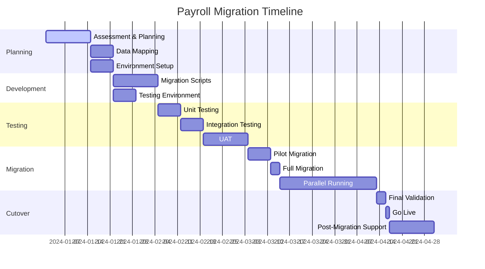
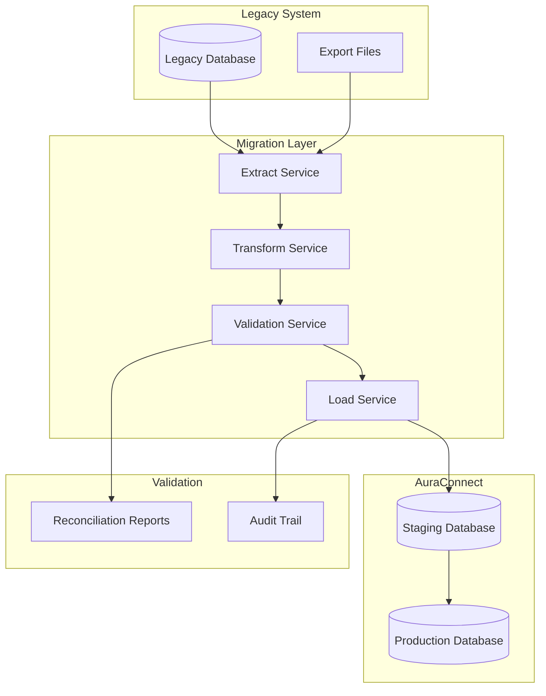

# Migration Overview

This guide provides a comprehensive overview of migrating from legacy payroll systems to the AuraConnect Payroll & Tax Module.

## Migration Objectives

- **Data Integrity**: Ensure all payroll data is accurately transferred
- **Compliance**: Maintain regulatory compliance throughout migration
- **Zero Downtime**: Minimize disruption to payroll operations
- **Audit Trail**: Preserve historical data and audit trails
- **Parallel Running**: Support parallel running during transition

## Migration Timeline



## Pre-Migration Planning

### System Assessment

#### Current System Inventory
```yaml
Current_System_Assessment:
  system_info:
    name: "Legacy Payroll System"
    vendor: "Current Vendor"
    version: "x.x.x"
    database: "Oracle/SQL Server/MySQL"
    users: 500
    
  data_volume:
    employees: 5000
    historical_years: 7
    payment_records: 350000
    tax_forms: 35000
    
  integrations:
    - name: "Time & Attendance"
      type: "API"
      frequency: "Daily"
    - name: "HRIS"
      type: "File Transfer"
      frequency: "Real-time"
    - name: "GL System"
      type: "Batch"
      frequency: "Per Pay Run"
```

#### Gap Analysis

| Feature | Legacy System | AuraConnect | Gap | Migration Action |
|---------|--------------|-------------|-----|------------------|
| Multi-state Payroll | Limited | Full Support | ✓ | Map state configurations |
| Direct Deposit | File-based | API-based | ✓ | Update bank interfaces |
| Tax Filing | Manual | Automated | ✓ | Configure tax services |
| Garnishments | Basic | Advanced | ✓ | Enhanced data mapping |
| Reporting | Limited | Comprehensive | ✓ | Train users on new reports |

### Risk Assessment

| Risk | Impact | Probability | Mitigation |
|------|--------|-------------|------------|
| Data Loss | High | Low | Comprehensive backups, validation |
| Calculation Differences | High | Medium | Parallel running, reconciliation |
| User Adoption | Medium | Medium | Training, documentation |
| Integration Failures | High | Low | Phased approach, fallback plans |
| Compliance Issues | High | Low | Audit trail preservation |

## Migration Strategy

### Migration Architecture



### Data Categories

#### 1. Master Data
- Employee demographics
- Compensation details
- Tax configurations
- Benefit enrollments
- Bank account information

#### 2. Transactional Data
- Payment history (current year)
- YTD totals
- Tax withholdings
- Deduction history
- Leave balances

#### 3. Historical Data
- Prior year payment records
- Tax forms (W-2, 1099)
- Audit logs
- Compliance reports

#### 4. Configuration Data
- Pay schedules
- Overtime rules
- Tax tables
- Deduction codes
- GL mappings

## Migration Phases

### Phase 1: Environment Setup
- Create migration environment
- Install migration tools
- Configure connections
- Set up staging database

### Phase 2: Data Extraction
- Extract employee master data
- Export transactional data
- Backup configuration data
- Document data quality issues

### Phase 3: Data Transformation
- Map fields to new schema
- Transform data formats
- Encrypt sensitive data
- Validate transformations

### Phase 4: Data Loading
- Load to staging environment
- Run validation checks
- Fix data issues
- Prepare for production load

### Phase 5: Testing & Validation
- Unit test transformations
- Integration testing
- User acceptance testing
- Performance testing

### Phase 6: Cutover
- Final data sync
- System switchover
- Validation checks
- Go-live monitoring

## Success Criteria

1. **Data Accuracy**: 100% of critical data migrated correctly
2. **Performance**: System meets or exceeds legacy performance
3. **User Adoption**: 95% of users successfully using new system
4. **Compliance**: All regulatory requirements maintained
5. **Timeline**: Migration completed within scheduled timeframe

## Related Documentation

- [Data Mapping Guide](data-mapping.md) - Detailed field mappings
- [System-Specific Guides](system-specific.md) - ADP, Paychex, QuickBooks
- [Validation Procedures](validation.md) - Testing and reconciliation
- [Cutover Planning](cutover.md) - Go-live procedures
- [Rollback Procedures](rollback.md) - Contingency planning

## Next Steps

1. Complete current system assessment
2. Identify key stakeholders
3. Form migration team
4. Create detailed project plan
5. Begin data mapping exercise

For migration support, contact: migration-support@auraconnect.com