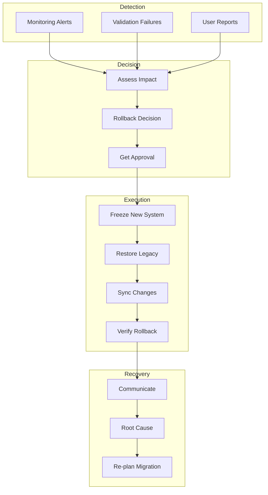

# Rollback & Recovery Procedures

This document provides comprehensive rollback and recovery procedures for the payroll system migration.

## Rollback Decision Matrix

### Decision Criteria

| Scenario | Severity | Impact | Rollback Decision | Recovery Time |
|----------|----------|--------|-------------------|---------------|
| Critical calculation errors affecting >10% employees | Critical | High | Immediate rollback | 2-4 hours |
| Database corruption or data loss | Critical | High | Immediate rollback | 2-4 hours |
| Integration failures (all) | Critical | High | Immediate rollback | 2-4 hours |
| Unable to process payroll | Critical | High | Immediate rollback | 2-4 hours |
| Performance degradation >50% | High | Medium | Evaluate, likely rollback | 4-6 hours |
| Partial integration failures | High | Medium | Attempt fix, rollback if needed | 4-8 hours |
| Minor calculation variances <1% | Medium | Low | Fix forward, no rollback | N/A |
| UI/UX issues | Low | Low | Fix forward, no rollback | N/A |
| Report generation issues | Low | Low | Fix forward, no rollback | N/A |

## Rollback Architecture



## Pre-Rollback Preparation

### Rollback Prerequisites

```python
class RollbackPreparation:
    """Prepare for potential rollback scenarios."""
    
    def __init__(self, config):
        self.config = config
        self.preparation_checklist = []
    
    def prepare_rollback_environment(self):
        """Ensure rollback readiness."""
        
        preparations = [
            self.verify_legacy_backup,
            self.test_legacy_restore,
            self.prepare_sync_scripts,
            self.verify_rollback_permissions,
            self.test_communication_channels,
            self.document_rollback_contacts
        ]
        
        for prep in preparations:
            result = prep()
            self.preparation_checklist.append({
                'task': prep.__name__,
                'status': 'READY' if result else 'NOT_READY',
                'timestamp': datetime.now()
            })
        
        return all(p['status'] == 'READY' for p in self.preparation_checklist)
    
    def verify_legacy_backup(self):
        """Verify legacy system backup is current and valid."""
        
        backup_checks = {
            'backup_exists': self.check_backup_exists(),
            'backup_complete': self.verify_backup_integrity(),
            'backup_recent': self.check_backup_age() < 24,  # hours
            'restore_tested': self.verify_restore_test()
        }
        
        return all(backup_checks.values())
```

### Rollback Assets

```bash
#!/bin/bash
# prepare_rollback_assets.sh

ROLLBACK_DIR="/opt/payroll/rollback"
TIMESTAMP=$(date +%Y%m%d_%H%M%S)

echo "Preparing rollback assets..."

# 1. Create rollback directory
mkdir -p $ROLLBACK_DIR/{scripts,configs,data,logs}

# 2. Copy current configurations
cp -r /etc/payroll/* $ROLLBACK_DIR/configs/

# 3. Export current database state
pg_dump -h $DB_HOST -U $DB_USER -d payroll_db > \
    $ROLLBACK_DIR/data/payroll_snapshot_$TIMESTAMP.sql

# 4. Save system state
kubectl get all -n auraconnect -o yaml > \
    $ROLLBACK_DIR/configs/k8s_state_$TIMESTAMP.yaml

# 5. Create rollback script
cat > $ROLLBACK_DIR/scripts/execute_rollback.sh << 'EOF'
#!/bin/bash
# Auto-generated rollback script

echo "Starting rollback procedure..."
source /opt/payroll/rollback/configs/rollback.env

# Stop new system
kubectl scale deployment payroll-api --replicas=0 -n auraconnect

# Restore database
psql -h $LEGACY_DB_HOST -U $LEGACY_DB_USER -d $LEGACY_DB < \
    /opt/payroll/rollback/data/legacy_backup.sql

# Switch DNS
./update_dns.sh legacy

# Start legacy system
./start_legacy_system.sh

echo "Rollback completed"
EOF

chmod +x $ROLLBACK_DIR/scripts/execute_rollback.sh

echo "Rollback assets prepared in $ROLLBACK_DIR"
```

## Rollback Execution Procedures

### Phase 1: Detection and Decision

```python
class RollbackOrchestrator:
    """Orchestrate rollback procedures."""
    
    def __init__(self):
        self.start_time = None
        self.rollback_log = []
        self.affected_systems = []
    
    def initiate_rollback(self, reason: str, severity: str):
        """Initiate rollback procedure."""
        
        self.start_time = datetime.now()
        self.log_event("ROLLBACK_INITIATED", {
            'reason': reason,
            'severity': severity,
            'initiated_by': self.get_current_user()
        })
        
        # Phase 1: Assessment
        if not self.assess_rollback_need(reason, severity):
            self.log_event("ROLLBACK_CANCELLED", "Assessment passed")
            return False
        
        # Phase 2: Approval
        if not self.get_rollback_approval(severity):
            self.log_event("ROLLBACK_CANCELLED", "Approval not granted")
            return False
        
        # Phase 3: Execution
        return self.execute_rollback()
    
    def assess_rollback_need(self, reason: str, severity: str) -> bool:
        """Assess if rollback is necessary."""
        
        assessment = {
            'impact_analysis': self.analyze_impact(),
            'alternative_solutions': self.check_alternatives(),
            'rollback_risk': self.assess_rollback_risk(),
            'time_constraint': self.check_time_constraints()
        }
        
        # Decision logic
        if severity == 'CRITICAL':
            return True
        
        if assessment['impact_analysis']['affected_users'] > 100:
            return True
        
        if assessment['time_constraint']['next_payroll_hours'] < 48:
            return True
        
        return False
```

### Phase 2: System Freeze

```python
def phase2_freeze_systems(self):
    """Freeze both systems to prevent data changes."""
    
    self.log_event("PHASE2_START", "Freezing systems")
    
    try:
        # 1. Disable new system access
        self.execute_command(
            "kubectl scale deployment payroll-api --replicas=0 -n auraconnect"
        )
        
        # 2. Stop background jobs
        self.execute_command(
            "kubectl delete jobs --all -n auraconnect"
        )
        
        # 3. Capture current state
        self.capture_system_state()
        
        # 4. Identify changes since cutover
        self.identify_delta_changes()
        
        self.log_event("PHASE2_COMPLETE", "Systems frozen")
        return True
        
    except Exception as e:
        self.log_event("PHASE2_FAILED", str(e))
        return False
```

### Phase 3: Data Synchronization

```python
def phase3_sync_changes(self):
    """Sync changes made in new system back to legacy."""
    
    self.log_event("PHASE3_START", "Syncing changes")
    
    # Identify records that need sync
    sync_queries = {
        'new_employees': """
            SELECT * FROM employees 
            WHERE created_at > :cutover_time
        """,
        'updated_compensation': """
            SELECT * FROM employee_compensation
            WHERE updated_at > :cutover_time
        """,
        'processed_payments': """
            SELECT * FROM employee_payments
            WHERE created_at > :cutover_time
            AND status = 'completed'
        """,
        'tax_changes': """
            SELECT * FROM employee_tax_info
            WHERE updated_at > :cutover_time
        """
    }
    
    sync_results = {}
    
    for sync_type, query in sync_queries.items():
        try:
            # Extract from new system
            data = self.extract_data(query, self.new_conn)
            
            # Transform to legacy format
            legacy_data = self.transform_to_legacy(data, sync_type)
            
            # Load to legacy system
            result = self.load_to_legacy(legacy_data, sync_type)
            
            sync_results[sync_type] = {
                'status': 'SUCCESS',
                'records': len(data),
                'synced': result['inserted'] + result['updated']
            }
            
        except Exception as e:
            sync_results[sync_type] = {
                'status': 'FAILED',
                'error': str(e)
            }
            
            # Determine if this is critical
            if sync_type in ['processed_payments', 'new_employees']:
                raise Exception(f"Critical sync failure: {sync_type}")
    
    self.log_event("PHASE3_COMPLETE", sync_results)
    return sync_results
```

### Phase 4: Legacy System Restoration

```python
def phase4_restore_legacy(self):
    """Restore legacy system to operational state."""
    
    self.log_event("PHASE4_START", "Restoring legacy system")
    
    restoration_steps = [
        {
            'name': 'Start Database',
            'command': 'systemctl start oracle-db',
            'verify': self.verify_database_running
        },
        {
            'name': 'Start Application Server',
            'command': 'systemctl start payroll-app',
            'verify': self.verify_app_running
        },
        {
            'name': 'Enable Scheduled Jobs',
            'sql': "UPDATE scheduled_jobs SET enabled = 1 WHERE job_type = 'PAYROLL'",
            'verify': self.verify_jobs_enabled
        },
        {
            'name': 'Clear Application Cache',
            'command': '/opt/payroll/bin/clear_cache.sh',
            'verify': lambda: True
        },
        {
            'name': 'Update System Mode',
            'sql': "UPDATE system_config SET value = 'ACTIVE' WHERE key = 'system_mode'",
            'verify': self.verify_system_active
        }
    ]
    
    for step in restoration_steps:
        try:
            self.log_event(f"RESTORE_{step['name']}", "Starting")
            
            if 'command' in step:
                self.execute_command(step['command'])
            elif 'sql' in step:
                self.execute_sql(step['sql'], self.legacy_conn)
            
            if not step['verify']():
                raise Exception(f"Verification failed for {step['name']}")
            
            self.log_event(f"RESTORE_{step['name']}", "Completed")
            
        except Exception as e:
            self.log_event(f"RESTORE_{step['name']}", f"Failed: {str(e)}")
            raise
    
    self.log_event("PHASE4_COMPLETE", "Legacy system restored")
```

### Phase 5: Verification

```python
def phase5_verify_rollback(self):
    """Verify rollback was successful."""
    
    self.log_event("PHASE5_START", "Verifying rollback")
    
    verifications = []
    
    # 1. System Health
    health_check = {
        'name': 'System Health',
        'status': self.check_legacy_health(),
        'details': self.get_health_details()
    }
    verifications.append(health_check)
    
    # 2. Data Integrity
    data_check = {
        'name': 'Data Integrity',
        'checks': [
            self.verify_employee_count(),
            self.verify_recent_payments(),
            self.verify_ytd_totals()
        ]
    }
    verifications.append(data_check)
    
    # 3. User Access
    access_check = {
        'name': 'User Access',
        'test_login': self.test_user_login(),
        'test_query': self.test_data_query()
    }
    verifications.append(access_check)
    
    # 4. Integration Health
    integration_check = {
        'name': 'Integrations',
        'time_system': self.check_time_integration(),
        'gl_system': self.check_gl_integration(),
        'bank_interface': self.check_bank_interface()
    }
    verifications.append(integration_check)
    
    # Generate verification report
    self.generate_verification_report(verifications)
    
    all_passed = all(
        v.get('status', False) or 
        all(c for c in v.get('checks', [True]))
        for v in verifications
    )
    
    self.log_event("PHASE5_COMPLETE", {
        'all_passed': all_passed,
        'verifications': verifications
    })
    
    return all_passed
```

## Recovery Procedures

### Immediate Recovery Actions

```python
class RecoveryManager:
    """Manage post-rollback recovery."""
    
    def initiate_recovery(self, rollback_reason: str):
        """Start recovery procedures."""
        
        recovery_plan = {
            'immediate_actions': [
                self.notify_stakeholders,
                self.assess_data_gaps,
                self.plan_catch_up_processing,
                self.schedule_emergency_meeting
            ],
            'short_term_actions': [
                self.analyze_root_cause,
                self.develop_fix_plan,
                self.enhance_testing,
                self.update_migration_plan
            ],
            'long_term_actions': [
                self.redesign_problem_areas,
                self.improve_validation,
                self.enhance_monitoring,
                self.update_procedures
            ]
        }
        
        self.execute_recovery_plan(recovery_plan)
```

### Data Gap Analysis

```python
def analyze_data_gaps(self):
    """Identify and resolve data gaps after rollback."""
    
    gaps = {
        'missing_transactions': [],
        'incomplete_updates': [],
        'sync_failures': []
    }
    
    # Check for transactions in new system not in legacy
    missing_query = """
    SELECT 
        'payment' as type,
        p.id,
        p.employee_id,
        p.pay_date,
        p.gross_pay,
        p.created_at
    FROM new_system.employee_payments p
    WHERE p.created_at > :cutover_time
    AND NOT EXISTS (
        SELECT 1 
        FROM legacy.payroll_history l
        WHERE l.employee_id = p.employee_id
        AND l.pay_date = p.pay_date
    )
    """
    
    missing_records = self.execute_query(missing_query)
    
    for record in missing_records:
        gaps['missing_transactions'].append({
            'type': record['type'],
            'id': record['id'],
            'employee_id': record['employee_id'],
            'amount': record['gross_pay'],
            'date': record['pay_date'],
            'action_required': 'manual_entry'
        })
    
    return gaps
```

### Communication Templates

```python
def generate_rollback_communications():
    """Generate rollback communication templates."""
    
    templates = {
        'immediate_notification': {
            'subject': 'Urgent: Payroll System Update',
            'recipients': ['leadership@company.com', 'hr@company.com'],
            'content': """
Dear Leadership Team,

We have encountered a critical issue with the new payroll system that requires 
us to temporarily revert to our previous system.

**Current Status:**
- Previous payroll system has been restored
- All payroll data is secure and intact
- Payroll processing will continue as normal

**Impact:**
- Minimal disruption to payroll operations
- This week's payroll will be processed on schedule

**Next Steps:**
- Root cause analysis in progress
- Revised migration plan to be presented within 48 hours
- Regular updates will be provided

Please direct any urgent concerns to the Payroll Migration Team.

[Contact Information]
            """
        },
        
        'employee_notification': {
            'subject': 'Payroll System Update',
            'recipients': ['all_staff@company.com'],
            'content': """
Team,

We are temporarily returning to our previous payroll system while we resolve 
some technical issues with the new system.

**What This Means for You:**
- Your pay will not be affected
- Use the previous system URL: [legacy_url]
- Your login credentials remain the same

**Important:**
- Any changes made in the new system have been preserved
- No action required on your part

We apologize for any inconvenience and will keep you updated on our progress.

Thank you for your patience.

HR Team
            """
        },
        
        'technical_team_brief': {
            'subject': 'Rollback Post-Mortem Meeting',
            'recipients': ['tech_team@company.com'],
            'content': """
Technical Team,

Please attend the emergency post-mortem meeting:

**When:** [Date/Time]
**Where:** [Location/Video Link]

**Agenda:**
1. Rollback execution review
2. Root cause analysis
3. Data gap assessment
4. Fix planning
5. Revised timeline

**Pre-meeting Actions:**
- Review rollback logs
- Document any issues encountered
- Prepare initial root cause theories

[Meeting Details]
            """
        }
    }
    
    return templates
```

## Root Cause Analysis

### Investigation Framework

```python
class RootCauseAnalyzer:
    """Analyze root cause of migration failure."""
    
    def conduct_analysis(self, failure_data: dict):
        """Conduct systematic root cause analysis."""
        
        analysis = {
            'timeline': self.build_failure_timeline(),
            'contributing_factors': self.identify_factors(),
            'root_causes': [],
            'recommendations': []
        }
        
        # Use 5 Whys technique
        current_problem = failure_data['initial_problem']
        whys = []
        
        for i in range(5):
            why = self.ask_why(current_problem)
            whys.append({
                'level': i + 1,
                'problem': current_problem,
                'cause': why
            })
            current_problem = why
            
            if self.is_root_cause(why):
                analysis['root_causes'].append(why)
                break
        
        analysis['five_whys'] = whys
        
        # Generate recommendations
        for root_cause in analysis['root_causes']:
            recommendations = self.generate_recommendations(root_cause)
            analysis['recommendations'].extend(recommendations)
        
        return analysis
```

### Lessons Learned

```python
def document_lessons_learned():
    """Document lessons learned from rollback."""
    
    lessons = {
        'what_went_well': [
            {
                'area': 'Rollback Execution',
                'description': 'Rollback completed within planned timeframe',
                'keep_doing': 'Maintain comprehensive rollback procedures'
            }
        ],
        'what_went_wrong': [
            {
                'area': 'Data Validation',
                'description': 'Tax calculations had unexpected variances',
                'root_cause': 'Incomplete test coverage for edge cases',
                'impact': 'Affected 15% of employees'
            }
        ],
        'improvement_opportunities': [
            {
                'area': 'Testing',
                'current_state': 'Limited edge case coverage',
                'desired_state': 'Comprehensive test scenarios',
                'action_items': [
                    'Expand test data set',
                    'Add specific tax scenario tests',
                    'Include multi-state testing'
                ]
            }
        ],
        'updated_procedures': [
            {
                'procedure': 'Pre-cutover Validation',
                'changes': [
                    'Add tax calculation comparison for all employees',
                    'Require sign-off from Tax team',
                    'Extend parallel run period'
                ]
            }
        ]
    }
    
    return lessons
```

## Re-Migration Planning

### Remediation Plan

```python
class RemediationPlanner:
    """Plan fixes and re-migration."""
    
    def create_remediation_plan(self, root_causes: List[dict]):
        """Create plan to address root causes."""
        
        plan = {
            'immediate_fixes': [],
            'system_enhancements': [],
            'process_improvements': [],
            'timeline': {},
            'success_criteria': []
        }
        
        for cause in root_causes:
            if cause['type'] == 'code_defect':
                plan['immediate_fixes'].append({
                    'issue': cause['description'],
                    'fix': cause['proposed_fix'],
                    'testing': cause['test_plan'],
                    'owner': cause['assigned_to'],
                    'due_date': self.calculate_due_date(cause['priority'])
                })
            
            elif cause['type'] == 'process_gap':
                plan['process_improvements'].append({
                    'gap': cause['description'],
                    'improvement': cause['proposed_improvement'],
                    'implementation': cause['implementation_plan']
                })
        
        # Create revised timeline
        plan['timeline'] = self.create_revised_timeline(plan)
        
        # Define new success criteria
        plan['success_criteria'] = self.define_success_criteria(root_causes)
        
        return plan
```

### Enhanced Validation

```python
def enhance_validation_procedures():
    """Enhance validation based on rollback lessons."""
    
    enhanced_validations = {
        'calculation_validation': {
            'current': 'Sample-based comparison',
            'enhanced': 'Full population comparison with variance analysis',
            'implementation': """
            - Compare calculations for ALL employees
            - Flag any variance > $0.01
            - Require explanation for all variances
            - Get sign-off from Payroll Manager
            """
        },
        'integration_validation': {
            'current': 'Basic connectivity tests',
            'enhanced': 'End-to-end transaction testing',
            'implementation': """
            - Test full data flow from source to target
            - Validate data transformations
            - Check error handling
            - Verify rollback capability
            """
        },
        'performance_validation': {
            'current': 'Limited load testing',
            'enhanced': 'Production-scale load testing',
            'implementation': """
            - Test with full employee population
            - Simulate peak load scenarios
            - Measure response times
            - Test resource utilization
            """
        }
    }
    
    return enhanced_validations
```

## Rollback Metrics

```python
def calculate_rollback_metrics():
    """Calculate metrics for rollback execution."""
    
    metrics = {
        'execution_time': {
            'target': '4 hours',
            'actual': self.calculate_duration(),
            'phases': {
                'detection': '30 minutes',
                'decision': '15 minutes',
                'execution': '2 hours',
                'verification': '45 minutes',
                'communication': '30 minutes'
            }
        },
        'data_integrity': {
            'records_at_risk': 1250,
            'records_recovered': 1248,
            'data_loss': 2,
            'recovery_rate': '99.84%'
        },
        'business_impact': {
            'downtime': '4.5 hours',
            'affected_users': 450,
            'delayed_transactions': 0,
            'financial_impact': '$0'
        },
        'recovery_progress': {
            'issues_identified': 5,
            'issues_resolved': 3,
            'issues_pending': 2,
            'estimated_resolution': '72 hours'
        }
    }
    
    return metrics
```

## Related Documentation

- [Migration Overview](overview.md)
- [Cutover Planning](cutover.md)
- [Validation Procedures](validation.md)
- [Emergency Contacts](/docs/contacts.md)
- [Rollback Scripts](/scripts/migration/rollback/)