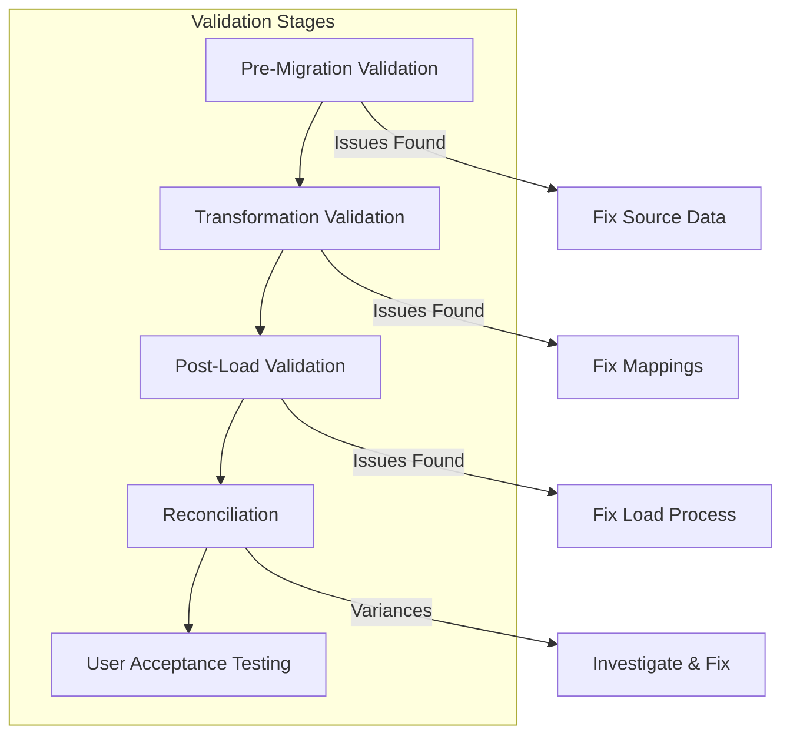

# Validation & Testing Guide

This document provides comprehensive validation procedures for ensuring data integrity during payroll migration.

## Validation Overview



## Pre-Migration Validation

### Data Quality Checks

```python
class PreMigrationValidator:
    """Validate source data before migration."""
    
    def __init__(self, connection):
        self.connection = connection
        self.validation_results = []
    
    def validate_all(self):
        """Run all pre-migration validations."""
        self.check_required_fields()
        self.check_data_types()
        self.check_referential_integrity()
        self.check_business_rules()
        self.check_duplicates()
        return self.validation_results
    
    def check_required_fields(self):
        """Validate required fields are populated."""
        queries = {
            'employees_missing_ssn': """
                SELECT COUNT(*) as count
                FROM employees
                WHERE ssn IS NULL OR ssn = ''
                AND status = 'A'
            """,
            'employees_missing_hire_date': """
                SELECT COUNT(*) as count
                FROM employees
                WHERE hire_date IS NULL
                AND status = 'A'
            """,
            'compensation_missing_rate': """
                SELECT COUNT(*) as count
                FROM compensation
                WHERE (salary IS NULL AND hourly_rate IS NULL)
                AND effective_date >= DATEADD(year, -1, GETDATE())
            """
        }
        
        for check_name, query in queries.items():
            result = pd.read_sql(query, self.connection)
            count = result['count'][0]
            
            self.validation_results.append({
                'check': check_name,
                'severity': 'ERROR' if count > 0 else 'PASS',
                'count': count,
                'message': f'{count} records failed validation'
            })
```

### Data Type Validation

```python
def validate_data_types(df: pd.DataFrame, schema: dict) -> List[dict]:
    """Validate data types match expected schema."""
    issues = []
    
    for column, expected_type in schema.items():
        if column not in df.columns:
            issues.append({
                'column': column,
                'issue': 'Missing column',
                'severity': 'ERROR'
            })
            continue
        
        # Check for type compatibility
        if expected_type == 'date':
            # Try to convert to date
            try:
                pd.to_datetime(df[column], errors='coerce')
                invalid_dates = df[column].isna().sum()
                if invalid_dates > 0:
                    issues.append({
                        'column': column,
                        'issue': f'{invalid_dates} invalid dates',
                        'severity': 'WARNING'
                    })
            except Exception as e:
                issues.append({
                    'column': column,
                    'issue': f'Cannot convert to date: {str(e)}',
                    'severity': 'ERROR'
                })
        
        elif expected_type == 'decimal':
            # Check numeric values
            try:
                pd.to_numeric(df[column], errors='coerce')
                invalid_numbers = df[column].isna().sum()
                if invalid_numbers > 0:
                    issues.append({
                        'column': column,
                        'issue': f'{invalid_numbers} non-numeric values',
                        'severity': 'WARNING'
                    })
            except Exception as e:
                issues.append({
                    'column': column,
                    'issue': f'Cannot convert to decimal: {str(e)}',
                    'severity': 'ERROR'
                })
    
    return issues
```

## Transformation Validation

### Field Mapping Validation

```python
class TransformationValidator:
    """Validate data transformations."""
    
    def validate_transformation(self, source_df: pd.DataFrame, 
                              target_df: pd.DataFrame,
                              mapping: dict) -> dict:
        """Validate transformation was successful."""
        results = {
            'row_count': self._validate_row_count(source_df, target_df),
            'field_mappings': self._validate_mappings(source_df, target_df, mapping),
            'data_integrity': self._validate_integrity(source_df, target_df),
            'business_rules': self._validate_business_rules(target_df)
        }
        
        return results
    
    def _validate_row_count(self, source_df, target_df):
        """Ensure no records were lost."""
        source_count = len(source_df)
        target_count = len(target_df)
        
        return {
            'source_count': source_count,
            'target_count': target_count,
            'match': source_count == target_count,
            'variance': abs(source_count - target_count)
        }
    
    def _validate_mappings(self, source_df, target_df, mapping):
        """Validate each field was mapped correctly."""
        mapping_results = []
        
        for source_field, target_field in mapping.items():
            if callable(target_field):
                # Skip transformation functions
                continue
            
            # Check field exists
            if target_field not in target_df.columns:
                mapping_results.append({
                    'field': target_field,
                    'status': 'MISSING',
                    'message': 'Target field not found'
                })
                continue
            
            # Check data was transferred
            null_count = target_df[target_field].isna().sum()
            mapping_results.append({
                'field': target_field,
                'status': 'OK' if null_count == 0 else 'WARNING',
                'null_count': null_count,
                'message': f'{null_count} null values after mapping'
            })
        
        return mapping_results
```

### Business Rule Validation

```python
def validate_payroll_calculations(df: pd.DataFrame) -> List[dict]:
    """Validate payroll calculation rules."""
    violations = []
    
    # Rule 1: Gross pay must equal sum of components
    df['calculated_gross'] = (
        df['regular_pay'] + 
        df['overtime_pay'] + 
        df['bonus'] + 
        df['commission']
    )
    
    gross_variance = df[
        abs(df['gross_pay'] - df['calculated_gross']) > 0.01
    ]
    
    if not gross_variance.empty:
        violations.append({
            'rule': 'Gross pay calculation',
            'severity': 'ERROR',
            'count': len(gross_variance),
            'sample_ids': gross_variance['employee_id'].head(5).tolist()
        })
    
    # Rule 2: Net pay must be less than gross pay
    net_exceeds_gross = df[df['net_pay'] > df['gross_pay']]
    
    if not net_exceeds_gross.empty:
        violations.append({
            'rule': 'Net pay exceeds gross',
            'severity': 'ERROR',
            'count': len(net_exceeds_gross),
            'sample_ids': net_exceeds_gross['employee_id'].head(5).tolist()
        })
    
    # Rule 3: Tax withholdings must be reasonable
    df['tax_percentage'] = (
        (df['federal_tax'] + df['state_tax']) / df['gross_pay'] * 100
    )
    
    high_tax = df[df['tax_percentage'] > 50]  # More than 50% tax
    
    if not high_tax.empty:
        violations.append({
            'rule': 'Excessive tax withholding',
            'severity': 'WARNING',
            'count': len(high_tax),
            'sample_ids': high_tax['employee_id'].head(5).tolist()
        })
    
    return violations
```

## Post-Load Validation

### Database Integrity Checks

```sql
-- Check referential integrity
SELECT 'Missing employee reference' as check_name,
       COUNT(*) as error_count
FROM employee_payments ep
LEFT JOIN employees e ON ep.employee_id = e.id
WHERE e.id IS NULL

UNION ALL

-- Check for orphaned records
SELECT 'Orphaned tax records' as check_name,
       COUNT(*) as error_count
FROM employee_tax_info eti
LEFT JOIN employees e ON eti.employee_id = e.id
WHERE e.id IS NULL

UNION ALL

-- Check for duplicate payments
SELECT 'Duplicate payments' as check_name,
       COUNT(*) as error_count
FROM (
    SELECT employee_id, pay_period_start, pay_period_end,
           COUNT(*) as payment_count
    FROM employee_payments
    GROUP BY employee_id, pay_period_start, pay_period_end
    HAVING COUNT(*) > 1
) duplicates;
```

### Data Completeness Validation

```python
def validate_data_completeness(db_session) -> dict:
    """Check data completeness after load."""
    
    completeness_checks = {}
    
    # Check employee data completeness
    employee_query = """
    SELECT 
        COUNT(*) as total_employees,
        COUNT(ssn_encrypted) as with_ssn,
        COUNT(hire_date) as with_hire_date,
        COUNT(department) as with_department,
        COUNT(CASE WHEN employment_status = 'active' THEN 1 END) as active
    FROM employees
    """
    
    result = db_session.execute(employee_query).fetchone()
    
    completeness_checks['employees'] = {
        'total': result.total_employees,
        'ssn_completeness': (result.with_ssn / result.total_employees * 100),
        'hire_date_completeness': (result.with_hire_date / result.total_employees * 100),
        'department_completeness': (result.with_department / result.total_employees * 100),
        'active_count': result.active
    }
    
    # Check compensation data
    comp_query = """
    SELECT 
        COUNT(DISTINCT employee_id) as employees_with_comp,
        COUNT(*) as total_comp_records,
        AVG(CASE WHEN pay_type = 'salary' THEN annual_salary ELSE hourly_rate * 2080 END) as avg_annual_comp
    FROM employee_compensation
    WHERE is_active = true
    """
    
    comp_result = db_session.execute(comp_query).fetchone()
    
    completeness_checks['compensation'] = {
        'employees_with_comp': comp_result.employees_with_comp,
        'total_records': comp_result.total_comp_records,
        'average_annual': comp_result.avg_annual_comp
    }
    
    return completeness_checks
```

## Reconciliation

### Financial Reconciliation

```python
class FinancialReconciliation:
    """Reconcile financial totals between systems."""
    
    def __init__(self, source_conn, target_conn):
        self.source_conn = source_conn
        self.target_conn = target_conn
    
    def reconcile_ytd_totals(self, year: int) -> pd.DataFrame:
        """Reconcile YTD totals by employee."""
        
        # Get source totals
        source_query = f"""
        SELECT 
            emp_id,
            SUM(gross_pay) as ytd_gross,
            SUM(net_pay) as ytd_net,
            SUM(fed_tax) as ytd_fed_tax,
            SUM(state_tax) as ytd_state_tax,
            SUM(soc_sec) as ytd_soc_sec,
            SUM(medicare) as ytd_medicare
        FROM payroll_history
        WHERE YEAR(pay_date) = {year}
        GROUP BY emp_id
        """
        
        source_df = pd.read_sql(source_query, self.source_conn)
        
        # Get target totals
        target_query = f"""
        SELECT 
            e.employee_code as emp_id,
            SUM(p.gross_pay) as ytd_gross,
            SUM(p.net_pay) as ytd_net,
            SUM(pt.tax_amount) FILTER (WHERE pt.tax_type = 'federal_income') as ytd_fed_tax,
            SUM(pt.tax_amount) FILTER (WHERE pt.tax_type = 'state_income') as ytd_state_tax,
            SUM(pt.tax_amount) FILTER (WHERE pt.tax_type = 'social_security') as ytd_soc_sec,
            SUM(pt.tax_amount) FILTER (WHERE pt.tax_type = 'medicare') as ytd_medicare
        FROM employee_payments p
        JOIN employees e ON p.employee_id = e.id
        LEFT JOIN payment_taxes pt ON p.id = pt.payment_id
        WHERE EXTRACT(YEAR FROM p.pay_date) = {year}
        GROUP BY e.employee_code
        """
        
        target_df = pd.read_sql(target_query, self.target_conn)
        
        # Merge and compare
        comparison = pd.merge(
            source_df,
            target_df,
            on='emp_id',
            suffixes=('_source', '_target')
        )
        
        # Calculate variances
        for field in ['ytd_gross', 'ytd_net', 'ytd_fed_tax']:
            comparison[f'{field}_variance'] = (
                comparison[f'{field}_target'] - comparison[f'{field}_source']
            )
            comparison[f'{field}_match'] = (
                abs(comparison[f'{field}_variance']) < 0.01
            )
        
        return comparison
```

### Detailed Reconciliation Report

```python
def generate_reconciliation_report(comparison_df: pd.DataFrame) -> dict:
    """Generate detailed reconciliation report."""
    
    report = {
        'summary': {
            'total_employees': len(comparison_df),
            'perfect_matches': len(comparison_df[
                comparison_df['ytd_gross_match'] & 
                comparison_df['ytd_net_match'] &
                comparison_df['ytd_fed_tax_match']
            ]),
            'employees_with_variances': len(comparison_df[
                ~comparison_df['ytd_gross_match'] |
                ~comparison_df['ytd_net_match'] |
                ~comparison_df['ytd_fed_tax_match']
            ])
        },
        'variance_analysis': {},
        'sample_variances': []
    }
    
    # Analyze variances by field
    for field in ['ytd_gross', 'ytd_net', 'ytd_fed_tax']:
        variances = comparison_df[~comparison_df[f'{field}_match']]
        
        report['variance_analysis'][field] = {
            'count': len(variances),
            'total_variance': variances[f'{field}_variance'].sum(),
            'avg_variance': variances[f'{field}_variance'].mean(),
            'max_variance': variances[f'{field}_variance'].max(),
            'min_variance': variances[f'{field}_variance'].min()
        }
        
        # Get sample variances
        if not variances.empty:
            samples = variances.nlargest(5, f'{field}_variance')[
                ['emp_id', f'{field}_source', f'{field}_target', f'{field}_variance']
            ].to_dict('records')
            
            report['sample_variances'].extend([
                {
                    'field': field,
                    'employee': s['emp_id'],
                    'source_value': s[f'{field}_source'],
                    'target_value': s[f'{field}_target'],
                    'variance': s[f'{field}_variance']
                }
                for s in samples
            ])
    
    return report
```

## User Acceptance Testing (UAT)

### UAT Test Scenarios

```python
UAT_TEST_SCENARIOS = [
    {
        'id': 'UAT-001',
        'category': 'Employee Setup',
        'description': 'Verify employee data is correctly displayed',
        'steps': [
            'Search for a known employee',
            'Verify personal information matches legacy system',
            'Check compensation details',
            'Verify tax setup',
            'Check benefit enrollments'
        ],
        'expected_result': 'All employee data matches legacy system'
    },
    {
        'id': 'UAT-002',
        'category': 'Payroll Calculation',
        'description': 'Run payroll calculation and compare to legacy',
        'steps': [
            'Select pay period matching legacy run',
            'Run calculation for test employee',
            'Compare gross pay calculation',
            'Verify tax withholdings',
            'Check net pay matches'
        ],
        'expected_result': 'Calculations match within $0.01'
    },
    {
        'id': 'UAT-003',
        'category': 'YTD Totals',
        'description': 'Verify YTD totals are accurate',
        'steps': [
            'View employee YTD summary',
            'Compare YTD gross to legacy',
            'Compare YTD taxes to legacy',
            'Check YTD deductions'
        ],
        'expected_result': 'YTD totals match exactly'
    }
]
```

### UAT Checklist Generator

```python
def generate_uat_checklist(test_scenarios: List[dict], 
                          test_employees: List[str]) -> pd.DataFrame:
    """Generate UAT checklist for testers."""
    
    checklist_items = []
    
    for scenario in test_scenarios:
        for employee in test_employees:
            checklist_items.append({
                'test_id': scenario['id'],
                'category': scenario['category'],
                'employee_id': employee,
                'description': scenario['description'],
                'tester_name': '',
                'test_date': '',
                'result': '',  # Pass/Fail
                'notes': '',
                'legacy_value': '',
                'new_value': '',
                'variance': ''
            })
    
    checklist_df = pd.DataFrame(checklist_items)
    
    # Save to Excel with formatting
    with pd.ExcelWriter('uat_checklist.xlsx', engine='xlsxwriter') as writer:
        checklist_df.to_excel(writer, sheet_name='UAT Checklist', index=False)
        
        # Format the worksheet
        workbook = writer.book
        worksheet = writer.sheets['UAT Checklist']
        
        # Add data validation for result column
        worksheet.data_validation(
            f'G2:G{len(checklist_df)+1}',
            {
                'validate': 'list',
                'source': ['Pass', 'Fail', 'Blocked']
            }
        )
    
    return checklist_df
```

## Automated Testing Framework

### Test Data Generator

```python
class TestDataGenerator:
    """Generate test data for validation."""
    
    def generate_test_employees(self, count: int = 50) -> pd.DataFrame:
        """Generate diverse test employee data."""
        
        fake = Faker()
        employees = []
        
        for i in range(count):
            # Generate diverse scenarios
            employment_type = random.choice(['active', 'terminated', 'leave'])
            pay_type = random.choice(['salary', 'hourly'])
            state = random.choice(['CA', 'NY', 'TX', 'FL', 'IL'])
            
            employee = {
                'employee_code': f'TEST{i:04d}',
                'first_name': fake.first_name(),
                'last_name': fake.last_name(),
                'ssn': fake.ssn(),
                'hire_date': fake.date_between(start_date='-10y', end_date='-1y'),
                'employment_status': employment_type,
                'department': random.choice(['Engineering', 'Sales', 'HR', 'Finance']),
                'location': state.lower(),
                'pay_type': pay_type,
                'annual_salary': random.randint(40000, 150000) if pay_type == 'salary' else None,
                'hourly_rate': random.randint(15, 75) if pay_type == 'hourly' else None,
                'federal_filing_status': random.choice(['single', 'married']),
                'state': state
            }
            
            employees.append(employee)
        
        return pd.DataFrame(employees)
```

### Automated Test Runner

```python
class MigrationTestRunner:
    """Automated migration testing framework."""
    
    def __init__(self, source_system: str, target_connection):
        self.source_system = source_system
        self.target_conn = target_connection
        self.test_results = []
    
    def run_all_tests(self):
        """Run complete test suite."""
        
        print("Starting automated migration tests...")
        
        # Pre-migration tests
        self.run_test(
            "Pre-migration data quality",
            self.test_source_data_quality
        )
        
        # Transformation tests
        self.run_test(
            "Field mapping validation",
            self.test_field_mappings
        )
        
        # Post-load tests
        self.run_test(
            "Database integrity",
            self.test_database_integrity
        )
        
        # Calculation tests
        self.run_test(
            "Payroll calculations",
            self.test_payroll_calculations
        )
        
        # Reconciliation tests
        self.run_test(
            "Financial reconciliation",
            self.test_financial_reconciliation
        )
        
        # Generate report
        self.generate_test_report()
    
    def run_test(self, test_name: str, test_function):
        """Run individual test and capture results."""
        
        print(f"\nRunning: {test_name}")
        start_time = time.time()
        
        try:
            result = test_function()
            status = 'PASS' if result['passed'] else 'FAIL'
            error = None
        except Exception as e:
            status = 'ERROR'
            result = None
            error = str(e)
        
        duration = time.time() - start_time
        
        self.test_results.append({
            'test_name': test_name,
            'status': status,
            'duration': duration,
            'result': result,
            'error': error,
            'timestamp': datetime.now()
        })
        
        print(f"  Status: {status} ({duration:.2f}s)")
```

## Validation Dashboard

```python
def create_validation_dashboard(test_results: List[dict]) -> None:
    """Create visual dashboard of validation results."""
    
    import matplotlib.pyplot as plt
    import seaborn as sns
    
    fig, axes = plt.subplots(2, 2, figsize=(15, 10))
    
    # Test status summary
    status_counts = pd.DataFrame(test_results)['status'].value_counts()
    axes[0, 0].pie(status_counts.values, labels=status_counts.index, autopct='%1.1f%%')
    axes[0, 0].set_title('Test Status Summary')
    
    # Validation timeline
    timeline_df = pd.DataFrame(test_results)
    timeline_df['timestamp'] = pd.to_datetime(timeline_df['timestamp'])
    axes[0, 1].plot(timeline_df['timestamp'], timeline_df['duration'])
    axes[0, 1].set_title('Test Execution Timeline')
    axes[0, 1].set_xlabel('Time')
    axes[0, 1].set_ylabel('Duration (seconds)')
    
    # Error categories
    errors_df = timeline_df[timeline_df['status'] == 'FAIL']
    if not errors_df.empty:
        error_categories = errors_df['test_name'].value_counts()
        axes[1, 0].bar(error_categories.index, error_categories.values)
        axes[1, 0].set_title('Failed Tests by Category')
        axes[1, 0].tick_params(axis='x', rotation=45)
    
    # Save dashboard
    plt.tight_layout()
    plt.savefig('validation_dashboard.png')
    plt.close()
```

## Related Documentation

- [Migration Overview](overview.md)
- [Data Mapping Guide](data-mapping.md)
- [Reconciliation Scripts](/scripts/migration/validation/)
- [UAT Templates](/templates/uat/)