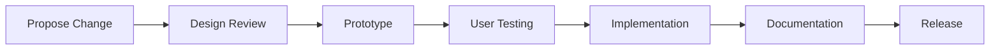

# AuraConnect Unified Design Language

> A comprehensive design system that ensures consistency, accessibility, and delightful experiences across all AuraConnect platforms.

## Table of Contents
1. [Introduction](#introduction)
2. [Design Principles](#design-principles)
3. [Foundation Systems](#foundation-systems)
4. [Component Patterns](#component-patterns)
5. [Motion & Interaction](#motion--interaction)
6. [Iconography & Imagery](#iconography--imagery)
7. [Platform Adaptations](#platform-adaptations)
8. [Implementation Strategy](#implementation-strategy)
9. [Governance Model](#governance-model)

---

## Introduction

The AuraConnect Unified Design Language is a living system of design decisions, principles, and patterns that create cohesive experiences across our Admin Dashboard, Mobile Applications, and Customer Web interfaces.

### Goals
- **Consistency**: Unified experience across all touchpoints
- **Efficiency**: Accelerate design and development workflows
- **Quality**: Maintain high standards for usability and accessibility
- **Scalability**: Support growth and new features seamlessly

### Reference Implementation
Our design system is inspired by modern enterprise patterns, particularly the [AdminMart Modernize](https://modernize-nextjs.adminmart.com/) theme, adapted for restaurant industry needs.

---

## Design Principles

### 1. Clarity
**Information hierarchy and visual simplicity**
- Progressive disclosure of complexity
- Clear visual hierarchy through typography and spacing
- Meaningful use of color and contrast
- Scannable layouts with clear entry points

### 2. Efficiency
**Optimize for speed and task completion**
- Minimize cognitive load
- Reduce clicks/taps to complete tasks
- Smart defaults and predictive assistance
- Keyboard shortcuts and gesture support

### 3. Delight
**Thoughtful micro-interactions and animations**
- Smooth, purposeful transitions
- Celebratory moments for achievements
- Personality without compromising professionalism
- Surprise and delight in appropriate contexts

### 4. Inclusivity
**Accessible and culturally adaptable**
- WCAG 2.1 AA compliance minimum
- Support for RTL languages
- Cultural color considerations
- Multiple input methods support
- Screen reader optimized

### 5. Consistency
**Predictable patterns across platforms**
- Unified mental models
- Consistent terminology
- Familiar interaction patterns
- Platform-aware adaptations

---

## Foundation Systems

### Grid System
**8px base unit with responsive breakpoints**

```scss
// Base unit
$base-unit: 8px;

// Grid spacing
$spacing-scale: (
  xxs: 4px,   // 0.5 * base
  xs:  8px,   // 1 * base
  sm:  12px,  // 1.5 * base
  md:  16px,  // 2 * base
  lg:  24px,  // 3 * base
  xl:  32px,  // 4 * base
  xxl: 48px,  // 6 * base
  xxxl: 64px  // 8 * base
);

// Breakpoints
$breakpoints: (
  mobile:  360px,
  tablet:  768px,
  desktop: 1024px,
  wide:    1440px
);

// Container widths
$containers: (
  mobile:  100%,
  tablet:  750px,
  desktop: 970px,
  wide:    1400px
);
```

### Color System
**Semantic color tokens with theme variations**

#### Primary Palette
```json
{
  "primary": {
    "50": "#ECF2FF",
    "100": "#DBEAFE",
    "200": "#BFDBFE",
    "300": "#93C5FD",
    "400": "#60A5FA",
    "500": "#5D87FF", // Main
    "600": "#4570EA",
    "700": "#1D4ED8",
    "800": "#1E40AF",
    "900": "#1E3A8A"
  }
}
```

#### Semantic Colors
- **Success**: Green scale for positive actions/states
- **Warning**: Amber scale for caution states
- **Error**: Red scale for errors (AA compliant)
- **Info**: Blue scale for informational content

#### Accessibility Requirements
- Text on white: minimum 4.5:1 contrast (AA)
- Interactive elements: minimum 3:1 contrast
- Focus indicators: 3px solid outline

### Typography
**Type scale with Plus Jakarta Sans**

```scss
// Font families
$font-primary: 'Plus Jakarta Sans', -apple-system, sans-serif;
$font-mono: 'SF Mono', 'Monaco', monospace;

// Type scale
$type-scale: (
  xs:   (size: 12px, height: 16px, weight: 400),
  sm:   (size: 14px, height: 20px, weight: 400),
  base: (size: 16px, height: 24px, weight: 400),
  lg:   (size: 18px, height: 26px, weight: 500),
  xl:   (size: 20px, height: 28px, weight: 500),
  2xl:  (size: 24px, height: 32px, weight: 600),
  3xl:  (size: 30px, height: 38px, weight: 600),
  4xl:  (size: 36px, height: 44px, weight: 700),
  5xl:  (size: 48px, height: 56px, weight: 700)
);
```

### Elevation System
**Shadow scale for depth hierarchy**

```scss
$shadows: (
  none: none,
  xs:   0 1px 2px rgba(42, 53, 71, 0.05),
  sm:   0 2px 4px rgba(42, 53, 71, 0.08),
  md:   0 4px 8px rgba(42, 53, 71, 0.10),
  lg:   0 8px 16px rgba(42, 53, 71, 0.12),
  xl:   0 12px 24px rgba(42, 53, 71, 0.15),
  xxl:  0 20px 40px rgba(42, 53, 71, 0.20)
);
```

---

## Component Patterns

### Navigation Patterns

#### Admin Dashboard
- **Primary**: Left sidebar with collapsible menu
- **Secondary**: Top header with user menu
- **Tertiary**: Breadcrumbs for deep navigation

#### Mobile Apps
- **Primary**: Bottom tab navigation (5 items max)
- **Secondary**: Stack navigation within tabs
- **Tertiary**: Drawer for settings/profile

#### Customer Web
- **Primary**: Top navigation bar
- **Secondary**: Category filters
- **Tertiary**: Footer navigation

### Form Patterns

#### Input States
1. **Default**: Neutral border, clear label
2. **Focus**: Primary color border, elevated shadow
3. **Error**: Error color border, helper text below
4. **Success**: Success color border, checkmark icon
5. **Disabled**: Reduced opacity, no interaction

#### Validation
- Real-time validation where appropriate
- Clear error messages with recovery hints
- Success feedback for complex validations
- Inline validation for critical fields

### Feedback Patterns

#### Loading States
```typescript
interface LoadingStates {
  skeleton: "Layout structure visible";
  spinner: "Centered loading indicator";
  progress: "Linear or circular progress";
  shimmer: "Animated placeholder effect";
}
```

#### Empty States
- Friendly illustration or icon
- Clear explanation of state
- Action button when applicable
- Alternative suggestions

#### Error States
- Clear error message
- Recovery action
- Contact support option
- Error code for debugging

### Action Patterns

#### Button Hierarchy
1. **Primary**: Main actions (filled, high contrast)
2. **Secondary**: Alternative actions (outlined)
3. **Tertiary**: Less important (text only)
4. **Danger**: Destructive actions (red variants)
5. **Ghost**: Subtle actions (transparent)

#### Button Sizes
- **Small**: 32px height, compact scenarios
- **Medium**: 44px height, default size
- **Large**: 56px height, primary CTAs

### Content Patterns

#### Cards
- **Elevated**: Primary content containers
- **Outlined**: Secondary containers
- **Filled**: Grouped content areas
- **Interactive**: Clickable/tappable cards

#### Lists
- **Simple**: Text-only items
- **Rich**: Avatar, title, subtitle, metadata
- **Interactive**: Swipe actions (mobile)
- **Virtualized**: Performance for long lists

#### Tables
- **Responsive**: Horizontal scroll on mobile
- **Sortable**: Column sort indicators
- **Filterable**: Inline or modal filters
- **Selectable**: Checkbox selection pattern

---

## Motion & Interaction

### Animation Principles

1. **Purpose**: Every animation has meaning
2. **Performance**: 60fps minimum
3. **Personality**: Reflects brand character
4. **Predictability**: Consistent timing/easing

### Timing Functions

```javascript
const animations = {
  duration: {
    instant: 0,
    fast: 200,
    normal: 300,
    slow: 500,
    verySlow: 1000
  },
  easing: {
    linear: [0, 0, 1, 1],
    easeIn: [0.42, 0, 1, 1],
    easeOut: [0, 0, 0.58, 1],
    easeInOut: [0.42, 0, 0.58, 1],
    spring: [0.25, 0.46, 0.45, 0.94]
  }
};
```

### Transition Patterns

#### Page Transitions
- **Web**: Fade with subtle scale
- **Mobile**: Platform-native slide
- **Modals**: Slide up with backdrop fade

#### Micro-interactions
- **Hover**: Subtle elevation change
- **Press**: Scale down slightly (0.98)
- **Success**: Brief celebration animation
- **Error**: Subtle shake animation

### Gesture Library (Mobile)

```typescript
interface GesturePatterns {
  swipe: {
    left: "Reveal actions or delete";
    right: "Navigate back or reveal menu";
    down: "Refresh content";
    up: "Load more or dismiss";
  };
  pinch: "Zoom content";
  longPress: "Context menu";
  doubleTap: "Quick action";
}
```

### Haptic Feedback Guidelines

- **Light**: Selection changes
- **Medium**: Action confirmations
- **Heavy**: Errors or important alerts
- **Success**: Completion celebrations

---

## Iconography & Imagery

### Icon System

#### Grid & Construction
- **Base grid**: 24x24px
- **Stroke width**: 2px consistent
- **Corner radius**: 2px for rounded style
- **Safe area**: 2px padding

#### Icon Categories
1. **Navigation**: Arrows, menu, close
2. **Actions**: Add, edit, delete, share
3. **Status**: Success, warning, error, info
4. **Objects**: Orders, menu, inventory
5. **Social**: User, team, notifications

#### Usage Guidelines
- Always pair with text for clarity
- Maintain consistent size within context
- Use filled variants for selected states
- Ensure sufficient contrast

### Photography Style

#### Content Types
1. **Food**: High quality, appetizing, natural lighting
2. **Restaurant**: Warm, inviting atmospheres
3. **People**: Diverse, authentic, engaging
4. **Abstract**: Patterns, textures for backgrounds

#### Treatment
- **Aspect ratios**: 16:9, 4:3, 1:1, 9:16
- **Color overlay**: 20% brand color for consistency
- **Blur**: Background images at 80% clarity
- **Compression**: WebP with fallback to JPEG

### Illustration Principles

#### Style
- **Geometric**: Simple, modern shapes
- **Color**: Limited palette from brand colors
- **Stroke**: Consistent 2-4px weight
- **Perspective**: Isometric or flat

#### Use Cases
- Empty states
- Onboarding flows
- Feature highlights
- Error pages

---

## Platform Adaptations

### Web (Admin Dashboard)

```scss
// Desktop-first optimizations
.admin-container {
  max-width: 1400px;
  margin: 0 auto;
  padding: 24px;
  
  @media (max-width: 768px) {
    padding: 16px;
  }
}

// Dense information layouts
.data-table {
  font-size: 14px;
  line-height: 1.5;
  
  td {
    padding: 8px 12px;
  }
}
```

### Mobile (iOS/Android)

```javascript
// Platform-specific adaptations
const platformStyles = {
  ios: {
    fontFamily: 'System',
    shadowStyle: iosShadow,
    headerHeight: 44,
    tabBarHeight: 49
  },
  android: {
    fontFamily: 'Roboto',
    shadowStyle: elevation,
    headerHeight: 56,
    tabBarHeight: 56
  }
};
```

### Customer Web (Responsive)

```scss
// Mobile-first responsive
.customer-layout {
  display: grid;
  gap: 16px;
  
  @media (min-width: 768px) {
    grid-template-columns: repeat(2, 1fr);
    gap: 24px;
  }
  
  @media (min-width: 1024px) {
    grid-template-columns: repeat(3, 1fr);
    gap: 32px;
  }
}
```

---

## Implementation Strategy

### Design Token Architecture

```yaml
# tokens.yml
tokens:
  color:
    $type: color
    primary:
      value: '#5D87FF'
      description: 'Primary brand color'
    
  spacing:
    $type: dimension
    small:
      value: '8px'
      description: 'Small spacing unit'
    
  typography:
    $type: typography
    heading-1:
      value:
        fontFamily: 'Plus Jakarta Sans'
        fontSize: '48px'
        lineHeight: '56px'
        fontWeight: 700
```

### Token Distribution

```javascript
// Web: CSS Custom Properties
:root {
  --color-primary: #5D87FF;
  --spacing-small: 8px;
}

// React Native: JavaScript Objects
export const tokens = {
  color: {
    primary: '#5D87FF'
  },
  spacing: {
    small: 8
  }
};

// Figma: Figma Tokens Plugin
{
  "color": {
    "primary": {
      "$value": "#5D87FF"
    }
  }
}
```

### Migration Path

1. **Phase 1**: Audit existing implementations
2. **Phase 2**: Create token mapping
3. **Phase 3**: Update core components
4. **Phase 4**: Migrate feature areas
5. **Phase 5**: Deprecate old patterns

---

## Governance Model

### Contribution Process



### Decision Framework

#### Minor Updates
- Color adjustments within contrast requirements
- Spacing tweaks within scale
- Copy changes
- **Approval**: Design lead

#### Major Changes
- New components
- Pattern modifications
- Breaking changes
- **Approval**: Design committee

### Version Control

```json
{
  "version": "1.0.0",
  "releases": {
    "1.0.0": {
      "date": "2025-08-19",
      "changes": [
        "Initial design system release",
        "Core component library",
        "Token architecture"
      ]
    }
  }
}
```

### Quality Assurance

#### Automated Checks
- Contrast ratio validation
- Token consistency
- Component prop types
- Accessibility audit

#### Manual Review
- Visual regression testing
- Cross-platform verification
- User testing sessions
- Performance benchmarks

### Training & Adoption

#### Resources
1. **Documentation site**: Comprehensive guides
2. **Figma library**: Shared components
3. **Code sandbox**: Live examples
4. **Slack channel**: #design-system
5. **Office hours**: Weekly Q&A

#### Onboarding
- New team member orientation
- Design system workshop
- Component library training
- Best practices session

---

## Appendix

### Tools & Resources

- **Design**: Figma, Figma Tokens
- **Development**: Storybook, Style Dictionary
- **Testing**: Chromatic, Percy
- **Documentation**: Docusaurus
- **Collaboration**: Slack, Linear

### References

- [Material Design 3](https://m3.material.io/)
- [Apple Human Interface Guidelines](https://developer.apple.com/design/)
- [IBM Carbon Design System](https://carbondesignsystem.com/)
- [Ant Design](https://ant.design/)
- [AdminMart Modernize](https://modernize-nextjs.adminmart.com/)

### Contact

- **Design System Team**: design-system@auraconnect.ai
- **Slack**: #design-system
- **Linear Board**: [Design System](https://linear.app/auraconnect/team/DS)

---

*Last Updated: August 19, 2025*
*Version: 1.0.0*