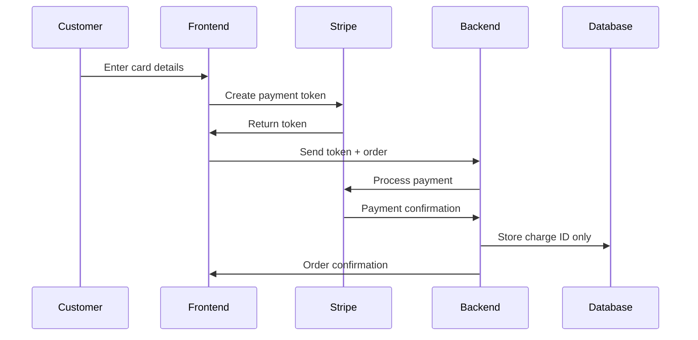

# Security Documentation - AuraConnect

**Version: 1.0.0** | Last Updated: January 2025

## Table of Contents

1. [Security Overview](#security-overview)
2. [Authentication & Authorization](#authentication--authorization)
3. [Data Encryption](#data-encryption)
4. [API Security](#api-security)
5. [Payment Security (PCI Compliance)](#payment-security-pci-compliance)
6. [OWASP Top 10 Mitigation](#owasp-top-10-mitigation)
7. [Security Best Practices](#security-best-practices)
8. [Incident Response](#incident-response)
9. [Security Checklist](#security-checklist)
10. [Vulnerability Reporting](#vulnerability-reporting)

## Security Overview

AuraConnect implements multiple layers of security to protect sensitive restaurant data, customer information, and financial transactions. This document outlines our security architecture and best practices.

### Key Security Features

- **JWT-based authentication** with refresh token rotation
- **Role-Based Access Control (RBAC)** with granular permissions
- **End-to-end encryption** for sensitive data
- **PCI DSS compliance** for payment processing
- **OWASP security measures** implementation
- **Rate limiting** and DDoS protection
- **Comprehensive audit logging**

## Authentication & Authorization

### JWT Implementation

```python
# JWT Configuration
JWT_ALGORITHM = "HS256"
JWT_ACCESS_TOKEN_EXPIRE_MINUTES = 30
JWT_REFRESH_TOKEN_EXPIRE_DAYS = 7

# Token Structure
{
  "sub": "user_id",
  "email": "user@example.com",
  "roles": ["manager", "staff"],
  "tenant_id": 1,
  "exp": 1234567890,
  "iat": 1234567890,
  "jti": "unique_token_id"
}
```

### Refresh Token Rotation

1. **Single-use refresh tokens**: Each refresh token can only be used once
2. **Token family tracking**: Detects and invalidates compromised token families
3. **Automatic revocation**: Suspicious activity triggers token revocation

### RBAC Implementation

```python
# Permission Structure
permissions = {
    "orders.view": "View orders",
    "orders.create": "Create orders",
    "orders.update": "Update orders",
    "orders.delete": "Delete orders",
    "staff.manage": "Manage staff members",
    "payroll.process": "Process payroll",
    "reports.financial": "View financial reports"
}

# Role Hierarchy
roles = {
    "super_admin": ["*"],  # All permissions
    "restaurant_owner": ["orders.*", "staff.*", "menu.*", "reports.*"],
    "manager": ["orders.*", "staff.view", "menu.*", "reports.basic"],
    "staff": ["orders.create", "orders.view", "menu.view"]
}
```

### Multi-Factor Authentication (MFA)

- **TOTP support**: Time-based One-Time Passwords
- **SMS verification**: For critical operations
- **Email verification**: For account changes
- **Backup codes**: For account recovery

## Data Encryption

### Encryption at Rest

```python
# Database Encryption
- PostgreSQL: Transparent Data Encryption (TDE)
- Column-level encryption for PII
- Encrypted backups with AES-256

# File Storage
- AWS S3: Server-Side Encryption (SSE-S3)
- Local files: AES-256-GCM encryption
```

### Encryption in Transit

```bash
# TLS Configuration
- Minimum TLS 1.2
- Strong cipher suites only
- HSTS enabled
- Certificate pinning for mobile apps
```

### Sensitive Data Handling

```python
# PII Fields Encrypted
- customer.ssn
- staff.bank_account
- payment.card_number
- user.password (Argon2id hashing)

# Encryption Library
from cryptography.fernet import Fernet

class EncryptionService:
    def encrypt_field(self, data: str) -> str:
        return self.cipher.encrypt(data.encode())
    
    def decrypt_field(self, encrypted: str) -> str:
        return self.cipher.decrypt(encrypted).decode()
```

## API Security

### Rate Limiting

```python
# Rate Limit Configuration
RATE_LIMITS = {
    "default": "100/minute",
    "auth": "5/minute",
    "payment": "20/minute",
    "report": "10/hour"
}

# Implementation
from fastapi_limiter import FastAPILimiter

@app.get("/api/orders")
@limiter.limit("100/minute")
async def get_orders():
    pass
```

### Input Validation

```python
# Pydantic Models for Validation
class OrderCreate(BaseModel):
    items: List[OrderItem]
    customer_id: conint(gt=0)
    payment_method: Literal["cash", "card", "digital"]
    
    @validator('items')
    def validate_items(cls, v):
        if not v:
            raise ValueError('Order must have at least one item')
        return v
```

### SQL Injection Prevention

```python
# Using SQLAlchemy ORM (Safe)
orders = db.query(Order).filter(
    Order.restaurant_id == restaurant_id,
    Order.status == status
).all()

# Parameterized Queries (Safe)
query = text("""
    SELECT * FROM orders 
    WHERE restaurant_id = :restaurant_id 
    AND status = :status
""")
result = db.execute(query, {
    "restaurant_id": restaurant_id,
    "status": status
})
```

### XSS Prevention

```javascript
// React automatically escapes content
const OrderItem = ({ description }) => (
    <div>{description}</div>  // Safe
);

// For HTML content, use DOMPurify
import DOMPurify from 'dompurify';

const SafeHTML = ({ html }) => (
    <div dangerouslySetInnerHTML={{
        __html: DOMPurify.sanitize(html)
    }} />
);
```

## Payment Security (PCI Compliance)

### PCI DSS Requirements

1. **Never store sensitive cardholder data**
   - No credit card numbers in database
   - No CVV storage
   - Use tokenization (Stripe, Square)

2. **Secure payment integration**
```javascript
// Frontend - Use Stripe Elements
const stripe = Stripe(STRIPE_PUBLISHABLE_KEY);
const elements = stripe.elements();

// Never send card details to your server
const { token } = await stripe.createToken(card);
// Send only the token to backend
```

3. **Backend payment processing**
```python
# Process payment with token only
import stripe

def process_payment(token: str, amount: int):
    charge = stripe.Charge.create(
        amount=amount,
        currency="usd",
        source=token,
        description="Order payment"
    )
    # Store only charge ID, not card details
    return charge.id
```

### Secure Payment Workflow



## OWASP Top 10 Mitigation

### 1. Injection
- **Mitigation**: ORM usage, parameterized queries, input validation
- **Implementation**: SQLAlchemy ORM, Pydantic validation

### 2. Broken Authentication
- **Mitigation**: Strong password policy, MFA, session management
- **Implementation**: Argon2 hashing, JWT with expiry, refresh token rotation

### 3. Sensitive Data Exposure
- **Mitigation**: Encryption at rest/transit, data minimization
- **Implementation**: TLS 1.2+, AES-256 encryption, PII masking

### 4. XML External Entities (XXE)
- **Mitigation**: Disable XML parsing, use JSON
- **Implementation**: JSON-only APIs, no XML processing

### 5. Broken Access Control
- **Mitigation**: RBAC, resource ownership checks
- **Implementation**: Permission decorators, tenant isolation

### 6. Security Misconfiguration
- **Mitigation**: Secure defaults, automated security scanning
- **Implementation**: Environment-specific configs, security headers

### 7. Cross-Site Scripting (XSS)
- **Mitigation**: Content Security Policy, output encoding
- **Implementation**: React auto-escaping, DOMPurify for HTML

### 8. Insecure Deserialization
- **Mitigation**: JSON Schema validation, type checking
- **Implementation**: Pydantic models, strict typing

### 9. Using Components with Known Vulnerabilities
- **Mitigation**: Dependency scanning, regular updates
- **Implementation**: Dependabot, npm audit, pip-audit

### 10. Insufficient Logging & Monitoring
- **Mitigation**: Comprehensive audit logs, alerting
- **Implementation**: Structured logging, Sentry integration

## Security Best Practices

### Development Practices

1. **Code Reviews**
   - Security-focused review checklist
   - Automated security scanning
   - Peer review for sensitive changes

2. **Secure Coding Standards**
```python
# Use secrets management
from core.config import settings

# Bad
API_KEY = "hardcoded_key"

# Good
API_KEY = settings.EXTERNAL_API_KEY

# Use environment variables
DATABASE_URL = os.getenv("DATABASE_URL")
```

3. **Dependency Management**
```bash
# Regular vulnerability scanning
npm audit
pip-audit

# Automated updates
dependabot.yml configuration
```

### Infrastructure Security

1. **Network Security**
   - VPC with private subnets
   - Security groups with minimal access
   - WAF for DDoS protection

2. **Container Security**
```dockerfile
# Use specific versions
FROM python:3.11-slim

# Run as non-root
RUN useradd -m appuser
USER appuser

# Minimal attack surface
RUN apt-get update && apt-get install -y \
    --no-install-recommends \
    build-essential \
    && rm -rf /var/lib/apt/lists/*
```

3. **Secrets Management**
```yaml
# Kubernetes Secrets
apiVersion: v1
kind: Secret
metadata:
  name: api-secrets
type: Opaque
data:
  database_url: <base64_encoded>
  jwt_secret: <base64_encoded>
```

### Monitoring & Alerting

1. **Security Events to Monitor**
   - Failed login attempts
   - Permission violations
   - Unusual API usage patterns
   - Data export activities

2. **Alerting Rules**
```python
# Alert on suspicious activity
if failed_login_count > 5:
    alert("Multiple failed login attempts", user_id)

if api_calls_per_minute > 1000:
    alert("Potential DDoS attack", ip_address)
```

## Incident Response

### Response Plan

1. **Detection**
   - Automated alerts
   - Log analysis
   - User reports

2. **Containment**
   - Isolate affected systems
   - Revoke compromised credentials
   - Block malicious IPs

3. **Eradication**
   - Remove malicious code
   - Patch vulnerabilities
   - Update security rules

4. **Recovery**
   - Restore from clean backups
   - Verify system integrity
   - Monitor for recurrence

5. **Post-Incident**
   - Document lessons learned
   - Update security procedures
   - Communicate with stakeholders

### Contact Information

```yaml
Security Team:
  Email: security@auratechwave.com
  Phone: +1 (555) 123-4567
  On-Call: security-oncall@auratechwave.com

Incident Response:
  Critical: incident-critical@auratechwave.com
  High: incident-high@auratechwave.com
  Medium: incident-medium@auratechwave.com
```

## Security Checklist

### Pre-Deployment

- [ ] All dependencies updated and scanned
- [ ] Environment variables configured
- [ ] SSL/TLS certificates valid
- [ ] Security headers configured
- [ ] Rate limiting enabled
- [ ] Logging configured
- [ ] Backup strategy tested
- [ ] Incident response plan reviewed

### Regular Audits

- [ ] Weekly: Dependency vulnerability scan
- [ ] Monthly: Access control review
- [ ] Quarterly: Penetration testing
- [ ] Annually: Full security audit

### Configuration Checklist

```python
# Security Headers
SECURITY_HEADERS = {
    "X-Frame-Options": "DENY",
    "X-Content-Type-Options": "nosniff",
    "X-XSS-Protection": "1; mode=block",
    "Strict-Transport-Security": "max-age=31536000; includeSubDomains",
    "Content-Security-Policy": "default-src 'self'",
    "Referrer-Policy": "strict-origin-when-cross-origin"
}

# CORS Configuration
CORS_ORIGINS = [
    "https://app.auraconnect.com",
    "https://admin.auraconnect.com"
]

# Session Configuration
SESSION_COOKIE_SECURE = True
SESSION_COOKIE_HTTPONLY = True
SESSION_COOKIE_SAMESITE = "Strict"
```

## Vulnerability Reporting

### Responsible Disclosure

We take security seriously and appreciate responsible disclosure of vulnerabilities.

**Report Security Issues**:
- Email: security@auratechwave.com
- PGP Key: [Download Public Key](https://auraconnect.com/security/pgp-key.asc)

**Please Include**:
1. Description of the vulnerability
2. Steps to reproduce
3. Potential impact
4. Suggested fix (if any)

**Response Timeline**:
- Initial response: Within 24 hours
- Status update: Within 72 hours
- Fix timeline: Based on severity

**Bug Bounty Program**:
- Critical: $1,000 - $5,000
- High: $500 - $1,000
- Medium: $100 - $500
- Low: $50 - $100

### Security Updates

Subscribe to security updates:
- Security mailing list: security-updates@auratechwave.com
- RSS feed: https://auraconnect.com/security/feed.xml
- Twitter: @AuraConnectSec

---

*This security documentation is regularly updated. For the latest version, visit our [Security Portal](https://docs.auraconnect.com/security).*