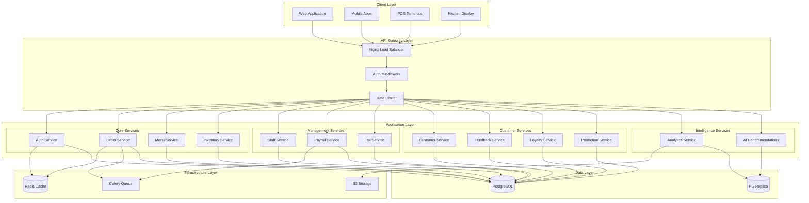
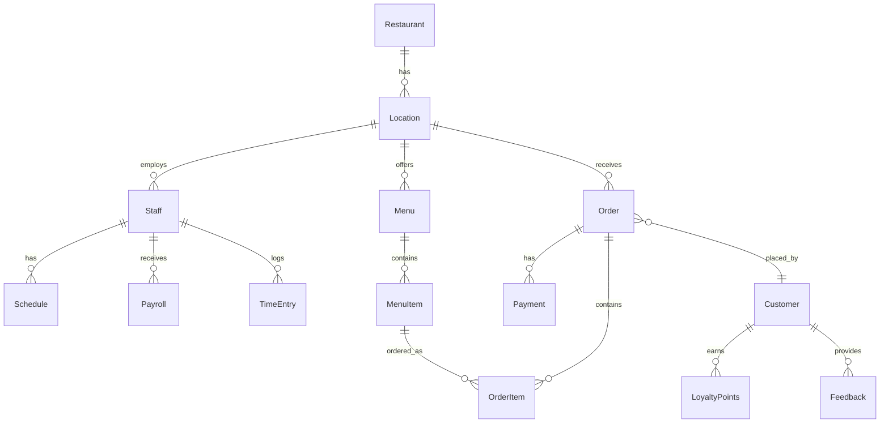
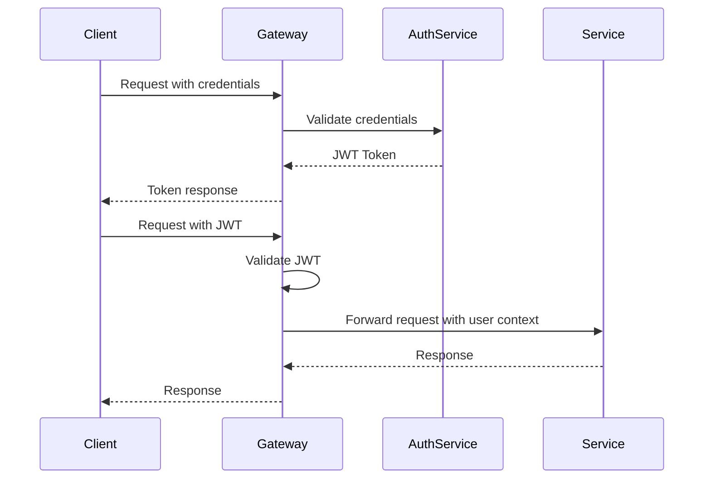
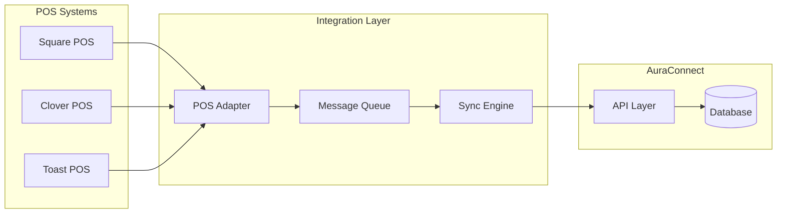

# AuraConnect Architecture Overview

## Table of Contents

1. [System Overview](#system-overview)
2. [Architecture Principles](#architecture-principles)
3. [High-Level Architecture](#high-level-architecture)
4. [Microservices Architecture](#microservices-architecture)
5. [Data Architecture](#data-architecture)
6. [Security Architecture](#security-architecture)
7. [Integration Architecture](#integration-architecture)
8. [Deployment Architecture](#deployment-architecture)
9. [Technology Stack](#technology-stack)

## System Overview

AuraConnect is built on a modern microservices architecture that ensures scalability, maintainability, and reliability. The system is designed to handle the complex requirements of restaurant management while providing flexibility for future growth.

### Key Architectural Components

- **Frontend Applications**: Multiple client applications for different user types
- **API Gateway**: Central entry point with load balancing and rate limiting
- **Microservices**: Domain-driven services handling specific business functions
- **Data Layer**: PostgreSQL with multi-tenant support and data partitioning
- **Infrastructure Services**: Redis, Celery, S3 for caching, queuing, and storage

## Architecture Principles

### 1. Domain-Driven Design (DDD)
Each microservice is organized around a specific business domain, ensuring clear boundaries and responsibilities.

### 2. API-First Design
All services expose well-documented RESTful APIs, enabling easy integration and extensibility.

### 3. Event-Driven Architecture
Services communicate through events for loose coupling and scalability.

### 4. Security by Design
Security is built into every layer, from API authentication to data encryption.

### 5. Cloud-Native
Designed for containerization and orchestration in cloud environments.

## High-Level Architecture



## Microservices Architecture

### Service Communication Patterns

#### Synchronous Communication
- **REST APIs**: Primary communication method
- **GraphQL**: Future implementation for flexible queries
- **gRPC**: For internal service-to-service communication

#### Asynchronous Communication
- **Event Bus**: Redis Pub/Sub for real-time events
- **Message Queue**: Celery for background tasks
- **Webhooks**: For external integrations

### Service Registry and Discovery

```yaml
services:
  auth-service:
    host: auth.internal
    port: 8001
    health: /health
    
  order-service:
    host: orders.internal
    port: 8002
    health: /health
    
  payroll-service:
    host: payroll.internal
    port: 8003
    health: /health
```

### API Gateway Pattern

The API Gateway (Nginx) provides:
- **Routing**: Routes requests to appropriate services
- **Authentication**: Validates JWT tokens
- **Rate Limiting**: Prevents API abuse
- **Load Balancing**: Distributes load across service instances
- **SSL Termination**: Handles HTTPS certificates

## Data Architecture

### Multi-Tenant Architecture

```sql
-- Row-level security for tenant isolation
CREATE POLICY tenant_isolation ON all_tables
    FOR ALL
    USING (tenant_id = current_setting('app.current_tenant')::int);
```

### Database Schema Design



### Data Partitioning Strategy

- **Time-based partitioning**: Orders, payments, and logs
- **List partitioning**: By location for multi-location restaurants
- **Hash partitioning**: Customer data for even distribution

## Security Architecture

### Authentication & Authorization



### Security Layers

1. **Network Security**
   - SSL/TLS encryption
   - VPC isolation
   - Security groups

2. **Application Security**
   - JWT authentication
   - Role-based access control (RBAC)
   - Input validation
   - SQL injection prevention

3. **Data Security**
   - Encryption at rest
   - Encryption in transit
   - PII data masking
   - Audit logging

## Integration Architecture

### POS Integration



### External Service Integration

- **Payment Processing**: Stripe, PayPal, Square
- **SMS/Email**: Twilio, SendGrid
- **Analytics**: Google Analytics, Mixpanel
- **Accounting**: QuickBooks, Xero

## Deployment Architecture

### Container Architecture

```yaml
version: '3.8'

services:
  nginx:
    image: nginx:alpine
    ports:
      - "80:80"
      - "443:443"
    depends_on:
      - auth-service
      - order-service
      
  auth-service:
    build: ./services/auth
    environment:
      - DATABASE_URL=${DATABASE_URL}
      - REDIS_URL=${REDIS_URL}
    deploy:
      replicas: 2
      
  order-service:
    build: ./services/orders
    environment:
      - DATABASE_URL=${DATABASE_URL}
      - REDIS_URL=${REDIS_URL}
    deploy:
      replicas: 3
      
  postgres:
    image: postgres:14-alpine
    volumes:
      - postgres_data:/var/lib/postgresql/data
      
  redis:
    image: redis:7-alpine
    command: redis-server --appendonly yes
```

### Kubernetes Architecture

```yaml
apiVersion: apps/v1
kind: Deployment
metadata:
  name: order-service
spec:
  replicas: 3
  selector:
    matchLabels:
      app: order-service
  template:
    metadata:
      labels:
        app: order-service
    spec:
      containers:
      - name: order-service
        image: auraconnect/order-service:latest
        ports:
        - containerPort: 8000
        env:
        - name: DATABASE_URL
          valueFrom:
            secretKeyRef:
              name: db-secret
              key: url
```

### Scaling Strategy

#### Horizontal Scaling
- **Stateless Services**: Easy to scale horizontally
- **Load Balancing**: Distribute traffic across instances
- **Auto-scaling**: Based on CPU/memory metrics

#### Vertical Scaling
- **Database**: Scale up for better performance
- **Cache**: Increase Redis memory
- **Workers**: More powerful machines for background jobs

## Technology Stack

### Backend Stack

| Technology | Purpose | Version |
|------------|---------|---------|
| Python | Primary language | 3.11+ |
| FastAPI | Web framework | 0.104+ |
| PostgreSQL | Primary database | 14+ |
| Redis | Cache & message broker | 7+ |
| Celery | Task queue | 5.3+ |
| SQLAlchemy | ORM | 2.0+ |
| Alembic | Database migrations | 1.12+ |
| Pydantic | Data validation | 2.4+ |

### Frontend Stack

| Technology | Purpose | Version |
|------------|---------|---------|
| React | UI framework | 18+ |
| TypeScript | Type safety | 5+ |
| Redux Toolkit | State management | 1.9+ |
| Material-UI | Component library | 5+ |
| Axios | HTTP client | 1.5+ |
| React Query | Data fetching | 4+ |

### Infrastructure Stack

| Technology | Purpose |
|------------|---------|
| Docker | Containerization |
| Kubernetes | Container orchestration |
| Nginx | API gateway & load balancer |
| Prometheus | Monitoring |
| Grafana | Metrics visualization |
| ELK Stack | Logging |
| GitHub Actions | CI/CD |

## Architecture Decision Records (ADRs)

### ADR-001: Microservices Architecture
**Decision**: Use microservices instead of monolithic architecture
**Rationale**: Better scalability, independent deployments, technology flexibility

### ADR-002: PostgreSQL as Primary Database
**Decision**: Use PostgreSQL for all services
**Rationale**: ACID compliance, JSON support, excellent performance, proven reliability

### ADR-003: JWT for Authentication
**Decision**: Use JWT tokens with refresh token pattern
**Rationale**: Stateless, scalable, industry standard

### ADR-004: Redis for Caching
**Decision**: Use Redis for caching and pub/sub
**Rationale**: High performance, versatility, wide adoption

## Performance Considerations

### Caching Strategy
- **API Response Caching**: Redis with TTL
- **Database Query Caching**: Query result caching
- **Static Asset Caching**: CDN for frontend assets

### Database Optimization
- **Indexes**: Strategic indexing for common queries
- **Connection Pooling**: Optimal connection management
- **Query Optimization**: EXPLAIN ANALYZE for slow queries

### API Performance
- **Pagination**: Limit response sizes
- **Field Selection**: GraphQL-style field selection
- **Compression**: Gzip response compression

## Monitoring and Observability

### Metrics Collection
```yaml
metrics:
  - name: api_request_duration
    type: histogram
    labels: [method, endpoint, status]
    
  - name: database_query_duration
    type: histogram
    labels: [query_type, table]
    
  - name: cache_hit_rate
    type: gauge
    labels: [cache_type]
```

### Logging Strategy
- **Structured Logging**: JSON format for easy parsing
- **Correlation IDs**: Track requests across services
- **Log Levels**: DEBUG, INFO, WARNING, ERROR, CRITICAL

### Health Checks
```python
@app.get("/health")
async def health_check():
    return {
        "status": "healthy",
        "database": check_database(),
        "redis": check_redis(),
        "version": __version__
    }
```

## Future Architecture Enhancements

### Short-term (6 months)
- GraphQL API implementation
- Service mesh (Istio) for better service communication
- Enhanced monitoring with distributed tracing

### Long-term (1-2 years)
- Event sourcing for critical operations
- CQRS pattern for read/write separation
- Machine learning pipeline for advanced analytics

## Related Documentation

- [Deployment Guide](../deployment/README.md)
- [Security Guide](../guides/security.md)
- [API Design Guide](../api/design-guide.md)
- [Module Architecture](../modules/README.md)