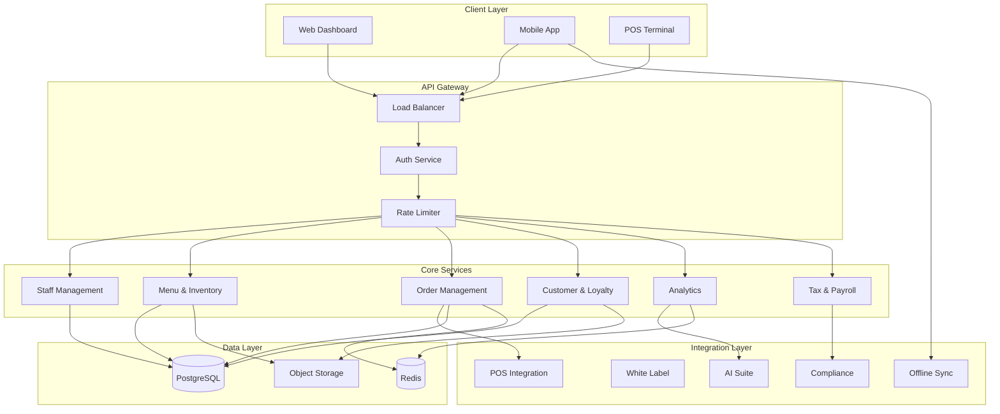

# AuraConnect – Global Architecture Overview

## 🌐 Purpose
This document presents a high-level view of AuraConnect’s complete architecture. It ties together all core and optional modules in a cohesive ecosystem that supports multi-tenant restaurant operations with agentic AI, mobile support, and regulatory compliance.

---

## 📊 Global System Diagram

---

## 🧩 Key Platform Layers

### 1. **Client Interfaces**
- Web Dashboard (React)
- Mobile App (React Native with Offline Sync)
- POS Terminal UI (for integrated POS)

### 2. **Core Application Layer**
| Module                | Description |
|----------------------|-------------|
| Staff Management     | Roles, shifts, access control |
| Menu & Inventory     | Menu CRUD, inventory tracking, modifiers |
| Order Management     | Front-of-house + back-of-house coordination |
| Customer & Loyalty   | CRM, loyalty points, feedback engine |
| Analytics & Reporting| KPIs, dashboards, smart insights |
| Taxing & Payroll     | Compliance, payslips, tax filing |

### 3. **Optional Integration Layer**
| Module                     | Functionality |
|---------------------------|---------------|
| POS Integration           | Vendor APIs for order, payment sync |
| White-Labeling Support    | Custom domain + themes per tenant |
| Offline Sync for Mobile   | Local DB & queuing with auto-sync |
| AI Customization Suite    | Recommendations, smart replies, insights |
| Regulatory & Compliance   | GDPR, audit logs, labor/tax compliance |

### 4. **Shared Services**
- **AuthService**: JWT, RBAC
- **NotificationService**: Email/SMS/push
- **Scheduler**: CRON/real-time event triggers
- **FileService**: Images, documents, receipts
- **AuditLogger**: Immutable tracking across modules

---

## 🗃️ Data Layer
- PostgreSQL (Supabase or hosted)
- Redis (optional for queue/cache)
- Local mobile SQLite for offline
- Object Storage (S3/Supabase for assets)

---

## 🔄 DevOps & Deployment
- Hosted via Docker or Railway/Render
- Netlify for wiki/docs site
- GitHub Actions for CI/CD
- Versioned APIs with OpenAPI + Postman workspace

---

## 🤖 AI Layer
- OpenAI / Gemini integrations via `AICore`
- Prompt-based workflows stored per tenant
- Custom-trained embeddings (future optional)

---

## ✅ Summary
AuraConnect’s architecture is modular, multi-tenant, and developer-ready. It scales from single-location setups to franchise networks and supports both real-time and offline-first operations.

Refer to each module’s dedicated documentation in the wiki for detailed implementation.

