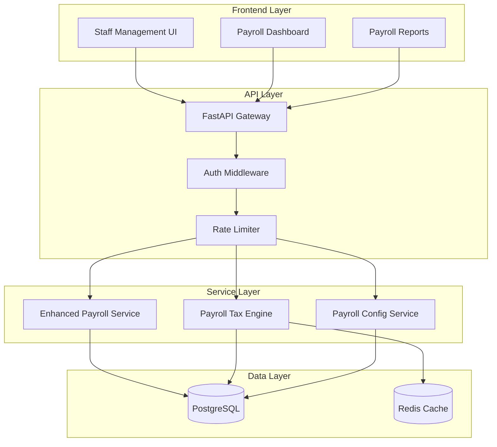
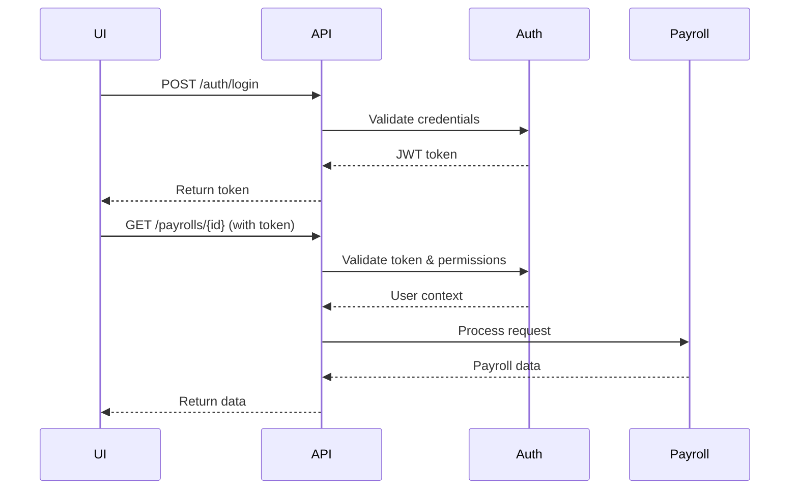
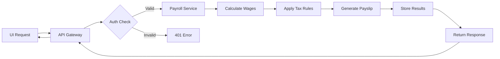

# Payroll Integration Architecture

## Overview

This document describes the integration architecture between the payroll/tax modules and the AuraConnect AI platform. The payroll system provides comprehensive wage calculation, tax processing, and compliance management capabilities integrated seamlessly with the staff management UI.

## System Architecture

### Core Components



## Integration Points

### 1. Staff Management UI Integration

The payroll system integrates with the existing staff management UI through:

- **Payroll Dashboard Component**: Embedded within the staff profile view
- **Batch Processing Interface**: Accessible from the staff listing page
- **Real-time Status Updates**: WebSocket integration for processing status

#### UI Components

```typescript
// Example integration in Staff Profile
interface StaffPayrollProps {
  staffId: number;
  tenantId?: number;
}

const StaffPayrollSection: React.FC<StaffPayrollProps> = ({ staffId, tenantId }) => {
  // Payroll history display
  // Quick actions (run payroll, view payslips)
  // Tax information summary
};
```

### 2. API Integration

The payroll module exposes RESTful endpoints integrated with the main API gateway:

#### Key Endpoints

- `POST /api/v1/payrolls/run` - Execute payroll processing
- `GET /api/v1/payrolls/{staff_id}` - Retrieve payroll history
- `GET /api/v1/payrolls/{staff_id}/detail` - Get detailed breakdown
- `GET /api/v1/payrolls/rules` - Tax rules and policies
- `POST /api/v1/payrolls/export` - Export payroll data

#### Authentication Flow



### 3. Database Integration

The payroll module extends the existing database schema with:

#### Core Tables

- `payrolls` - Main payroll records
- `payroll_items` - Line items (wages, deductions, taxes)
- `tax_rules` - Tax configuration by jurisdiction
- `payroll_config` - Company-specific settings
- `employee_payments` - Payment processing records

#### Relationships

```sql
-- Example relationship structure
Staff (1) --> (n) Payroll
Payroll (1) --> (n) PayrollItem
TaxRule (n) <--> (n) Payroll
EmployeePayment (1) --> (1) Payroll
```

## Data Flow

### Payroll Processing Flow



### Tax Calculation Flow

1. **Input Collection**: Gather employee data, hours, rates
2. **Gross Calculation**: Base pay + overtime + bonuses
3. **Tax Determination**: Apply federal, state, local rules
4. **Deduction Processing**: Pre-tax and post-tax deductions
5. **Net Calculation**: Final take-home amount
6. **Compliance Check**: Validate against regulations

## Security Considerations

### Authentication & Authorization

- JWT-based authentication with role-based access control
- Tenant isolation for multi-tenant deployments
- Audit logging for all payroll operations

### Data Protection

- Encryption at rest for sensitive payroll data
- TLS 1.3 for data in transit
- PII masking in logs and exports
- Regular security audits

## Performance Optimization

### Caching Strategy

```python
# Redis caching for tax rules
@cache_result(ttl=3600)
def get_tax_rules(jurisdiction: str, date: datetime) -> List[TaxRule]:
    # Cached tax rule retrieval
    pass
```

### Batch Processing

- Asynchronous processing for large payroll runs
- Job queue management with Celery/Redis
- Progress tracking and resumable operations

## Monitoring & Observability

### Key Metrics

- Payroll processing time
- Tax calculation accuracy
- API response times
- Error rates by operation

### Logging

```python
# Structured logging example
logger.info("payroll.processed", extra={
    "staff_id": staff_id,
    "pay_period": pay_period,
    "gross_pay": gross_pay,
    "net_pay": net_pay,
    "processing_time": elapsed_time
})
```

## Error Handling

### Common Error Scenarios

1. **Missing Configuration**: Clear error messages for missing tax rules
2. **Calculation Errors**: Detailed breakdown of calculation failures
3. **Integration Failures**: Graceful degradation and retry logic
4. **Validation Errors**: Comprehensive input validation

### Error Response Format

```json
{
  "error": {
    "code": "PAYROLL_CALCULATION_ERROR",
    "message": "Failed to calculate payroll for staff member",
    "details": {
      "staff_id": 123,
      "reason": "Missing tax configuration for state: CA",
      "suggestion": "Please configure California tax rules"
    }
  }
}
```

## Testing Strategy

### Unit Tests

- Service layer logic validation
- Tax calculation accuracy
- Edge case handling

### Integration Tests

- API endpoint testing
- Database transaction integrity
- UI component integration

### End-to-End Tests

- Complete payroll workflow
- Multi-tenant scenarios
- Performance benchmarks

## Deployment Considerations

### Environment Configuration

```yaml
# Example environment variables
PAYROLL_SERVICE_URL: "http://payroll-service:8000"
TAX_SERVICE_ENABLED: "true"
PAYROLL_BATCH_SIZE: "100"
PAYROLL_CACHE_TTL: "3600"
```

### Migration Strategy

1. Deploy database migrations
2. Update API gateway configuration
3. Deploy payroll service instances
4. Enable UI features progressively
5. Monitor and validate

## Future Enhancements

1. **Real-time Processing**: WebSocket updates for live status
2. **Advanced Analytics**: Payroll trends and forecasting
3. **Mobile Integration**: Native mobile app support
4. **Third-party Integrations**: QuickBooks, ADP, etc.
5. **AI-powered Insights**: Anomaly detection and optimization

## References

- [Enhanced Payroll Service Documentation](../../../backend/modules/staff/services/enhanced_payroll_service.py)
- [Tax Engine Architecture](./payroll_tax_architecture.md)
- [API Phase 4 Documentation](../../../backend/API_PHASE4_DOCUMENTATION.md)
- [Production Deployment Guide](../../../backend/PRODUCTION_DEPLOYMENT_GUIDE.md)