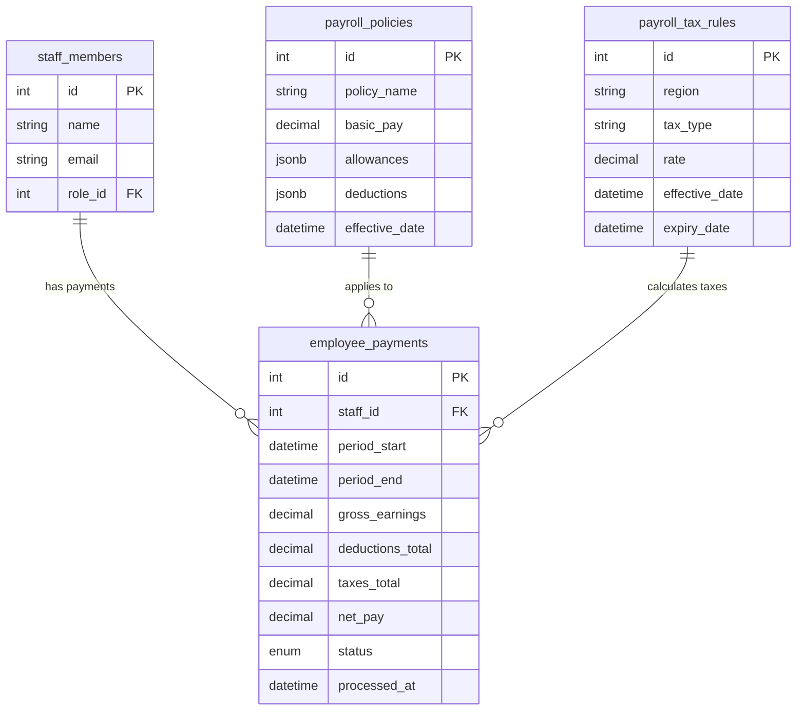

# AuraConnect – Taxing & Payroll System

## 1. 💼 Overview & Goals

This module automates tax calculations and staff payroll based on configured rules, logged work hours, role-based rates, and region-specific compliance. It integrates with government APIs, accounting tools, and banks/payroll providers.

**Goals:**

- Automate tax calculation on orders and salaries
- Track logged hours and overtime
- Generate payslips and tax forms
- Support multi-location tax zones and laws

---

## 2. 📋 Core Features

- Tax rule configuration by location and category
- Real-time tax applied at checkout (order-level)
- Hour tracking and pay-grade management
- Payroll calculation engine with tax deduction
- Payslip generation and report export (PDF)
- Integration hooks for government API filing

---

## 3. 🧱 Architecture Overview

**Core Services:**

- `TaxEngine` – Order tax rules, region-based logic
- `PayrollEngine` – Calculates net pay, bonuses, taxes
- `TimeTracker` – Work hours, shifts, overtime
- `PayslipService` – Generates PDF payslips and records
- `ComplianceGateway` – Hooks to tax/GST/EPF APIs

```
[OrderService / StaffService] ─▶ [TaxEngine / TimeTracker]
                 │                          │
                 ▼                          ▼
          [PayrollEngine]         [ComplianceGateway]
                 │                          │
                 ▼                          ▼
         [PayslipService]              [Export/Reports]
```

---

## 4. 🔄 Workflow Flowcharts

### Payroll Cycle Flow:

1. Staff logs work hours (TimeTracker)
2. PayrollEngine pulls hours + pay-grade + tax rules
3. Net salary calculated with deductions
4. PayslipService generates slip + report
5. Optionally sends to bank/payroll API

### Tax Calculation Flow:

1. Customer places order
2. Location-based rules fetched
3. TaxEngine applies percentages to subtotal
4. Totals sent back to OrderService

---

## 5. 📡 API Endpoints

### Tax

- `GET /tax/rules/:location`
- `POST /tax/apply` – returns computed tax on input

### Payroll

- `GET /payroll/:staffId`
- `POST /payroll/run` – generate payroll for period
- `GET /payroll/history/:staffId`

### Time Tracking

- `POST /timelog/start`
- `POST /timelog/stop`
- `GET /timelog/:staffId`

---

## 6. 🗃️ Database Schema

### Table: `tax_rules`

\| id | location | category | rate\_percent |

### Table: `time_logs`

\| id | staff\_id | shift\_id | start\_time | end\_time |

### Table: `payroll`

\| id | staff\_id | gross | deductions | net | period |

### Table: `payslips`

\| id | payroll\_id | pdf\_url | issued\_at |

---

## 6.1. New Dedicated Payroll Module Schema

### Table: `payroll_tax_rules`
| Field | Type | Description |
|-------|------|-------------|
| id | Integer (PK) | Primary key |
| region | String | Tax jurisdiction/region |
| tax_type | String | "percentage" or "fixed" |
| rate | Decimal(10,4) | Tax rate value |
| effective_date | DateTime | When rule becomes active |
| expiry_date | DateTime (nullable) | When rule expires |

### Table: `payroll_policies`
| Field | Type | Description |
|-------|------|-------------|
| id | Integer (PK) | Primary key |
| policy_name | String | Policy identifier |
| basic_pay | Decimal(10,2) | Base salary amount |
| allowances | JSONB | Structured allowances data |
| deductions | JSONB | Structured deductions data |
| effective_date | DateTime | Policy effective date |

### Table: `employee_payments`
| Field | Type | Description |
|-------|------|-------------|
| id | Integer (PK) | Primary key |
| staff_id | Integer (FK) | References staff_members.id |
| period_start | DateTime | Pay period start |
| period_end | DateTime | Pay period end |
| gross_earnings | Decimal(10,2) | Total earnings before deductions |
| deductions_total | Decimal(10,2) | Total deductions |
| taxes_total | Decimal(10,2) | Total tax amount |
| net_pay | Decimal(10,2) | Final pay amount |
| status | Enum | PENDING/PROCESSED/PAID |
| processed_at | DateTime (nullable) | Processing timestamp |

### ER Diagram


---

## 7. 🛠️ Code Stub

```ts
// payroll.service.ts
app.post("/payroll/run", authenticate, authorize("admin"), async (req, res) => {
  const results = await payrollEngine.generateForPeriod(req.body);
  res.status(200).json(results);
});
```

---

## 8. 📘 Developer Notes

- Tax rules can be dynamic or geo-based (e.g. state GST, VAT)
- Make `TimeTracker` extensible for biometrics or manual logs
- Payroll reports should support month-end exports (Excel/PDF)
- Ensure data security and audit trails for compliance

---

## ✅ Summary

This module handles the financial and legal backbone of restaurant operations — ensuring accurate pay and compliant taxation. It’s tightly linked with order flow and staff activity.

➡️ Core modules complete! Next: **POS Integration (Optional module 1)**

