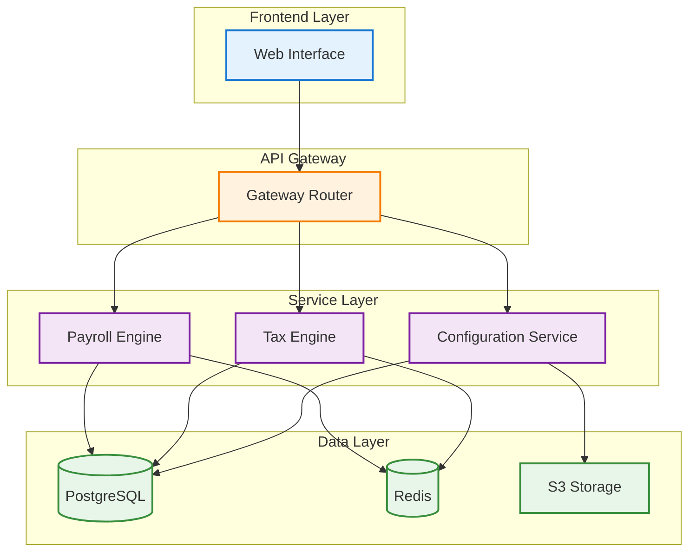
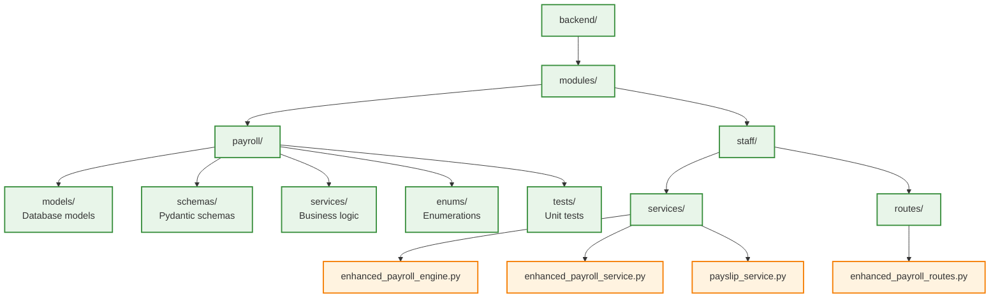

# Payroll & Tax Module Developer Guide

## Table of Contents
1. [Overview](#overview)
2. [Architecture](#architecture)
3. [Getting Started](#getting-started)
4. [Core Concepts](#core-concepts)
5. [API Reference](#api-reference)
6. [Implementation Guide](#implementation-guide)
7. [Testing](#testing)
8. [Troubleshooting](#troubleshooting)
9. [Best Practices](#best-practices)

## Overview

The AuraConnect AI Payroll & Tax module provides comprehensive wage calculation, tax processing, and compliance management for restaurant businesses. This guide covers everything developers need to know to work with and extend the payroll system.

### Key Features
- Multi-jurisdiction tax calculations
- Overtime and shift differential handling
- Tip reporting and allocation
- Batch payroll processing
- Real-time compliance validation
- Comprehensive audit trails

## Architecture

### System Components



### Module Structure



## Getting Started

### Prerequisites

- Python 3.9+
- PostgreSQL 13+
- Redis 6+
- Node.js 16+ (for frontend)

### Installation

1. **Clone the repository**
   ```bash
   git clone https://github.com/auraconnect/auraconnectai.git
   cd auraconnectai
   ```

2. **Set up the backend**
   ```bash
   cd backend
   python -m venv venv
   source venv/bin/activate  # On Windows: venv\Scripts\activate
   pip install -r requirements.txt
   ```

3. **Configure environment**
   ```bash
   cp .env.example .env
   # Edit .env with your configuration
   ```

4. **Run database migrations**
   ```bash
   alembic upgrade head
   ```

5. **Start the development server**
   ```bash
   uvicorn app.main:app --reload
   ```

## Core Concepts

### 1. Payroll Calculation Flow

The payroll calculation follows a specific sequence:

```python
# Example calculation flow
async def calculate_payroll(staff_id: int, period: PayPeriod):
    # 1. Gather time data
    hours = await get_worked_hours(staff_id, period)
    
    # 2. Calculate gross pay
    gross_pay = calculate_gross_pay(hours, staff.hourly_rate)
    
    # 3. Apply tax calculations
    taxes = await tax_engine.calculate_taxes(gross_pay, staff.tax_profile)
    
    # 4. Process deductions
    deductions = calculate_deductions(gross_pay, staff.benefits)
    
    # 5. Calculate net pay
    net_pay = gross_pay - taxes.total - deductions.total
    
    return PayrollResult(
        gross_pay=gross_pay,
        taxes=taxes,
        deductions=deductions,
        net_pay=net_pay
    )
```

### 2. Tax Engine

The tax engine handles multi-jurisdiction calculations:

```python
class PayrollTaxEngine:
    async def calculate_taxes(
        self,
        gross_pay: Decimal,
        tax_profile: TaxProfile
    ) -> TaxCalculation:
        # Federal taxes
        federal = self.calculate_federal_tax(gross_pay, tax_profile)
        
        # State taxes
        state = self.calculate_state_tax(
            gross_pay, 
            tax_profile.state,
            tax_profile.allowances
        )
        
        # Local taxes
        local = self.calculate_local_tax(
            gross_pay,
            tax_profile.locality
        )
        
        # FICA taxes
        fica = self.calculate_fica(gross_pay)
        
        return TaxCalculation(
            federal=federal,
            state=state,
            local=local,
            fica=fica
        )
```

### 3. Configuration Management

Company-specific settings are managed through the configuration service:

```python
# Example configuration
{
    "company_id": 1,
    "pay_periods": {
        "frequency": "biweekly",
        "start_day": "monday"
    },
    "overtime_rules": {
        "daily_threshold": 8,
        "weekly_threshold": 40,
        "multiplier": 1.5
    },
    "deductions": [
        {
            "name": "Health Insurance",
            "type": "pre_tax",
            "amount": 150.00
        }
    ]
}
```

## API Reference

### Authentication

All API endpoints require JWT authentication:

```bash
# Get token
curl -X POST http://localhost:8000/auth/login \
  -H "Content-Type: application/json" \
  -d '{"username": "admin", "password": "secret"}'

# Use token in requests
curl -X GET http://localhost:8000/api/v1/payrolls/1 \
  -H "Authorization: Bearer <token>"
```

### Core Endpoints

#### Run Payroll
```http
POST /api/v1/payrolls/run
Content-Type: application/json
Authorization: Bearer <token>

{
  "staff_ids": [1, 2, 3],
  "pay_period_start": "2024-01-15",
  "pay_period_end": "2024-01-29",
  "tenant_id": 1
}
```

#### Get Payroll History
```http
GET /api/v1/payrolls/{staff_id}?limit=10&tenant_id=1
Authorization: Bearer <token>
```

#### Get Payroll Detail
```http
GET /api/v1/payrolls/{payroll_id}/detail
Authorization: Bearer <token>
```

#### Export Payroll Data
```http
POST /api/v1/payrolls/export
Content-Type: application/json
Authorization: Bearer <token>

{
  "format": "csv",
  "pay_period_start": "2024-01-01",
  "pay_period_end": "2024-01-31",
  "include_details": true
}
```

## Implementation Guide

### Adding a New Tax Jurisdiction

1. **Create tax rule model**
   ```python
   # models/tax_rules.py
   class CaliforniaTaxRule(TaxRule):
       state_code = "CA"
       brackets = [
           {"min": 0, "max": 10000, "rate": 0.01},
           {"min": 10000, "max": 25000, "rate": 0.02},
           # ... more brackets
       ]
   ```

2. **Implement calculator**
   ```python
   # services/tax_calculators.py
   class CaliforniaTaxCalculator(StateTaxCalculator):
       def calculate(self, gross_pay: Decimal) -> Decimal:
           # Implementation
           pass
   ```

3. **Register with engine**
   ```python
   # services/payroll_tax_engine.py
   TAX_CALCULATORS["CA"] = CaliforniaTaxCalculator()
   ```

### Adding Custom Deductions

1. **Define deduction type**
   ```python
   class DeductionType(Enum):
       PRE_TAX = "pre_tax"
       POST_TAX = "post_tax"
       GARNISHMENT = "garnishment"
   ```

2. **Create deduction handler**
   ```python
   class CustomDeductionHandler:
       def calculate(
           self, 
           gross_pay: Decimal, 
           employee: Employee
       ) -> Decimal:
           # Custom logic
           pass
   ```

### Implementing Payroll Policies

```python
# Example: Overtime policy
class OvertimePolicy:
    def __init__(self, daily_threshold=8, weekly_threshold=40):
        self.daily_threshold = daily_threshold
        self.weekly_threshold = weekly_threshold
    
    def calculate_overtime(self, hours_worked: Dict) -> Decimal:
        overtime_hours = Decimal(0)
        
        # Daily overtime
        for day, hours in hours_worked.items():
            if hours > self.daily_threshold:
                overtime_hours += hours - self.daily_threshold
        
        # Weekly overtime
        total_hours = sum(hours_worked.values())
        if total_hours > self.weekly_threshold:
            weekly_ot = total_hours - self.weekly_threshold
            overtime_hours = max(overtime_hours, weekly_ot)
        
        return overtime_hours
```

## Testing

### Unit Tests

```python
# tests/test_payroll_engine.py
import pytest
from decimal import Decimal
from modules.staff.services.enhanced_payroll_engine import EnhancedPayrollEngine

class TestPayrollEngine:
    @pytest.fixture
    def engine(self, db_session):
        return EnhancedPayrollEngine(db_session)
    
    async def test_calculate_gross_pay(self, engine):
        result = await engine.calculate_gross_pay(
            regular_hours=40,
            overtime_hours=5,
            hourly_rate=Decimal("15.00")
        )
        
        assert result.regular_pay == Decimal("600.00")
        assert result.overtime_pay == Decimal("112.50")
        assert result.gross_pay == Decimal("712.50")
```

### Integration Tests

```python
# tests/test_payroll_api.py
async def test_run_payroll_endpoint(client, auth_headers):
    response = await client.post(
        "/api/v1/payrolls/run",
        json={
            "staff_ids": [1],
            "pay_period_start": "2024-01-15",
            "pay_period_end": "2024-01-29"
        },
        headers=auth_headers
    )
    
    assert response.status_code == 202
    assert "job_id" in response.json()
```

### Performance Tests

```python
# tests/test_payroll_performance.py
import asyncio
import time

async def test_batch_processing_performance(engine):
    staff_ids = list(range(1, 1001))  # 1000 employees
    
    start_time = time.time()
    
    tasks = [
        engine.process_payroll(staff_id)
        for staff_id in staff_ids
    ]
    
    results = await asyncio.gather(*tasks)
    
    elapsed = time.time() - start_time
    
    assert elapsed < 60  # Should process 1000 in under 60 seconds
    assert all(r.success for r in results)
```

## Troubleshooting

### Common Issues

#### 1. Tax Calculation Errors
```python
# Check tax rule configuration
GET /api/v1/payrolls/rules?jurisdiction=CA

# Verify tax tables are up to date
python manage.py update_tax_tables
```

#### 2. Performance Issues
```python
# Enable query logging
SQLALCHEMY_ECHO=true

# Check slow queries
SELECT * FROM pg_stat_statements 
WHERE mean_exec_time > 100 
ORDER BY mean_exec_time DESC;
```

#### 3. Batch Processing Failures
```python
# Check job status
GET /api/v1/payrolls/run/{job_id}/status

# Review error logs
tail -f logs/payroll_errors.log
```

### Debug Mode

Enable detailed logging:

```python
# .env
LOG_LEVEL=DEBUG
PAYROLL_DEBUG=true

# In code
import logging
logging.getLogger("payroll").setLevel(logging.DEBUG)
```

## Best Practices

### 1. Error Handling

Always use specific exception types:

```python
class PayrollException(Exception):
    """Base exception for payroll errors"""
    pass

class InsufficientHoursException(PayrollException):
    """Raised when employee has no hours for period"""
    pass

class TaxCalculationException(PayrollException):
    """Raised when tax calculation fails"""
    pass
```

### 2. Data Validation

Use Pydantic for request/response validation:

```python
class PayrollRunRequest(BaseModel):
    staff_ids: Optional[List[int]] = None
    pay_period_start: date
    pay_period_end: date
    
    @validator('pay_period_end')
    def validate_period(cls, v, values):
        if v <= values.get('pay_period_start'):
            raise ValueError('End date must be after start date')
        return v
```

### 3. Audit Logging

Log all payroll operations:

```python
@audit_log("payroll.processed")
async def process_payroll(self, staff_id: int):
    # Processing logic
    pass
```

### 4. Money Handling

Always use Decimal for monetary values:

```python
from decimal import Decimal, ROUND_HALF_UP

def round_money(amount: Decimal) -> Decimal:
    return amount.quantize(Decimal('0.01'), rounding=ROUND_HALF_UP)
```

### 5. Testing Strategy

- Unit test all calculation logic
- Integration test API endpoints
- End-to-end test complete workflows
- Performance test batch operations
- Security test authorization

## Security Considerations

### Data Protection
- Encrypt PII at rest
- Use TLS for all communications
- Implement field-level encryption for SSNs
- Regular security audits

### Access Control
- Role-based permissions
- Tenant isolation
- Audit all access
- Session management

### Compliance
- GDPR/CCPA compliance
- SOC 2 certification readiness
- PCI DSS for payment data
- State-specific requirements

## Support

For additional help:
- Internal Wiki: https://wiki.auraconnect.ai/payroll
- Slack: #payroll-dev
- Email: payroll-team@auraconnect.ai

## Related Documentation

### Architecture
- [Payroll Integration Architecture](architecture/payroll_integration.md) - System integration overview
- [Payroll Module Architecture](../feature_docs/payroll/architecture.md) - Core module architecture
- [Tax Calculation Flow](../feature_docs/payroll/tax_calculation_flow.md) - Tax processing workflow

### Deployment & Operations
- [Production Readiness Checklist](../PAYROLL_PRODUCTION_READINESS_CHECKLIST.md) - Pre-deployment requirements
- [Production Deployment Guide](../../backend/PRODUCTION_DEPLOYMENT_GUIDE.md) - Deployment procedures
- [API Phase 4 Documentation](../../backend/API_PHASE4_DOCUMENTATION.md) - API specifications

### Frontend Integration
- [PayrollIntegration Component](../../frontend/components/staff/PayrollIntegration.tsx) - Main UI component
- [usePayrollAPI Hook](../../frontend/hooks/usePayrollAPI.ts) - API integration hook
- [Payroll Types](../../frontend/types/payroll.ts) - TypeScript type definitions