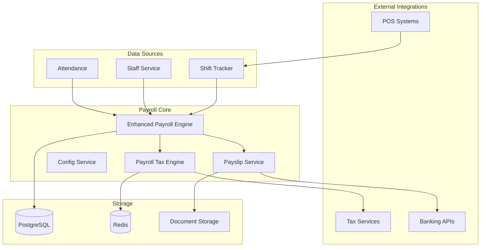
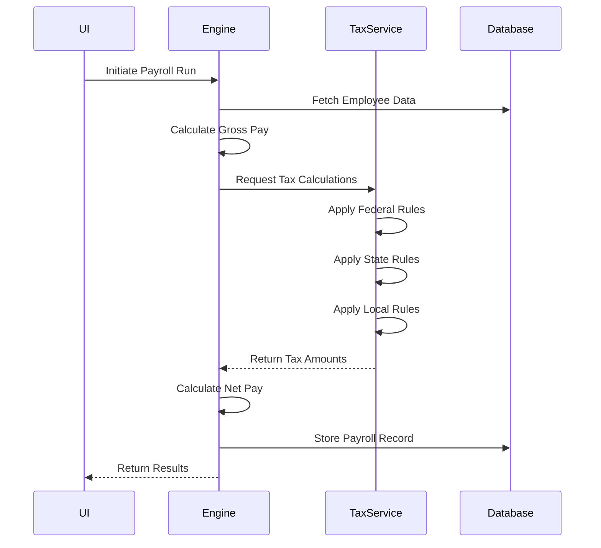
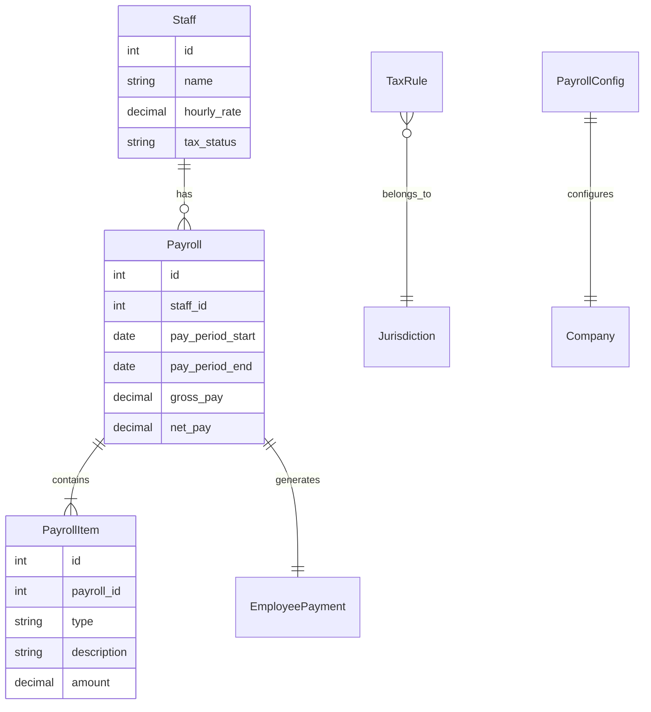

# Payroll Module Architecture

## Overview
The payroll module provides comprehensive wage calculation, tax processing, and compliance management integrated with the AuraConnect AI platform. It automates salary calculation, shift tracking, bonuses, tax deductions, and payslip generation.

## System Architecture Diagram



## System Flow

### 1. Data Collection Phase
- **Shift Logging**: Staff clock-in/out via POS integration or manual entry
- **Attendance Tracking**: Automatic absence and overtime detection
- **Rate Retrieval**: Current pay rates from staff configuration

### 2. Calculation Phase


### 3. Compliance & Validation
- **Minimum Wage Verification**: Ensures compliance with local regulations
- **Overtime Rules**: Applies proper overtime multipliers
- **Tax Compliance**: Validates against current tax tables
- **Audit Trail**: Complete logging of all calculations

### 4. Output Generation
- **Payslip Creation**: PDF generation with detailed breakdown
- **Payment Processing**: Integration with banking APIs
- **Record Archival**: Secure storage with retention policies

## Key Components

### Enhanced Payroll Engine
- **Location**: `backend/modules/staff/services/enhanced_payroll_engine.py`
- **Responsibilities**:
  - Orchestrates entire payroll calculation
  - Handles complex wage scenarios
  - Manages batch processing
  - Provides calculation transparency

### Payroll Tax Engine
- **Location**: `backend/modules/payroll/services/payroll_tax_engine.py`
- **Responsibilities**:
  - Multi-jurisdiction tax calculations
  - Tax table management
  - Withholding calculations
  - Compliance reporting

### Configuration Service
- **Location**: `backend/modules/payroll/services/payroll_configuration_service.py`
- **Responsibilities**:
  - Company-specific settings
  - Pay period management
  - Deduction rules
  - Benefit configurations

### Payslip Service
- **Location**: `backend/modules/staff/services/payslip_service.py`
- **Responsibilities**:
  - PDF generation
  - Email distribution
  - Archive management
  - Employee portal access

## Data Models

### Core Entities


## API Integration

### REST Endpoints
- `POST /api/v1/payrolls/run` - Execute payroll batch
- `GET /api/v1/payrolls/{staff_id}` - Retrieve history
- `GET /api/v1/payrolls/{id}/detail` - Detailed breakdown
- `POST /api/v1/payrolls/export` - Export data
- `GET /api/v1/payrolls/rules` - Tax rules

### WebSocket Events
- `payroll.started` - Processing initiated
- `payroll.progress` - Progress updates
- `payroll.completed` - Processing finished
- `payroll.error` - Error notifications

## Security & Compliance

### Access Control
- Role-based permissions (Admin, Payroll Manager, Employee)
- Tenant isolation for multi-tenant deployments
- Audit logging for all operations

### Data Protection
- Encryption at rest (AES-256)
- TLS 1.3 for transit
- PII masking in logs
- GDPR/CCPA compliance

## Performance Considerations

### Optimization Strategies
- **Batch Processing**: Handles 1000+ employees per run
- **Caching**: Redis for tax rules and calculations
- **Async Operations**: Background job processing
- **Database Indexing**: Optimized for common queries

### Scalability
- Horizontal scaling via load balancing
- Database read replicas for reports
- Queue-based job distribution
- CDN for document delivery

## Developer Notes

### Best Practices
1. **Service Layer Design**: All business logic in service classes
2. **Dependency Injection**: Use FastAPI's dependency system
3. **Error Handling**: Comprehensive exception handling
4. **Testing**: Minimum 80% test coverage
5. **Documentation**: OpenAPI specs for all endpoints

### Common Patterns
```python
# Example service pattern
class PayrollService:
    def __init__(self, db: Session):
        self.db = db
        self.engine = EnhancedPayrollEngine(db)
    
    async def process_payroll(self, staff_id: int, period: PayPeriod):
        # Validation
        # Calculation
        # Persistence
        # Notification
        pass
```

### Testing Requirements
- Unit tests for all calculations
- Integration tests for API endpoints
- End-to-end tests for complete workflows
- Performance tests for batch operations

## Future Enhancements
1. **AI-Powered Insights**: Anomaly detection and forecasting
2. **Mobile App**: Native iOS/Android applications
3. **Third-Party Integrations**: QuickBooks, ADP, Paychex
4. **Advanced Analytics**: Predictive modeling for labor costs
5. **Blockchain Integration**: Immutable payroll records

## Related Documentation

### Development & Integration
- [Payroll Tax Developer Guide](../../dev/payroll_tax_developer_guide.md) - Complete developer documentation
- [Payroll Integration Architecture](../../dev/architecture/payroll_integration.md) - System integration details
- [Production Readiness Checklist](../../modules/payroll/production-checklist.md) - Deployment requirements

### Implementation Details
- [Tax Calculation Flow](tax_calculation_flow.md) - Tax processing workflow
- [API Phase 4 Documentation](../../../backend/API_PHASE4_DOCUMENTATION.md) - REST API specifications
- [PayrollIntegration Component](../../../frontend/components/staff/PayrollIntegration.tsx) - UI implementation
