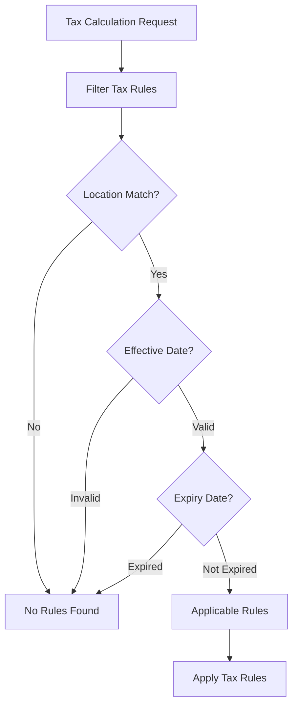

# Payroll Tax Calculation Flow Documentation

## Overview

This document describes the tax calculation flow implemented in AuraConnect's payroll system as part of Phase 2: Tax Services (AUR-276). The tax system provides comprehensive payroll tax calculations with multi-jurisdiction support and effective date handling.

## Architecture

### Core Components

1. **PayrollTaxEngine** (`backend/modules/payroll/services/payroll_tax_engine.py`)
   - Core tax rule evaluation engine
   - Handles multi-jurisdiction calculations
   - Manages effective/expiry date filtering

2. **PayrollTaxService** (`backend/modules/payroll/services/payroll_tax_service.py`)
   - High-level service API for payroll integration
   - Provides database persistence
   - Offers validation and bulk operations

3. **Data Models** (`backend/modules/payroll/models/payroll_models.py`)
   - `TaxRule`: Multi-jurisdiction tax rule definitions
   - `EmployeePayment`: Payroll payment records with tax fields
   - `EmployeePaymentTaxApplication`: Detailed tax calculation audit trail

4. **Schemas** (`backend/modules/payroll/schemas/payroll_tax_schemas.py`)
   - Pydantic models for request/response validation
   - Type-safe data transfer objects

## Tax Calculation Flow

### 1. Tax Rule Lookup



**Filtering Criteria:**
- Location/jurisdiction match
- Effective date ≤ pay date
- Expiry date > pay date (or NULL for no expiry)
- Active status = true
- Optional tenant filtering

### 2. Tax Rule Application

For each applicable tax rule:

1. **Calculate Taxable Amount**
   ```python
   taxable_amount = gross_pay
   
   # Apply minimum threshold
   if rule.min_taxable_amount and taxable_amount < rule.min_taxable_amount:
       return 0.00
   
   # Apply maximum cap
   if rule.max_taxable_amount and taxable_amount > rule.max_taxable_amount:
       taxable_amount = rule.max_taxable_amount
   ```

2. **Calculate Tax Amount**
   ```python
   effective_rate = rule.employee_portion or rule.rate_percent
   calculated_tax = taxable_amount * (effective_rate / 100)
   ```

3. **Create Tax Application Record**
   - Tax rule reference
   - Taxable amount used
   - Calculated tax amount
   - Effective rate applied
   - Calculation method used

### 3. Tax Categorization

Taxes are categorized by jurisdiction and type:

- **Federal**: Federal income tax, federal unemployment tax
- **State**: State income tax, state unemployment tax, state disability insurance
- **Local**: City/county taxes, local income tax
- **Payroll Taxes**: Social Security, Medicare, additional Medicare tax

### 4. Response Generation

The final response includes:
- Gross pay amount
- Total tax deductions
- Net pay calculation
- Detailed tax breakdown by category
- Individual tax application details
- Calculation timestamp

## Multi-Jurisdiction Support

### Jurisdiction Types

1. **Federal Level**
   - Federal income tax
   - Social Security (OASDI)
   - Medicare
   - Federal unemployment tax (FUTA)

2. **State Level**
   - State income tax
   - State unemployment insurance (SUI)
   - State disability insurance (SDI)
   - State-specific taxes

3. **Local Level**
   - City income tax
   - County taxes
   - Metropolitan district taxes
   - Municipal taxes

### Tax Rule Configuration

Each tax rule supports:

```sql
CREATE TABLE payroll_tax_rules (
    id INTEGER PRIMARY KEY,
    rule_name VARCHAR(100) NOT NULL,
    location VARCHAR(100) NOT NULL,           -- Jurisdiction identifier
    tax_type ENUM('FEDERAL', 'STATE', 'LOCAL', ...) NOT NULL,
    rate_percent NUMERIC(5,4) NOT NULL,       -- Total tax rate
    employee_portion NUMERIC(5,4),           -- Employee's share
    employer_portion NUMERIC(5,4),           -- Employer's share
    max_taxable_amount NUMERIC(12,2),        -- Annual wage cap
    min_taxable_amount NUMERIC(12,2),        -- Minimum threshold
    effective_date DATETIME NOT NULL,         -- When rule becomes active
    expiry_date DATETIME,                     -- When rule expires (NULL = never)
    is_active BOOLEAN DEFAULT TRUE
);
```

## Effective Date Handling

### Rule Lifecycle

1. **Future Rules**: `effective_date > current_date`
   - Not yet applicable
   - Used for advance tax planning

2. **Active Rules**: `effective_date ≤ current_date AND (expiry_date > current_date OR expiry_date IS NULL)`
   - Currently applicable for calculations
   - Used for payroll processing

3. **Expired Rules**: `expiry_date ≤ current_date`
   - No longer applicable for new calculations
   - Maintained for historical audit purposes

### Date-Based Filtering

```python
def _get_applicable_tax_rules(self, location: str, pay_date: date):
    return self.db.query(TaxRule).filter(
        TaxRule.location == location,
        TaxRule.is_active == True,
        TaxRule.effective_date <= pay_date,
        (TaxRule.expiry_date.is_(None)) | (TaxRule.expiry_date > pay_date)
    ).all()
```

## API Usage Examples

### Basic Tax Calculation

```python
from backend.modules.payroll.services.payroll_tax_service import PayrollTaxService
from backend.modules.payroll.schemas.payroll_tax_schemas import PayrollTaxServiceRequest

# Create service instance
tax_service = PayrollTaxService(db_session)

# Prepare calculation request
request = PayrollTaxServiceRequest(
    staff_id=123,
    payroll_policy_id=456,
    pay_period_start=date(2025, 7, 1),
    pay_period_end=date(2025, 7, 15),
    gross_pay=Decimal('5000.00'),
    location="California",
    tenant_id=1
)

# Calculate taxes
response = tax_service.calculate_and_save_taxes(request)

# Access results
print(f"Gross Pay: ${response.tax_calculation.gross_pay}")
print(f"Total Taxes: ${response.tax_calculation.total_taxes}")
print(f"Net Pay: ${response.tax_calculation.net_pay}")
```

### Update Existing Payment

```python
# Update taxes for existing employee payment
response = tax_service.update_employee_payment_taxes(
    employee_payment_id=789
)

# Tax fields automatically updated in database
# - federal_tax, state_tax, local_tax
# - social_security_tax, medicare_tax
# - total_deductions, net_pay
```

### Validate Tax Setup

```python
from backend.modules.payroll.schemas.payroll_tax_schemas import TaxRuleValidationRequest

# Validate tax configuration
validation_request = TaxRuleValidationRequest(
    location="California",
    pay_date=date(2025, 7, 15),
    tenant_id=1
)

validation_response = tax_service.validate_tax_setup(validation_request)

if validation_response.missing_jurisdictions:
    print(f"Missing jurisdictions: {validation_response.missing_jurisdictions}")

if validation_response.potential_issues:
    print(f"Issues found: {validation_response.potential_issues}")
```

### Bulk Recalculation

```python
# Recalculate taxes for all employees in a pay period
result = tax_service.bulk_recalculate_taxes(
    location="California",
    pay_period_start=date(2025, 7, 1),
    pay_period_end=date(2025, 7, 15),
    tenant_id=1
)

print(f"Updated {result['updated_count']} of {result['total_payments']} payments")
if result['errors']:
    print(f"Errors encountered: {result['error_count']}")
```

## Integration Points

### Payroll Engine Integration

The tax service integrates with the payroll processing engine:

```python
# In payroll processing workflow
from backend.modules.payroll.services.payroll_tax_service import PayrollTaxService

def process_employee_payroll(employee_payment: EmployeePayment):
    tax_service = PayrollTaxService(db)
    
    # Calculate taxes and update payment record
    tax_response = tax_service.update_employee_payment_taxes(
        employee_payment.id
    )
    
    # Use tax breakdown for payslip generation
    tax_breakdown = tax_response.tax_calculation.tax_breakdown
    
    return {
        'gross_pay': employee_payment.gross_pay,
        'federal_tax': tax_breakdown.federal_tax,
        'state_tax': tax_breakdown.state_tax,
        'net_pay': tax_response.tax_calculation.net_pay
    }
```

### Database Schema Integration

Tax calculations are persisted in two ways:

1. **Summary in EmployeePayment**
   - Individual tax category totals
   - Integrated with existing payroll fields

2. **Detailed in EmployeePaymentTaxApplication**
   - Full audit trail per tax rule
   - Calculation methodology tracking
   - Historical tax rule references

## Error Handling

### Common Error Scenarios

1. **No Tax Rules Found**
   - Returns zero tax calculation
   - Logs warning for missing configuration

2. **Invalid Tax Rule Configuration**
   - Negative rates or amounts
   - Overlapping effective dates
   - Missing required fields

3. **Calculation Errors**
   - Overflow in tax calculations
   - Rounding precision issues
   - Database constraint violations

### Error Recovery

```python
try:
    response = tax_service.calculate_and_save_taxes(request)
except ValueError as e:
    # Handle configuration errors
    logger.error(f"Tax configuration error: {e}")
    # Return zero tax response or raise to caller
except Exception as e:
    # Handle unexpected errors
    logger.error(f"Unexpected tax calculation error: {e}")
    # Rollback database changes
    db.rollback()
    raise
```

## Performance Considerations

### Query Optimization

- Indexed fields: `location`, `effective_date`, `tax_type`
- Composite indexes for common filter combinations
- Efficient date range queries

### Caching Strategy

- Tax rules cached by location and date range
- Jurisdiction summaries cached for validation
- Cache invalidation on rule updates

### Bulk Operations

- Batch processing for multiple employees
- Transaction management for consistency
- Progress tracking for long-running operations

## Testing Strategy

### Unit Tests

- Tax calculation accuracy with various scenarios
- Edge cases (zero pay, maximum wages, etc.)
- Date filtering logic
- Error handling paths

### Integration Tests

- End-to-end payroll processing
- Database persistence validation
- Multi-jurisdiction scenarios

### Performance Tests

- Bulk calculation performance
- Query optimization validation
- Memory usage under load

## Compliance Considerations

### Audit Trail

- All tax calculations are logged with timestamps
- Tax rule versions preserved for historical accuracy
- Calculation methodology documented per application

### Data Retention

- Tax applications retained for regulatory periods
- Historical tax rules maintained indefinitely
- Audit logs protected from modification

### Accuracy Requirements

- Decimal precision maintained throughout calculations
- Rounding rules applied consistently
- Validation against known tax scenarios

---

This documentation provides a comprehensive overview of the payroll tax calculation system implemented in AuraConnect. For specific implementation details, refer to the source code and unit tests in the respective modules.