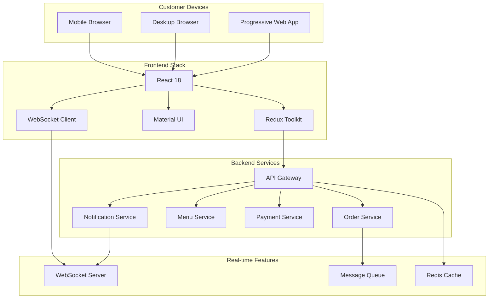

# Customer Web App Setup Guide

## Table of Contents

1. [Overview](#overview)
2. [Architecture](#architecture)
3. [Prerequisites](#prerequisites)
4. [Installation](#installation)
5. [Configuration](#configuration)
6. [Features](#features)
7. [Deployment](#deployment)
8. [Mobile Support](#mobile-support)
9. [API Integration](#api-integration)
10. [Security](#security)
11. [Analytics](#analytics)
12. [Troubleshooting](#troubleshooting)
13. [Best Practices](#best-practices)

## Overview

The AuraConnect Customer Web App provides a modern, responsive interface for customers to:
- Browse menus and place orders
- Make reservations
- Track orders in real-time
- Manage loyalty rewards
- Provide feedback
- Access order history

## Architecture



## Prerequisites

- Node.js 18+ and npm/yarn
- Git for version control
- Backend services running
- SSL certificate for production

## Installation

### 1. Clone the Repository

```bash
git clone https://github.com/AuraTechWave/auraconnectai.git
cd auraconnectai/frontend/customer-web
```

### 2. Install Dependencies

```bash
# Using npm
npm install

# Using yarn
yarn install
```

### 3. Environment Setup

Create a `.env.local` file:

```env
# API Configuration
REACT_APP_API_URL=http://localhost:8000/api/v1
REACT_APP_WS_URL=ws://localhost:8000/ws

# Restaurant Configuration
REACT_APP_RESTAURANT_ID=1
REACT_APP_RESTAURANT_NAME="Your Restaurant"
REACT_APP_DEFAULT_LOCATION=1

# Features
REACT_APP_ENABLE_ONLINE_ORDERING=true
REACT_APP_ENABLE_RESERVATIONS=true
REACT_APP_ENABLE_LOYALTY=true
REACT_APP_ENABLE_DELIVERY=true

# Third-party Services
REACT_APP_GOOGLE_MAPS_KEY=your_google_maps_key
REACT_APP_STRIPE_PUBLIC_KEY=your_stripe_public_key
REACT_APP_GA_TRACKING_ID=your_analytics_id

# Push Notifications
REACT_APP_VAPID_PUBLIC_KEY=your_vapid_public_key
```

### 4. Run Development Server

```bash
# Start development server
npm start
# or
yarn start

# App will be available at http://localhost:3000
```

## Configuration

### Theme Customization

```javascript
// src/theme/config.js
export const themeConfig = {
    primary: {
        main: '#1976d2',
        light: '#42a5f5',
        dark: '#1565c0',
    },
    secondary: {
        main: '#dc004e',
        light: '#e33371',
        dark: '#9a0036',
    },
    typography: {
        fontFamily: '"Roboto", "Helvetica", "Arial", sans-serif',
        h1: {
            fontSize: '2.5rem',
            fontWeight: 600,
        },
    },
    shape: {
        borderRadius: 8,
    },
};
```

### Feature Flags

```javascript
// src/config/features.js
export const features = {
    ordering: {
        enabled: true,
        minimumOrder: 10.00,
        deliveryRadius: 5, // miles
        estimatedTime: 30, // minutes
    },
    reservations: {
        enabled: true,
        advanceDays: 30,
        partySize: { min: 1, max: 20 },
        timeSlots: 15, // minutes
    },
    loyalty: {
        enabled: true,
        pointsPerDollar: 1,
        rewardThreshold: 100,
    },
    payments: {
        methods: ['card', 'apple_pay', 'google_pay'],
        saveCards: true,
        tipping: {
            enabled: true,
            suggestions: [15, 18, 20, 25],
        },
    },
};
```

## Features

### 1. Menu & Ordering

```javascript
// Menu browsing with filters
const MenuPage = () => {
    const [filters, setFilters] = useState({
        category: 'all',
        dietary: [],
        priceRange: [0, 100],
        search: '',
    });
    
    return (
        <MenuContainer>
            <MenuFilters onChange={setFilters} />
            <MenuGrid filters={filters} />
            <Cart />
        </MenuContainer>
    );
};
```

### 2. Real-time Order Tracking

```javascript
// WebSocket connection for live updates
useEffect(() => {
    const ws = new WebSocket(process.env.REACT_APP_WS_URL);
    
    ws.onmessage = (event) => {
        const update = JSON.parse(event.data);
        if (update.type === 'order_status') {
            dispatch(updateOrderStatus(update));
        }
    };
    
    return () => ws.close();
}, []);
```

### 3. Push Notifications

```javascript
// Service worker registration
if ('serviceWorker' in navigator) {
    navigator.serviceWorker
        .register('/service-worker.js')
        .then(registration => {
            console.log('SW registered:', registration);
            subscribeToNotifications(registration);
        });
}

// Subscribe to push notifications
async function subscribeToNotifications(registration) {
    const subscription = await registration.pushManager.subscribe({
        userVisibleOnly: true,
        applicationServerKey: urlBase64ToUint8Array(
            process.env.REACT_APP_VAPID_PUBLIC_KEY
        ),
    });
    
    // Send subscription to backend
    await api.post('/notifications/subscribe', subscription);
}
```

### 4. Offline Support

```javascript
// Progressive Web App configuration
// public/manifest.json
{
    "name": "AuraConnect Restaurant",
    "short_name": "AuraConnect",
    "start_url": "/",
    "display": "standalone",
    "theme_color": "#1976d2",
    "background_color": "#ffffff",
    "icons": [
        {
            "src": "/icon-192.png",
            "sizes": "192x192",
            "type": "image/png"
        },
        {
            "src": "/icon-512.png",
            "sizes": "512x512",
            "type": "image/png"
        }
    ]
}
```

## Deployment

### 1. Build for Production

```bash
# Create optimized production build
npm run build
# or
yarn build

# Test production build locally
npm run serve
```

### 2. Deploy to Netlify

```bash
# Install Netlify CLI
npm install -g netlify-cli

# Deploy to Netlify
netlify deploy --prod --dir=build
```

### 3. Deploy to Vercel

```bash
# Install Vercel CLI
npm install -g vercel

# Deploy
vercel --prod
```

### 4. Docker Deployment

```dockerfile
# Dockerfile
FROM node:18-alpine as builder
WORKDIR /app
COPY package*.json ./
RUN npm ci
COPY . .
RUN npm run build

FROM nginx:alpine
COPY --from=builder /app/build /usr/share/nginx/html
COPY nginx.conf /etc/nginx/conf.d/default.conf
EXPOSE 80
CMD ["nginx", "-g", "daemon off;"]
```

### 5. CDN Configuration

```nginx
# nginx.conf
server {
    listen 80;
    server_name customer.auraconnect.com;
    root /usr/share/nginx/html;
    
    # Compression
    gzip on;
    gzip_types text/plain text/css application/json application/javascript;
    
    # Cache static assets
    location ~* \.(js|css|png|jpg|jpeg|gif|ico|svg)$ {
        expires 1y;
        add_header Cache-Control "public, immutable";
    }
    
    # SPA routing
    location / {
        try_files $uri $uri/ /index.html;
    }
}
```

## Mobile Support

### Responsive Design

```css
/* Mobile-first approach */
.menu-grid {
    display: grid;
    grid-template-columns: 1fr;
    gap: 1rem;
}

@media (min-width: 768px) {
    .menu-grid {
        grid-template-columns: repeat(2, 1fr);
    }
}

@media (min-width: 1024px) {
    .menu-grid {
        grid-template-columns: repeat(3, 1fr);
    }
}
```

### Touch Gestures

```javascript
// Swipe to delete cart item
import { useSwipeable } from 'react-swipeable';

const CartItem = ({ item, onDelete }) => {
    const handlers = useSwipeable({
        onSwipedLeft: () => onDelete(item.id),
        preventDefaultTouchmoveEvent: true,
        trackMouse: true,
    });
    
    return (
        <div {...handlers} className="cart-item">
            {/* Item content */}
        </div>
    );
};
```

## API Integration

### API Client Setup

```javascript
// src/services/api.js
import axios from 'axios';
import { store } from '../store';

const api = axios.create({
    baseURL: process.env.REACT_APP_API_URL,
    timeout: 10000,
});

// Request interceptor for auth
api.interceptors.request.use(
    config => {
        const token = store.getState().auth.token;
        if (token) {
            config.headers.Authorization = `Bearer ${token}`;
        }
        return config;
    },
    error => Promise.reject(error)
);

// Response interceptor for error handling
api.interceptors.response.use(
    response => response,
    error => {
        if (error.response?.status === 401) {
            store.dispatch(logout());
        }
        return Promise.reject(error);
    }
);

export default api;
```

### State Management

```javascript
// src/store/slices/menuSlice.js
import { createSlice, createAsyncThunk } from '@reduxjs/toolkit';
import api from '../../services/api';

export const fetchMenu = createAsyncThunk(
    'menu/fetch',
    async (locationId) => {
        const response = await api.get(`/menu/location/${locationId}`);
        return response.data;
    }
);

const menuSlice = createSlice({
    name: 'menu',
    initialState: {
        items: [],
        categories: [],
        loading: false,
        error: null,
    },
    reducers: {
        // Sync actions
    },
    extraReducers: (builder) => {
        builder
            .addCase(fetchMenu.pending, (state) => {
                state.loading = true;
            })
            .addCase(fetchMenu.fulfilled, (state, action) => {
                state.loading = false;
                state.items = action.payload.items;
                state.categories = action.payload.categories;
            })
            .addCase(fetchMenu.rejected, (state, action) => {
                state.loading = false;
                state.error = action.error.message;
            });
    },
});

export default menuSlice.reducer;
```

## Security

### Content Security Policy

```html
<!-- public/index.html -->
<meta http-equiv="Content-Security-Policy" 
      content="default-src 'self'; 
               script-src 'self' 'unsafe-inline' https://maps.googleapis.com; 
               style-src 'self' 'unsafe-inline' https://fonts.googleapis.com; 
               font-src 'self' https://fonts.gstatic.com; 
               img-src 'self' data: https:; 
               connect-src 'self' wss: https://api.auraconnect.com;">
```

### Authentication Flow

```javascript
// OAuth2 with PKCE
const login = async () => {
    const codeVerifier = generateCodeVerifier();
    const codeChallenge = await generateCodeChallenge(codeVerifier);
    
    // Store verifier
    sessionStorage.setItem('code_verifier', codeVerifier);
    
    // Redirect to auth
    window.location.href = `${AUTH_URL}?` + new URLSearchParams({
        client_id: CLIENT_ID,
        redirect_uri: REDIRECT_URI,
        response_type: 'code',
        scope: 'openid profile email',
        code_challenge: codeChallenge,
        code_challenge_method: 'S256',
    });
};
```

## Analytics

### Google Analytics 4

```javascript
// src/utils/analytics.js
import ReactGA from 'react-ga4';

export const initGA = () => {
    ReactGA.initialize(process.env.REACT_APP_GA_TRACKING_ID);
};

export const logPageView = (path) => {
    ReactGA.send({ hitType: 'pageview', page: path });
};

export const logEvent = (category, action, label, value) => {
    ReactGA.event({
        category,
        action,
        label,
        value,
    });
};

// Track order completion
export const trackOrderComplete = (order) => {
    ReactGA.event('purchase', {
        transaction_id: order.id,
        value: order.total,
        currency: 'USD',
        items: order.items.map(item => ({
            item_id: item.id,
            item_name: item.name,
            price: item.price,
            quantity: item.quantity,
        })),
    });
};
```

## Troubleshooting

### Common Issues

1. **API Connection Failed**
   ```javascript
   // Check CORS configuration
   // Verify API URL in .env
   // Check network tab for errors
   ```

2. **WebSocket Not Connecting**
   ```javascript
   // Ensure WSS for production
   // Check firewall rules
   // Verify authentication
   ```

3. **Push Notifications Not Working**
   ```javascript
   // Verify HTTPS
   // Check service worker registration
   // Validate VAPID keys
   ```

4. **Performance Issues**
   ```javascript
   // Implement lazy loading
   // Use React.memo for components
   // Optimize images with next-gen formats
   ```

## Best Practices

### 1. Performance Optimization

```javascript
// Lazy load routes
const Menu = lazy(() => import('./pages/Menu'));
const Orders = lazy(() => import('./pages/Orders'));

// Image optimization

```

### 2. Accessibility

```javascript
// ARIA labels and keyboard navigation
<button
    aria-label="Add to cart"
    onClick={handleAddToCart}
    onKeyDown={(e) => {
        if (e.key === 'Enter' || e.key === ' ') {
            handleAddToCart();
        }
    }}
>
    <AddIcon />
</button>
```

### 3. Error Boundaries

```javascript
class ErrorBoundary extends Component {
    state = { hasError: false };
    
    static getDerivedStateFromError(error) {
        return { hasError: true };
    }
    
    componentDidCatch(error, errorInfo) {
        logError(error, errorInfo);
    }
    
    render() {
        if (this.state.hasError) {
            return <ErrorFallback />;
        }
        
        return this.props.children;
    }
}
```

## Support

- **Documentation**: [Customer App Guide](https://docs.auraconnect.com/customer-app)
- **Frontend Team**: frontend-team@auraconnect.com
- **Slack**: #customer-web-app

---

*Last Updated: January 2025*