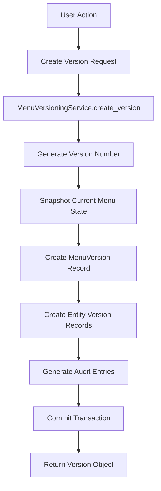
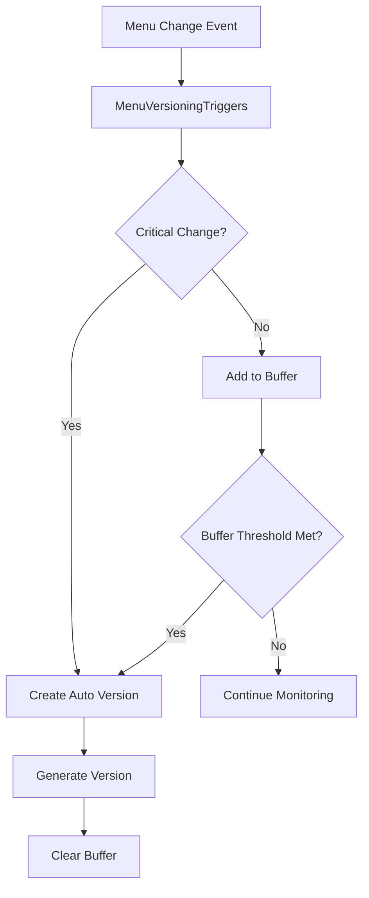
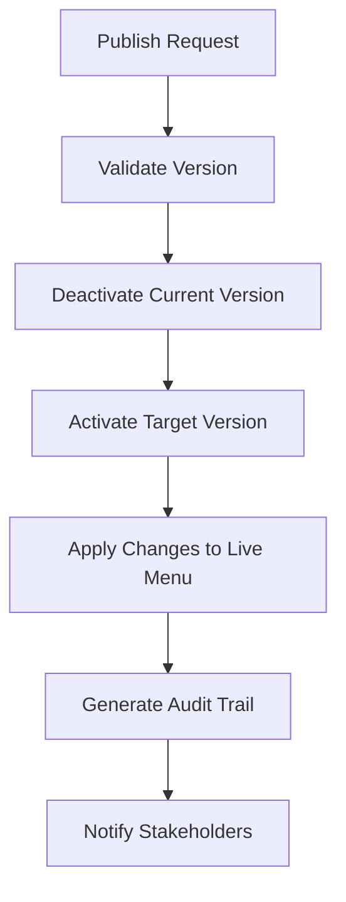

# Menu Versioning & Audit Trail Architecture

## Overview

The Menu Versioning system provides comprehensive version control and audit trail capabilities for restaurant menu management. This system ensures compliance, enables rollback capabilities, and provides detailed tracking of all menu changes.

## Architecture Components

### 1. Database Layer

#### Core Models

```python
# Primary versioning model
MenuVersion
├── version_number: str          # Auto-generated version identifier
├── version_name: str           # Human-readable name
├── description: str            # Version description
├── version_type: VersionType   # manual, scheduled, rollback, etc.
├── is_active: bool            # Only one version can be active
├── is_published: bool         # Published state
├── parent_version_id: int     # Reference to parent version
└── metadata: dict             # Counts and change summaries

# Snapshot models for each entity type
MenuCategoryVersion, MenuItemVersion, ModifierGroupVersion, ModifierVersion
├── menu_version_id: int       # Reference to MenuVersion
├── original_entity_id: int    # Reference to original entity
├── entity_data: ...          # Snapshot of entity data at version time
├── change_type: ChangeType   # create, update, delete, etc.
├── change_summary: str       # Human-readable change description
└── changed_fields: list      # List of fields that changed

# Comprehensive audit logging
MenuAuditLog
├── menu_version_id: int      # Optional version reference
├── action: str              # Action performed
├── entity_type: str         # Type of entity changed
├── change_type: ChangeType  # Type of change
├── old_values: dict         # Previous values
├── new_values: dict         # New values
├── user_context: dict       # User, IP, session info
├── batch_id: uuid           # Group related changes
└── metadata: dict           # Additional context
```

#### Key Design Principles

1. **Immutable Snapshots**: Each version contains complete snapshots of menu state
2. **Hierarchical Versioning**: Versions can reference parent versions for rollback chains
3. **Granular Audit Trail**: Every change is logged with full context
4. **Batch Operations**: Related changes are grouped with batch IDs

### 2. Service Layer

#### MenuVersioningService

The core business logic service providing:

```python
class MenuVersioningService:
    def create_version(request: CreateVersionRequest) -> MenuVersion
    def publish_version(version_id: int, request: PublishVersionRequest) -> MenuVersion
    def rollback_to_version(request: RollbackVersionRequest) -> MenuVersion
    def compare_versions(request: VersionComparisonRequest) -> MenuVersionComparison
    def get_versions(page: int, size: int, filters: dict) -> Tuple[List[MenuVersion], int]
    def get_audit_logs(filters: dict) -> Tuple[List[MenuAuditLog], int]
```

#### Key Features

- **Smart Snapshotting**: Only captures active/relevant entities based on configuration
- **Atomic Operations**: All version operations are wrapped in database transactions
- **Audit Context**: Automatic audit trail generation for all operations
- **Caching**: Version comparisons are cached for performance
- **Bulk Operations**: Efficient handling of large-scale changes

### 3. Automation Layer

#### MenuVersioningTriggers

Automated versioning system that monitors menu changes:

```python
class MenuVersioningTriggers:
    # Event listeners for SQLAlchemy models
    def setup_event_listeners()
    
    # Change detection and buffering
    def add_change_to_buffer(change_data: dict)
    def should_create_auto_version(change_type: str, entity_type: str) -> bool
    
    # Automatic version creation
    def create_auto_version(db: Session, trigger_reason: str) -> Optional[int]
```

#### Trigger Rules

1. **Critical Changes**: Price changes, availability changes always trigger versioning
2. **Threshold-Based**: Auto-version when change buffer reaches threshold (default: 10)
3. **Bulk Operations**: Significant bulk operations (>5 items) trigger versioning
4. **Time-Based**: Configurable time-based auto-versioning (future enhancement)

### 4. API Layer

#### RESTful Endpoints

```
POST   /menu/versions                    # Create new version
GET    /menu/versions                    # List versions (paginated)
GET    /menu/versions/{id}               # Get version details
POST   /menu/versions/{id}/publish       # Publish version
POST   /menu/versions/rollback           # Rollback to version
POST   /menu/versions/compare            # Compare versions
GET    /menu/versions/audit/logs         # Get audit trail
GET    /menu/versions/stats              # Get version statistics
POST   /menu/versions/bulk-change        # Bulk operations
POST   /menu/versions/{id}/export        # Export version
POST   /menu/versions/import             # Import version
```

#### Authentication & Authorization

- **RBAC Integration**: All endpoints protected with role-based permissions
- **Granular Permissions**: 
  - `menu:read` - View versions and audit logs
  - `menu:create` - Create new versions
  - `menu:update` - Publish versions and rollback
  - `menu:delete` - Delete draft versions
  - `menu:manage_versions` - Advanced version management

### 5. Frontend Layer

#### React Components

```typescript
MenuVersioning
├── VersionsList           # Paginated version management
├── VersionComparison      # Side-by-side version comparison
├── AuditTrail            # Comprehensive audit log viewer
├── VersionCreation       # Form for creating new versions
├── BulkOperations        # Bulk change interface
└── VersionStats          # Dashboard statistics
```

#### Key Features

- **Virtualized Tables**: Handle large datasets efficiently
- **Real-time Updates**: WebSocket integration for live updates (future)
- **Interactive Comparison**: Visual diff between versions
- **Export Capabilities**: CSV, JSON, Excel export options
- **Mobile Responsive**: Optimized for mobile devices

## Data Flow

### Version Creation Flow



### Automated Versioning Flow



### Version Publishing Flow



## Performance Considerations

### Database Optimization

1. **Indexing Strategy**:
   ```sql
   -- Core indexes for performance
   CREATE INDEX idx_menu_versions_active ON menu_versions(is_active);
   CREATE INDEX idx_menu_versions_published ON menu_versions(is_published);
   CREATE INDEX idx_menu_audit_logs_created_at ON menu_audit_logs(created_at);
   CREATE INDEX idx_menu_audit_logs_entity ON menu_audit_logs(entity_type, entity_id);
   ```

2. **Partitioning**: Audit logs partitioned by date for large-scale deployments

3. **Archiving**: Automated archiving of old versions and audit logs

### Caching Strategy

1. **Version Comparisons**: Cached with TTL-based invalidation
2. **Statistics**: Cached and updated via background jobs
3. **Frequently Accessed Versions**: Redis caching for active versions

### Query Optimization

1. **Eager Loading**: Related data loaded efficiently
2. **Pagination**: All list endpoints support pagination
3. **Filtering**: Database-level filtering to reduce data transfer

## Security Considerations

### Data Protection

1. **Audit Trail Integrity**: Immutable audit logs with checksum validation
2. **Version Integrity**: Digital signatures for version data (future enhancement)
3. **Access Controls**: Comprehensive RBAC integration
4. **Data Encryption**: Sensitive fields encrypted at rest

### Compliance Features

1. **GDPR Compliance**: Data retention policies and anonymization
2. **SOX Compliance**: Complete audit trail with user attribution
3. **HIPAA Ready**: Audit logging suitable for healthcare environments
4. **Industry Standards**: Configurable compliance profiles

## Monitoring & Observability

### Metrics

1. **Version Metrics**:
   - Versions created per day/week/month
   - Average time between versions
   - Rollback frequency and reasons
   - Version size and complexity metrics

2. **Performance Metrics**:
   - Version creation time
   - Comparison generation time
   - Query response times
   - Cache hit rates

3. **Business Metrics**:
   - Most frequently changed menu items
   - Peak change times
   - User activity patterns
   - Compliance audit requests

### Alerting

1. **System Alerts**:
   - Version creation failures
   - Audit log inconsistencies
   - Performance degradation
   - Storage threshold breaches

2. **Business Alerts**:
   - Unusual change patterns
   - Failed compliance requirements
   - Unauthorized access attempts
   - Critical system rollbacks

## Deployment Architecture

### Production Setup

```yaml
# Database Configuration
postgresql:
  version: "14+"
  extensions: ["uuid-ossp", "btree_gin"]
  backup_strategy: "continuous_archiving"
  
# Caching Layer
redis:
  version: "7+"
  configuration: "persistence_enabled"
  
# Application Layer
backend:
  instances: 3
  load_balancer: "nginx"
  health_checks: "enabled"
  
# Frontend Layer
frontend:
  cdn: "cloudflare"
  caching: "aggressive"
  monitoring: "real_user_monitoring"
```

### Scaling Considerations

1. **Horizontal Scaling**: Stateless design enables horizontal scaling
2. **Database Scaling**: Read replicas for reporting and analytics
3. **Caching**: Distributed caching for multi-instance deployments
4. **Background Processing**: Queue-based processing for heavy operations

## Future Enhancements

### Planned Features

1. **Real-time Collaboration**: WebSocket-based real-time version updates
2. **Advanced Analytics**: ML-powered change pattern analysis
3. **Integration APIs**: Webhooks for external system integration
4. **Mobile App**: Dedicated mobile app for version management
5. **Advanced Exports**: PDF reports with visual comparisons

### Technical Improvements

1. **GraphQL API**: Alternative API interface for complex queries
2. **Event Sourcing**: Enhanced event-driven architecture
3. **Blockchain Audit**: Immutable audit trail using blockchain
4. **AI-Powered Insights**: Automated change recommendations
5. **Multi-tenant Architecture**: Support for multiple restaurant chains

## Development Guidelines

### Code Standards

1. **Type Safety**: Full TypeScript coverage on frontend
2. **Testing**: Minimum 80% code coverage
3. **Documentation**: Comprehensive API documentation
4. **Error Handling**: Graceful error handling and recovery

### Best Practices

1. **Version Naming**: Consistent version naming conventions
2. **Change Descriptions**: Mandatory change descriptions for versions
3. **Testing**: All version operations must be tested
4. **Monitoring**: All operations must be monitored and logged

This architecture provides a robust, scalable, and compliant menu versioning system that meets enterprise requirements while maintaining ease of use and performance.