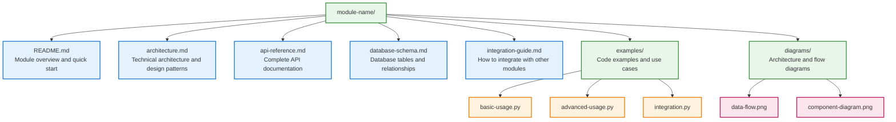
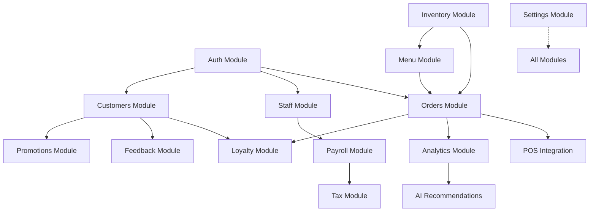

# AuraConnect Modules Documentation

## Overview

This directory contains comprehensive documentation for all AuraConnect modules. Each module has its own dedicated documentation covering architecture, API endpoints, database schema, and integration guides.

## Module Categories

### 🍽️ Restaurant Operations

| Module | Description | Documentation |
|--------|-------------|--------------|
| **[Orders](./orders/README.md)** | Order management, processing, and tracking | [View Docs](./orders/README.md) |
| **[Menu](./menu/README.md)** | Menu management, categories, and modifiers | [View Docs](./menu/README.md) |
| **Inventory** | Stock tracking and supplier management | *(Coming Soon)* |
| **[POS Integration](../feature_docs/pos_integration/README.md)** | Point of Sale system adapters | [View Docs](../feature_docs/pos_integration/README.md) |

### 👥 Staff & Financial Management

| Module | Description | Documentation |
|--------|-------------|--------------|
| **[Staff](./staff/README.md)** | Employee management and scheduling | [View Docs](./staff/README.md) |
| **[Payroll](../feature_docs/payroll/README.md)** | Payroll processing and compliance | [View Docs](../feature_docs/payroll/README.md) |
| **[Tax](../feature_docs/tax/README.md)** | Tax calculations and reporting | [View Docs](../feature_docs/tax/README.md) |
| **Auth** | Authentication and authorization | *(Integrated)* |

### 🎯 Customer Experience

| Module | Description | Documentation |
|--------|-------------|--------------|
| **Customers** | Customer relationship management | *(Coming Soon)* |
| **Feedback** | Reviews and feedback management | *(Coming Soon)* |
| **Loyalty** | Rewards and loyalty programs | *(Coming Soon)* |
| **Promotions** | Marketing and promotional campaigns | *(Coming Soon)* |

### 📊 Intelligence & Configuration

| Module | Description | Documentation |
|--------|-------------|--------------|
| **Analytics** | Business intelligence and reporting | *(Coming Soon)* |
| **[AI Recommendations](../feature_docs/ai_agents/README.md)** | Machine learning insights | [View Docs](../feature_docs/ai_agents/README.md) |
| **Settings** | System configuration and preferences | *(Integrated)* |

## Documentation Structure

Each module documentation follows a consistent structure:

## Getting Started with a Module

1. **Read the Overview**: Start with the module's README.md for a high-level understanding
2. **Understand the Architecture**: Review architecture.md for technical design details
3. **Explore the API**: Check api-reference.md for endpoint documentation
4. **Review Examples**: Look at the examples folder for practical implementations
5. **Check Integration Points**: Read integration-guide.md to understand module dependencies

## Common Patterns Across Modules

### Authentication
All modules use JWT-based authentication with the Auth module.

### Database Access
- Multi-tenant architecture with row-level security
- PostgreSQL as the primary database
- Redis for caching and real-time features

### API Design
- RESTful endpoints following OpenAPI 3.0 specification
- Consistent error handling and response formats
- Pagination support for list endpoints
- Field filtering and sorting capabilities

### Event System
- Event-driven architecture for module communication
- Redis pub/sub for real-time events
- Celery for async task processing

## Module Dependencies

## Development Guidelines

### Adding a New Module

1. Create module directory structure
2. Implement core service classes
3. Define API endpoints
4. Create database migrations
5. Write comprehensive tests
6. Document all components

### Module Communication

- **Direct API Calls**: For synchronous operations
- **Event Bus**: For async notifications
- **Shared Database**: For tightly coupled data (avoid when possible)
- **Message Queue**: For background processing

## Testing Modules

Each module includes:
- Unit tests for business logic
- Integration tests for API endpoints
- Performance tests for critical paths
- Mock implementations for dependencies

## Contributing

When contributing to module documentation:
1. Follow the established structure
2. Include code examples
3. Add diagrams for complex flows
4. Keep API documentation up-to-date
5. Document breaking changes

## Support

For module-specific questions:
- Check the module's README first
- Review the examples folder
- Consult the integration guide
- Contact the module maintainer (listed in each README)

---

*Last Updated: January 2025*