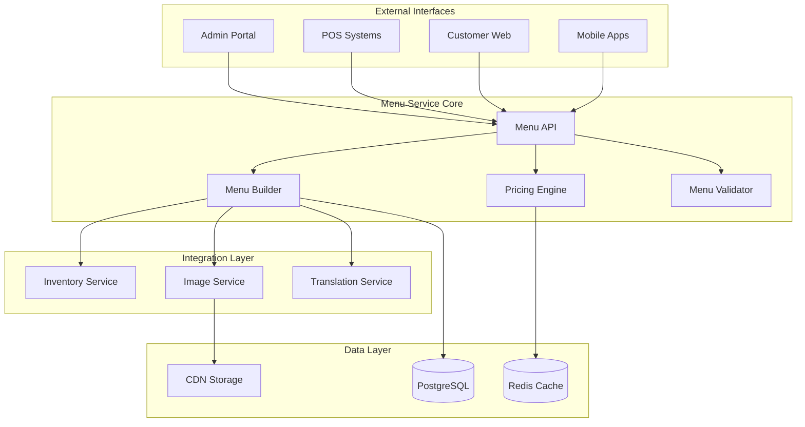
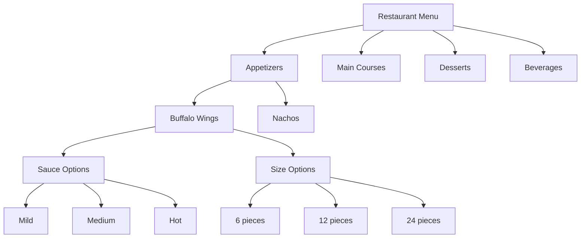

# Menu Module

## Overview

The Menu module manages all aspects of restaurant menus including items, categories, modifiers, pricing, and availability. It provides a flexible system for creating complex menu structures with support for variations, dietary information, and multi-location management.

## Key Features

- 📋 **Hierarchical Menu Structure**: Categories, subcategories, and items
- 🎛️ **Dynamic Pricing**: Time-based, location-based, and promotional pricing
- 🥘 **Modifier Management**: Customizable options and add-ons
- 🍽️ **Dietary Information**: Allergens, nutritional data, and dietary tags
- 📅 **Scheduling**: Menu availability by time and day
- 🌍 **Multi-location Support**: Location-specific menus and pricing
- 📸 **Image Management**: Multiple images per item with CDN support
- 🔄 **Version Control**: Track menu changes and rollback capability

## Architecture Overview



## Quick Start

### Prerequisites

- Python 3.11+
- PostgreSQL 14+
- Redis 6+
- S3-compatible storage for images

### Installation

```bash
# Navigate to the menu module
cd backend/modules/menu

# Install dependencies
pip install -r requirements.txt

# Run migrations
alembic upgrade head

# Start the service
uvicorn main:app --reload --port 8001
```

### Basic Usage

```python
import requests

# Create a menu category
category_data = {
    "name": "Appetizers",
    "description": "Start your meal with our delicious appetizers",
    "display_order": 1,
    "is_active": True
}

response = requests.post(
    "http://localhost:8001/api/v1/menu/categories",
    json=category_data,
    headers={"Authorization": "Bearer <token>"}
)

category = response.json()

# Create a menu item
item_data = {
    "name": "Buffalo Wings",
    "description": "Crispy chicken wings with buffalo sauce",
    "category_id": category["id"],
    "base_price": "12.99",
    "preparation_time_minutes": 15,
    "dietary_info": {
        "calories": 450,
        "is_vegetarian": False,
        "is_gluten_free": True,
        "allergens": ["dairy"]
    }
}

item_response = requests.post(
    "http://localhost:8001/api/v1/menu/items",
    json=item_data,
    headers={"Authorization": "Bearer <token>"}
)
```

## Core Components

### 1. Menu Builder
Constructs complete menu structures with categories, items, and modifiers.

### 2. Pricing Engine
Calculates dynamic pricing based on rules, promotions, and location.

### 3. Availability Manager
Controls when items are available based on schedule and inventory.

### 4. Modifier System
Manages customization options, add-ons, and variations.

## API Endpoints

### Menu Categories

| Endpoint | Method | Description |
|----------|--------|-------------|
| `/api/v1/menu/categories` | GET | List all categories |
| `/api/v1/menu/categories` | POST | Create category |
| `/api/v1/menu/categories/{id}` | GET | Get category details |
| `/api/v1/menu/categories/{id}` | PUT | Update category |
| `/api/v1/menu/categories/{id}` | DELETE | Delete category |

### Menu Items

| Endpoint | Method | Description |
|----------|--------|-------------|
| `/api/v1/menu/items` | GET | List menu items |
| `/api/v1/menu/items` | POST | Create menu item |
| `/api/v1/menu/items/{id}` | GET | Get item details |
| `/api/v1/menu/items/{id}` | PUT | Update menu item |
| `/api/v1/menu/items/{id}` | DELETE | Delete menu item |
| `/api/v1/menu/items/{id}/modifiers` | GET | Get item modifiers |
| `/api/v1/menu/items/{id}/availability` | PUT | Update availability |

### Modifiers

| Endpoint | Method | Description |
|----------|--------|-------------|
| `/api/v1/menu/modifiers` | GET | List modifiers |
| `/api/v1/menu/modifiers` | POST | Create modifier |
| `/api/v1/menu/modifier-groups` | POST | Create modifier group |

[View Complete API Reference](./api-reference.md)

## Menu Structure



## Database Schema

### Core Tables

- `menu_categories` - Menu categories and subcategories
- `menu_items` - Individual menu items
- `menu_item_modifiers` - Available modifiers for items
- `modifier_groups` - Grouped modifiers (e.g., sizes, sauces)
- `modifier_options` - Individual modifier choices
- `menu_item_prices` - Pricing rules and history
- `menu_schedules` - Availability schedules
- `dietary_info` - Nutritional and dietary information

[View Complete Schema](./database-schema.md)

## Pricing System

### Dynamic Pricing Rules

```python
# Example pricing configuration
pricing_rules = {
    "base_price": "12.99",
    "location_overrides": {
        "downtown": "14.99",
        "airport": "16.99"
    },
    "time_based_pricing": [
        {
            "days": ["saturday", "sunday"],
            "start_time": "17:00",
            "end_time": "21:00",
            "price_adjustment": 1.5  # $1.50 increase
        }
    ],
    "promotional_pricing": {
        "happy_hour": {
            "start_time": "15:00",
            "end_time": "18:00",
            "discount_percentage": 20
        }
    }
}
```

## Modifier System

### Modifier Types

1. **Single Select**: Choose one option (e.g., cooking temperature)
2. **Multi Select**: Choose multiple options (e.g., toppings)
3. **Quantity Based**: Select quantity of add-ons
4. **Nested Modifiers**: Modifiers with sub-options

### Example Configuration

```json
{
  "modifier_group": {
    "name": "Pizza Toppings",
    "type": "multi_select",
    "min_selections": 0,
    "max_selections": 5,
    "options": [
      {
        "name": "Pepperoni",
        "price": "1.50",
        "max_quantity": 2
      },
      {
        "name": "Extra Cheese",
        "price": "2.00",
        "max_quantity": 3
      },
      {
        "name": "Mushrooms",
        "price": "1.00",
        "is_default": true
      }
    ]
  }
}
```

## Integration Points

### Inventory Service
- Check ingredient availability
- Update stock levels
- Track usage patterns

### Order Service
- Validate menu selections
- Calculate order totals
- Apply pricing rules

### Analytics Service
- Track popular items
- Monitor pricing effectiveness
- Analyze modifier trends

## Events

The Menu module publishes the following events:

| Event | Description | Payload |
|-------|-------------|------|
| `menu.item.created` | New menu item added | Item details |
| `menu.item.updated` | Menu item modified | Changed fields |
| `menu.item.availability_changed` | Item availability updated | Item ID, availability |
| `menu.price.changed` | Price updated | Item ID, old/new price |
| `menu.category.reordered` | Category order changed | Category positions |

## Configuration

```yaml
# config/menu.yaml
menu:
  max_categories_depth: 3
  max_modifiers_per_item: 10
  image_size_limits:
    max_width: 2048
    max_height: 2048
    max_file_size_mb: 5
  
cache:
  menu_ttl_seconds: 300
  price_ttl_seconds: 60
  
cdn:
  base_url: "https://cdn.auraconnect.com"
  image_formats:
    - webp
    - jpg
    - png
```

## Menu Versioning

The menu system supports versioning for tracking changes:

```python
# Get current menu version
current_version = menu_service.get_current_version()

# Create new version
new_version = menu_service.create_version(
    name="Summer Menu 2024",
    description="Updated menu with seasonal items"
)

# Rollback to previous version
menu_service.rollback_to_version(version_id=5)
```

## Performance Considerations

- Menu data is heavily cached with 5-minute TTL
- Popular items are pre-cached during off-peak hours
- Image resizing happens asynchronously
- Database queries use materialized views for complex menus

## Security

- Role-based permissions for menu management
- Audit logs for all menu changes
- Image upload validation and sanitization
- Price change approval workflow (optional)

## Testing

```bash
# Run unit tests
pytest tests/unit/

# Run integration tests
pytest tests/integration/

# Test menu builder
pytest tests/test_menu_builder.py

# Test pricing engine
pytest tests/test_pricing_engine.py
```

## Troubleshooting

### Common Issues

1. **Menu Items Not Showing**
   - Check item availability schedule
   - Verify category is active
   - Ensure location has item enabled

2. **Pricing Incorrect**
   - Review pricing rules priority
   - Check cache invalidation
   - Verify promotion dates

3. **Images Not Loading**
   - Validate CDN configuration
   - Check image processing queue
   - Verify S3 permissions

## Best Practices

1. **Menu Organization**
   - Keep category depth shallow (max 3 levels)
   - Use clear, descriptive names
   - Order items logically

2. **Pricing Strategy**
   - Set base prices at item level
   - Use location overrides sparingly
   - Test pricing rules thoroughly

3. **Modifier Management**
   - Group related modifiers
   - Set reasonable limits
   - Provide default selections

## Related Documentation

- [Architecture Details](./architecture.md)
- [API Reference](./api-reference.md)
- [Database Schema](./database-schema.md)
- [Integration Guide](./integration-guide.md)
- [Menu Builder Guide](./guides/menu-builder.md)

## Support

- **Module Owner**: Menu Team
- **Email**: menu-team@auraconnect.com
- **Slack**: #menu-module

---

*Last Updated: January 2025*