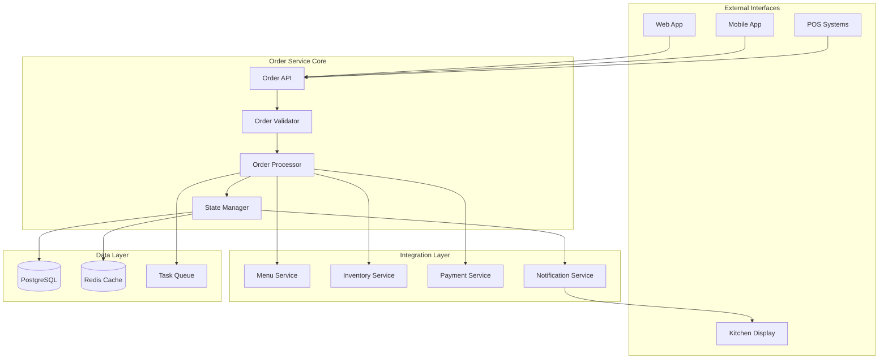
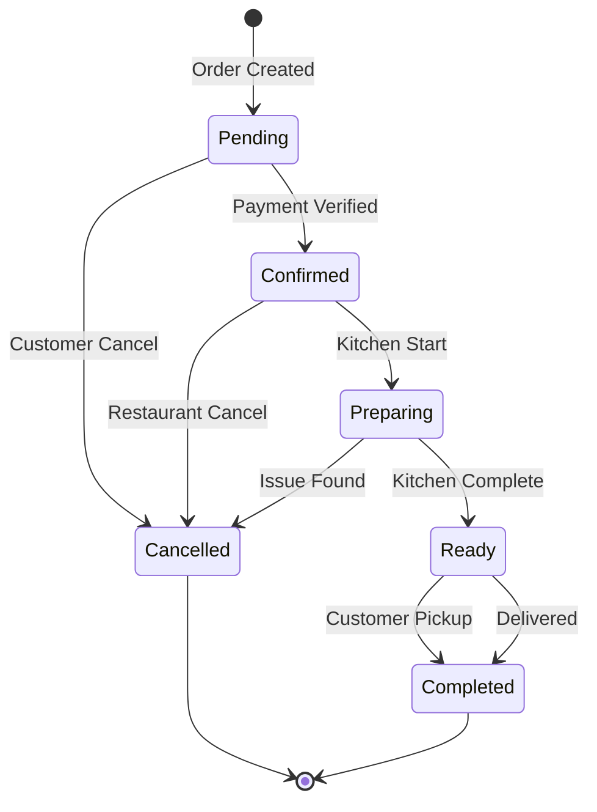

# Orders Module

## Table of Contents

1. [Overview](#overview)
2. [Key Features](#key-features)
3. [Architecture Overview](#architecture-overview)
4. [Quick Start](#quick-start)
5. [API Endpoints](#api-endpoints)
6. [Order States](#order-states)
7. [Order Processing](#order-processing)
8. [Integration Points](#integration-points)
9. [Events](#events)
10. [Order Tracking & Notifications](#order-tracking-notifications)
11. [Error Handling](#error-handling)
12. [Performance Optimization](#performance-optimization)
13. [Configuration](#configuration)
14. [Testing](#testing)
15. [Related Documentation](#related-documentation)

## Overview

The Orders module is the central hub for all order-related operations in AuraConnect. It handles order creation, processing, tracking, and fulfillment across multiple channels including dine-in, takeout, delivery, and online ordering.

## Key Features

- 📦 **Multi-channel Order Management**: Support for dine-in, takeout, delivery, and online orders
- 🌍 **Real-time Synchronization**: Live updates across all connected devices
- 🍳 **Kitchen Integration**: Direct communication with kitchen display systems
- 💳 **Payment Processing**: Integrated payment handling with multiple providers
- 📨 **Order Tracking**: Real-time status updates with push notifications
- 📈 **Analytics Integration**: Comprehensive order analytics and reporting
- 🔄 **POS Synchronization**: Bidirectional sync with major POS systems
- 📋 **Special Instructions**: Support for customer preferences and modifications

## Architecture Overview



## Quick Start

### Prerequisites

- Python 3.11+
- PostgreSQL 14+
- Redis 6+
- Access to Menu and Inventory services

### Installation

```bash
# Navigate to the orders module
cd backend/modules/orders

# Install dependencies
pip install -r requirements.txt

# Run migrations
alembic upgrade head

# Start the service
uvicorn main:app --reload --port 8002
```

### Basic Usage

```python
import requests

# Create a new order
order_data = {
    "customer_id": 123,
    "location_id": 1,
    "order_type": "dine_in",
    "table_number": "5",
    "items": [
        {
            "menu_item_id": 10,
            "quantity": 2,
            "modifiers": ["extra_cheese", "no_onions"],
            "special_instructions": "Well done"
        }
    ]
}

response = requests.post(
    "http://localhost:8002/api/v1/orders",
    json=order_data,
    headers={"Authorization": "Bearer <token>"}
)

order = response.json()
print(f"Order created: {order['order_number']}")
```

## Core Components

### 1. Order Processor
Handles the business logic for order creation, validation, and processing.

### 2. State Manager
Manages order state transitions and ensures consistency across the system.

### 3. Integration Services
Provides seamless integration with Menu, Inventory, and Payment services.

### 4. Real-time Updates
Uses Redis pub/sub for live order status updates.

## API Endpoints

> 📌 **See also**: [Complete Orders API Reference](./api-reference.md) for detailed endpoint documentation with request/response examples.

### Order Management

| Endpoint | Method | Description |
|----------|--------|-------------|
| `/api/v1/orders` | GET | List orders with filtering |
| `/api/v1/orders` | POST | Create new order |
| `/api/v1/orders/{id}` | GET | Get order details |
| `/api/v1/orders/{id}` | PUT | Update order |
| `/api/v1/orders/{id}/status` | PUT | Update order status |
| `/api/v1/orders/{id}/cancel` | POST | Cancel order |

### Order Items

| Endpoint | Method | Description |
|----------|--------|-------------|
| `/api/v1/orders/{id}/items` | POST | Add items to order |
| `/api/v1/orders/{id}/items/{item_id}` | PUT | Update order item |
| `/api/v1/orders/{id}/items/{item_id}` | DELETE | Remove order item |

### Kitchen Integration

| Endpoint | Method | Description |
|----------|--------|-------------|
| `/api/v1/kitchen/orders` | GET | Get kitchen queue |
| `/api/v1/kitchen/orders/{id}/prepare` | POST | Mark order as preparing |
| `/api/v1/kitchen/orders/{id}/ready` | POST | Mark order as ready |

### Order Tracking

| Endpoint | Method | Description |
|----------|--------|-------------|
| `/api/v1/orders/{id}/track` | GET | Get tracking info |
| `/api/v1/orders/track/{code}` | GET | Track by code (no auth) |
| `/api/v1/orders/{id}/notifications` | GET | Get notification history |
| `/api/v1/orders/{id}/subscribe` | POST | Subscribe to updates |
| `/api/v1/orders/{id}/eta` | GET | Get estimated time |

[View Complete API Reference](./api-reference.md)

## Order States



## Database Schema

### Core Tables

- `orders` - Main order information
- `order_items` - Individual items in orders
- `order_modifiers` - Item modifications
- `order_status_history` - Status change tracking
- `order_payments` - Payment information

View Complete Schema (Coming Soon)

## Integration Points

### Menu Service
- Validates menu items and pricing
- Retrieves item details and modifiers
- Checks item availability

### Inventory Service
- Deducts inventory on order confirmation
- Checks stock availability
- Updates ingredient usage

### Payment Service
- Processes payments
- Handles refunds
- Manages payment methods

### Notification Service
- Sends order confirmations
- Updates customers on status changes
- Alerts staff of new orders

## Events

The Orders module publishes the following events:

| Event | Description | Payload |
|-------|-------------|------|
| `order.created` | New order created | Order details |
| `order.confirmed` | Order confirmed | Order ID, timestamp |
| `order.preparing` | Kitchen started order | Order ID, kitchen station |
| `order.ready` | Order ready for pickup | Order ID, preparation time |
| `order.completed` | Order fulfilled | Order ID, completion time |
| `order.cancelled` | Order cancelled | Order ID, reason |
| `order.updated` | Order details updated | Order ID, changes |
| `order.tracking.viewed` | Tracking page accessed | Order ID, viewer info |

## Order Tracking & Notifications

### Real-time Tracking Features

- **Unique Tracking Codes**: Each order gets a shareable tracking code
- **Anonymous Access**: Customers can track without login using the code
- **Live Status Updates**: WebSocket connections for real-time updates
- **Location Tracking**: For delivery orders with driver location
- **ETA Calculation**: Dynamic time estimates based on kitchen load

### Notification Channels

```python
# Notification configuration
notification_config = {
    "channels": {
        "email": {
            "enabled": True,
            "templates": {
                "order_confirmed": "order-confirmed.html",
                "order_ready": "order-ready.html",
                "order_delivered": "order-delivered.html"
            }
        },
        "sms": {
            "enabled": True,
            "provider": "twilio",
            "from_number": "+1234567890"
        },
        "push": {
            "enabled": True,
            "providers": ["firebase", "apns"],
            "priority": "high"
        },
        "whatsapp": {
            "enabled": True,
            "business_number": "+1234567890"
        }
    }
}
```

### WebSocket Integration

```javascript
// Customer connects to track order
const ws = new WebSocket(`wss://api.restaurant.com/ws/orders/${orderId}/track`);

ws.onmessage = (event) => {
    const update = JSON.parse(event.data);
    switch(update.type) {
        case 'status_changed':
            updateOrderStatus(update.status);
            break;
        case 'location_update':
            updateDriverLocation(update.location);
            break;
        case 'eta_changed':
            updateEstimatedTime(update.eta);
            break;
    }
};
```

### Tracking Page Features

```python
# Tracking page data
tracking_info = {
    "order_id": "ORD-123456",
    "tracking_code": "TRK-ABC123",
    "status": "preparing",
    "status_history": [
        {"status": "confirmed", "timestamp": "2024-01-20T10:30:00Z"},
        {"status": "preparing", "timestamp": "2024-01-20T10:35:00Z"}
    ],
    "estimated_ready_time": "2024-01-20T11:00:00Z",
    "items": [
        {"name": "Margherita Pizza", "quantity": 1},
        {"name": "Caesar Salad", "quantity": 2}
    ],
    "restaurant": {
        "name": "Pizza Palace",
        "phone": "(555) 123-4567",
        "address": "123 Main St"
    },
    "delivery_info": {
        "driver": {"name": "John D.", "phone": "(555) 987-6543"},
        "current_location": {"lat": 40.7128, "lng": -74.0060},
        "estimated_arrival": "2024-01-20T11:30:00Z"
    }
}
```

### Push Notification Examples

```json
{
    "order_confirmed": {
        "title": "Order Confirmed! 🎉",
        "body": "Your order #12345 has been confirmed and will be ready in ~30 minutes",
        "icon": "/icon-192.png",
        "badge": "/badge-72.png",
        "data": {
            "order_id": "12345",
            "tracking_url": "/track/TRK-ABC123"
        }
    },
    "order_ready": {
        "title": "Your order is ready! 🍕",
        "body": "Order #12345 is ready for pickup",
        "actions": [
            {"action": "view", "title": "View Order"},
            {"action": "directions", "title": "Get Directions"}
        ]
    }
}

## Configuration

```yaml
# config/orders.yaml
orders:
  max_items_per_order: 50
  order_timeout_minutes: 120
  auto_confirm_enabled: true
  
integrations:
  menu_service_url: "http://menu-service:8001"
  inventory_service_url: "http://inventory-service:8003"
  payment_service_url: "http://payment-service:8004"
  
notifications:
  enabled: true
  channels:
    - email
    - sms
    - push
```

## Performance Considerations

- Orders are cached in Redis for 30 minutes
- Database queries use proper indexing
- Bulk operations are processed asynchronously
- Real-time updates use pub/sub to minimize polling

## Security

- All endpoints require authentication
- Role-based permissions for order operations
- PII data is encrypted at rest
- Audit logs for all order modifications

## Testing

```bash
# Run unit tests
pytest tests/unit/

# Run integration tests
pytest tests/integration/

# Run with coverage
pytest --cov=orders tests/
```

## Troubleshooting

### Common Issues

1. **Order Creation Fails**
   - Check menu item availability
   - Verify customer authentication
   - Ensure inventory levels

2. **Status Updates Not Reflecting**
   - Check Redis connection
   - Verify WebSocket connectivity
   - Review event bus configuration

3. **Payment Processing Errors**
   - Validate payment service connection
   - Check payment method validity
   - Review transaction logs

## Monitoring

Key metrics to monitor:

- Order creation rate
- Average processing time
- Order fulfillment rate
- Error rates by type
- Payment success rate

## Related Documentation

- [Architecture Details](./architecture.md)
- [API Reference](./api-reference.md)
- Database Schema (Coming Soon)
- Integration Guide (Coming Soon)
- Examples (Coming Soon)

## Support

- **Module Owner**: Orders Team
- **Email**: orders-team@auraconnect.com
- **Slack**: #orders-module

---

*Last Updated: January 2025*