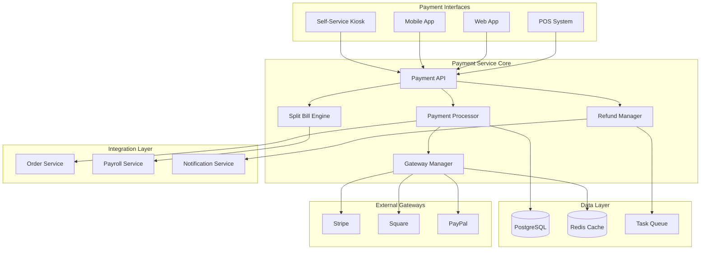
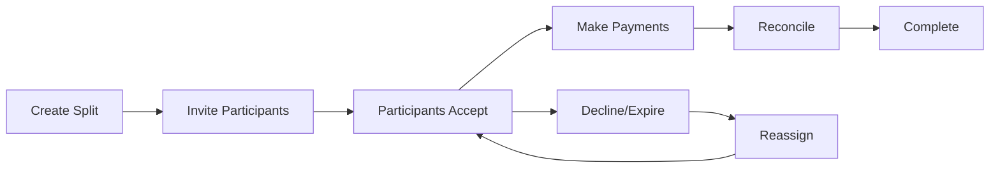
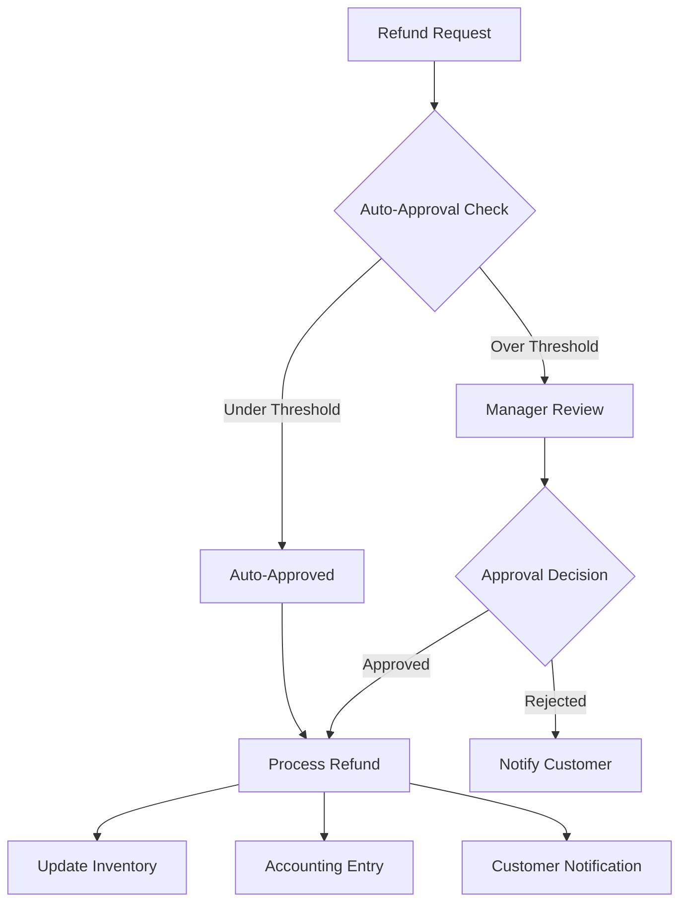

# Payments Module

## Table of Contents

1. [Overview](#overview)
2. [Key Features](#key-features)
3. [Architecture Overview](#architecture-overview)
4. [Quick Start](#quick-start)
5. [Core Components](#core-components)
6. [API Endpoints](#api-endpoints)
7. [Payment Gateway Integration](#payment-gateway-integration)
8. [Split Bill Management](#split-bill-management)
9. [Refund Processing](#refund-processing)
10. [Tip Management](#tip-management)
11. [Security Features](#security-features)
12. [Webhook Handling](#webhook-handling)
13. [Testing](#testing)
14. [Configuration](#configuration)
15. [Troubleshooting](#troubleshooting)
16. [Related Documentation](#related-documentation)

## Overview

The Payments module provides a comprehensive payment processing system with multi-gateway support, split bill functionality, refund management, and tip distribution. It integrates seamlessly with orders, payroll, and accounting systems.

## Key Features

- 💳 **Multi-Gateway Support**: Stripe, Square, PayPal integration
- 🔄 **Unified Payment Interface**: Consistent API across all gateways
- 📱 **Split Bill Management**: Flexible bill splitting with multiple methods
- 💰 **Refund Processing**: Automated refund workflow with approval rules
- 💵 **Tip Management**: Calculation and distribution to staff
- 🔐 **PCI Compliance**: Token-based secure payment processing
- 🔄 **Webhook Integration**: Real-time payment status updates
- 📊 **Analytics**: Payment metrics and reporting

## Architecture Overview



## Quick Start

### Prerequisites

- Python 3.11+
- PostgreSQL 14+
- Redis 6+
- Payment gateway credentials (Stripe, Square, or PayPal)

### Installation

```bash
# Navigate to the payments module
cd backend/modules/payments

# Install dependencies
pip install -r requirements.txt

# Run migrations
alembic upgrade head

# Configure payment gateways
export STRIPE_API_KEY="your_stripe_key"
export SQUARE_ACCESS_TOKEN="your_square_token"
export PAYPAL_CLIENT_ID="your_paypal_client_id"

# Start the service
uvicorn main:app --reload --port 8008
```

### Basic Usage

```python
import requests

# Create a payment
payment_data = {
    "order_id": 123,
    "amount": 45.99,
    "currency": "USD",
    "gateway": "stripe",
    "payment_method": {
        "type": "card",
        "token": "tok_visa"
    }
}

response = requests.post(
    "http://localhost:8008/api/v1/payments",
    json=payment_data,
    headers={"Authorization": "Bearer <token>"}
)

payment = response.json()

# Split a bill
split_data = {
    "order_id": 123,
    "split_method": "equal",
    "participant_count": 4,
    "include_tip": True,
    "tip_percentage": 18
}

split_response = requests.post(
    "http://localhost:8008/api/v1/payments/split",
    json=split_data,
    headers={"Authorization": "Bearer <token>"}
)
```

## Core Components

### 1. Payment Processor

Handles payment creation, capture, and cancellation across all gateways.

```python
class PaymentProcessor:
    def create_payment(self, 
                      amount: Decimal, 
                      gateway: PaymentGateway,
                      payment_method: PaymentMethod) -> Payment:
        # Validate payment data
        # Select appropriate gateway
        # Process payment with idempotency
        # Handle gateway response
        # Update payment status
        pass
```

### 2. Gateway Manager

Manages multiple payment gateway integrations with a unified interface.

```python
class GatewayManager:
    def get_gateway(self, gateway_type: str) -> PaymentGateway:
        # Return configured gateway instance
        pass
        
    def process_payment(self, 
                       gateway: PaymentGateway,
                       payment_data: dict) -> GatewayResponse:
        # Process payment through selected gateway
        pass
```

### 3. Split Bill Engine

Handles complex bill splitting scenarios.

```python
class SplitBillEngine:
    def create_split(self,
                    order: Order,
                    method: SplitMethod,
                    participants: List[Participant]) -> BillSplit:
        # Calculate individual amounts
        # Create participant entries
        # Generate payment links
        # Track payment status
        pass
```

## API Endpoints

> 📌 **See also**: [Payment Processing in API Reference](../../api/README.md#financial-management) for complete API documentation.

### Payment Management

| Endpoint | Method | Description |
|----------|--------|-------------|
| `/api/v1/payments` | POST | Create payment |
| `/api/v1/payments/{id}` | GET | Get payment details |
| `/api/v1/payments/{id}/capture` | POST | Capture authorized payment |
| `/api/v1/payments/{id}/cancel` | POST | Cancel payment |
| `/api/v1/payments/methods` | GET | List saved payment methods |
| `/api/v1/payments/methods` | POST | Save payment method |

### Split Bill Management

| Endpoint | Method | Description |
|----------|--------|-------------|
| `/api/v1/payments/split` | POST | Create bill split |
| `/api/v1/payments/split/{id}` | GET | Get split details |
| `/api/v1/payments/split/{id}/participants` | GET | List participants |
| `/api/v1/payments/split/{token}/accept` | POST | Accept split invitation |
| `/api/v1/payments/split/{token}/pay` | POST | Pay split portion |

### Refund Management

| Endpoint | Method | Description |
|----------|--------|-------------|
| `/api/v1/payments/refunds` | POST | Create refund request |
| `/api/v1/payments/refunds/{id}` | GET | Get refund details |
| `/api/v1/payments/refunds/{id}/approve` | POST | Approve refund |
| `/api/v1/payments/refunds/{id}/process` | POST | Process refund |

## Payment Gateway Integration

### Supported Gateways

1. **Stripe**
   - Card payments
   - Digital wallets
   - Bank transfers
   - Recurring payments

2. **Square**
   - In-person payments
   - Online payments
   - Gift cards
   - Loyalty integration

3. **PayPal**
   - PayPal checkout
   - Venmo
   - PayPal Credit
   - International payments

### Gateway Configuration

```yaml
# config/payments.yaml
payments:
  gateways:
    stripe:
      api_key: ${STRIPE_API_KEY}
      webhook_secret: ${STRIPE_WEBHOOK_SECRET}
      capture_method: "manual"
      
    square:
      access_token: ${SQUARE_ACCESS_TOKEN}
      location_id: ${SQUARE_LOCATION_ID}
      environment: "production"
      
    paypal:
      client_id: ${PAYPAL_CLIENT_ID}
      client_secret: ${PAYPAL_CLIENT_SECRET}
      mode: "live"
```

## Split Bill Management

### Split Methods

1. **Equal Split**: Divide total equally among participants
2. **Percentage Split**: Assign percentage to each participant
3. **Amount Split**: Specify exact amount per participant
4. **Item-Based Split**: Assign specific items to participants
5. **Custom Split**: Manual allocation with validation

### Split Bill Workflow



### Example: Creating an Item-Based Split

```python
# Split by items
split_data = {
    "order_id": 123,
    "split_method": "item_based",
    "participants": [
        {
            "name": "Alice",
            "email": "alice@example.com",
            "items": [1, 3, 5],  # Order item IDs
            "tip_percentage": 20
        },
        {
            "name": "Bob",
            "email": "bob@example.com",
            "items": [2, 4],
            "tip_percentage": 18
        }
    ]
}
```

## Refund Processing

### Refund Categories

1. **Quality Issues**: Food quality, incorrect order
2. **Service Issues**: Poor service, long wait times
3. **Technical Issues**: App errors, payment problems
4. **Customer Request**: Changed mind, allergies
5. **Operational Issues**: Restaurant closure, out of stock

### Refund Workflow



### Refund Policy Configuration

```python
refund_policy = {
    "auto_approval_threshold": 25.00,
    "max_refund_percentage": 100,
    "time_limit_hours": 24,
    "reasons_requiring_approval": [
        "CUSTOMER_CHANGED_MIND",
        "NO_REASON_PROVIDED"
    ],
    "notification_settings": {
        "customer": True,
        "manager": True,
        "accounting": True
    }
}
```

## Tip Management

### Tip Calculation Methods

1. **Percentage**: Based on order subtotal
2. **Fixed Amount**: Specific dollar amount
3. **Round Up**: Round total to nearest dollar
4. **Custom**: Manual entry

### Tip Distribution

```python
# Configure tip distribution
tip_distribution = {
    "method": "pool",  # pool, percentage, role_based, direct
    "rules": {
        "servers": 0.7,
        "kitchen": 0.2,
        "host": 0.1
    },
    "frequency": "daily",
    "integration": "payroll"
}
```

## Security Features

### PCI Compliance

- No storage of card numbers
- Token-based processing
- TLS encryption for all API calls
- Regular security audits

### Authentication & Authorization

```python
# Required permissions
permissions = {
    "create_payment": ["pos", "cashier", "manager"],
    "process_refund": ["manager", "admin"],
    "view_reports": ["manager", "admin", "accountant"],
    "configure_gateways": ["admin"]
}
```

### Data Protection

- Encrypted payment tokens
- Secure webhook endpoints
- Audit logging for all transactions
- GDPR compliance for customer data

## Webhook Handling

### Webhook Endpoints

```python
@router.post("/webhooks/stripe")
async def handle_stripe_webhook(request: Request):
    # Verify signature
    # Process event
    # Update payment status
    # Trigger notifications
    pass

@router.post("/webhooks/square")
async def handle_square_webhook(request: Request):
    # Similar processing for Square
    pass
```

### Event Types Handled

- Payment completed
- Payment failed
- Refund processed
- Dispute created
- Card updated

## Testing

```bash
# Run unit tests
pytest tests/unit/

# Run integration tests
pytest tests/integration/

# Test payment gateways (sandbox)
pytest tests/test_gateways.py -v

# Test split bill scenarios
pytest tests/test_split_bill.py -v

# Test refund workflows
pytest tests/test_refunds.py -v
```

## Configuration

```yaml
# config/payments.yaml
payments:
  default_currency: USD
  supported_currencies: [USD, CAD, EUR]
  
  processing:
    timeout_seconds: 30
    retry_attempts: 3
    idempotency_window_hours: 24
    
  split_bill:
    expiration_hours: 48
    reminder_intervals: [12, 24, 36]
    max_participants: 20
    
  refunds:
    auto_approval_threshold: 25.00
    processing_time_hours: 24
    retention_days: 90
    
  tips:
    suggested_percentages: [15, 18, 20, 25]
    max_percentage: 50
    distribution_frequency: daily
```

## Monitoring

### Key Metrics

```prometheus
# Payment success rate
payment_success_rate{gateway="stripe"} 0.98

# Average processing time
payment_processing_duration_seconds{gateway="square"} 1.2

# Refund request rate
refund_requests_total{reason="quality_issue"} 23

# Split bill completion rate
split_bill_completion_rate 0.85
```

## Troubleshooting

### Common Issues

1. **Payment Declined**
   - Check card details
   - Verify sufficient funds
   - Review gateway logs

2. **Split Bill Not Completing**
   - Check participant status
   - Verify payment methods
   - Review expiration settings

3. **Refund Not Processing**
   - Verify original payment status
   - Check refund policy limits
   - Review gateway capabilities

4. **Webhook Not Received**
   - Verify endpoint URL
   - Check signature validation
   - Review firewall settings

## Related Documentation

- [Order Processing](../orders/README.md)
- [Payroll Integration](../payroll/README.md)
- [Analytics & Reporting](../analytics/README.md)
- [API Reference](../../api/README.md)
- [Security Guide](../../guides/security.md)

## Support

- **Module Owner**: Payments Team
- **Email**: payments-team@auraconnect.com
- **Slack**: #payments-module

---

*Last Updated: January 2025*