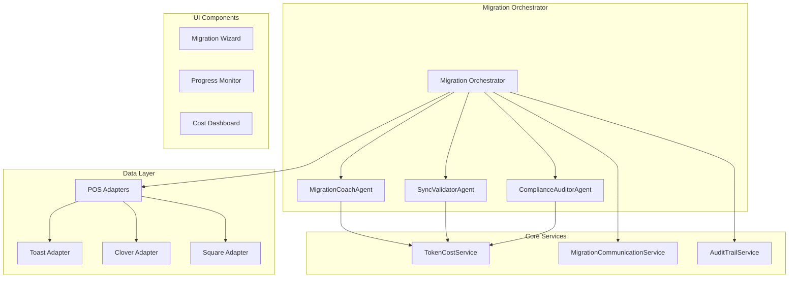

# POS Migration Suite - Technical Documentation

## Overview

The AuraConnect POS Migration Suite is an AI-powered, enterprise-grade solution that transforms complex POS data migrations into guided, automated experiences. This document outlines the technical architecture, implementation details, and operational guidelines.

## Architecture Overview



## AI Agents

### MigrationCoachAgent

**Purpose**: Provides intelligent guidance throughout the migration process

**Key Features**:
- Analyzes POS data structures
- Suggests optimal field mappings with confidence scores
- Identifies data transformation requirements
- Estimates migration complexity and timeline

**Implementation**:
```python
# Location: backend/modules/pos_migration/agents/migration_coach_agent.py
class MigrationCoachAgent:
    async def analyze_pos_structure(self, pos_type, sample_data, target_schema)
    async def suggest_field_mappings(self, source_fields, target_fields, context)
    async def estimate_complexity(self, data_stats)
```

### SyncValidatorAgent

**Purpose**: Validates data integrity and detects anomalies

**Key Features**:
- ML-powered pricing anomaly detection
- Modifier logic validation
- Data completeness checks
- Duplicate detection

**Implementation**:
```python
# Location: backend/modules/pos_migration/agents/sync_validator_agent.py
class SyncValidatorAgent:
    async def validate_pricing_data(self, items, pos_type)
    async def check_modifier_consistency(self, modifiers)
    async def detect_duplicates(self, items)
```

### ComplianceAuditorAgent

**Purpose**: Ensures regulatory compliance throughout migration

**Key Features**:
- GDPR/CCPA compliance verification
- Customer consent tracking
- Audit trail generation
- Data retention policy enforcement

**Implementation**:
```python
# Location: backend/modules/pos_migration/agents/compliance_auditor_agent.py
class ComplianceAuditorAgent:
    async def verify_customer_consent(self, customers)
    async def generate_audit_report(self, migration_id)
    async def check_data_retention_compliance(self, data_categories)
```

## Core Services

### TokenCostService

**Purpose**: Track and optimize AI token usage

**Features**:
- Real-time usage tracking per tenant/operation
- Cost calculation across multiple AI providers
- Budget alerts and limits
- Optimization recommendations

**Database Schema**:
```sql
CREATE TABLE token_usage (
    id SERIAL PRIMARY KEY,
    tenant_id UUID NOT NULL,
    migration_id UUID,
    operation_type VARCHAR(50) NOT NULL,
    model VARCHAR(50) NOT NULL,
    input_tokens INTEGER NOT NULL,
    output_tokens INTEGER NOT NULL,
    cost_usd DECIMAL(10, 6) NOT NULL,
    created_at TIMESTAMP DEFAULT CURRENT_TIMESTAMP,
    
    INDEX idx_tenant_usage (tenant_id, created_at),
    INDEX idx_migration_usage (migration_id)
);
```

### MigrationCommunicationService

**Purpose**: Automated customer communication

**Features**:
- Multi-channel notifications (email, SMS, in-app)
- Personalized AI-generated content
- Consent management
- Progress updates

**Communication Templates**:
- Migration announcement
- Consent request
- Progress updates
- Completion summary
- Error notifications

## Fallback Strategies

### AI Service Failures

1. **Cached Suggestions**:
```python
class FallbackCache:
    def __init__(self, redis_client):
        self.cache = redis_client
        self.ttl = 86400  # 24 hours
    
    async def get_cached_mapping(self, source_schema_hash):
        return await self.cache.get(f"mapping:{source_schema_hash}")
```

2. **Rule-Based Mappings**:
```python
COMMON_FIELD_MAPPINGS = {
    # Toast
    "itemName": "name",
    "itemPrice": "price",
    "categoryName": "category_id",
    
    # Clover
    "name": "name",
    "price": "price",
    "categories": "category_id",
    
    # Square
    "item_data.name": "name",
    "item_data.variations[0].price_money.amount": "price"
}
```

3. **Offline Mode**:
```python
class OfflineMigrationService:
    def suggest_mappings_offline(self, source_fields, target_fields):
        # Use Levenshtein distance for basic matching
        # Apply common patterns
        # Return confidence scores based on match quality
```

## Human Oversight Features

### Mapping Review UI

```typescript
interface MappingReview {
  mappings: FieldMapping[];
  confidenceThreshold: number;
  showOnlyLowConfidence: boolean;
  allowBulkEdit: boolean;
  exportFormat: 'csv' | 'json' | 'xlsx';
}

// Visual indicators:
// 🟢 High confidence (> 90%)
// 🟡 Medium confidence (70-90%)
// 🔴 Low confidence (< 70%)
// ❓ No AI suggestion available
```

### Audit Trail

```python
class MigrationAuditLog:
    def log_ai_suggestion(self, suggestion):
        return {
            "timestamp": datetime.utcnow(),
            "type": "ai_suggestion",
            "agent": suggestion.agent_name,
            "prompt_hash": hashlib.sha256(suggestion.prompt.encode()).hexdigest(),
            "response_summary": suggestion.summary,
            "confidence": suggestion.confidence,
            "tokens_used": suggestion.token_count
        }
    
    def log_human_override(self, original, modified, reason):
        return {
            "timestamp": datetime.utcnow(),
            "type": "human_override",
            "original_suggestion": original,
            "modified_value": modified,
            "reason": reason,
            "user_id": current_user.id
        }
```

## Performance Optimization

### Token Usage Optimization

1. **Batch Processing**:
```python
# Instead of individual field mappings
await map_field("itemName", target_fields)  # 500 tokens
await map_field("itemPrice", target_fields)  # 500 tokens

# Batch all fields together
await map_fields(all_source_fields, target_fields)  # 800 tokens total
```

2. **Smart Caching**:
```python
# Cache common patterns
@lru_cache(maxsize=1000)
def get_field_mapping_prompt(source_type, target_type):
    return MAPPING_PROMPTS.get((source_type, target_type))
```

3. **Progressive Enhancement**:
```python
# Start with cheap models, escalate if needed
models = ["gpt-3.5-turbo", "gpt-4", "gpt-4-turbo"]
for model in models:
    result = await try_with_model(model, prompt)
    if result.confidence > 0.8:
        break
```

## Security Considerations

### Data Privacy

1. **PII Handling**:
- Never send full customer records to AI
- Use data masking for sensitive fields
- Process on-premises when possible

2. **Audit Compliance**:
- Log all data access with purpose
- Implement retention policies
- Support right-to-deletion

### API Security

```python
class MigrationAPIAuth:
    required_permissions = {
        "/migration/start": ["migration.write", "tenant.admin"],
        "/migration/preview": ["migration.read"],
        "/migration/ai/suggest": ["migration.ai.use"]
    }
```

## Monitoring & Observability

### Key Metrics

```python
MIGRATION_METRICS = {
    # Performance
    "migration.duration": "histogram",
    "migration.items_per_second": "gauge",
    
    # AI Usage
    "ai.tokens.used": "counter",
    "ai.cost.usd": "counter",
    "ai.latency": "histogram",
    
    # Quality
    "migration.errors": "counter",
    "migration.validation_failures": "counter",
    "human.overrides": "counter",
    
    # Business
    "migration.completed": "counter",
    "migration.revenue": "counter"
}
```

### Alerts

```yaml
alerts:
  - name: HighTokenUsage
    condition: ai.tokens.used > 100000 per hour
    action: notify_ops
    
  - name: MigrationStalled
    condition: migration.progress.unchanged for 30 minutes
    action: notify_customer_success
    
  - name: HighErrorRate
    condition: migration.errors / migration.attempts > 0.1
    action: page_oncall
```

## Testing Strategy

### Unit Tests
- Agent logic with mocked AI responses
- Fallback behavior
- Cost calculations

### Integration Tests
- POS adapter connections
- End-to-end migration flow
- WebSocket progress updates

### Load Tests
- Concurrent migrations
- Large dataset handling (10k+ items)
- AI service rate limiting

### Compliance Tests
- GDPR consent flows
- Audit trail completeness
- Data retention verification

## Deployment Guide

### Prerequisites
- PostgreSQL 14+
- Redis 6+
- OpenAI API key
- POS API credentials

### Environment Variables
```bash
# AI Configuration
OPENAI_API_KEY=sk-...
AI_MODEL_DEFAULT=gpt-4
AI_TOKEN_LIMIT_PER_TENANT=1000000

# Migration Settings
MIGRATION_BATCH_SIZE=100
MIGRATION_TIMEOUT_MINUTES=120
MIGRATION_RETRY_ATTEMPTS=3

# Feature Flags
ENABLE_AI_COACH=true
ENABLE_COMPLIANCE_AUDIT=true
ENABLE_COST_TRACKING=true
```

### Migration Rollback

```python
class MigrationRollback:
    async def rollback(self, migration_id: str):
        # 1. Stop any in-progress operations
        # 2. Restore from pre-migration snapshot
        # 3. Notify affected systems
        # 4. Generate rollback report
```

## Support Playbook

### Common Issues

1. **AI Timeout**
   - Switch to fallback mode
   - Continue with cached suggestions
   - Alert customer of degraded experience

2. **POS API Rate Limit**
   - Implement exponential backoff
   - Queue requests
   - Notify customer of delays

3. **Data Quality Issues**
   - Flag for manual review
   - Provide detailed validation report
   - Offer data cleanup tools

### Escalation Path

1. L1: Customer Success (basic troubleshooting)
2. L2: Migration Specialists (technical issues)
3. L3: Engineering (code fixes)
4. L4: AI/ML Team (model improvements)