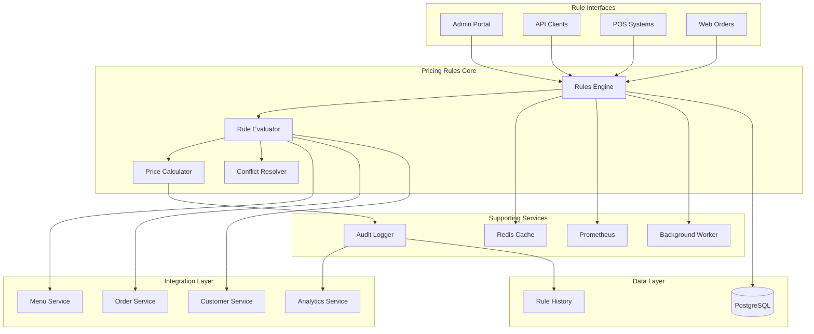

# Pricing Rules Module

## Table of Contents

1. [Overview](#overview)
2. [Key Features](#key-features)
3. [Architecture Overview](#architecture-overview)
4. [Quick Start](#quick-start)
5. [Rule Types](#rule-types)
6. [Rule Conditions](#rule-conditions)
7. [API Endpoints](#api-endpoints)
8. [Conflict Resolution](#conflict-resolution)
9. [Promo Codes](#promo-codes)
10. [Debugging & Monitoring](#debugging-monitoring)
11. [Integration Points](#integration-points)
12. [Configuration](#configuration)
13. [Testing](#testing)
14. [Best Practices](#best-practices)
15. [Related Documentation](#related-documentation)

## Overview

The Pricing Rules module provides a flexible and powerful system for dynamic pricing, discounts, and promotions. It supports various rule types, complex conditions, conflict resolution strategies, and real-time price calculations with comprehensive monitoring and debugging capabilities.

## Key Features

- 💰 **10+ Rule Types**: Percentage, fixed, BOGO, bundle, happy hour, and more
- 🎯 **Flexible Conditions**: Time, items, customers, order value based
- 🔄 **Smart Conflict Resolution**: 5 strategies for handling overlapping rules
- 📊 **Rule Stacking**: Support for combining compatible rules
- 🎫 **Promo Code Management**: Customer and campaign specific codes
- 🐛 **Debug Mode**: Detailed rule evaluation explanations
- 📈 **Prometheus Metrics**: Performance and usage monitoring
- 🔍 **Audit Trail**: Complete history of rule applications

## Architecture Overview



## Quick Start

### Prerequisites

- Python 3.11+
- PostgreSQL 14+
- Redis 6+
- Prometheus (for metrics)

### Installation

```bash
# Navigate to pricing rules module
cd backend/modules/pricing_rules

# Install dependencies
pip install -r requirements.txt

# Run migrations
alembic upgrade head

# Start the service
uvicorn main:app --reload --port 8011

# Start background worker
celery -A tasks worker --loglevel=info
```

### Basic Usage

```python
import requests
from datetime import datetime, timedelta

# Create a percentage discount rule
rule_data = {
    "name": "Weekend Special - 20% Off",
    "rule_type": "percentage_discount",
    "priority": 100,
    "discount_value": 20.0,
    "conditions": {
        "days_of_week": ["saturday", "sunday"],
        "min_order_value": 30.0
    },
    "start_date": datetime.now().isoformat(),
    "end_date": (datetime.now() + timedelta(days=30)).isoformat(),
    "is_active": True
}

response = requests.post(
    "http://localhost:8011/api/v1/pricing-rules",
    json=rule_data,
    headers={"Authorization": "Bearer <token>"}
)

rule = response.json()
print(f"Rule created: {rule['id']}")
```

## Rule Types

### 1. Percentage Discount
```python
{
    "rule_type": "percentage_discount",
    "discount_value": 15.0,  # 15% off
    "conditions": {
        "min_order_value": 50.0
    }
}
```

### 2. Fixed Amount Discount
```python
{
    "rule_type": "fixed_discount",
    "discount_value": 10.0,  # $10 off
    "conditions": {
        "first_time_customer": True
    }
}
```

### 3. Buy One Get One (BOGO)
```python
{
    "rule_type": "bogo",
    "config": {
        "buy_quantity": 2,
        "get_quantity": 1,
        "get_percentage": 100.0  # Free
    },
    "conditions": {
        "menu_items": [123, 124, 125],
        "categories": ["beverages"]
    }
}
```

### 4. Bundle Pricing
```python
{
    "rule_type": "bundle",
    "config": {
        "bundle_items": [
            {"item_id": 101, "quantity": 1},  # Burger
            {"item_id": 201, "quantity": 1},  # Fries
            {"item_id": 301, "quantity": 1}   # Drink
        ],
        "bundle_price": 12.99
    }
}
```

### 5. Happy Hour
```python
{
    "rule_type": "happy_hour",
    "discount_value": 50.0,  # 50% off
    "conditions": {
        "time_ranges": [
            {"start": "15:00", "end": "18:00"}
        ],
        "categories": ["beverages", "appetizers"]
    }
}
```

### 6. Tiered Pricing
```python
{
    "rule_type": "tiered",
    "config": {
        "tiers": [
            {"min_value": 50, "discount": 5},
            {"min_value": 100, "discount": 10},
            {"min_value": 200, "discount": 15}
        ]
    }
}
```

### 7. Item-Specific Pricing
```python
{
    "rule_type": "item_price_override",
    "config": {
        "item_prices": {
            "123": 9.99,  # Menu item ID: price
            "124": 7.99
        }
    }
}
```

### 8. Category Discount
```python
{
    "rule_type": "category_discount",
    "discount_value": 25.0,
    "conditions": {
        "categories": ["desserts"],
        "min_items": 2
    }
}
```

### 9. Loyalty Pricing
```python
{
    "rule_type": "loyalty",
    "config": {
        "tiers": {
            "bronze": 5,
            "silver": 10,
            "gold": 15,
            "platinum": 20
        }
    }
}
```

### 10. Flash Sale
```python
{
    "rule_type": "flash_sale",
    "discount_value": 30.0,
    "conditions": {
        "start_time": "2024-01-20T10:00:00",
        "end_time": "2024-01-20T14:00:00",
        "max_uses": 100
    }
}
```

## Rule Conditions

### Time-Based Conditions
```python
conditions = {
    "days_of_week": ["monday", "tuesday", "wednesday"],
    "time_ranges": [
        {"start": "11:00", "end": "14:00"},
        {"start": "17:00", "end": "21:00"}
    ],
    "date_ranges": [
        {
            "start": "2024-12-20",
            "end": "2024-12-31"
        }
    ]
}
```

### Item-Based Conditions
```python
conditions = {
    "menu_items": [101, 102, 103],
    "categories": ["entrees", "appetizers"],
    "exclude_items": [201, 202],
    "min_item_quantity": 2
}
```

### Customer-Based Conditions
```python
conditions = {
    "customer_segments": ["vip", "loyalty_gold"],
    "first_time_customer": False,
    "min_order_count": 5,
    "customer_tags": ["birthday_month"]
}
```

### Order-Based Conditions
```python
conditions = {
    "min_order_value": 30.0,
    "max_order_value": 200.0,
    "order_types": ["dine_in", "takeout"],
    "payment_methods": ["credit_card"]
}
```

### Complex Conditions
```python
conditions = {
    "and": [
        {"min_order_value": 50.0},
        {"or": [
            {"days_of_week": ["saturday", "sunday"]},
            {"customer_segments": ["vip"]}
        ]}
    ]
}
```

## API Endpoints

> 📌 **See also**: [Pricing Rules in API Reference](../../api/README.md#pricing-management) for complete API documentation.

### Rule Management

| Endpoint | Method | Description |
|----------|--------|-------------|
| `/api/v1/pricing-rules` | GET | List all rules |
| `/api/v1/pricing-rules` | POST | Create new rule |
| `/api/v1/pricing-rules/{id}` | GET | Get rule details |
| `/api/v1/pricing-rules/{id}` | PUT | Update rule |
| `/api/v1/pricing-rules/{id}` | DELETE | Delete rule |
| `/api/v1/pricing-rules/{id}/toggle` | POST | Enable/disable rule |

### Price Calculation

| Endpoint | Method | Description |
|----------|--------|-------------|
| `/api/v1/pricing-rules/calculate` | POST | Calculate prices with rules |
| `/api/v1/pricing-rules/preview` | POST | Preview rule effects |
| `/api/v1/pricing-rules/debug` | POST | Debug rule evaluation |

### Promo Codes

| Endpoint | Method | Description |
|----------|--------|-------------|
| `/api/v1/pricing-rules/promo-codes` | GET | List promo codes |
| `/api/v1/pricing-rules/promo-codes` | POST | Create promo code |
| `/api/v1/pricing-rules/promo-codes/validate` | POST | Validate promo code |

## Conflict Resolution

### Resolution Strategies

1. **Highest Priority Wins**
```python
conflict_resolution = "highest_priority"
# Rule with highest priority value is applied
```

2. **Best for Customer**
```python
conflict_resolution = "best_for_customer"
# Rule giving maximum discount is applied
```

3. **First Match**
```python
conflict_resolution = "first_match"
# First matching rule in priority order
```

4. **Stack Compatible**
```python
conflict_resolution = "stack_compatible"
# Apply all non-conflicting rules
```

5. **Manual Override**
```python
conflict_resolution = "manual"
# Requires manual selection
```

### Stacking Rules

```python
# Define stackable rule groups
stacking_config = {
    "allow_stacking": True,
    "stack_groups": {
        "discounts": ["percentage_discount", "loyalty"],
        "promotions": ["bogo", "bundle"],
        "exclusive": ["flash_sale", "clearance"]
    },
    "max_stack_count": 3
}
```

## Promo Codes

### Creating Promo Codes

```python
promo_code = {
    "code": "SUMMER20",
    "rule_id": 123,
    "usage_limit": 1000,
    "usage_per_customer": 1,
    "valid_from": "2024-06-01",
    "valid_until": "2024-08-31",
    "minimum_order_value": 25.0,
    "allowed_channels": ["web", "mobile"]
}
```

### Promo Code Validation

```python
# Validate promo code
validation_request = {
    "code": "SUMMER20",
    "order_value": 35.0,
    "customer_id": 456,
    "channel": "web"
}

response = requests.post(
    "/api/v1/pricing-rules/promo-codes/validate",
    json=validation_request
)

if response.json()["valid"]:
    discount = response.json()["discount_amount"]
```

## Debugging & Monitoring

### Debug Endpoint

```python
# Debug why rules are/aren't applying
debug_request = {
    "order": {
        "items": [
            {"id": 123, "quantity": 2, "price": 15.99},
            {"id": 456, "quantity": 1, "price": 8.99}
        ],
        "customer_id": 789,
        "order_type": "dine_in"
    },
    "promo_code": "TESTCODE"
}

response = requests.post(
    "/api/v1/pricing-rules/debug",
    json=debug_request
)

# Response includes:
# - All evaluated rules
# - Why each rule matched/didn't match
# - Final price calculation
# - Applied discounts
```

### Prometheus Metrics

```python
# Available metrics
pricing_rules_evaluated_total  # Counter
pricing_rules_applied_total    # Counter by rule type
pricing_rules_evaluation_duration_seconds  # Histogram
pricing_rules_discount_amount  # Histogram
pricing_rules_cache_hits_total  # Counter
pricing_rules_conflicts_total  # Counter

# Custom metrics
rule_usage_by_type = Counter(
    'pricing_rule_usage_by_type',
    'Number of times each rule type is used',
    ['rule_type']
)
```

### Monitoring Dashboard

```yaml
# Grafana dashboard queries
- Average rule evaluation time
- Most used rules
- Discount amounts distribution
- Cache hit rate
- Conflict resolution frequency
- Promo code usage
```

## Integration Points

### Menu Service
- Get item prices and categories
- Validate menu item availability
- Apply category-based rules

### Order Service
- Calculate order totals
- Apply rules during checkout
- Track rule usage per order

### Customer Service
- Retrieve customer segments
- Check loyalty status
- Validate customer eligibility

### Analytics Service
- Track rule performance
- Measure conversion impact
- ROI analysis

## Configuration

```yaml
# config/pricing_rules.yaml
pricing_rules:
  cache:
    enabled: true
    ttl_seconds: 300
    
  evaluation:
    max_rules_per_order: 10
    timeout_seconds: 2
    
  conflict_resolution:
    default_strategy: "best_for_customer"
    allow_manual_override: true
    
  stacking:
    enabled: true
    max_stack_count: 3
    max_total_discount_percentage: 50
    
  promo_codes:
    case_sensitive: false
    min_length: 4
    max_length: 20
    
  monitoring:
    metrics_enabled: true
    debug_mode: false
    audit_retention_days: 90
    
  background_worker:
    expiry_check_interval: 3600  # 1 hour
    metrics_update_interval: 300  # 5 minutes
```

## Testing

```bash
# Run unit tests
pytest tests/unit/

# Test rule evaluation
pytest tests/test_rule_evaluation.py -v

# Test conflict resolution
pytest tests/test_conflict_resolution.py -v

# Test promo codes
pytest tests/test_promo_codes.py -v

# Performance tests
pytest tests/test_performance.py --benchmark
```

### Test Scenarios

```python
# Test complex rule stacking
def test_rule_stacking():
    rules = [
        create_percentage_rule(10),  # 10% loyalty
        create_happy_hour_rule(20),   # 20% happy hour
        create_promo_code_rule(5)     # $5 off
    ]
    
    order = create_test_order(total=50.0)
    result = pricing_engine.calculate(order, rules)
    
    # Should apply: 10% + 20% = 28% off $50 = $14
    # Then $5 off = $19 total discount
    assert result.total_discount == 19.0
    assert result.final_price == 31.0
```

## Best Practices

### 1. Rule Design

- Keep conditions simple and testable
- Use descriptive rule names
- Set appropriate priorities
- Document rule purposes

### 2. Performance

- Cache frequently used rules
- Limit condition complexity
- Use batch evaluation for multiple items
- Monitor evaluation times

### 3. Conflict Management

- Define clear stacking policies
- Test rule combinations
- Use debug mode for troubleshooting
- Monitor conflict frequencies

### 4. Promo Code Security

- Use unique, hard-to-guess codes
- Implement rate limiting
- Track usage patterns
- Expire codes promptly

## Common Use Cases

### 1. Happy Hour Implementation
```python
# 50% off drinks 3-6 PM weekdays
happy_hour = {
    "name": "Weekday Happy Hour",
    "rule_type": "happy_hour",
    "discount_value": 50.0,
    "conditions": {
        "days_of_week": ["mon", "tue", "wed", "thu", "fri"],
        "time_ranges": [{"start": "15:00", "end": "18:00"}],
        "categories": ["beverages", "beer", "wine"]
    }
}
```

### 2. Loyalty Program
```python
# Tiered discounts based on loyalty status
loyalty_tiers = {
    "name": "Loyalty Rewards",
    "rule_type": "loyalty",
    "config": {
        "bronze": {"min_points": 100, "discount": 5},
        "silver": {"min_points": 500, "discount": 10},
        "gold": {"min_points": 1000, "discount": 15},
        "platinum": {"min_points": 5000, "discount": 20}
    }
}
```

### 3. Seasonal Promotion
```python
# Summer special on specific items
summer_special = {
    "name": "Summer Menu Special",
    "rule_type": "percentage_discount",
    "discount_value": 25.0,
    "conditions": {
        "date_ranges": [{
            "start": "2024-06-01",
            "end": "2024-08-31"
        }],
        "menu_items": [301, 302, 303, 304]  # Summer menu items
    },
    "marketing_text": "25% off all summer specials!"
}
```

## Related Documentation

- [Menu Module](../menu/README.md)
- [Order Processing](../orders/README.md)
- Promotions Module *(Coming Soon)*
- Analytics Module *(Coming Soon)*
- [API Reference](../../api/README.md)

## Support

- **Module Owner**: Pricing Team
- **Email**: pricing-team@auraconnect.com
- **Slack**: #pricing-rules

---

*Last Updated: January 2025*