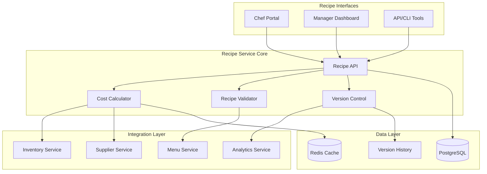
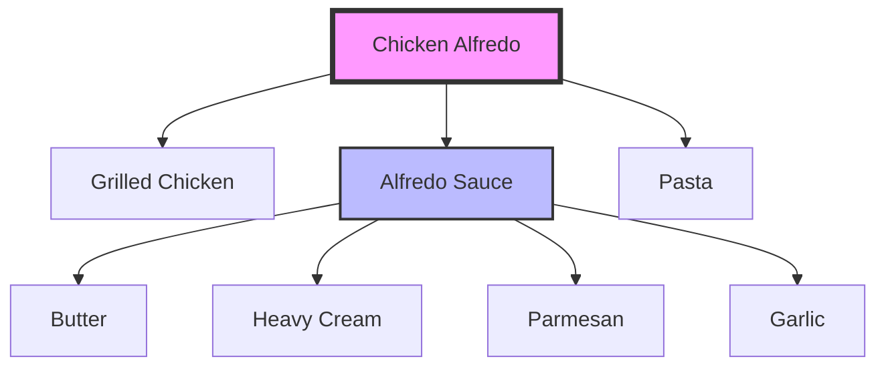

# Recipe Management Module

## Table of Contents

1. [Overview](#overview)
2. [Key Features](#key-features)
3. [Architecture Overview](#architecture-overview)
4. [Quick Start](#quick-start)
5. [Core Components](#core-components)
6. [API Endpoints](#api-endpoints)
7. [Recipe Structure](#recipe-structure)
8. [Cost Calculation](#cost-calculation)
9. [Compliance & Validation](#compliance-validation)
10. [Version Control](#version-control)
11. [Integration Points](#integration-points)
12. [Analytics & Reporting](#analytics-reporting)
13. [Configuration](#configuration)
14. [Testing](#testing)
15. [Troubleshooting](#troubleshooting)
16. [Related Documentation](#related-documentation)

## Overview

The Recipe Management module provides comprehensive Bill of Materials (BOM) functionality for menu items. It tracks ingredients, quantities, preparation steps, and automatically calculates food costs while maintaining version history and ensuring compliance.

## Key Features

- 📋 **Complete BOM Tracking**: Detailed ingredient lists with quantities
- 💰 **Automatic Cost Calculation**: Real-time food cost and profit margins
- 🔄 **Sub-Recipe Support**: Complex recipes with nested components
- 📊 **Cost Analytics**: Track cost trends and optimize pricing
- ✅ **Compliance Validation**: Ensure all menu items have recipes
- 📈 **Version Control**: Full history with rollback capability
- 🔍 **Recipe Search**: Find recipes by ingredient or cost
- 📦 **Bulk Operations**: Import/export and batch updates

## Architecture Overview



## Quick Start

### Prerequisites

- Python 3.11+
- PostgreSQL 14+
- Redis 6+
- Access to Menu and Inventory services

### Installation

```bash
# Navigate to recipe module
cd backend/modules/recipes

# Install dependencies
pip install -r requirements.txt

# Run migrations
alembic upgrade head

# Start the service
uvicorn main:app --reload --port 8010
```

### Basic Usage

```python
import requests

# Create a recipe
recipe_data = {
    "menu_item_id": 123,
    "name": "Chicken Alfredo",
    "yield_amount": 1,
    "yield_unit": "portion",
    "prep_time_minutes": 10,
    "cook_time_minutes": 15,
    "ingredients": [
        {
            "ingredient_id": 45,  # Chicken breast
            "quantity": 200,
            "unit": "g",
            "preparation_notes": "Grilled and sliced"
        },
        {
            "ingredient_id": 67,  # Alfredo sauce
            "quantity": 150,
            "unit": "ml",
            "is_sub_recipe": True
        },
        {
            "ingredient_id": 89,  # Fettuccine pasta
            "quantity": 180,
            "unit": "g",
            "preparation_notes": "Cooked al dente"
        }
    ],
    "instructions": [
        "Cook pasta according to package directions",
        "Grill chicken breast and slice",
        "Heat alfredo sauce",
        "Combine all ingredients and serve"
    ]
}

response = requests.post(
    "http://localhost:8010/api/v1/recipes",
    json=recipe_data,
    headers={"Authorization": "Bearer <token>"}
)

recipe = response.json()
print(f"Recipe created with cost: ${recipe['total_cost']}")
```

## Core Components

### 1. Recipe Builder

```python
class RecipeBuilder:
    def create_recipe(self, recipe_data: RecipeCreate) -> Recipe:
        # Validate ingredients exist
        # Check sub-recipe references
        # Calculate nutritional info
        # Compute total cost
        # Store recipe with version
        pass
        
    def clone_recipe(self, 
                    recipe_id: int,
                    adjustments: RecipeAdjustments) -> Recipe:
        # Copy existing recipe
        # Apply portion adjustments
        # Recalculate costs
        # Create new version
        pass
```

### 2. Cost Calculator

```python
class CostCalculator:
    def calculate_recipe_cost(self, recipe: Recipe) -> CostBreakdown:
        # Get current ingredient prices
        # Calculate sub-recipe costs
        # Add labor cost (optional)
        # Include overhead percentage
        # Return detailed breakdown
        pass
        
    def calculate_profit_margin(self,
                               recipe_cost: Decimal,
                               menu_price: Decimal) -> ProfitAnalysis:
        # Calculate gross margin
        # Determine markup percentage
        # Compare to target margins
        # Suggest optimal pricing
        pass
```

### 3. Recipe Validator

```python
class RecipeValidator:
    def validate_completeness(self, recipe: Recipe) -> ValidationResult:
        # Check all required fields
        # Verify ingredient availability
        # Validate measurements
        # Check nutritional data
        # Ensure cost is reasonable
        pass
        
    def check_compliance(self, restaurant_id: int) -> ComplianceReport:
        # Find menu items without recipes
        # Identify incomplete recipes
        # Check expired versions
        # Generate compliance score
        pass
```

## API Endpoints

> 📌 **See also**: [Recipe Management in API Reference](../../api/README.md#restaurant-operations) for complete API documentation.

### Recipe Management

| Endpoint | Method | Description |
|----------|--------|-------------|
| `/api/v1/recipes` | GET | List recipes |
| `/api/v1/recipes` | POST | Create recipe |
| `/api/v1/recipes/{id}` | GET | Get recipe details |
| `/api/v1/recipes/{id}` | PUT | Update recipe |
| `/api/v1/recipes/{id}` | DELETE | Delete recipe |
| `/api/v1/recipes/{id}/clone` | POST | Clone recipe |
| `/api/v1/recipes/{id}/versions` | GET | Get version history |

### Cost Analysis

| Endpoint | Method | Description |
|----------|--------|-------------|
| `/api/v1/recipes/{id}/cost` | GET | Get current cost |
| `/api/v1/recipes/cost-analysis` | GET | Analyze all costs |
| `/api/v1/recipes/margin-report` | GET | Profit margin report |
| `/api/v1/recipes/cost-trends` | GET | Cost trend analysis |

### Compliance

| Endpoint | Method | Description |
|----------|--------|-------------|
| `/api/v1/recipes/compliance` | GET | Compliance report |
| `/api/v1/recipes/validate` | POST | Validate recipes |
| `/api/v1/recipes/missing` | GET | Items without recipes |

## Recipe Structure

### Basic Recipe Model

```python
class Recipe:
    id: int
    menu_item_id: int
    name: str
    version: int
    yield_amount: Decimal
    yield_unit: str
    prep_time_minutes: int
    cook_time_minutes: int
    total_time_minutes: int
    
    # Ingredients
    ingredients: List[RecipeIngredient]
    
    # Instructions
    instructions: List[str]
    equipment_needed: List[str]
    
    # Costs
    ingredient_cost: Decimal
    labor_cost: Optional[Decimal]
    overhead_cost: Optional[Decimal]
    total_cost: Decimal
    cost_per_portion: Decimal
    
    # Metadata
    created_by: int
    created_at: datetime
    last_modified: datetime
    is_active: bool
```

### Recipe Ingredient Model

```python
class RecipeIngredient:
    ingredient_id: int
    ingredient_name: str
    quantity: Decimal
    unit: str
    preparation_notes: Optional[str]
    is_sub_recipe: bool
    
    # Costs
    unit_cost: Decimal
    total_cost: Decimal
    
    # Substitutions
    can_substitute: bool
    substitute_options: List[int]
```

### Sub-Recipe Support



## Cost Calculation

### Cost Components

```python
# Cost calculation example
cost_breakdown = {
    "ingredient_costs": [
        {"name": "Chicken", "quantity": 200, "unit": "g", "cost": 2.50},
        {"name": "Alfredo Sauce", "quantity": 150, "unit": "ml", "cost": 1.75},
        {"name": "Pasta", "quantity": 180, "unit": "g", "cost": 0.45}
    ],
    "total_ingredient_cost": 4.70,
    "labor_cost": 2.50,  # Based on prep/cook time
    "overhead_percentage": 0.15,  # 15% overhead
    "overhead_cost": 0.71,
    "total_cost": 7.91,
    "menu_price": 18.95,
    "food_cost_percentage": 24.8,
    "gross_margin": 11.04,
    "markup_percentage": 139.4
}
```

### Profit Margin Analysis

```python
# Margin analysis
margin_analysis = {
    "current_margin": {
        "food_cost_percentage": 24.8,
        "gross_profit_margin": 58.3,
        "contribution_margin": 11.04
    },
    "target_margin": {
        "food_cost_percentage": 30.0,
        "suggested_price": 15.70
    },
    "competitor_analysis": {
        "average_price": 17.50,
        "price_position": "above_average"
    }
}
```

## Compliance & Validation

### Validation Rules

```python
validation_rules = {
    "required_fields": [
        "menu_item_id",
        "ingredients",
        "yield_amount",
        "instructions"
    ],
    "cost_limits": {
        "max_food_cost_percentage": 40,
        "min_margin_percentage": 50
    },
    "ingredient_rules": {
        "min_ingredients": 1,
        "max_ingredients": 50,
        "require_measurements": True
    }
}
```

### Compliance Dashboard

```python
compliance_report = {
    "total_menu_items": 145,
    "items_with_recipes": 142,
    "compliance_rate": 97.9,
    "issues": [
        {
            "item_id": 234,
            "item_name": "Daily Special",
            "issue": "No recipe configured"
        },
        {
            "item_id": 567,
            "item_name": "Kids Mac & Cheese",
            "issue": "Recipe missing costs"
        }
    ],
    "cost_analysis": {
        "items_above_target_cost": 12,
        "items_below_min_margin": 8
    }
}
```

## Version Control

### Version Management

```python
# Version creation
new_version = {
    "recipe_id": 123,
    "version": 3,
    "changes": [
        "Updated chicken quantity from 180g to 200g",
        "Added garnish instructions",
        "Revised cooking time"
    ],
    "changed_by": "chef_john",
    "change_reason": "Portion size adjustment",
    "cost_impact": "+0.35"
}

# Version comparison
version_diff = {
    "version_1": 2,
    "version_2": 3,
    "changes": {
        "ingredients": [
            {
                "ingredient": "Chicken",
                "old_quantity": 180,
                "new_quantity": 200,
                "cost_change": "+0.35"
            }
        ],
        "instructions": {
            "added": ["Garnish with parsley"],
            "removed": [],
            "modified": []
        },
        "cost_change": {
            "old_cost": 7.56,
            "new_cost": 7.91,
            "percentage_change": 4.6
        }
    }
}
```

## Integration Points

### Menu Service
- Link recipes to menu items
- Update costs automatically
- Validate menu completeness

### Inventory Service
- Get real-time ingredient prices
- Check ingredient availability
- Track usage patterns

### Analytics Service
- Cost trend analysis
- Margin optimization
- Popular recipe tracking

### Supplier Service
- Price change notifications
- Alternative supplier costs
- Bulk pricing calculations

## Analytics & Reporting

### Key Reports

1. **Food Cost Report**
   ```python
   food_cost_report = {
       "period": "2024-01",
       "total_food_cost": 45678.90,
       "total_revenue": 156789.00,
       "overall_food_cost_percentage": 29.1,
       "by_category": {
           "appetizers": 27.3,
           "entrees": 31.2,
           "desserts": 22.8
       }
   }
   ```

2. **Recipe Performance**
   ```python
   recipe_performance = {
       "top_profit_items": [
           {"name": "Caesar Salad", "margin": 82.5},
           {"name": "Pasta Primavera", "margin": 78.3}
       ],
       "needs_optimization": [
           {"name": "Ribeye Steak", "margin": 45.2},
           {"name": "Lobster Roll", "margin": 48.7}
       ]
   }
   ```

3. **Ingredient Usage**
   ```python
   ingredient_usage = {
       "most_used": [
           {"name": "Olive Oil", "quantity": "45L", "cost": 234.50},
           {"name": "Garlic", "quantity": "12kg", "cost": 89.40}
       ],
       "cost_drivers": [
           {"name": "Beef", "total_cost": 3456.78, "percentage": 15.2},
           {"name": "Seafood", "total_cost": 2890.45, "percentage": 12.7}
       ]
   }
   ```

## Configuration

```yaml
# config/recipes.yaml
recipes:
  cost_calculation:
    include_labor: true
    labor_rate_per_hour: 25.00
    overhead_percentage: 15.0
    
  validation:
    require_all_items_have_recipes: true
    max_food_cost_percentage: 35.0
    min_gross_margin: 60.0
    
  versioning:
    keep_versions: 10
    require_change_notes: true
    
  alerts:
    cost_increase_threshold: 10.0  # percentage
    margin_decrease_threshold: 5.0  # percentage
    
  import_export:
    supported_formats: ["json", "csv", "xlsx"]
    max_batch_size: 1000
```

## Testing

```bash
# Run unit tests
pytest tests/unit/

# Test cost calculations
pytest tests/test_cost_calculator.py -v

# Test recipe validation
pytest tests/test_validator.py -v

# Test version control
pytest tests/test_versioning.py -v

# Integration tests
pytest tests/integration/
```

## Troubleshooting

### Common Issues

1. **Cost Calculation Errors**
   - Verify ingredient prices are current
   - Check unit conversions
   - Ensure sub-recipes are calculated

2. **Recipe Not Linking to Menu**
   - Confirm menu item exists
   - Check recipe is active
   - Verify permissions

3. **Version History Missing**
   - Check version retention settings
   - Verify database space
   - Review cleanup jobs

4. **Import Failures**
   - Validate file format
   - Check required fields
   - Review error logs

## Best Practices

1. **Recipe Creation**
   - Use consistent units
   - Include all ingredients
   - Add clear instructions

2. **Cost Management**
   - Update prices regularly
   - Review margins monthly
   - Track cost trends

3. **Version Control**
   - Document all changes
   - Test before deploying
   - Keep historical data

## Related Documentation

- [Menu Module](../menu/README.md)
- [Inventory Module](../inventory/README.md)
- [Analytics Module](../analytics/README.md)
- [API Reference](../../api/README.md)
- [Cost Management Guide](../../guides/cost-management.md)

## Support

- **Module Owner**: Recipe Management Team
- **Email**: recipes-team@auraconnect.com
- **Slack**: #recipe-management

---

*Last Updated: January 2025*