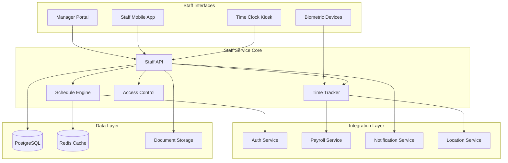
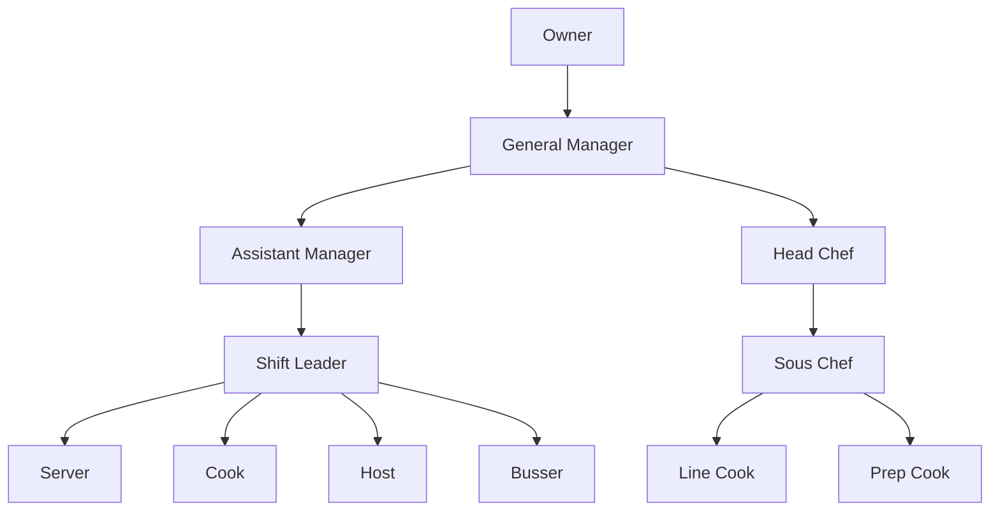

# Staff Module

## Table of Contents

1. [Overview](#overview)
2. [Key Features](#key-features)
3. [Architecture Overview](#architecture-overview)
4. [Quick Start](#quick-start)
5. [Core Components](#core-components)
6. [API Endpoints](#api-endpoints)
7. [Employee Roles & Permissions](#employee-roles-permissions)
8. [Scheduling System](#scheduling-system)
9. [Time Tracking Features](#time-tracking-features)
10. [Integration Points](#integration-points)
11. [Mobile App Features](#mobile-app-features)
12. [Compliance Features](#compliance-features)
13. [Performance Metrics](#performance-metrics)
14. [Configuration](#configuration)
15. [Testing](#testing)
16. [Troubleshooting](#troubleshooting)
17. [Related Documentation](#related-documentation)

## Overview

The Staff module provides comprehensive employee management capabilities including scheduling, time tracking, role management, and performance monitoring. It integrates seamlessly with the Payroll module for accurate compensation processing.

## Key Features

- 👥 **Employee Management**: Complete employee profiles and records
- 📅 **Smart Scheduling**: AI-assisted shift scheduling with conflict detection
- ⏰ **Time Tracking**: Clock in/out with geolocation and biometric support
- 🎯 **Role Management**: Flexible role-based access control (RBAC)
- 📈 **Performance Tracking**: KPIs, reviews, and goal management
- 📱 **Mobile Support**: Native mobile app for staff
- 🔔 **Notifications**: Real-time alerts for schedules and updates
- 📊 **Analytics**: Labor cost analysis and productivity metrics

## Architecture Overview



## Quick Start

### Prerequisites

- Python 3.11+
- PostgreSQL 14+
- Redis 6+
- S3-compatible storage for documents

### Installation

```bash
# Navigate to the staff module
cd backend/modules/staff

# Install dependencies
pip install -r requirements.txt

# Run migrations
alembic upgrade head

# Start the service
uvicorn main:app --reload --port 8005
```

### Basic Usage

```python
import requests
from datetime import datetime, timedelta

# Create an employee
employee_data = {
    "first_name": "John",
    "last_name": "Doe",
    "email": "john.doe@restaurant.com",
    "phone": "(555) 123-4567",
    "role_id": 3,  # Server role
    "location_ids": [1, 2],
    "hourly_rate": "15.50",
    "employment_type": "full_time",
    "start_date": "2024-01-15"
}

response = requests.post(
    "http://localhost:8005/api/v1/staff/employees",
    json=employee_data,
    headers={"Authorization": "Bearer <token>"}
)

employee = response.json()

# Create a schedule
schedule_data = {
    "employee_id": employee["id"],
    "location_id": 1,
    "start_time": "2024-01-20T09:00:00",
    "end_time": "2024-01-20T17:00:00",
    "role": "server",
    "break_minutes": 30
}

schedule_response = requests.post(
    "http://localhost:8005/api/v1/staff/schedules",
    json=schedule_data,
    headers={"Authorization": "Bearer <token>"}
)
```

## Core Components

### 1. Employee Management

```python
class EmployeeService:
    def create_employee(self, data: EmployeeCreate) -> Employee:
        # Validate employee data
        # Create user account
        # Assign roles and permissions
        # Set up payroll profile
        # Send welcome email
        pass
        
    def update_employee(self, id: int, data: EmployeeUpdate) -> Employee:
        # Update employee information
        # Log changes for audit
        # Sync with payroll if needed
        pass
```

### 2. Schedule Engine

```python
class ScheduleEngine:
    def generate_schedule(self, 
                         location_id: int, 
                         week_start: date,
                         constraints: ScheduleConstraints) -> Schedule:
        # Analyze labor requirements
        # Consider employee availability
        # Apply scheduling rules
        # Optimize for labor cost
        # Detect and resolve conflicts
        pass
```

### 3. Time Tracking

```python
class TimeTracker:
    def clock_in(self, 
                 employee_id: int, 
                 location: Location,
                 method: ClockMethod) -> TimeEntry:
        # Verify employee identity
        # Check schedule
        # Record location
        # Start time tracking
        pass
        
    def clock_out(self, time_entry_id: int) -> TimeEntry:
        # Calculate hours worked
        # Apply break rules
        # Check for overtime
        # Submit to payroll
        pass
```

## API Endpoints

> 📌 **See also**: [Staff Management in API Reference](../../api/README.md#staff-hr) for integration details.

### Employee Management

| Endpoint | Method | Description |
|----------|--------|-------------|
| `/api/v1/staff/employees` | GET | List employees |
| `/api/v1/staff/employees` | POST | Create employee |
| `/api/v1/staff/employees/{id}` | GET | Get employee details |
| `/api/v1/staff/employees/{id}` | PUT | Update employee |
| `/api/v1/staff/employees/{id}` | DELETE | Deactivate employee |
| `/api/v1/staff/employees/{id}/roles` | PUT | Update employee roles |

### Scheduling

| Endpoint | Method | Description |
|----------|--------|-------------|
| `/api/v1/staff/schedules` | GET | Get schedules |
| `/api/v1/staff/schedules` | POST | Create schedule |
| `/api/v1/staff/schedules/generate` | POST | Auto-generate schedules |
| `/api/v1/staff/schedules/{id}/publish` | POST | Publish schedule |
| `/api/v1/staff/shifts/swap` | POST | Request shift swap |

### Time Tracking

| Endpoint | Method | Description |
|----------|--------|-------------|
| `/api/v1/staff/time/clock-in` | POST | Clock in |
| `/api/v1/staff/time/clock-out` | POST | Clock out |
| `/api/v1/staff/time/entries` | GET | Get time entries |
| `/api/v1/staff/time/entries/{id}` | PUT | Edit time entry |

View Complete API Reference (Coming Soon)

## Employee Roles & Permissions



### Permission Matrix

| Permission | Owner | Manager | Shift Lead | Staff |
|------------|-------|---------|------------|-------|
| View All Employees | ✓ | ✓ | ✓ | - |
| Edit Employees | ✓ | ✓ | - | - |
| Create Schedules | ✓ | ✓ | ✓ | - |
| Approve Time Off | ✓ | ✓ | ✓ | - |
| View Own Schedule | ✓ | ✓ | ✓ | ✓ |
| Clock In/Out | ✓ | ✓ | ✓ | ✓ |
| Request Time Off | ✓ | ✓ | ✓ | ✓ |

## Scheduling System

### Advanced Scheduling Features

- **AI-Powered Optimization**: Automatically generate optimal schedules
- **Skill-Based Assignment**: Match staff skills to shift requirements
- **Availability Management**: Track and respect employee preferences
- **Labor Cost Forecasting**: Predict costs based on schedules
- **Shift Swapping**: Employee-initiated swap requests with approval
- **Template Scheduling**: Reusable schedule patterns

### Schedule Generation Algorithm

```python
# Enhanced scheduling constraints
constraints = {
    "min_staff": {
        "monday": {"09:00": 3, "12:00": 5, "18:00": 7},
        # ... other days
    },
    "max_hours_per_week": 40,
    "max_consecutive_days": 6,
    "min_hours_between_shifts": 8,
    "required_skills": {
        "kitchen": ["food_handler_cert"],
        "bar": ["alcohol_service_cert"]
    },
    "preferences": {
        "respect_availability": True,
        "balance_hours": True,
        "minimize_overtime": True
    },
    "labor_budget": {
        "target_percentage": 28.0,
        "max_percentage": 32.0
    }
}

# Generate optimal schedule with AI assistance
schedule = schedule_engine.generate(
    location_id=1,
    week_start=date(2024, 1, 22),
    constraints=constraints,
    optimization_goals=["cost", "coverage", "satisfaction"]
)
```

### Shift Templates

```json
{
  "templates": [
    {
      "name": "Morning Server",
      "start_time": "07:00",
      "end_time": "15:00",
      "roles": ["server"],
      "days": ["mon", "tue", "wed", "thu", "fri"]
    },
    {
      "name": "Evening Server",
      "start_time": "16:00",
      "end_time": "23:00",
      "roles": ["server"],
      "days": ["tue", "wed", "thu", "fri", "sat"]
    }
  ]
}
```

## Time Tracking Features

### Clock Methods

1. **Web Portal**: Browser-based clock in/out
2. **Mobile App**: GPS-verified mobile clocking
3. **Kiosk**: Shared terminal with PIN/badge
4. **Biometric**: Fingerprint or facial recognition (Face ID supported)

### Geofencing

```python
# Location verification
geofence_config = {
    "enabled": True,
    "radius_meters": 100,
    "locations": [
        {
            "id": 1,
            "latitude": 40.7128,
            "longitude": -74.0060
        }
    ]
}
```

## Biometric Authentication

### Supported Methods

1. **Fingerprint Recognition**
   - Secure SHA-256 hashing with salt
   - Template-based matching
   - Multi-finger enrollment support

2. **Face ID**
   - 3D facial recognition
   - Liveness detection
   - Works in various lighting conditions

3. **PIN Backup**
   - 4-6 digit PIN as fallback
   - Rate-limited (5 attempts per minute)
   - Automatic lockout protection

### Security Features

```python
# Biometric data security
biometric_security = {
    "encryption": "SHA-256 with salt",
    "hash_rounds": 10000,
    "storage": "Hashed templates only",
    "gdpr_compliant": True,
    "retention_days": 90,
    "audit_logging": True
}
```

### GDPR Compliance

- Right to deletion
- Data export capability
- Consent management
- Retention policies
- Audit trail

### API Endpoints

| Endpoint | Method | Description |
|----------|--------|-------------|
| `/api/v1/staff/biometric/enroll/fingerprint` | POST | Enroll fingerprint |
| `/api/v1/staff/biometric/enroll/face` | POST | Enroll Face ID |
| `/api/v1/staff/biometric/check-in` | POST | Biometric clock in |
| `/api/v1/staff/biometric/pin/set` | POST | Set backup PIN |
| `/api/v1/staff/biometric/{id}` | DELETE | Remove biometric data |

## Integration Points

### Payroll Service
- Submit approved time entries
- Calculate overtime and breaks
- Track paid time off
- Process tip distributions

### Auth Service
- User account creation
- Role assignment
- Permission validation
- Biometric enrollment

### Notification Service
- Schedule updates
- Shift reminders
- Time-off approvals
- Clock-in confirmations

## Events

| Event | Description | Payload |
|-------|-------------|------|
| `staff.employee.created` | New employee added | Employee details |
| `staff.schedule.published` | Schedule published | Schedule ID, week |
| `staff.shift.swapped` | Shift swap approved | Swap details |
| `staff.time.clocked_in` | Employee clocked in | Entry details |
| `staff.time.clocked_out` | Employee clocked out | Hours worked |
| `staff.biometric.enrolled` | Biometric data enrolled | Employee ID, method |
| `staff.biometric.check_in` | Biometric check-in | Employee ID, location |

## Database Schema

### Core Tables

- `employees` - Employee records
- `employee_roles` - Role assignments
- `schedules` - Work schedules
- `schedule_entries` - Individual shifts
- `time_entries` - Clock in/out records
- `time_off_requests` - PTO requests
- `employee_documents` - Certifications, etc.
- `staff_biometrics` - Encrypted biometric data
- `attendance_logs` - Detailed attendance records

View Complete Schema (Coming Soon)

## Mobile App Features

### Employee App

- View schedule
- Clock in/out with GPS
- Request time off
- Swap shifts
- View pay stubs
- Team communication
- Training materials

### Manager App

- Create/edit schedules
- Approve time off
- View labor costs
- Monitor attendance
- Send announcements
- Performance reviews

## Compliance Features

### Labor Law Compliance

```python
class ComplianceChecker:
    def validate_schedule(self, schedule: Schedule) -> ValidationResult:
        # Check minimum wage requirements
        # Verify break compliance
        # Validate overtime rules
        # Check minor work restrictions
        # Ensure meal period compliance
        pass
```

### Audit Trail

All actions are logged for compliance:

- Schedule changes
- Time entry modifications
- Rate changes
- Role assignments

## Performance Metrics

### KPIs Tracked

1. **Attendance**
   - On-time percentage
   - Absence rate
   - No-show tracking

2. **Productivity**
   - Sales per labor hour
   - Tables served
   - Orders processed

3. **Labor Cost**
   - Labor as % of sales
   - Overtime hours
   - Schedule efficiency

## Security

- Biometric data encryption
- Role-based access control
- Time entry tampering prevention
- Audit logs for all changes
- PII data protection

## Configuration

```yaml
# config/staff.yaml
staff:
  max_schedule_weeks_ahead: 4
  min_shift_length_hours: 3
  max_shift_length_hours: 12
  
time_tracking:
  clock_in_window_minutes: 15
  auto_clock_out_hours: 16
  require_manager_approval_after_minutes: 30
  
compliance:
  minor_max_hours_school_day: 3
  minor_max_hours_non_school: 8
  required_break_after_hours: 5
  break_duration_minutes: 30
```

## Testing

```bash
# Run unit tests
pytest tests/unit/

# Test scheduling algorithm
pytest tests/test_scheduler.py -v

# Test time tracking
pytest tests/test_time_tracking.py

# Integration tests
pytest tests/integration/
```

## Troubleshooting

### Common Issues

1. **Cannot Clock In**
   - Check schedule exists
   - Verify location/geofence
   - Confirm active employee status

2. **Schedule Conflicts**
   - Review availability settings
   - Check time-off requests
   - Verify role requirements

3. **Missing Time Entries**
   - Check clock-out status
   - Review auto-clock rules
   - Verify sync with payroll

## Related Documentation

- Architecture Details (Coming Soon)
- API Reference (Coming Soon)
- Database Schema (Coming Soon)
- Integration Guide (Coming Soon)
- Mobile App Guide (Coming Soon)

## Support

- **Module Owner**: Staff Management Team
- **Email**: staff-team@auraconnect.com
- **Slack**: #staff-module

---

*Last Updated: January 2025*