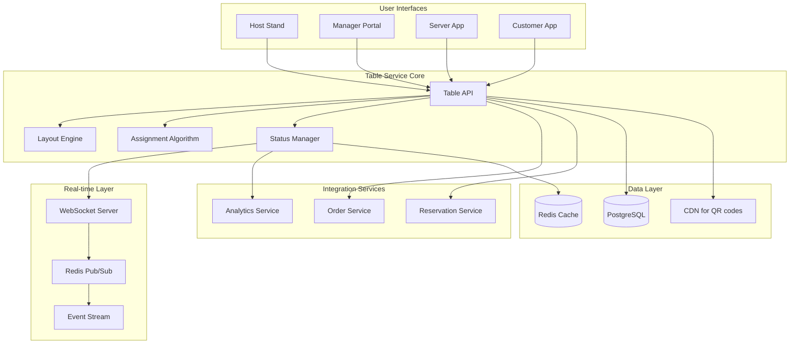
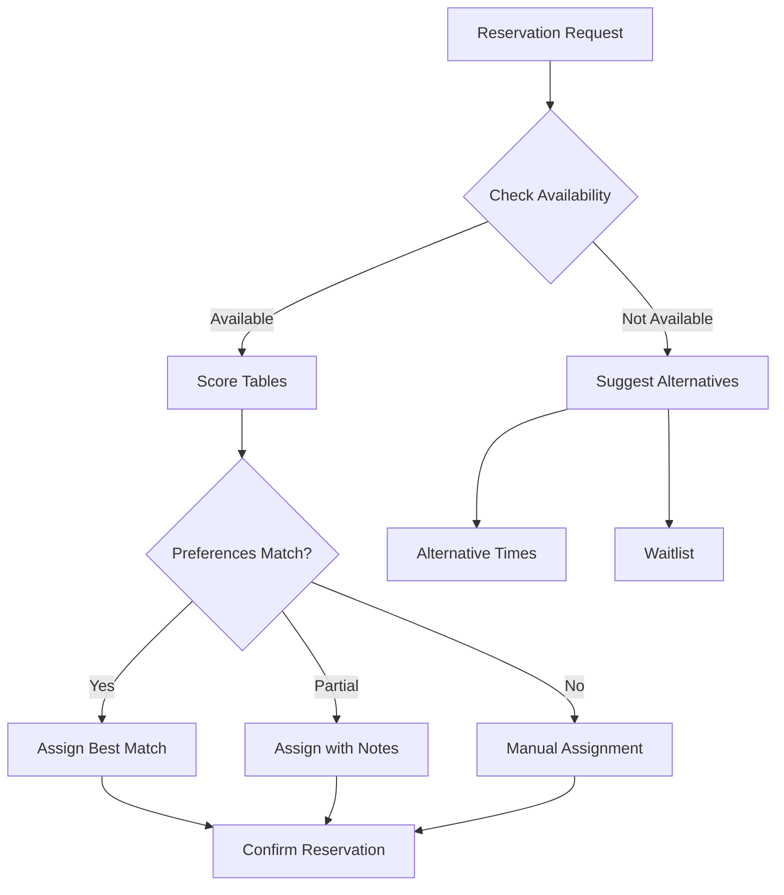

# Table Management Module

## Table of Contents

1. [Overview](#overview)
2. [Key Features](#key-features)
3. [Architecture Overview](#architecture-overview)
4. [Quick Start](#quick-start)
5. [Core Components](#core-components)
6. [API Endpoints](#api-endpoints)
7. [Table Layout Designer](#table-layout-designer)
8. [Reservation System](#reservation-system)
9. [Real-time Updates](#real-time-updates)
10. [Analytics & Reporting](#analytics-reporting)
11. [Integration Points](#integration-points)
12. [Configuration](#configuration)
13. [Testing](#testing)
14. [Troubleshooting](#troubleshooting)
15. [Related Documentation](#related-documentation)

## Overview

The Table Management module provides comprehensive restaurant floor planning, table management, and reservation handling. It includes a visual layout designer, real-time status tracking, and intelligent table assignment algorithms.

## Key Features

- 🏢 **Multi-Floor Support**: Manage multiple dining areas and floors
- 🎨 **Visual Layout Designer**: Drag-and-drop table arrangement
- 📅 **Smart Reservations**: Intelligent table assignment and optimization
- 🔄 **Real-time Status**: Live table status updates via WebSocket
- 📱 **QR Code Menus**: Digital menu access per table
- 🔗 **Table Combining**: Support for joining tables for larger parties
- 📊 **Utilization Analytics**: Track table turnover and efficiency
- 📤 **Import/Export**: Layout templates and bulk operations

## Architecture Overview



## Quick Start

### Prerequisites

- Python 3.11+
- PostgreSQL 14+
- Redis 6+
- WebSocket support

### Installation

```bash
# Navigate to table management module
cd backend/modules/table_management

# Install dependencies
pip install -r requirements.txt

# Run migrations
alembic upgrade head

# Start the service
uvicorn main:app --reload --port 8009
```

### Basic Usage

```python
import requests

# Create a floor
floor_data = {
    "name": "Main Dining Room",
    "level": 1,
    "is_active": True,
    "layout_config": {
        "width": 1000,
        "height": 800,
        "grid_size": 20
    }
}

floor_response = requests.post(
    "http://localhost:8009/api/v1/tables/floors",
    json=floor_data,
    headers={"Authorization": "Bearer <token>"}
)

floor = floor_response.json()

# Create a table
table_data = {
    "floor_id": floor["id"],
    "table_number": "T01",
    "capacity": 4,
    "shape": "square",
    "position": {"x": 100, "y": 100},
    "size": {"width": 80, "height": 80},
    "rotation": 0,
    "is_active": True
}

table_response = requests.post(
    "http://localhost:8009/api/v1/tables",
    json=table_data,
    headers={"Authorization": "Bearer <token>"}
)
```

## Core Components

### 1. Layout Engine

Manages floor plans and table positioning.

```python
class LayoutEngine:
    def create_floor(self, floor_data: FloorCreate) -> Floor:
        # Create floor with dimensions
        # Initialize grid system
        # Set up coordinate mapping
        pass
        
    def add_table(self, table_data: TableCreate) -> Table:
        # Validate position
        # Check for overlaps
        # Generate QR code
        # Save table configuration
        pass
        
    def validate_layout(self, floor_id: int) -> LayoutValidation:
        # Check table spacing
        # Verify accessibility paths
        # Validate capacity distribution
        pass
```

### 2. Assignment Algorithm

Intelligent table assignment based on party size and preferences.

```python
class TableAssignmentAlgorithm:
    def assign_table(self,
                    party_size: int,
                    preferences: TablePreferences,
                    available_tables: List[Table]) -> Table:
        # Score tables based on:
        # - Capacity match
        # - Location preference
        # - Special requirements
        # - Current utilization
        pass
        
    def combine_tables(self,
                      party_size: int,
                      floor_id: int) -> List[Table]:
        # Find adjacent tables
        # Check if combinable
        # Create table group
        pass
```

### 3. Status Manager

Real-time table status tracking and updates.

```python
class TableStatusManager:
    def update_status(self,
                     table_id: int,
                     status: TableStatus,
                     metadata: dict) -> None:
        # Update database
        # Broadcast via WebSocket
        # Update cache
        # Log status change
        pass
        
    def get_floor_status(self, floor_id: int) -> FloorStatus:
        # Aggregate table statuses
        # Calculate occupancy
        # Include wait times
        pass
```

## API Endpoints

> 📌 **See also**: [Table Management in API Reference](../../api/README.md#restaurant-operations) for complete API documentation.

### Floor Management

| Endpoint | Method | Description |
|----------|--------|-------------|
| `/api/v1/tables/floors` | GET | List all floors |
| `/api/v1/tables/floors` | POST | Create floor |
| `/api/v1/tables/floors/{id}` | GET | Get floor details |
| `/api/v1/tables/floors/{id}` | PUT | Update floor |
| `/api/v1/tables/floors/{id}/layout` | GET | Get floor layout |

### Table Management

| Endpoint | Method | Description |
|----------|--------|-------------|
| `/api/v1/tables` | GET | List tables |
| `/api/v1/tables` | POST | Create table |
| `/api/v1/tables/{id}` | PUT | Update table |
| `/api/v1/tables/{id}/status` | PUT | Update table status |
| `/api/v1/tables/{id}/qr` | GET | Get QR code |
| `/api/v1/tables/combine` | POST | Combine tables |

### Session Management

| Endpoint | Method | Description |
|----------|--------|-------------|
| `/api/v1/tables/sessions` | POST | Start dining session |
| `/api/v1/tables/sessions/{id}` | GET | Get session details |
| `/api/v1/tables/sessions/{id}/end` | POST | End session |
| `/api/v1/tables/sessions/{id}/transfer` | POST | Transfer to another table |

## Table Layout Designer

### Visual Design Features

```javascript
// Layout designer configuration
const designerConfig = {
    grid: {
        size: 20,
        visible: true,
        snap: true
    },
    shapes: ['square', 'circle', 'rectangle', 'oval'],
    tools: ['select', 'add', 'delete', 'rotate', 'duplicate'],
    constraints: {
        minSpacing: 60,  // cm between tables
        maxTables: 100,
        pathWidth: 120   // cm for walkways
    }
}
```

### Table Shapes and Sizes

```yaml
table_templates:
  - name: "2-Top Square"
    shape: square
    capacity: 2
    dimensions: {width: 70, height: 70}
    
  - name: "4-Top Round"
    shape: circle
    capacity: 4
    dimensions: {diameter: 90}
    
  - name: "6-Top Rectangle"
    shape: rectangle
    capacity: 6
    dimensions: {width: 180, height: 90}
    
  - name: "Booth"
    shape: rectangle
    capacity: 4
    dimensions: {width: 150, height: 120}
    type: booth
```

### Import/Export Formats

```json
// JSON export format
{
    "version": "1.0",
    "restaurant_id": 1,
    "floors": [
        {
            "name": "Main Floor",
            "tables": [
                {
                    "number": "T01",
                    "shape": "square",
                    "capacity": 4,
                    "position": {"x": 100, "y": 100},
                    "rotation": 0
                }
            ]
        }
    ]
}
```

## Reservation System

### Table Assignment Logic



### Preference Handling

```python
class TablePreferences:
    location: str  # "window", "private", "bar", "patio"
    accessibility: bool
    high_chair: bool
    booth_seating: bool
    quiet_area: bool
    near_amenities: List[str]  # ["restroom", "exit"]
```

## Real-time Updates

### WebSocket Events

```javascript
// Client connection
const ws = new WebSocket('ws://localhost:8009/ws/tables');

// Subscribe to floor updates
ws.send(JSON.stringify({
    action: 'subscribe',
    floor_id: 1
}));

// Receive status updates
ws.onmessage = (event) => {
    const update = JSON.parse(event.data);
    if (update.type === 'table_status_changed') {
        updateTableUI(update.table_id, update.status);
    }
};
```

### Event Types

| Event | Description | Payload |
|-------|-------------|---------|
| `table_status_changed` | Table status update | table_id, status, timestamp |
| `session_started` | New dining session | session_id, table_id, party_size |
| `session_ended` | Session completed | session_id, duration, total |
| `tables_combined` | Tables joined | table_ids, session_id |
| `layout_updated` | Floor plan changed | floor_id, changes |

## Analytics & Reporting

### Key Metrics

```python
# Table utilization metrics
utilization_metrics = {
    "occupancy_rate": 0.75,  # Average across day
    "turn_time_minutes": 65,  # Average dining duration
    "peak_occupancy": 0.95,  # During rush hours
    "revenue_per_table": 250.00,  # Daily average
    "wait_time_minutes": 15  # Average wait time
}

# Heat map data
heat_map_data = {
    "table_id": "T01",
    "utilization_score": 0.85,
    "revenue_score": 0.92,
    "turnover_rate": 4.5  # Times per day
}
```

### Reports Available

1. **Daily Utilization Report**
   - Occupancy by hour
   - Revenue per table
   - Turn times analysis

2. **Table Performance**
   - Most/least requested tables
   - Revenue by table location
   - Maintenance requirements

3. **Reservation Analytics**
   - No-show rates
   - Booking patterns
   - Preference trends

## Integration Points

### Order Service
- Link orders to table sessions
- Track order timing
- Calculate table revenue

### POS Integration
- Sync table status
- Transfer checks between tables
- Split bills by table

### Staff Management
- Server table assignments
- Section management
- Performance tracking

## Configuration

```yaml
# config/tables.yaml
table_management:
  floors:
    max_floors: 5
    max_tables_per_floor: 100
    
  tables:
    min_spacing_cm: 60
    default_turn_time_minutes: 90
    auto_release_minutes: 15
    
  reservations:
    advance_days: 30
    min_party_size: 1
    max_party_size: 20
    buffer_minutes: 15
    
  qr_codes:
    base_url: "https://menu.restaurant.com"
    size: 200
    error_correction: "M"
    
  websocket:
    ping_interval: 30
    max_connections_per_client: 5
```

## Testing

```bash
# Run unit tests
pytest tests/unit/

# Test layout engine
pytest tests/test_layout_engine.py -v

# Test assignment algorithm
pytest tests/test_assignment.py -v

# Test WebSocket connections
pytest tests/test_websocket.py -v

# Integration tests
pytest tests/integration/
```

## Troubleshooting

### Common Issues

1. **Tables Not Showing on Layout**
   - Verify floor is active
   - Check table coordinates
   - Clear browser cache

2. **Can't Combine Tables**
   - Ensure tables are adjacent
   - Check if tables are available
   - Verify combine permissions

3. **WebSocket Connection Drops**
   - Check network stability
   - Verify authentication
   - Review connection limits

4. **QR Codes Not Working**
   - Verify CDN configuration
   - Check URL formatting
   - Test QR code scanner

## Best Practices

1. **Layout Design**
   - Maintain adequate spacing
   - Consider traffic flow
   - Group similar table sizes

2. **Status Management**
   - Update promptly
   - Use appropriate statuses
   - Log status reasons

3. **Reservation Handling**
   - Set realistic buffer times
   - Track no-show patterns
   - Optimize table assignments

## Related Documentation

- [Orders Module](../orders/README.md)
- [Reservations Guide](../../guides/reservations.md)
- [POS Integration](../pos/README.md)
- [Analytics Module](../analytics/README.md)
- [API Reference](../../api/README.md)

## Support

- **Module Owner**: Table Management Team
- **Email**: tables-team@auraconnect.com
- **Slack**: #table-management

---

*Last Updated: January 2025*