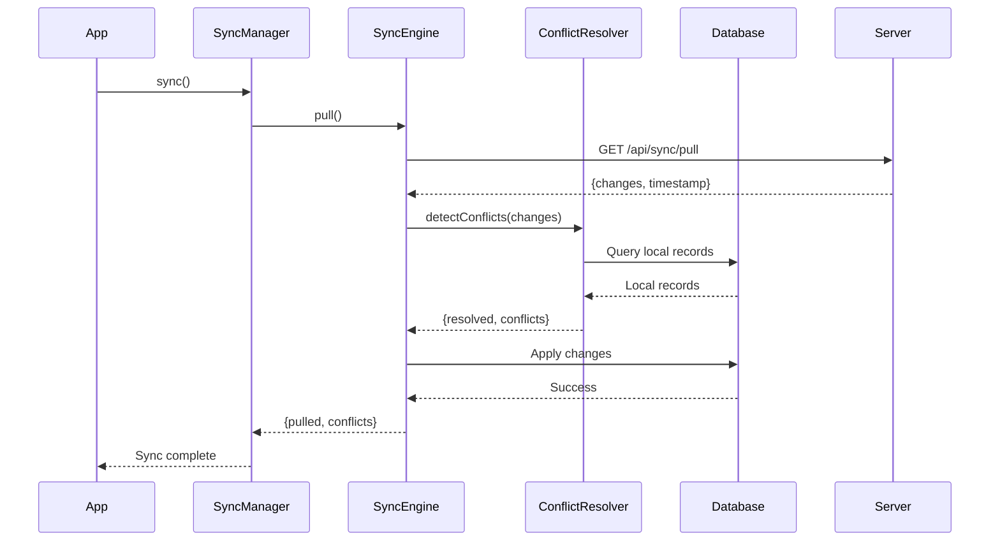
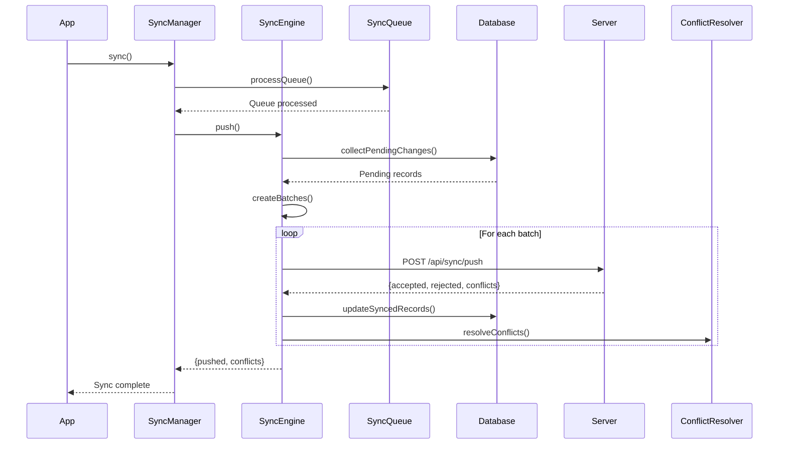
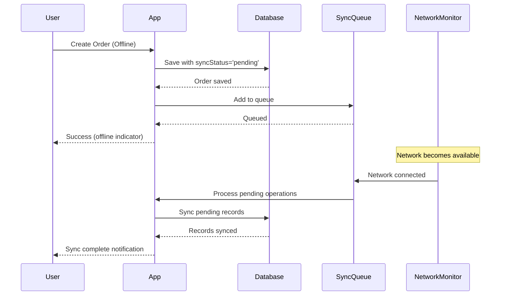

# Offline Sync Implementation for AuraConnect Mobile

## Overview

This document describes the comprehensive offline sync implementation for the AuraConnect mobile application, enabling staff to work seamlessly without internet connectivity.

## Architecture

### Sequence Diagrams

#### Pull Sync Process


#### Push Sync Process


#### Offline Operation Flow


### Core Components

1. **WatermelonDB** - Local SQLite database for offline data storage
2. **Sync Engine** - Handles bidirectional data synchronization
3. **Conflict Resolver** - Manages data conflicts between local and server
4. **Sync Queue** - Manages pending operations when offline
5. **Sync Manager** - Coordinates all sync operations

### Data Flow

```
┌─────────────┐     ┌──────────────┐     ┌─────────────┐
│   Mobile    │────▶│ WatermelonDB │────▶│ Sync Engine │
│     App     │     │   (SQLite)   │     │             │
└─────────────┘     └──────────────┘     └──────┬───────┘
                                                 │
                                                 ▼
┌─────────────┐     ┌──────────────┐     ┌─────────────┐
│   Server    │◀────│ Sync Queue   │◀────│  Conflict   │
│     API     │     │              │     │  Resolver   │
└─────────────┘     └──────────────┘     └─────────────┘
```

## Implementation Details

### 1. Database Schema

**Location**: `/mobile/src/database/schema.ts`

The database includes the following tables:
- `orders` - Customer orders with sync metadata
- `order_items` - Individual items in orders
- `staff` - Staff member information
- `shifts` - Staff shift records
- `menu_items` - Restaurant menu items
- `menu_categories` - Menu categories
- `customers` - Customer information
- `sync_logs` - Sync operation history

Each table includes sync metadata fields:
- `server_id` - Server-side identifier
- `sync_status` - Current sync status (pending/synced/conflict)
- `last_modified` - Timestamp for conflict resolution
- `is_deleted` - Soft delete flag

### 2. Sync Engine

**Location**: `/mobile/src/sync/SyncEngine.ts`

**Key Features**:
- Bidirectional sync (push/pull)
- Batch processing for efficiency
- Automatic conflict detection
- Progress tracking
- Error recovery

**Sync Process**:
1. Pull changes from server
2. Detect and resolve conflicts
3. Apply server changes to local database
4. Collect pending local changes
5. Push changes to server in batches
6. Update sync status for successful items

### 3. Conflict Resolution

**Location**: `/mobile/src/sync/ConflictResolver.ts`

**Strategies**:
- **Server Wins**: Server data takes precedence
- **Client Wins**: Local data takes precedence
- **Last Write Wins**: Most recent modification wins
- **Merge**: Custom merge logic per data type

**Collection-Specific Rules**:
- **Orders**: Server status takes precedence, local notes preserved if newer
- **Menu Items**: Server price/availability authoritative
- **Customers**: Preferences merged, server loyalty points authoritative

### 4. Sync Queue

**Location**: `/mobile/src/sync/SyncQueue.ts`

**Features**:
- Priority-based queue (high/normal/low)
- Automatic retry with exponential backoff
- Persistent storage using AsyncStorage
- Size limits to prevent memory issues
- Network-aware processing

### 5. Sync Manager

**Location**: `/mobile/src/sync/SyncManager.ts`

**Responsibilities**:
- Initialize sync on app startup
- Monitor network connectivity
- Trigger automatic sync when online
- Manage periodic background sync
- Provide sync state to UI components
- Handle sync errors gracefully

## UI Components

### Offline Indicator
**Location**: `/mobile/src/components/sync/OfflineIndicator.tsx`
- Shows when device is offline
- Animated slide-in/out effect
- Positioned at top of screen

### Sync Status Bar
**Location**: `/mobile/src/components/sync/SyncStatusBar.tsx`
- Displays current sync status
- Shows pending changes count
- Last sync timestamp
- Tap to trigger manual sync

### Sync Progress Modal
**Location**: `/mobile/src/components/sync/SyncProgressModal.tsx`
- Shows during active sync
- Progress bar and status messages
- Error handling display

## Usage Examples

### Creating an Order Offline

```typescript
// In CreateOrderScreen.tsx
const order = await ordersCollection.create(order => {
  order.orderNumber = generateId();
  order.customerName = customerName;
  order.status = 'pending';
  order.syncStatus = 'pending'; // Marked for sync
  order.lastModified = Date.now();
});

// Queue for sync when online
if (!isOffline) {
  await syncManager.queueOperation({
    collection: 'orders',
    operation: 'create',
    recordId: order.id,
    priority: 'high',
  });
}
```

### Using the Offline Hook

```typescript
import { useOfflineSync } from '@hooks/useOfflineSync';

const MyComponent = () => {
  const { syncState, sync, isOffline, hasPendingChanges } = useOfflineSync();
  
  // Display offline indicator
  if (isOffline) {
    return <Text>Working offline - {hasPendingChanges} pending changes</Text>;
  }
  
  // Trigger manual sync
  const handleSync = async () => {
    await sync();
  };
};
```

### Observing Collection Changes

```typescript
import { withObservables } from '@nozbe/with-observables';

const enhance = withObservables([''], () => ({
  orders: database.collections
    .get('orders')
    .query(
      Q.where('is_deleted', false),
      Q.sortBy('created_at', Q.desc),
    )
    .observe(),
}));

export default enhance(OrdersScreen);
```

## Configuration

**Location**: `/mobile/src/constants/config.ts`

```typescript
export const SYNC_CONFIG = {
  MAX_QUEUE_SIZE: 1000,
  BATCH_SIZE: 100,
  PULL_URL: '/api/sync/pull',
  PUSH_URL: '/api/sync/push',
  DEFAULT_CONFLICT_STRATEGY: 'last_write_wins',
  SYNC_INTERVAL: 300000, // 5 minutes
  BACKGROUND_SYNC_INTERVAL: 900000, // 15 minutes
};
```

## API Endpoints

### Pull Endpoint
**URL**: `GET /api/sync/pull`
**Params**:
- `lastPulledAt`: Timestamp of last successful pull
- `schemaVersion`: Current schema version

**Response**:
```json
{
  "changes": {
    "orders": {
      "created": [...],
      "updated": [...],
      "deleted": [...]
    }
  },
  "timestamp": 1234567890
}
```

### Push Endpoint
**URL**: `POST /api/sync/push`
**Body**:
```json
{
  "changes": {
    "orders": {
      "created": [...],
      "updated": [...],
      "deleted": [...]
    }
  },
  "lastPulledAt": 1234567890
}
```

**Response**:
```json
{
  "accepted": [...],
  "rejected": [...],
  "conflicts": [...]
}
```

## Testing

### Manual Testing Steps

1. **Offline Creation**:
   - Turn on airplane mode
   - Create new order
   - Verify order appears with pending sync icon
   - Turn off airplane mode
   - Verify automatic sync occurs

2. **Conflict Resolution**:
   - Create order on two devices
   - Modify same order on both while offline
   - Bring both online
   - Verify conflict resolution follows configured strategy

3. **Background Sync**:
   - Make changes while offline
   - Background the app
   - Bring device online
   - Verify background sync occurs

## Performance Considerations

1. **Batch Size**: Limited to 100 records per sync operation
2. **Queue Management**: Automatic cleanup of old low-priority items
3. **Database Indexes**: Added on sync_status and last_modified fields
4. **Lazy Loading**: Menu items and customers loaded on demand
5. **Observables**: Efficient UI updates using WatermelonDB observables

## Security

1. **Encryption**: Sensitive fields encrypted in offline queue
2. **Authentication**: Sync requires valid auth token
3. **Data Validation**: All synced data validated before storage
4. **Audit Trail**: Sync logs maintain operation history

## Future Enhancements

1. **Selective Sync**: Sync only specific collections based on user role
2. **Compression**: Compress sync payloads for better bandwidth usage
3. **Delta Sync**: Send only changed fields instead of full records
4. **Offline Analytics**: Track offline usage patterns
5. **Sync Scheduling**: Allow users to configure sync frequency
6. **WebSocket Real-time Sync**: Add real-time synchronization when online

## Implementation Notes

### Code Organization

For future implementations, consider splitting large features into multiple PRs:

1. **PR 1: Database Setup** (~800 LOC)
   - WatermelonDB schema and models
   - Base model with sync metadata
   - Database migrations

2. **PR 2: Sync Engine** (~1000 LOC)
   - Sync engine core functionality
   - Conflict resolver
   - Sync queue implementation

3. **PR 3: UI Integration** (~1200 LOC)
   - Offline indicators
   - Sync status components
   - Offline-capable screens

4. **PR 4: Testing & Documentation** (~1000 LOC)
   - Unit tests
   - Integration tests
   - Documentation

This approach makes code reviews more manageable and allows for incremental deployment.